<!--
Quelle: Google Präsentation „Einführung AIN Erstsemester“
(https://docs.google.com/presentation/d/12VpE4i2CEMk00CgfC-Uah1sGcPEaVNzKVlb2AiUhWjg)
HTWG-Theme: ../../themes/htwg.css + Logos.
Diagramme: diagrams/*.drawio.svg (editierbare Quellen: SVG mit eingebettetem Draw.io-Modell, in Cursor mit der Draw.io-Extension öffnen).
-->

### Prof. Dr. Marko Boger
## Angewandte Informatik (AIN)
# Erstsemestereinführung

---

# Prof. Dr. Marko Boger

- Raum O205
- marko.boger@htwg-konstanz.de
- Sprechstunde: Dienstags 11:30–13:00
- Studiendekan AIN

---

# Studieninhalte

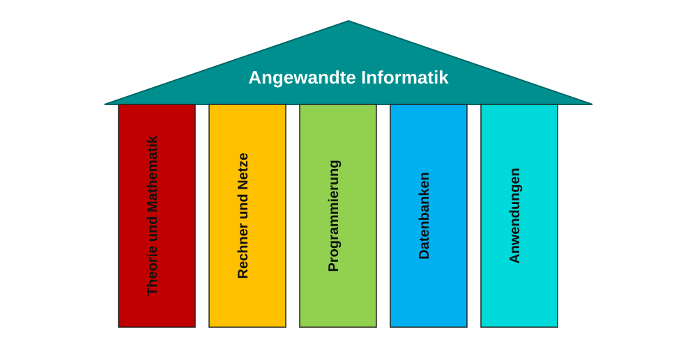

---

# Vorlesungen in den Semestern 1–4

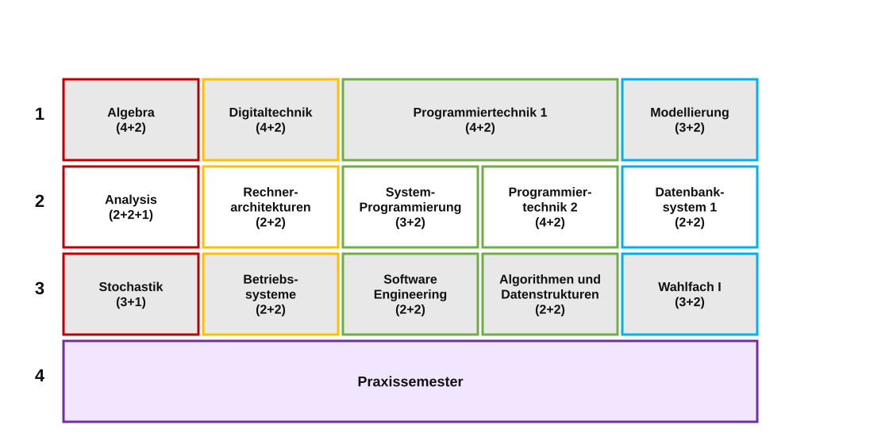

---

# Vorlesungen im 1. Semester

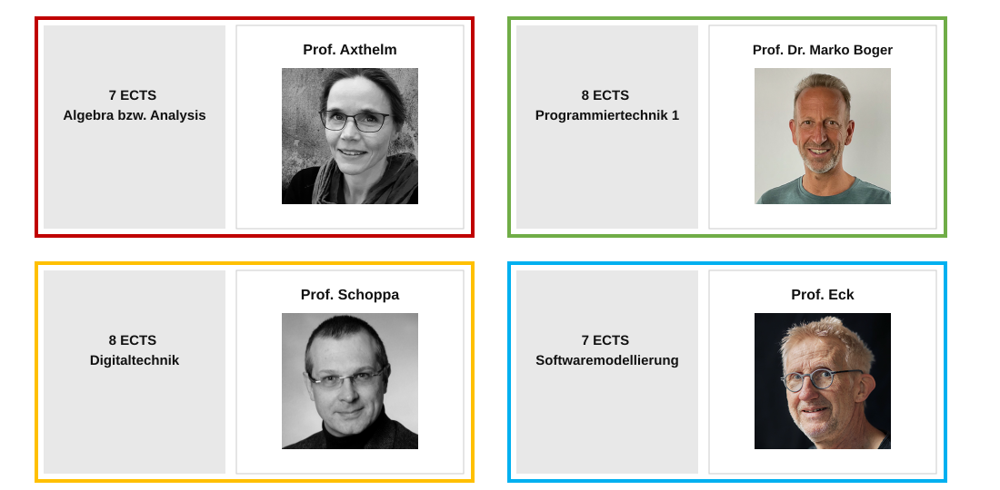

---

# Studienverlauf AIN (Gesamtübersicht)

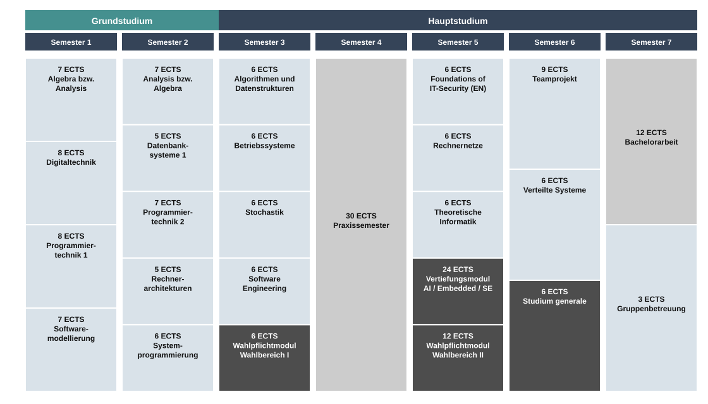

---

# Programmiersprachen — Zeitlinie (Auszug)

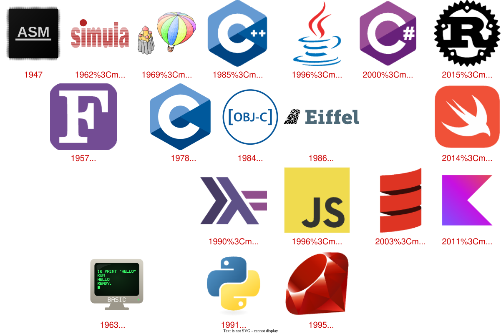

---

# Programming Paradigms

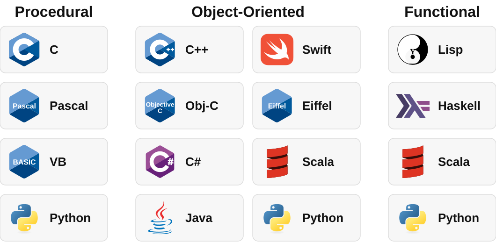

---

# Sprachen in AIN

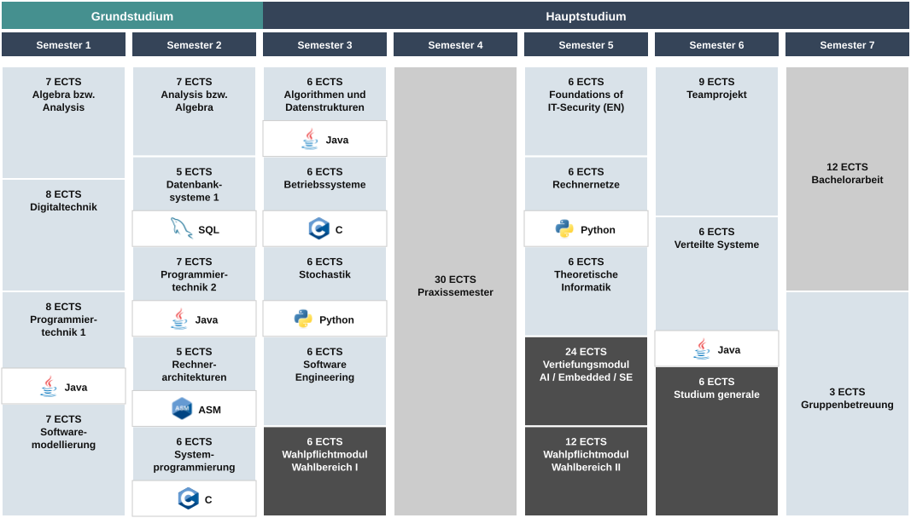

---

# Vertiefungsrichtungen

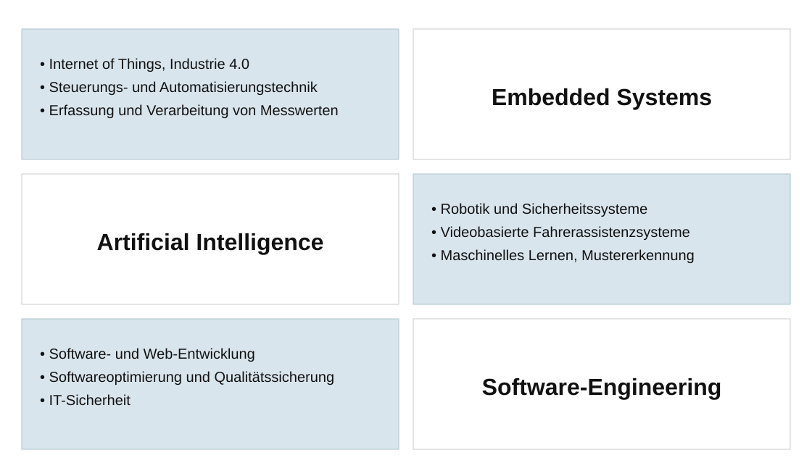

---

# Vertiefungsrichtungen in AIN

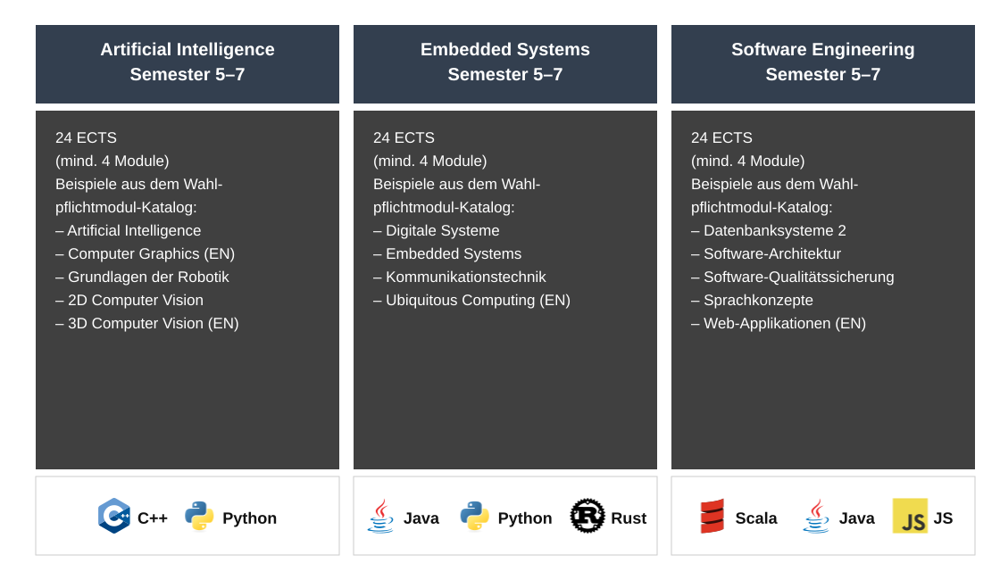

---

<!-- _footer: "" -->

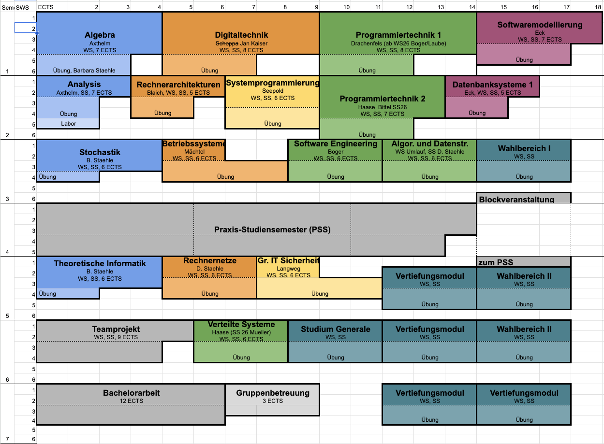

---

<!-- _footer: "" -->

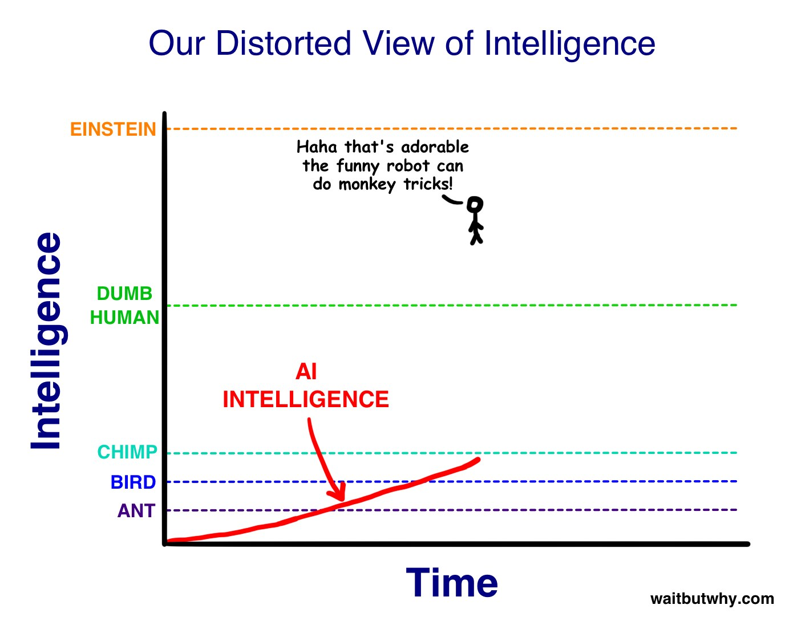

---

<!-- _footer: "" -->

---

# Traits of Software Development

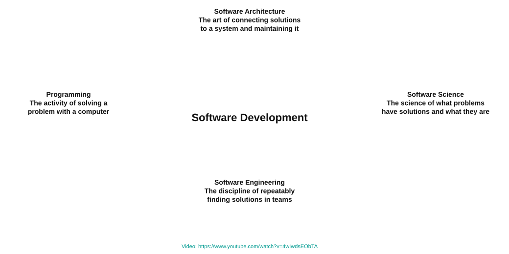

---

# Tools für das Studium

| Tool | Zweck | Link |
|------|--------|------|
| **Moodle** | Lernplattform | https://moodle.htwg-konstanz.de/ |
| **INdigit** | Teamprojekte, Abschlussarbeiten, Modulhandbuch | https://indigit.htwg-konstanz.de/ |
| **LSF** | Lehrveranstaltungsplan | https://lsf.htwg-konstanz.de/ |
| **SPO** | Studienprüfungsordnung | https://www.htwg-konstanz.de/bachelor/angewandte-informatik/dokumente |
| | Portal Prüfungsangelegenheiten | |
| | Liste der Termine (HTWG-Webseite) | |

---

# Wintersemester 2026/27 — Termine

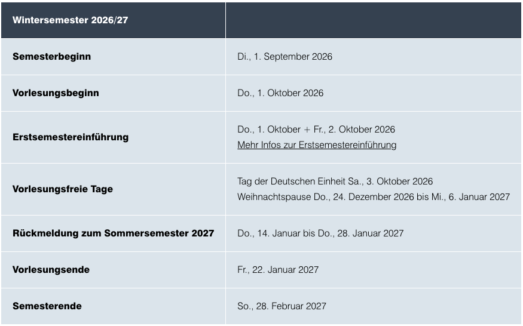

---

# Übungsgruppen

Übungsgruppen im Moodle-Kurs **AINORGA**

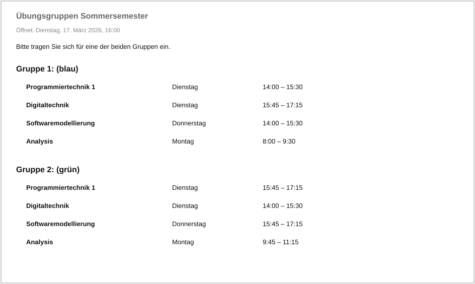

---

# INdigit

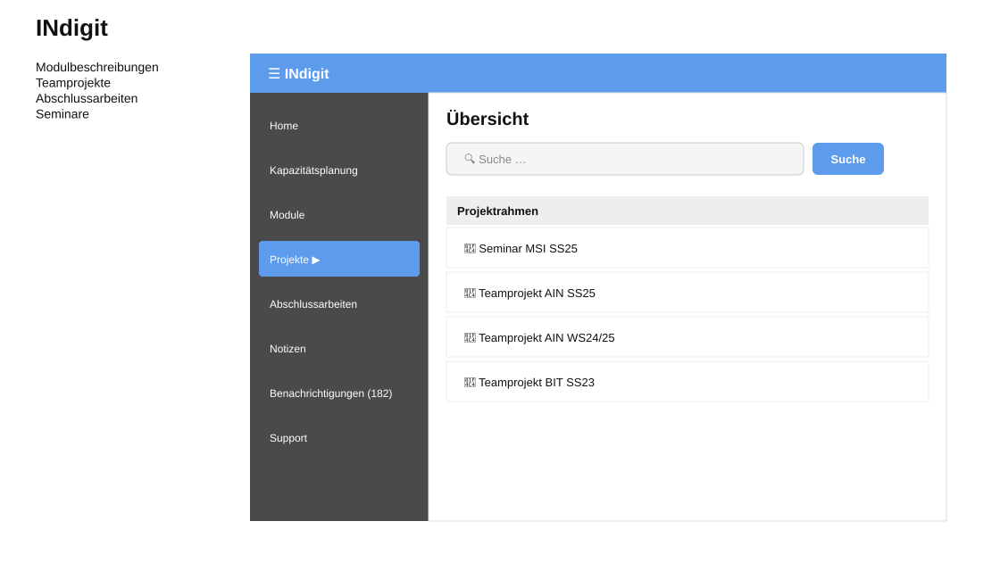

---

# Modulhandbuch in INdigit

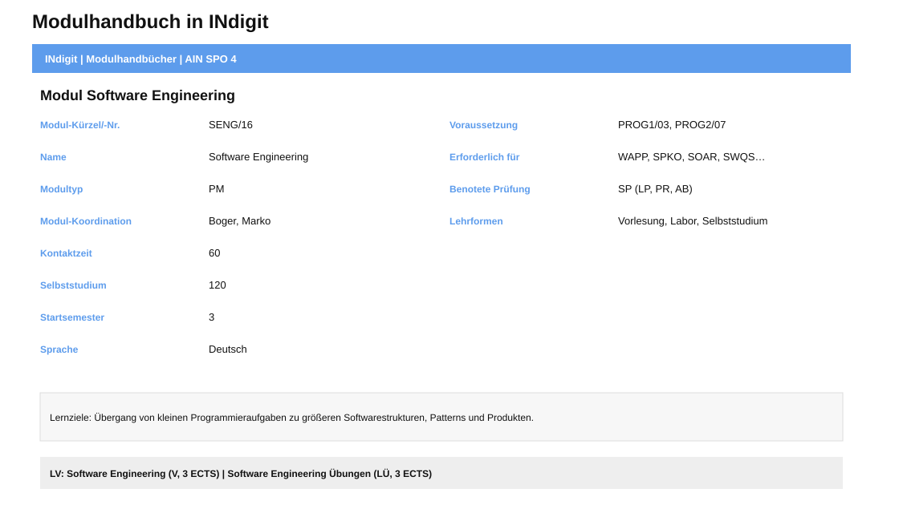

---

# Stundenplan AIN1 (LSF)

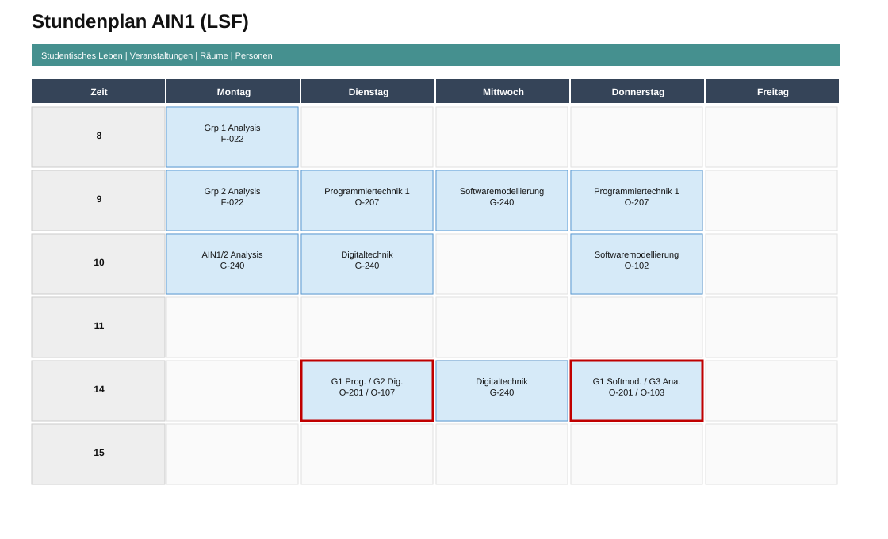

---

# Noch Fragen?

## Und viel Erfolg!
