<!--
Quelle: Google Präsentation „Einführung AIN Erstsemester“
(https://docs.google.com/presentation/d/12VpE4i2CEMk00CgfC-Uah1sGcPEaVNzKVlb2AiUhWjg)
HTWG-Theme: ../../themes/htwg.css + Logos.
Diagramme: diagrams/*.drawio.svg (editierbare Quellen: SVG mit eingebettetem Draw.io-Modell, in Cursor mit der Draw.io-Extension öffnen).
-->

### Prof. Dr. Marko Boger
## Angewandte Informatik (AIN)
# Erstsemestereinführung

---

# Prof. Dr. Marko Boger

- Raum O205
- marko.boger@htwg-konstanz.de
- Sprechstunde: Donnerstags 9:45–11:15 Uhr
- Studiendekan AIN

---

# Studieninhalte

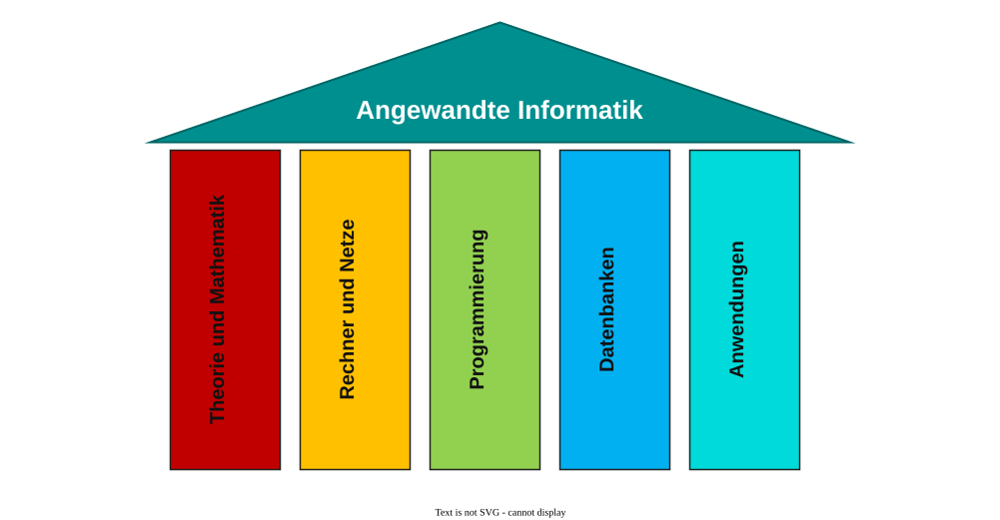

---

# Vorlesungen in den Semestern 1–4

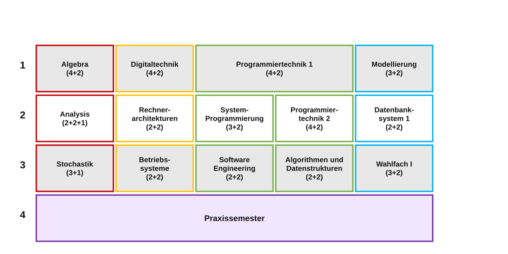

---

# Vorlesungen im 1. Semester

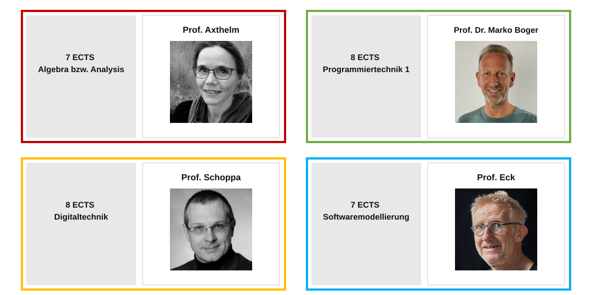

---

# Studienverlauf AIN (Gesamtübersicht)

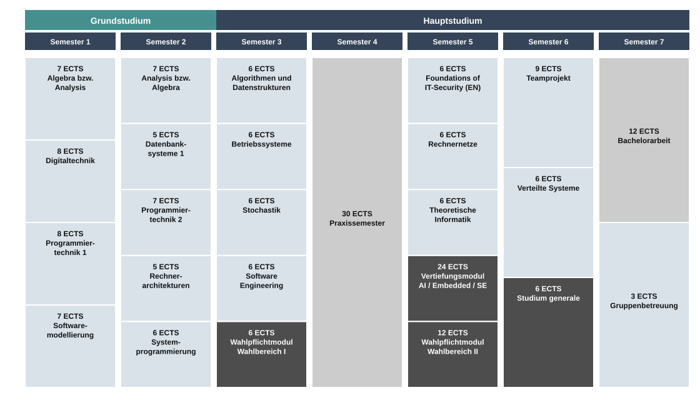

---

# A Short Language History

---

# Programming Paradigms

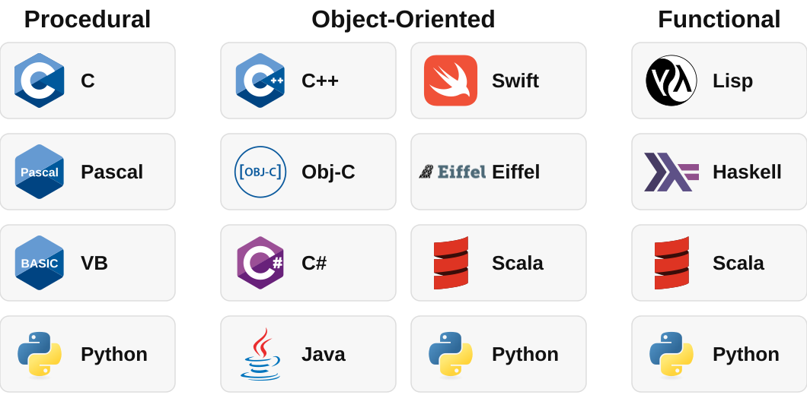

---

# Sprachen in AIN

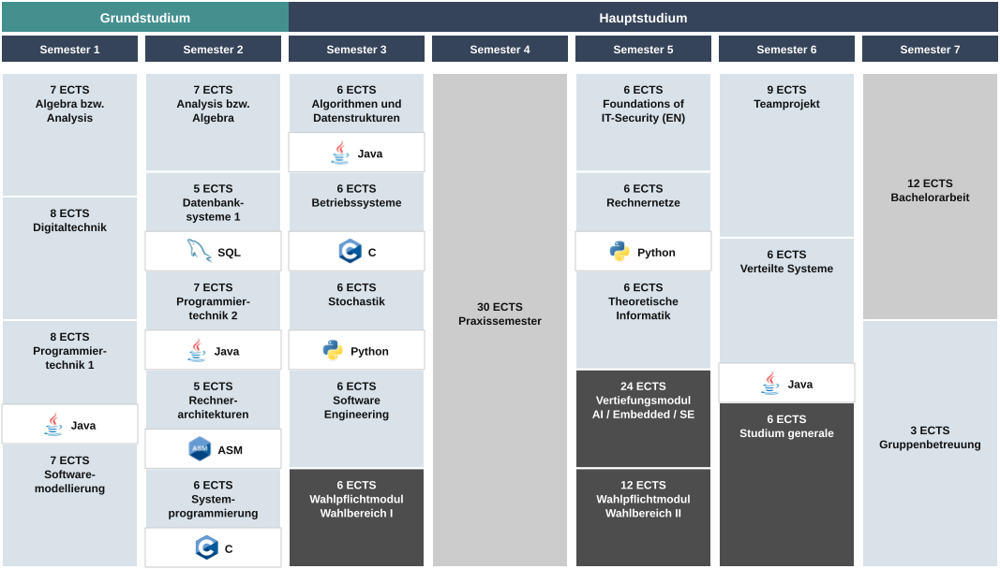

---

# Programming Paradigms

---

# Vertiefungsrichtungen

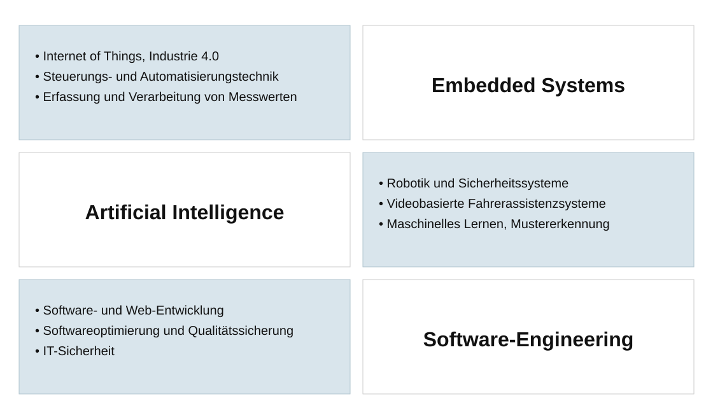

---

# Vertiefungsrichtungen in AIN

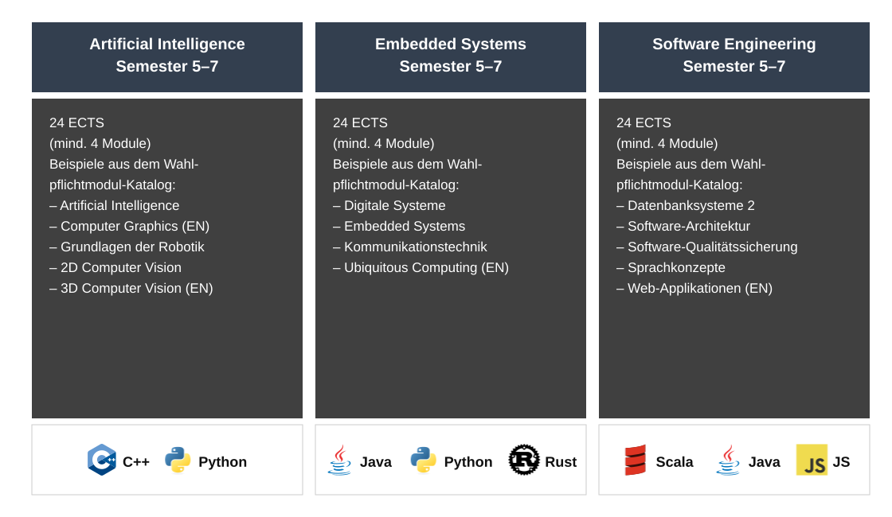

---

<!-- _footer: "" -->

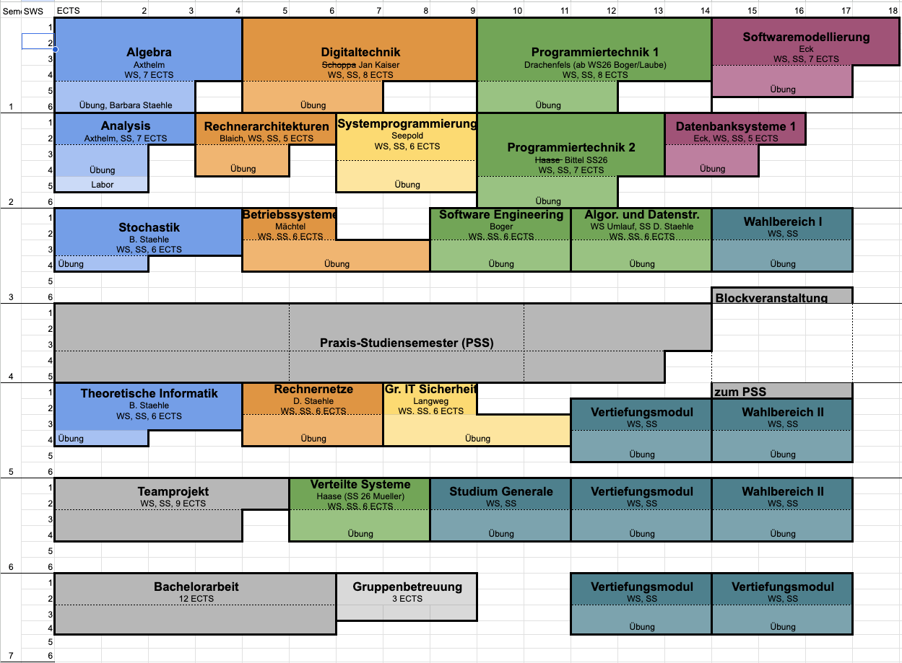

---

<!-- _footer: "" -->

---

<!-- _footer: "" -->

---

# Traits of Software Development

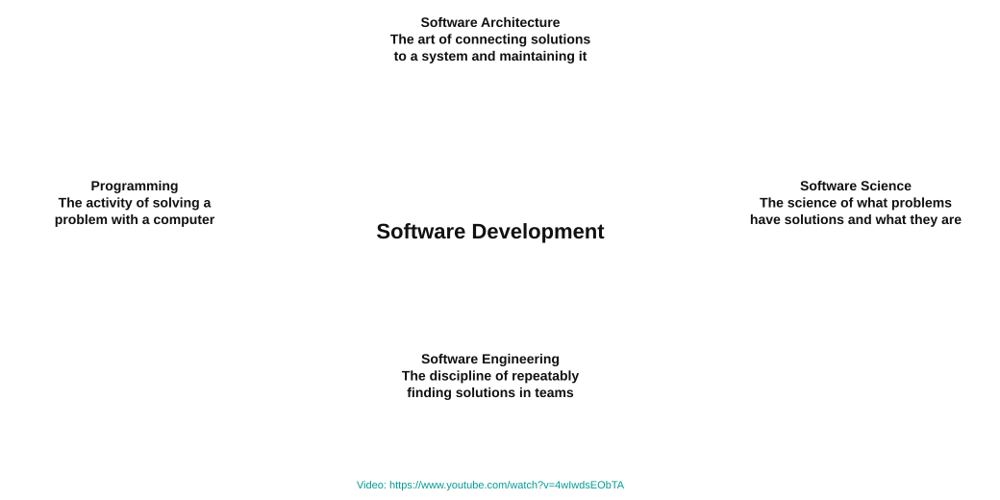

---

# Tools für das Studium

| Tool | Zweck | Link |
|------|--------|------|
| **Moodle** | Lernplattform | https://moodle.htwg-konstanz.de/ |
| **INdigit** | Teamprojekte, Abschlussarbeiten, Modulhandbuch | https://indigit.htwg-konstanz.de/ |
| **LSF** | Lehrveranstaltungsplan | https://lsf.htwg-konstanz.de/ |
| **SPO** | Studienprüfungsordnung | https://www.htwg-konstanz.de/bachelor/angewandte-informatik/dokumente |
| | Portal Prüfungsangelegenheiten | |
| | Liste der Termine (HTWG-Webseite) | |

---

# Wintersemester 2026/27 — Termine

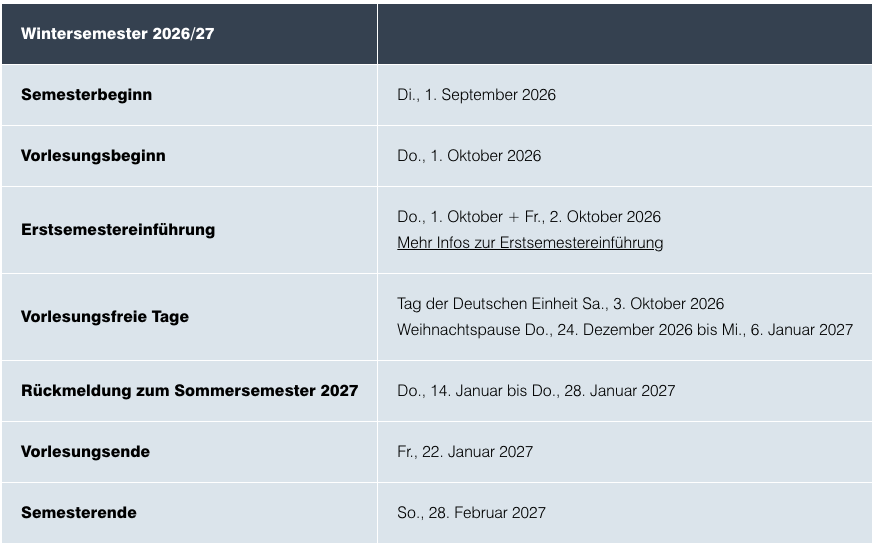

---

# Übungsgruppen

Übungsgruppen im Moodle-Kurs [**AINORGA**](https://moodle.htwg-konstanz.de/moodle/course/section.php?id=6495)

| Gruppe | Programmiertechnik 1 | Digitaltechnik | Softwaremodellierung |
|--------|----------------------|----------------|----------------------|
| ● Grüne Gruppe | Dienstag 14:00–15:30 O 008 | Mittwoch 14:00–15:30 F 023 | Mittwoch 15:45–17:15 O 107 |
| ● Blaue Gruppe | Dienstag 15:45–17:15 O 008 | Mittwoch 15:45–17:15 F 023 | Mittwoch 14:00–15:30 O 107 |

Bitte in Moodle für eine der Gruppen eintragen!

---

# INdigit

INdigit ist das unsere Platform um eine Reihe von Dingen zu organisieren. Dazu gehören:
 - Teamprojekte
 - Abschlussarbeiten
 - Das Modulhandbuch

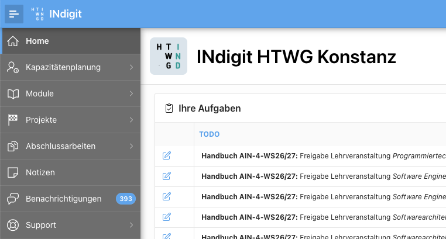

---

# Stundenplan AIN1 (LSF)

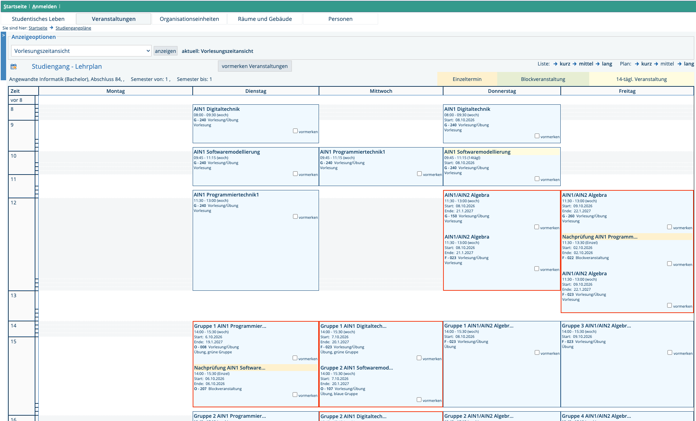

---

# Team Gleich — Gleichstellung & Diversity

Zentrale Anlaufstelle für Gleichstellung, Chancengerechtigkeit und Vielfalt an der HTWG – Unterstützung unabhängig von Geschlecht, Herkunft, Religion, Alter, Behinderung oder sexueller Identität.

- **Belästigung, Diskriminierung, Mobbing:** Ansprechpersonen sind Vera Maier-Tragmann, Prof. Dr. Georg Umlauf und Ilayda Zeller (Studentin, AStA)
- **Familien-Servicestelle (Grit Roth):** Studieren mit familiärer Verpflichtung, mit Behinderung und/oder chronischer Erkrankung
- **Angebote:** Coaching und Beratung, Begleitung in besonderen Lebenslagen, Mentoringprogramme, Workshops
- **Fakultät Informatik:** Prof. Dr. Rebekka Axthelm rebekka.axthelm@htwg-konstanz.de

[Antidiskriminierung](https://www.htwg-konstanz.de/hochschule/gleichstellung-und-diversity/antidiskriminierung)

[Familien-Servicestelle](https://www.htwg-konstanz.de/hochschule/gleichstellung-und-diversity/vereinbarkeit)

---

<!-- _class: abschluss -->

# Questions?

## Thank you and good luck!

marko.boger@htwg-konstanz.de
