<!--
Quelle: Google Präsentation „AIN5 Vertiefungsrichtungen“
(https://docs.google.com/presentation/d/1tYnGdR6WCjQOGEEHHtyckNQg3BWhEr9IBmkgf_-N3Zg), 1:1 übertragen.
Einzige inhaltliche Änderung: Folie 22 „Gruppenbetreuung Sem7“ – der veraltete Screenshot wurde durch die
aktuelle Terminübersicht „Methoden der Gruppenbetreuung“ aus der E-Mail von Emmanuel Winkler vom 29.09.2026 ersetzt.
Bilder: assets/*.png (aus dem PPTX-Export der Google-Präsentation extrahiert; Folien 18, 19 und 25 als Ausschnitt
des Folien-Thumbnails, weil dort Markierungsrahmen bzw. ein aus Formen gezeichnetes Diagramm enthalten sind).
-->

## Angewandte Informatik (AIN5)
# Informationen für das Hauptstudium AIN - Vertiefungsrichtungen

---

# Studiendekan AIN

Prof. Dr. Marko Boger

Raum O205

marko.boger@htwg-konstanz.de

Sprechstunde: Donnerstags 11:30–13:00 Uhr

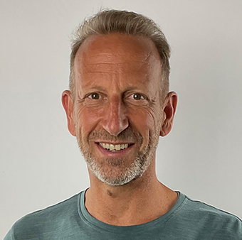

---

<!-- _footer: "" -->

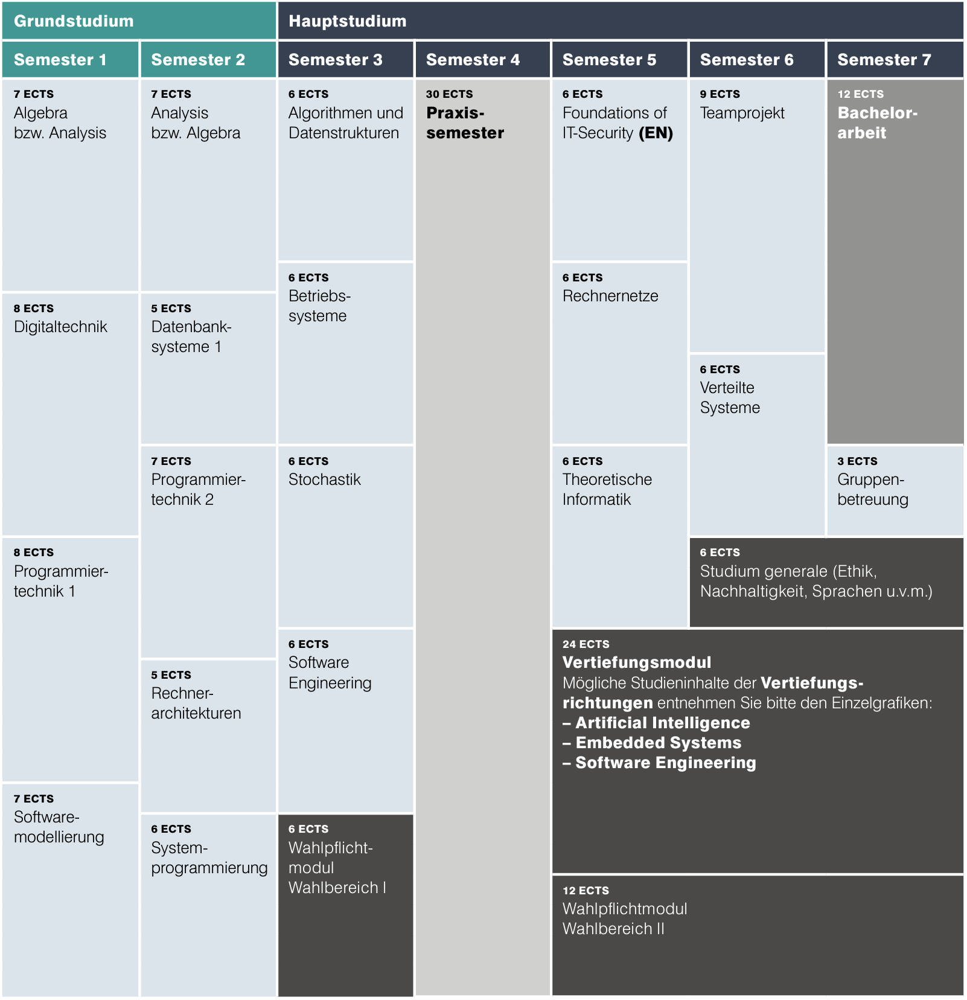

---

<!-- _footer: "" -->

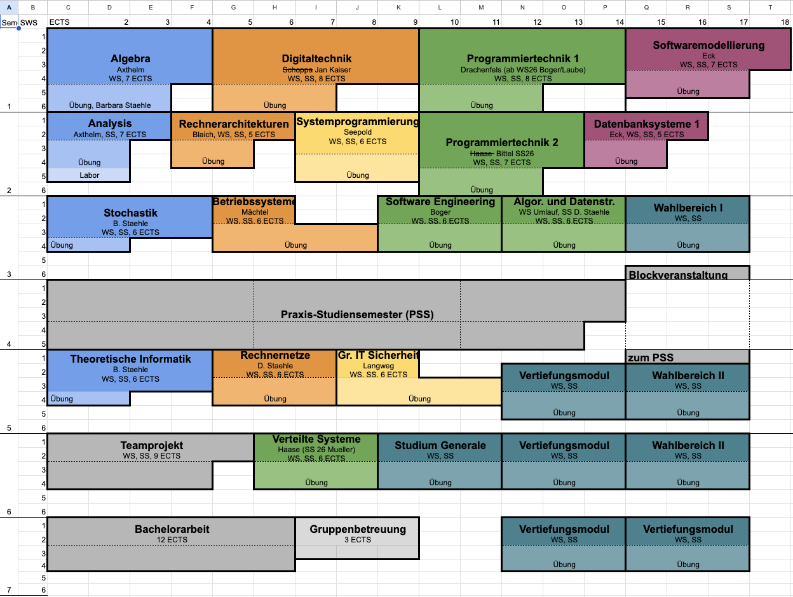

---

# Vertiefungsbereich

| | |
|---|---|
| Embedded Systems | − Internet of Things, Industrie 4.0 − Steuerungs- und Automatisierungstechnik − Erfassung und Verarbeitung von Messwerten |
| Artificial Intelligence | − Robotik und Sicherheitssysteme − Videobasierte Fahrerassistenzsysteme − Maschinelles Lernen, Mustererkennung |
| Software- Engineering | − Software- und Web-Entwicklung − Softwarearchitektur und Qualitätssicherung − IT-Sicherheit |

---

# Vertiefungsrichtungen in AIN

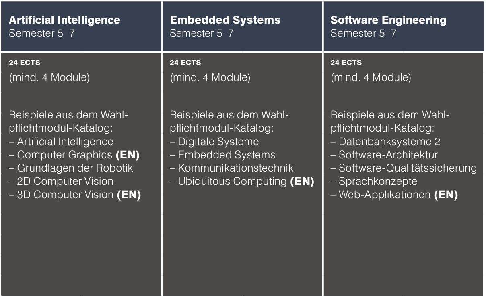

---

# Wahlbereich I

Fächer des Wahlbereich I sind für das 3. Semester vorgesehen und dienen zur Vorbereitung und Orientierung zum Vertiefungsbereich.

Dies sind derzeit

- **Web-Applikationen für die Vertiefung Software Engineering**
- **Technische Grundlangen der KI für die Vertiefung AI**
- **Microcontrollersysteme für die Vertiefung Embedded Systems**

Für die Vertiefung Software Engineering ist verpflichtend für alle Vertiefungsrichtungen.

Vorlesungen der Vertiefungsrichtungen, die nicht als Orientierungsfach genutzt werden, stehen dann als Teil des Wahlbereich II zur Verfügung.

---

# Vertiefungsbereich

Im Vertiefungsbereich sind 4 Module in den Semestern 5 bis 7 zu absolvieren.

Reihenfolge und Semester sind frei wählbar, auf eine inhaltliche Reihenfolge ist zu achten.

Der Katalog der angebotenen Vorlesungen kann sich über die Zeit ändern.

---

# Wahlbereich II

Der Wahlbereich II umfasst

- weitere Fächer des Vertiefungsbereichs über 4 Module hinaus.
  - derzeit keine
- Module anderer Vertiefungsbereiche.
- die Orientierungsfächer aus Wahlbereich I, soweit sie nicht schon als Orientierungsfach für die Vertiefung im Wahlbereich I gewählt wurden.

---

# Studium Generale

Im Studium Generale können Module aus anderen Bereichen der Hochschule gewählt werden, z. B.: Ethik, Sprachen, Innovation, Kultur, Theater, Softskills…

Ein Katalog steht unter https://www.htwg-konstanz.de/studium/interdisziplinaere-angebote/studium-generale

zur Verfügung.

Vorlesungen anderer Fachbereiche können ebenfalls genehmigt werden.

---

<!-- _footer: "" -->

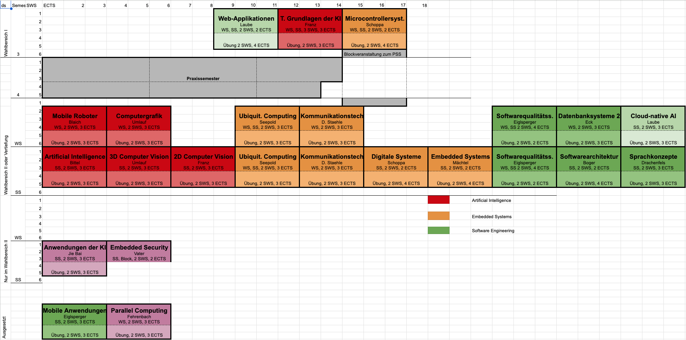

---

# Anmeldung zur Vertiefungsrichtung

- Studierende aus dem 5. Semester werden per E-Mail vom IN-Sekretariat/Studiendekan informiert und dazu aufgefordert, die Vertiefungsrichtung per E-Mail an Frau Baier zu melden.
- Frist für die Rückmeldung wird in der E-Mail genannt.

---

# Wechsel der Vertiefungsrichtung

- Die Vertiefungsrichtung kann ein einziges Mal gewechselt werden.
- Wechselt ein Studierender die Vertiefungsrichtung, so werden die Fächer der neuen Vertiefungsrichtung zu Pflichtmodulen, die der Studierende erfolgreich bestehen muss.
- Die in der alten Vertiefungsrichtung erfolgreich absolvierten Pflichtmodule können durch das Prüfungsamt als Wahlpflichtfächer in der neuen Vertiefungsrichtung anerkannt werden.

---

# Methoden der Gruppenbetreuung/Tutorium

- Zuordnung von Studierenden zu Fächern
  - aus den ersten drei Semestern im SG AIN
  - bedarfsorientiert, vom Studiengangsleiter nach Anmeldung (mit drei Wunschfächern)
  - in der letzten Woche des Vorsemesters
- Absprachen mit Professoren/innen können nur bedingt berücksichtigt werden.
- Vorziehen ist mit einer Genehmigung des/r Vorsitzenden des Prüfungsausschusses möglich. Voraussetzung: alle Leistungen aus den früheren Semestern müssen erfolgreich bestanden sein.
- Referent „Methoden der Gruppenbetreuung“: Emmanuel Winkler

---

# Methoden zur Gruppenbetreuung

<!-- Ersetzt den veralteten Screenshot. Quelle: E-Mail Emmanuel Winkler, 29.09.2026 (Methoden der Gruppenbetreuung). -->

| Tag | Gruppe | Unterricht | Pausen | UE |
|---|---|---|---|---|
| Fr 09.10.2026 | Gruppe 1 (SE) | 08:00–13:00 | 09:30–09:45, 11:15–11:30 | 6 |
| Fr 09.10.2026 | Gruppe 2 (übrige VR) | 14:00–19:00 | 15:30–15:45, 17:15–17:30 | 6 |
| Sa 10.10.2026 | Gruppe 1 (SE) | 08:00–13:00 | 09:30–09:45, 11:15–11:30 | 6 |
| Sa 10.10.2026 | Gruppe 2 (übrige VR) | 14:00–19:00 | 15:30–15:45, 17:15–17:30 | 6 |
| Mo 12.10.2026 | Gruppe 1 (SE) | 08:00–10:30 | 09:30–09:45 | 3 |
| Mo 12.10.2026 | Gruppe 2 (übrige VR) | 14:00–16:30 | 15:30–15:45 | 3 |

---

# Teamprojekte

- Projektarbeiten in kleinen Gruppen von 3 bis 7 Teilnehmern.
- Themen und Gruppen werden in INdigit verwaltet.
- gelegentlich interdisziplinäre Teamprojekte mit anderen Fakultäten.
- studentische Projektthemen sind möglich, müssen aber von einem Professor anerkannt und betreut werden.
- Teamprojekte werden in der ersten Woche des Semesters vorgestellt.
- Die Registrierung erfolgt im vorhergehenden Semester, um den Bedarf abschätzen zu können.
- Die Anmeldung erfolgt nach der Vorstellung in der ersten Woche des Semesters.
- Projektstart ist in der zweiten Woche des Semesters.

---

# Bachelorarbeit

- Externe und interne Bachelorarbeiten sind möglich
- Intern: Zwei Professoren der AIN
- Extern: Erstbetreuer ein Prof. der AIN, Zweitbetreuer der Firma
  - Zweitbetreuer muss selbst den angestrebten Abschluss haben
  - Ausgabe/Genehmigung des Themas durch die Hochschule
  - Bei externen Bachelorarbeiten besteht KEIN Anspruch auf die Betreuung seitens der Professoren
  - Wichtig: zuerst Betreuer/in finden, danach Werksvertrag unterschreiben
- Beantragung und Abgabe läuft über INdigit

---

# SPO3 / SPO4

- Die SPO4 ist gültig für alle Studienanfänger im Sommersemester 2024.
- Alle Studierenden, die zum Wintersemester 2023/24 bereits eingeschrieben waren bleiben in der AIN SPO3.
- Ein Wechsel in die SPO 4 ist mit Antrag beim Prüfungsausschussvorsitzenden (Schoppa / Staehle) möglich.
- Die Anerkennung einzelner Leistungen nach SPO4 in SPO3 ist ebenfalls möglich.

---

# Änderungen im Grundstudium

Probleme:

- Probleme Mathematik verlässlich professoral anzubieten
- Mathematik gebündelt in den ersten zwei Semestern
- Lücke zwischen Softwaremodellierung und Datenbanken

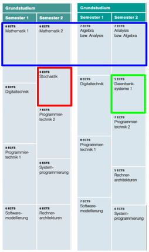

Lösungen:

- Mathematik 1 und Mathematik 2 werden umbenannt  und nur noch jährlich  angeboten, Prüfungen werden weiterhin jedes Semester angeboten.
- Stochastik wird in das dritte Semester verschoben
- Datenbanksysteme wird in das zweite Semester vorverschoben

---

# Änderungen im Hauptstudium

Probleme:

- Kombiniertes Modul Algorithmen und Datenstrukturen
- Ballung von Lehrinhalten im dritten Semester

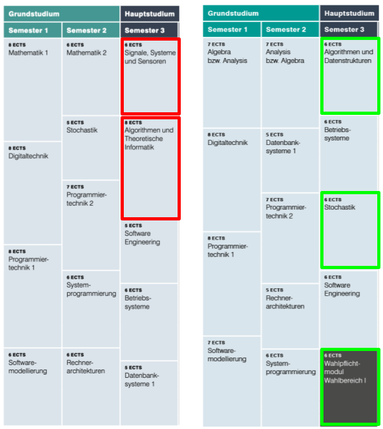

Lösungen:

- Aufteilung von “Algorithmen und Theoretische Informatik” in zwei separate Module.
  - Algo. in Sem 3
  - Theor. in Sem 5
- Einführung von Wahlbereich I mit zwei Modulen zur Auswahl:
  - Theoretische Grundlagen der KI
  - Digitale Systeme

---

# Vertiefungsrichtung SE SPO3

Die Vorlesung Mobile Anwendungen findet im WS26/27 nicht statt.

Evtl. wird diese im SS27 wieder angeboten.

Stattdessen bietet Pascal Laube die Vorlesung „Cloud Native AI“ an.

---

# Vertiefungsrichtung ES SPO3

Die Vorlesung Parallel Computing findet im WS26/27 nicht statt.

Stattdessen bietet Pascal Laube die Vorlesung „Cloud Native AI“ an.

---

# Vertiefungsrichtungen

Artificial Intelligence: N.N.

Embedded Systems: Dirk Staehle

Software Engineering: Marko Boger

---

# Web Applikationen, Wahlb. I Prof. Pascal Laube

Software-Anwendungen im Browser für unterschiedliche Geräte und viele Benutzer

Front-End-Entwicklung

Entwicklung in kleinen Teams

---

# Softwarearchtitektur Prof. Marko Boger

Architekturstile für große Anwendungen, Skalierbarkeit

Software-Entwicklung im Back-End

Entwicklung in Teams von Teams

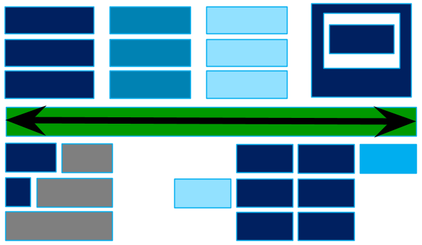

---

# Datenbanksysteme 2 Prof. Oliver Eck

Speicherung von großen Datenmengen in SQL- und Non-SQL-Datenbanken

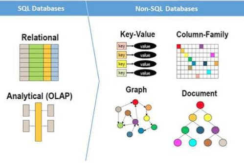

---

# Softwarequalitätssicherung Prof. Markus Eiglsperger

Techniken und Strategien für die Sicherung der Qualität und Wartbarkeit von Software

---

# Cloud Native AI Prof. Pascal Laube

- KI-Agenten und Multi-Agent-Systeme
- Retrieval-Augmented Generation (RAG)
- Deployment und Optimierung von ML-Modellen

Nachfolgeveranstaltung von Sprachkonzepte

Ersetzt in SPO3 im WS26/27 Mobile Anwendungen (SE) und Parallel Computing (AI, ES)

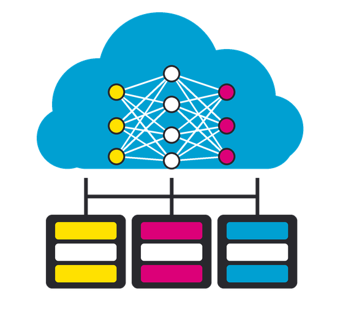

---

# Teamprojekte, Sem6 in INdigit

Bisher 16 registrierte Studenten, 54 Plätze (8 Projekte)

Vorstellung der Projekte im Anschluss gegen 12:30 Uhr

| Titel | Info | Projektleiter*in | Vorstellung |
|---|---|---|---|
| CodeTask: Eine Lernplattform für das Programmieren | 0 / 7 Mitglieder | Boger, Marko | |
| How can we leverage multimodal data to boost sleep disorder classification using machine learning? | 0 / 7 Mitglieder | Seepold, Ralf | ab 13 Uhr |
| OOXML-Forensik mit Windows PowerShell | 0 / 7 Mitglieder | Langweg, Hanno | 1. Präsentation (muss 12:50 gehen) |
| Projekt im Bereich Rechnernetze und Kommunikationstechnik | 0 / 7 Mitglieder | Staehle, Dirk | |
| Raumplanungstool für die HTWG | 0 / 7 Mitglieder | Boger, Marko | |
| SongConverter – KI-gestützte Konvertierung und manuelle Nachbearbeitung von Musikformaten (PDF, Audio, MIDI, MusicXML) | 0 / 5 Mitglieder | Haase, Oliver | keine Vorstellung, siehe [Moodle-Kurs](https://moodle.htwg-konstanz.de/moodle/course/view.php?id=3037) |
| Turing-Maschine zum Anfassen 1.1 oder 2.0 | 0 / 7 Mitglieder | Staehle, Barbara | keine Vorstellung |
| youBot 2.0 – Modernisierung eines mobilen Manipulators für ROS 2 | 0 / 7 Mitglieder | Blaich, Michael | keine Vorstellung |

<!-- Im Original steht zusätzlich die (vom Bild verdeckte) Textzeile „lkjlj“. -->

---

# CodeTask

CodeTask ist eine Lernplattform für das Programmieren.

Es wird im Wintersemester in Programmiertechnik 1 eingesetzt.

- Übungen
- Klausuren

Weiterentwicklung für Software Engineering

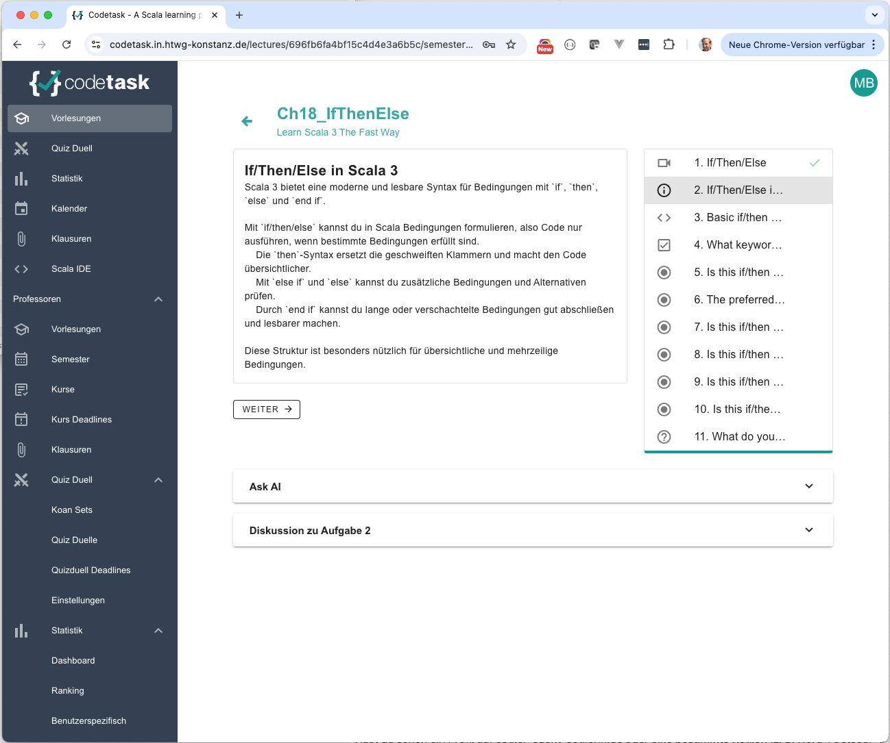

---

# Raumplanungstool für die HTWG

Neuentwicklung eines Raumplanungstools mit KI.

Anbindung an HISinOne.

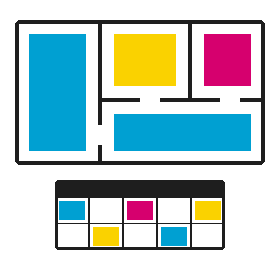

---

<!-- _class: abschluss -->

# Questions?

## Thank you!

marko.boger@htwg-konstanz.de
