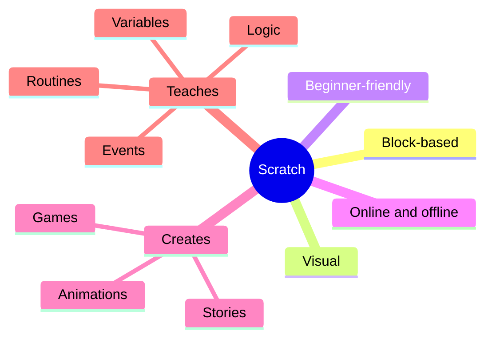
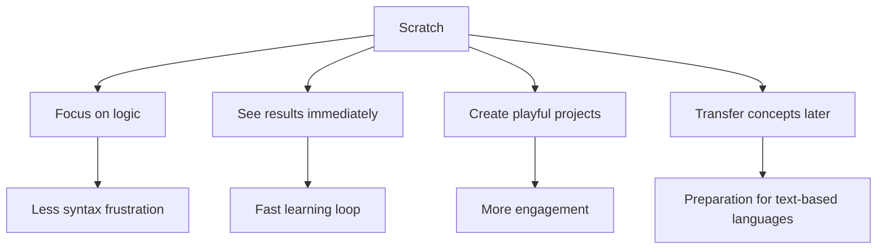
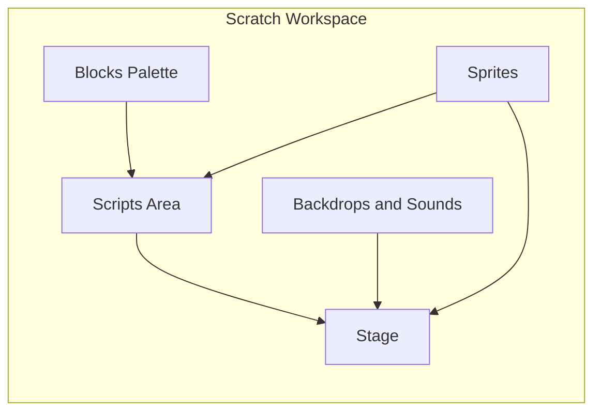
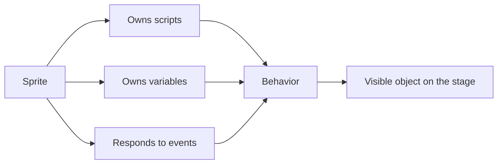
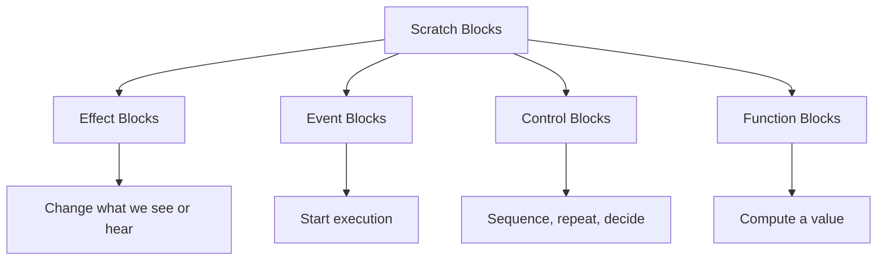
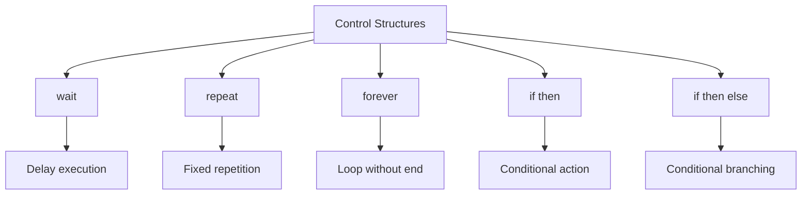
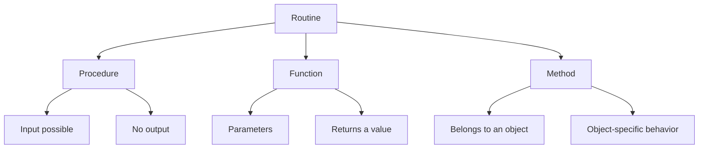
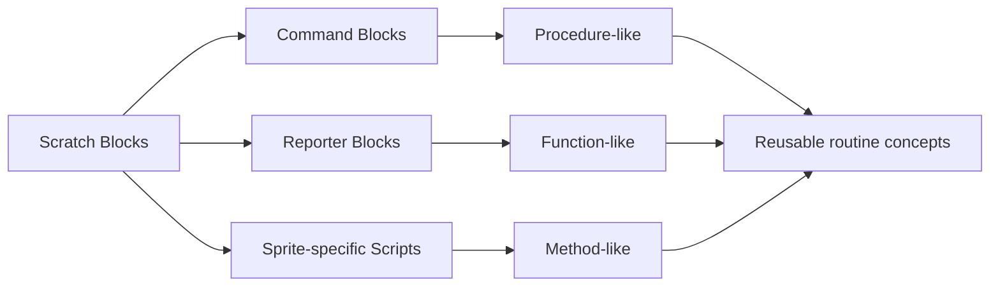

## Programmiertechnik I
# Lecture 01: Scratch

Visual programming as a gentle introduction to core programming concepts.

Proof of concept migrated from the Google Slides deck "PR-01-Scratch", slides 1-8.

---

# What Is Scratch

- Scratch is a **block-based visual programming language** developed by MIT.
- It is designed for beginners, but it is strong enough to teach central programming ideas.
- Students can build **games, animations, and interactive stories**.
- It is available online at `scratch.mit.edu` and also offline.

Why it matters for us:

- it reduces syntax friction
- it makes logic visible
- it gives immediate feedback

---

# Why We Start With Scratch

- **No syntax errors**: we focus on logic instead of punctuation.
- **Immediate feedback**: results appear directly on the stage.
- **Creative motivation**: students can build things that feel playful and personal.
- **Transfer value**: the ideas later reappear in Python, Java, and C#.
- **University relevance**: it trains problem-solving and computational thinking.

---

# The Scratch Environment

- **Stage**: where the animation or game becomes visible
- **Sprites**: programmable characters or objects
- **Blocks palette**: the available building blocks
- **Scripts area**: where blocks are assembled into behavior
- **Backdrops and sounds**: media that shape the scene

---

# Sprites Are Objects

- We will soon move to **object-oriented programming**.
- In Scratch, a sprite already behaves like a simple object.
- It has:
  - its own code
  - its own state
  - its own behavior on the stage

Core idea:

**A sprite is not only a picture. It is an executable thing.**

---

# Types of Blocks

Scratch uses different categories of blocks:

1. **Effect blocks** change appearance or sound
2. **Event blocks** start behavior
3. **Control blocks** manage flow
4. **Function blocks** compute and return values

The categories are important because they reflect different roles in a program.

---

# Control Structures

Control structures decide **when**, **how often**, and **under which condition** something happens.

Typical examples in Scratch:

- wait
- repeat
- forever
- if then
- if then else

These are the building blocks for algorithmic thinking.

---

# Blocks Are Routines

We use several names for reusable behavior:

- **Procedure**
  - may take input
  - has no return value
  - may have side effects
- **Function**
  - may take parameters
  - returns a value
- **Method**
  - a function or procedure that belongs to an object

The common abstraction is a **routine**.

---

# Scratch Blocks and Routines

What this means for Scratch:

- command-style blocks behave like **procedures**
- reporter blocks behave like **functions**
- sprite-specific behavior looks like a **method**

So when we work with Scratch blocks, we are already learning a more general programming idea:

**Programs are built from reusable routines.**

