## Programmiertechnik I
# Lecture 01: Scratch

Visual programming as a gentle introduction to core programming concepts.

Proof of concept migrated from the Google Slides deck "PR-01-Scratch", slides 1-8.

---

# What Is Scratch

- Scratch is a **block-based visual programming language** developed by MIT.
- It is designed for beginners, but it is strong enough to teach central programming ideas.
- Students can build **games, animations, and interactive stories**.
- It is available online at `scratch.mit.edu` and also offline.

Why it matters for us:

- it reduces syntax friction
- it makes logic visible
- it gives immediate feedback

---

# Why We Start With Scratch

- **No syntax errors**: we focus on logic instead of punctuation.
- **Immediate feedback**: results appear directly on the stage.
- **Creative motivation**: students can build things that feel playful and personal.
- **Transfer value**: the ideas later reappear in Python, Java, and C#.
- **University relevance**: it trains problem-solving and computational thinking.

---

# The Scratch Environment

- **Stage**: where the animation or game becomes visible
- **Sprites**: programmable characters or objects
- **Blocks palette**: the available building blocks
- **Scripts area**: where blocks are assembled into behavior
- **Backdrops and sounds**: media that shape the scene

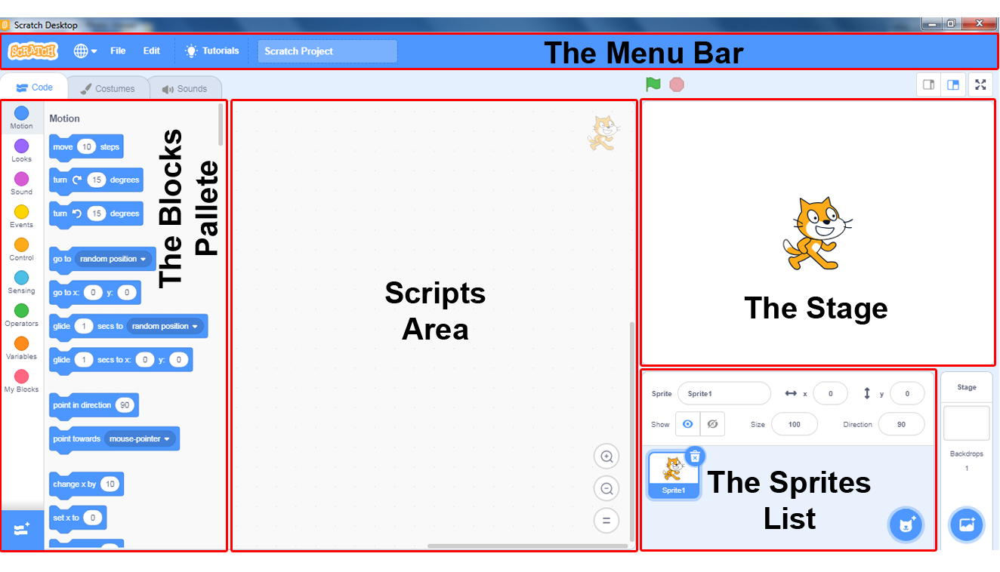

---

# Sprites Are Objects

- We will soon move to **object-oriented programming**.
- In Scratch, a sprite already behaves like a simple object.
- It has:
  - its own code
  - its own state
  - its own behavior on the stage

Core idea:

**A sprite is not only a picture. It is an executable thing.**

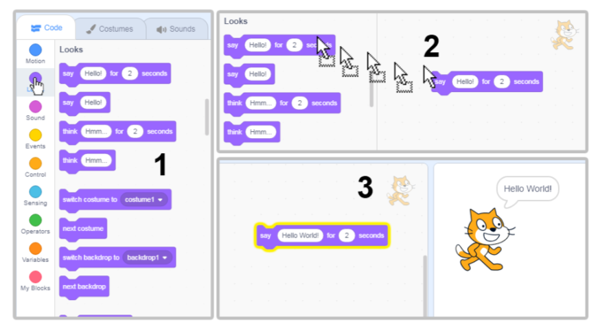

---

# Types of Blocks

Scratch uses different categories of blocks:

1. **Effect blocks** change appearance or sound
2. **Event blocks** start behavior
3. **Control blocks** manage flow
4. **Function blocks** compute and return values

The categories are important because they reflect different roles in a program.

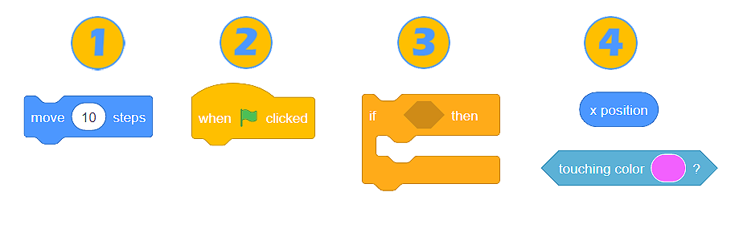

---

# Control Structures

Control structures decide **when**, **how often**, and **under which condition** something happens.

Typical examples in Scratch:

- wait
- repeat
- forever
- if then
- if then else

These are the building blocks for algorithmic thinking.

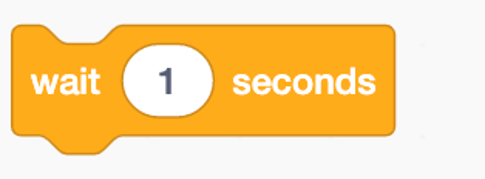

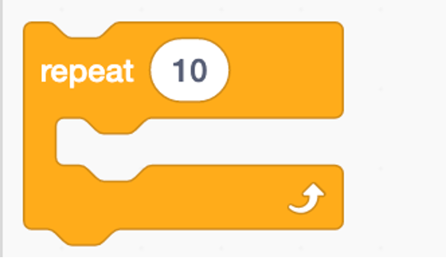

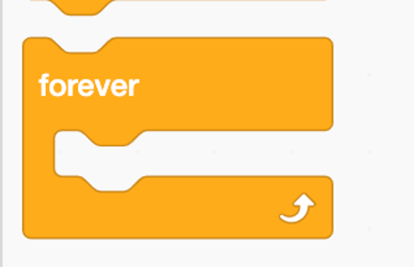

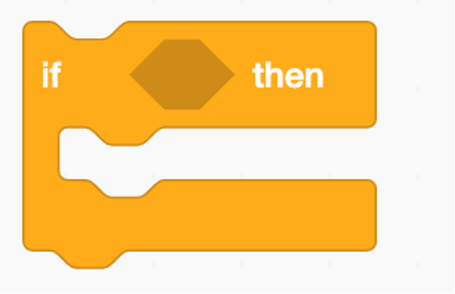

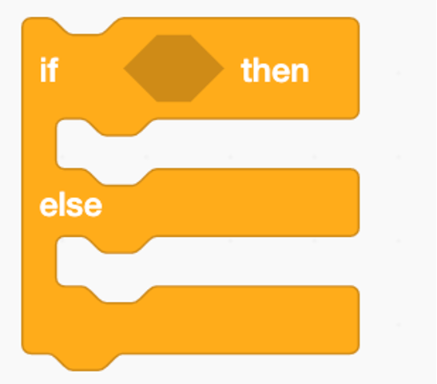

---

# Blocks Are Routines

We use several names for reusable behavior:

- **Procedure**
  - may take input
  - has no return value
  - may have side effects
- **Function**
  - may take parameters
  - returns a value
- **Method**
  - a function or procedure that belongs to an object

The common abstraction is a **routine**.

---

# Scratch Blocks and Routines

What this means for Scratch:

- command-style blocks behave like **procedures**
- reporter blocks behave like **functions**
- sprite-specific behavior looks like a **method**

So when we work with Scratch blocks, we are already learning a more general programming idea:

**Programs are built from reusable routines.**

---

# Function Blocks Have a Type

Types are:

- **Numbers** `(round)`
  - only number input is allowed
- **Strings** `(round)`
  - numbers are converted to strings when necessary
- **Boolean** `(pointed)`

Function blocks are typed, and the shape already hints at what kind of value they produce.

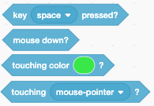

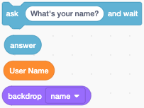

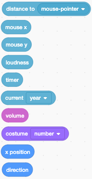

---

# Functions and Operators

- Function blocks return a value.
- The value can be a **number**, a **string**, or a **boolean**.
- Operators are again constructed from function blocks.
- Some operators transform numbers or strings into boolean values.

This is the basis for building larger expressions from smaller parts.

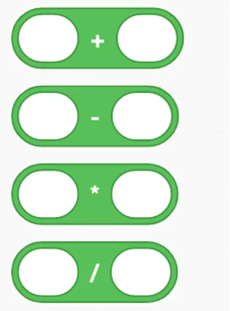

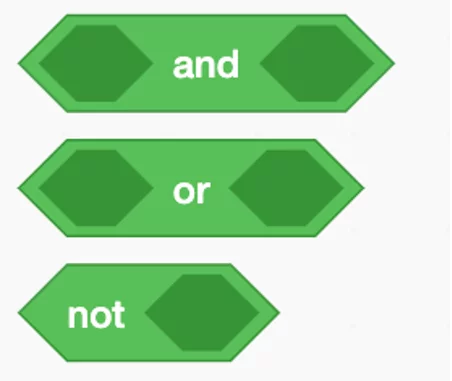

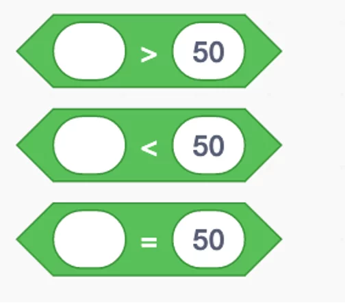

---

# Expressions

An **expression** combines numbers, variables, operations, or functions and can be evaluated to a value.

Expressions can also be nested.

- **Numeric expression**
  - contains only numbers
  - example: `3 + (5 * 2)`
- **Algebraic expression**
  - contains numbers and variables
  - example: `4x + 3`
- **Boolean expression**
  - uses logical operators such as `and`, `or`, and `not`
  - example: `A ^ (B | C)`

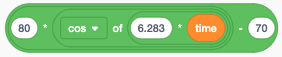

---

# Variables

- Variables can have a varying value.
- Variables can be:
  - defined
  - initialized
  - changed
  - incremented
  - shown
  - hidden
- Variables can have a **local** or **global** scope.

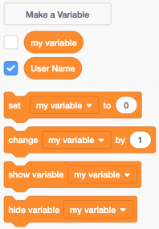

---

# Algebra

**Algebra** is the branch of mathematics that works with variables and rules for manipulating them.

Key components:

- **Variables**: symbols for unknown or changing values
- **Constants**: fixed numeric values
- **Operations**: addition, subtraction, multiplication, division, and more
- **Expressions**: combinations such as `2x + 5`
- **Equations**: statements like `2x + 5 = 11`
- **Functions**: rules like `f(x) = x^2`

Types of algebra:

- **Elementary algebra**: basic operations, linear and quadratic equations
- **Abstract algebra**: structures such as groups, rings, and fields
- **Linear algebra**: vectors, matrices, and transformations
- **Boolean algebra**: logic with binary values for computing

---

# Boolean Algebra

Boolean algebra is the algebra of **truth values**.

Instead of calculating with numbers such as `3` or `17`, we calculate with:

- `true`
- `false`

It is used whenever a program needs to make a decision.

Typical operators are:

- **and**
- **or**
- **not**

Examples:

- `score > 10 and lives > 0`
- `touching edge or touching enemy`
- `not gameOver`

This matters in Scratch because conditions inside blocks such as **if**, **if else**, and **repeat until** are boolean expressions.

---

# Define Blocks

- You can define your own blocks.
- These blocks can:
  - have parameters
  - change variables
- But they can **not**:
  - return a value

So in this form they are **procedures**, not functions.

Defined blocks are local to the current sprite.

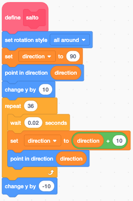

---

# Messages

- Messages are events that can be received and trigger execution.
- Messages can not have parameters.
- One script **sends** a message with `broadcast`.
- Another script **starts** when it matches that message with `when I receive`.

This is how Scratch lets sprites coordinate behavior.

  

    

      broadcast
      start game
    

    
send a message to all sprites

  

  

    

      when I receive
      start game
    

    
start this script when that message arrives

  

---

# Namespace

Namespaces are an important concept in programming languages.

They help us manage:

- visibility
- scope

In Scratch, there are only two namespaces:

- the object or sprite
- the global namespace

A global namespace can be problematic, but it is common in scripting-oriented systems such as JavaScript.

---

# Visibility or Scope

Variables have a visibility:

- **global**: available to all objects
- **local**: available only in the defining object

Defined blocks always have local visibility.

Messages are always sent globally as a broadcast.

This is a limitation.

We will later introduce namespaces to define visibility and scope in a much more fine-grained way.

---

# Task

Create a Scratch project.

It should contain:

- expressions
- variables
- defined blocks
- messages
