### Prof. Dr. Marko Boger, Prof. Dr. Pascal Laube
# Programmiertechnik I
Programming proficiency in the Age of AI

---

# Organization

- **Alternating lecturers**: this lecture is taught alternately by Prof. Dr. Marko Boger in the winter semester and Prof. Dr. Pascal Laube in the summer semester.
- **Materials**: all slides, files, and course materials are provided in **Moodle**.
- **Exercises**: Tutors (AIN Students 7. Semester) support and evaluate the exercises.
- **CodeTask**: CodeTask is a learning platform to support excercises and exams
- **Exams**: Exams are digital on the learning platform CodeTask
- **Grades**: Grades will be a mix of points collected throughout the semester and the final exam

---

# Prof. Dr. Marko Boger

- Room O205
- marko.boger@htwg-konstanz.de
- Office hours: Thursdays 11:30–13:00
- Dean of AIN, Software Engineering, Software Architecture

---

# Prof. Dr. Pascal Laube

- Room O205
- plaube@htwg-konstanz.de
- Office hours: by appointment via email
- Professor of Software Development and AI

---

# About this Lecture Series

- [Moodle](https://moodle.htwg-konstanz.de/moodle/course/view.php?id=3194) as central infrastructure.
- Lectures are in presence.
- Lectures: Tuesdays 11:30–13:00 and Wednesdays 9:45–11:15, room G 240
- Exercises: Tuesdays in room O 008, 
  - group 2 (green) at 14:00–15:30, 
  - group 1 (blue) at 15:45–17:15
- Slides are in English, communication usually is in German.

---

<!-- _class: inhalt -->

# Main Goal of this Lecture

Programming proficiency

- Introduction to programming for first-semester students of Applied Computer Science (AIN)
- The ability to read, write, and reason about code
- From visual programming with Scratch to general concepts: objects, routines, types, expressions, and scope
- Syntax, semantics, and type systems of programming lanugages
- Multiple paradigms: Procedural, Object-oriented, Functional
- Each lecture ends with a hands-on task to practice the new concepts

---

<!-- _class: inhalt -->

# Content of this Lecture

- Scratch
  - Introduction to concepts
  - First project - individual
- Scala
  - Languages and Paradigms
  - Number Types
  - Arrays and Lists
  - Control Structures
  - Tuple, Objects, Enums and Classes
  - Generic Types, Pattern Matching
  - Recursion

- Scala (continued)
  - Collections
  - Namespaces
  - LazyList
  - Second project - teams of two

- HTML, CSS

- Unity
  - C#
  - Third project - teams of two

---

<!-- _class: inhalt -->

# Content of this Lecture: Tools

- Scratch Editor
- Moodle
- CodeTask
- Scastie
- Command Line
- VS Code
- FMT
- Cursor
- Version Control

---

### Prof. Dr. Marko Boger, Prof. Dr. Pascal Laube
## Programmiertechnik I
# Lecture 01: Scratch

Visual programming as a gentle introduction to core programming concepts.

---

# What Is Scratch

- Scratch is a **block-based visual programming language** developed by MIT.
- It is designed for beginners, but it is strong enough to teach central programming ideas.
- Students can build **games, animations, and interactive stories**.
- It is available online at `scratch.mit.edu` and also offline.

Why it matters for us:

- it reduces syntax friction
- it makes logic visible
- it gives immediate feedback

---

# Why We Start With Scratch

- **No syntax errors**: we focus on logic instead of punctuation.
- **Immediate feedback**: results appear directly on the stage.
- **Creative motivation**: students can build things that feel playful and personal.
- **Transfer value**: the ideas later reappear in Scala and Unity.
- **University relevance**: it trains problem-solving and computational thinking.

---

<!-- _class: kapitel -->

# Basic Elements

Sprites, blocks and control structures

---

# The Scratch Environment

- **Stage**: where the animation or game becomes visible
- **Sprites**: programmable characters or objects
- **Blocks palette**: the available building blocks
- **Scripts area**: where blocks are assembled into behavior
- **Backdrops and sounds**: media that shape the scene
- **Costumes tab**: draw a sprite's look (Pong: white rectangle, circle); the backdrop is the stage's picture (Pong: centre line)

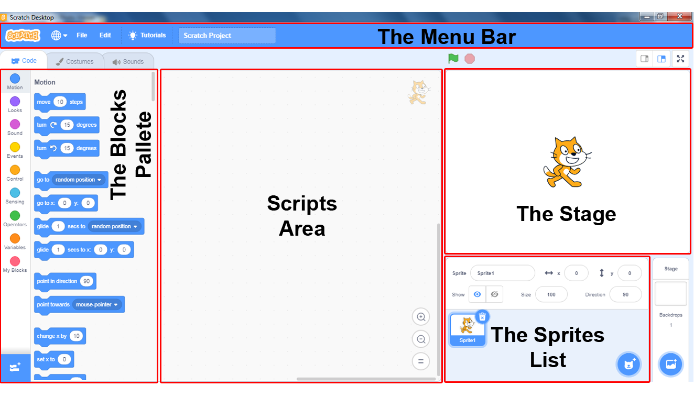

---

# Sprites Are Objects

- We will soon move to **object-oriented programming**.
- In Scratch, a sprite already behaves like a simple object.
- It has:
  - its own code
  - its own state
  - its own behavior on the stage

Core idea:

**A sprite is not only a picture. It is an executable thing.**

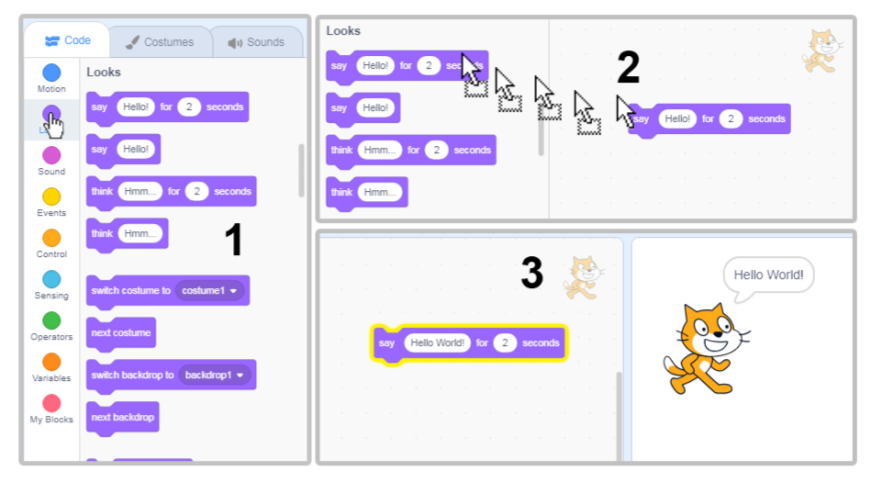

---

# Types of Blocks

Scratch groups its blocks into categories:

- **Motion**: move and turn sprites
- **Looks**: change appearance and speech bubbles
- **Sound**: play sounds and change volume
- **Events**: start scripts (green flag, key press, messages)
- **Control**: wait, loops, conditions, clones
- **Sensing**: react to input, touching, and timers
- **Operators**: arithmetic, comparisons, and logic
- **Variables**: variables and lists
- **My Blocks**: self-defined blocks

The categories are important because they reflect different roles in a program.

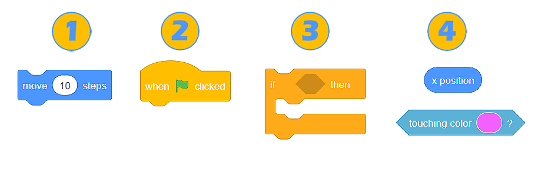

---

# Control Structures

Control structures decide **when**, **how often**, and **under which condition** something happens.

Typical examples in Scratch:

- wait
- repeat
- forever
- if then
- if then else

These are the building blocks for algorithmic thinking.

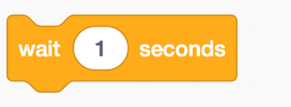

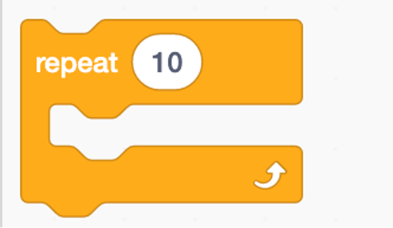

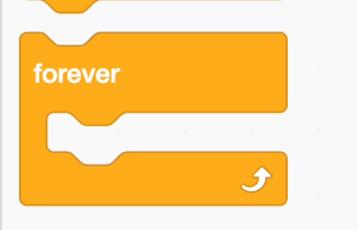

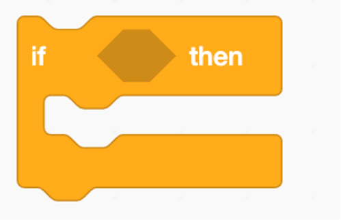

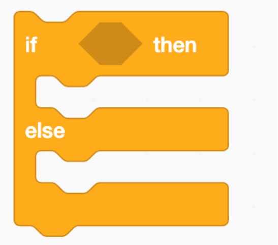

---

# Coordinates and Direction

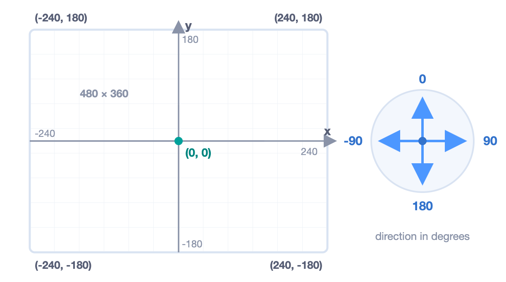

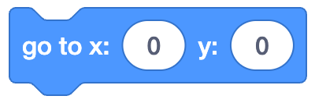
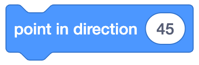
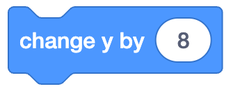

- The stage is **480 × 360** pixels, **(0, 0)** in the centre: x from -240 to 240, y from -180 to 180.
- `go to x: () y: ()` places a sprite; `change y by ()` moves up (+) or down (−); `x position` / `y position` report where it is.
- **Direction** in degrees: 90 = right, -90 = left, 0 = up, 180 = down; `move () steps` goes in the current direction.
- `if on edge, bounce` mirrors the direction at the stage edge.
- Mirroring by hand: `180 - direction` bounces off a horizontal surface, `0 - direction` off a vertical one (Pong paddles).

---

# Events and Parallel Scripts

- Every script starts with a **hat block**: `when green flag clicked`, `when [key] key pressed`, `when I receive [msg]`.
- One green-flag click starts all flag scripts of all sprites **and of the stage** at the same time: they run **in parallel**.
- The stage can have scripts too, e.g. setting `score` to 0 at the start.
- `when key pressed` reacts with the keyboard repeat delay; for smooth movement check `key [w] pressed?` inside `forever`.

<strong>Smooth movement:</strong>

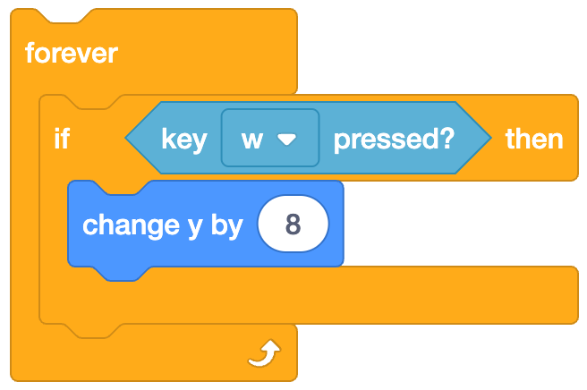

---

<!-- _class: kapitel -->

# Abstraction

Routines, functions, types, variables and scope

---

# Routines

We use several names for reusable behavior:

- **Procedure**
  - may take input
  - has no return value
  - may have side effects
- **Function**
  - may take parameters
  - returns a value
- **Method**
  - a function or procedure that belongs to an object

The common abstraction is a **routine**.

What this means for Scratch:

- command-style blocks behave like **procedures**
- reporter blocks behave like **functions**
- sprite-specific behavior looks like a **method**

So when we work with Scratch blocks, we are already learning a more general programming idea:

**Programs are built from reusable routines.**

---

# Function Blocks Have a Type

Types are:

- **Numbers** `(round)`
  - only number input is allowed
- **Strings** `(round)`
  - numbers are converted to strings when necessary
- **Boolean** `(pointed)`

Function blocks are typed, and the shape already hints at what kind of value they produce.

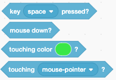

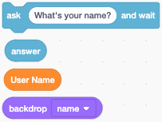

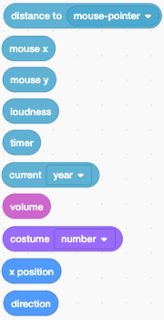

---

# Functions and Operators

- Function blocks return a value.
- The value can be a **number**, a **string**, or a **boolean**.
- Operators are again constructed from function blocks.
- Some operators transform numbers or strings into boolean values.

This is the basis for building larger expressions from smaller parts.

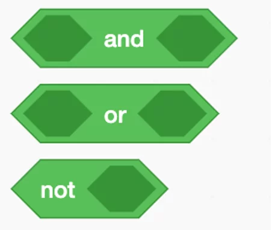

---

# Expressions

An **expression** combines numbers, variables, operations, or functions and can be evaluated to a value.

Expressions can also be nested.

- **Numeric expression**
  - contains only numbers
  - example: `3 + (5 * 2)`
- **Algebraic expression**
  - contains numbers and variables
  - example: `4x + 3`
- **Boolean expression**
  - uses logical operators such as `and`, `or`, and `not`
  - example: `A ^ (B | C)`

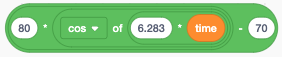

---

# Variables

- Variables can have a varying value.
- Variables can be:
  - defined
  - initialized
  - changed
  - incremented
  - shown on the stage as a **monitor** (checkbox), e.g. `score`
- Variables can have a **local** or **global** scope.

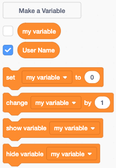

---

# Algebra

**Algebra** is the branch of mathematics that works with variables and rules for manipulating them.

Key components:

- **Variables**: symbols for unknown or changing values
- **Constants**: fixed numeric values
- **Operations**: addition, subtraction, multiplication, division, and more
- **Expressions**: combinations such as `2x + 5`
- **Equations**: statements like `2x + 5 = 11`
- **Functions**: rules like `f(x) = x^2`

Types of algebra:

- **Elementary algebra**: basic operations, linear and quadratic equations
- **Abstract algebra**: structures such as groups, rings, and fields
- **Linear algebra**: vectors, matrices, and transformations
- **Boolean algebra**: logic with binary values for computing

---

# Boolean Algebra

Boolean algebra is the algebra of **truth values**.

Instead of calculating with numbers such as `3` or `17`, we calculate with:

- `true`
- `false`

It is used whenever a program needs to make a decision.

Typical operators are:

- **and**
- **or**
- **not**

Examples:

- `score > 10 and lives > 0`
- `touching edge or touching enemy`
- `not gameOver`

This matters in Scratch because conditions inside blocks such as **if**, **if else**, and **repeat until** are boolean expressions.

---

# First Game: Pong

<strong>Ball</strong>
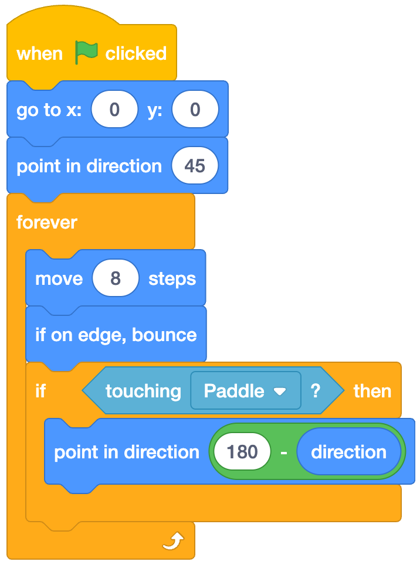

<strong>Paddle</strong>
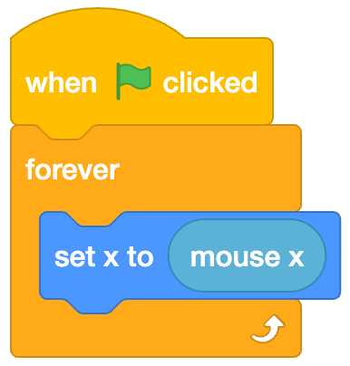

<strong>First collision check</strong>

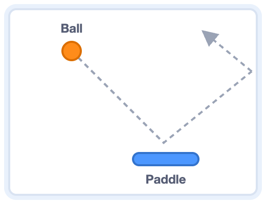

<strong>A collision is just a condition checked in every loop.</strong>

---

# Messages

- Messages are events that can be received and trigger execution.
- Messages can not have parameters.
- One script **sends** a message with `broadcast`.
- Another script **starts** when it matches that message with `when I receive`.
- `broadcast () and wait` continues only after all receiving scripts have finished (Pong: reset the ball, then go on).

This is how Scratch lets sprites coordinate behavior.

  

    
    
send a message to all sprites

  

  

    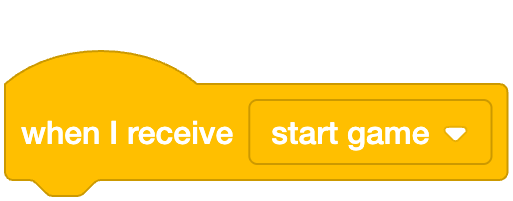
    
start this script when that message arrives

  

---

# Namespace

Namespaces are an important concept in programming languages.

They help us manage:

- visibility
- scope

In Scratch, there are only two namespaces:

- the object or sprite
- the global namespace

A global namespace can be problematic, but it is common in scripting-oriented systems such as JavaScript.

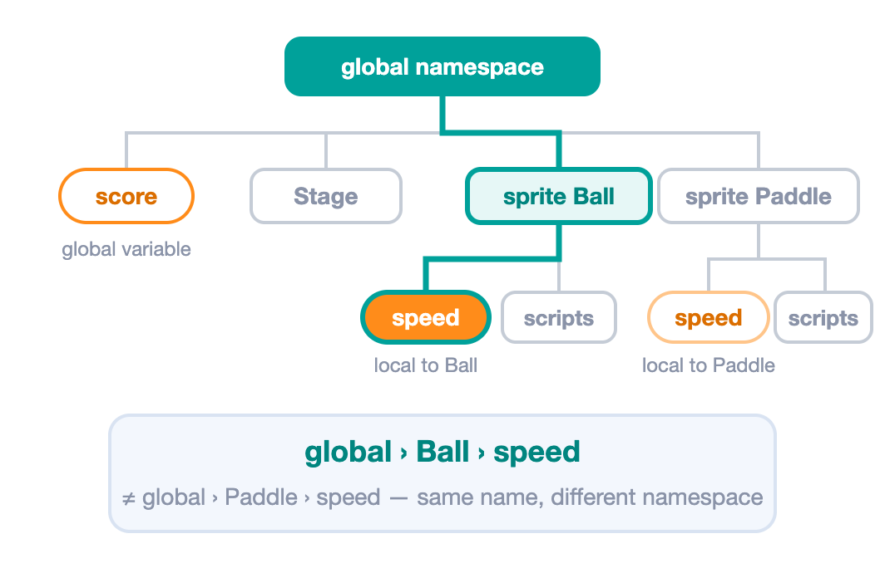

---

# Visibility or Scope

Variables have a visibility:

- **global**: available to all objects
- **local**: available only in the defining object

Messages are always sent globally as a broadcast.

This is a limitation.

We will later introduce namespaces to define visibility and scope in a much more fine-grained way.

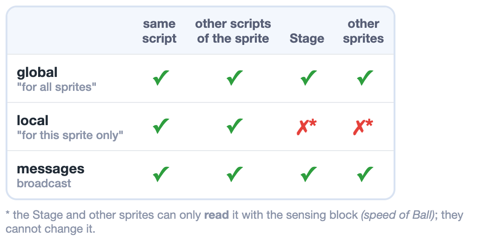

---

# Project Ideas: Classic Arcade Games

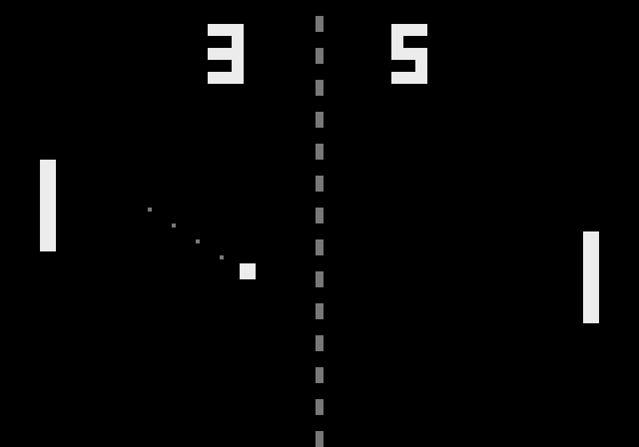

<strong style="font-size: 21px; color: #222;">Pong</strong>★☆☆

<strong>Scratch:</strong> touching, bounce, score variable

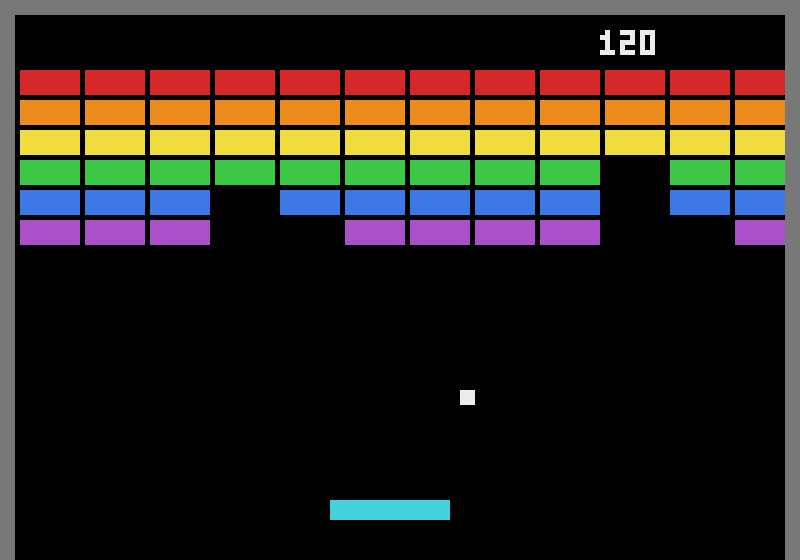

<strong style="font-size: 21px; color: #222;">Breakout</strong>★☆☆

<strong>Scratch:</strong> clones for bricks, touching, lives

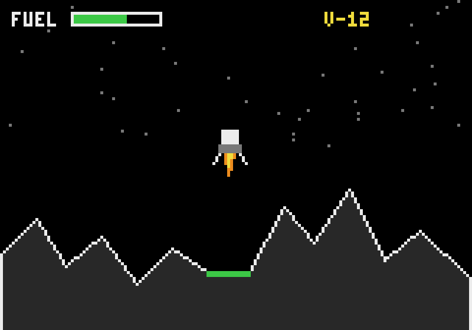

<strong style="font-size: 21px; color: #222;">Lunar Lander</strong>★★☆

<strong>Scratch:</strong> gravity via variables, key events, fuel

<strong>Build the core mechanic first, then add levels, sound, and polish.</strong>

---

# More Project Ideas

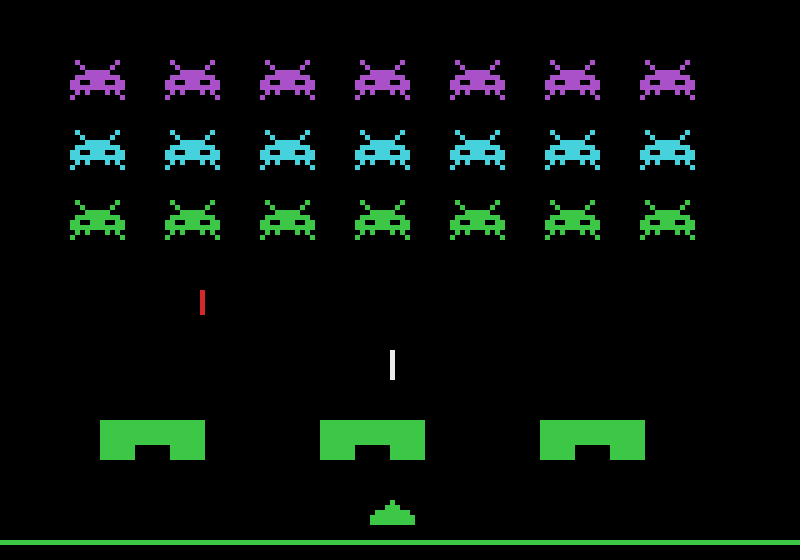

<strong style="font-size: 21px; color: #222;">Space Invaders</strong>★★☆

<strong>Scratch:</strong> clones for aliens and shots, broadcasts

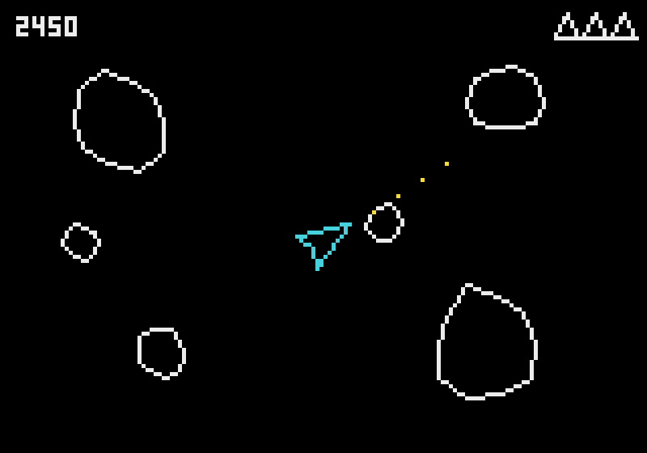

<strong style="font-size: 21px; color: #222;">Asteroids</strong>★★★

<strong>Scratch:</strong> direction and rotation, clones that split

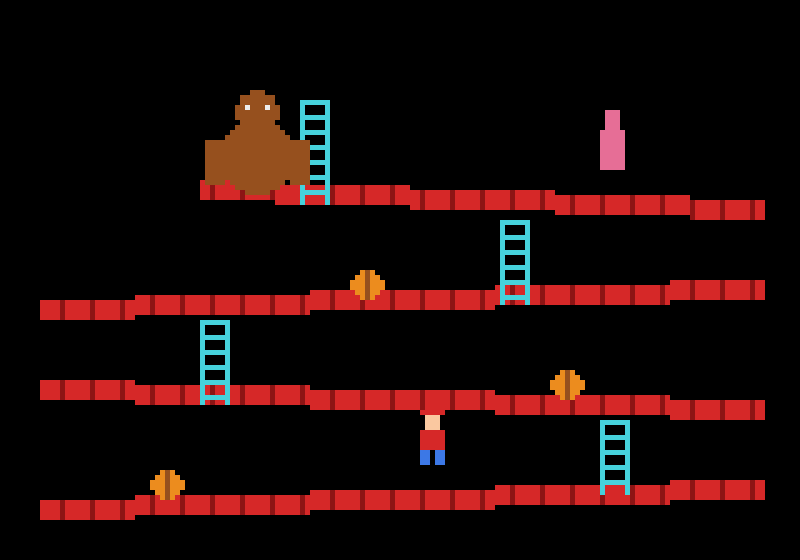

<strong style="font-size: 21px; color: #222;">Donkey Kong</strong>★★★

<strong>Scratch:</strong> clones for barrels, touching color for platforms, levels

<strong>All illustrations are our own pixel art, not screenshots of the original games.</strong>

---

# Finished Example: Pong.sb3

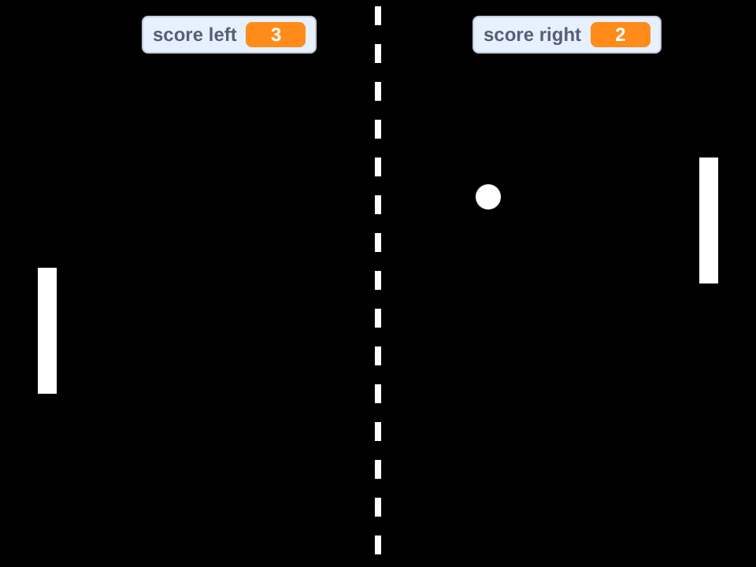

Open <strong>Pong.sb3</strong> and click the green flag. Left paddle: <strong>W / S</strong> &middot; right paddle: <strong>&uarr; / &darr;</strong>

- **Sprites + stage:** Paddle Left, Paddle Right, Ball; the stage draws the centre line
- **Smooth movement:** `forever` + `if key pressed` for each paddle
- **Motion:** `move (speed) steps` and `if on edge, bounce`
- **Collision:** `touching` a paddle **and** the right direction, then `point in direction (0 - direction)`
- **Scoring:** global variables, checked via the ball's x position
- **Serve:** `broadcast new ball` resets the ball; every hit makes it faster

---

<!-- _class: inhalt -->

# Summary

- Scratch is a block-based visual language (MIT) for learning core ideas without syntax noise
- Stage, sprites, blocks; sprites behave like simple objects with code and state
- Block categories, control structures, coordinates, events and parallel scripts
- Abstraction: blocks as procedures/functions; types (number, string, boolean); expressions
- Variables, algebra, and boolean algebra for conditions
- Messages (broadcast), namespace, and visibility/scope (global vs local)
- First game ideas (e.g. Pong) and classic arcade project suggestions

---

<!-- _class: aufgabe -->

# Task

Create a Scratch project.

It should contain:

- expressions
- variables
- messages

---

<!-- _class: abschluss -->

# Questions?

## Thank you!

marko.boger@htwg-konstanz.de
