### Prof. Dr. Marko Boger, Prof. Dr. Pascal Laube
## Programmiertechnik I
# Lecture 02: Scratch II

Deepening the core programming concepts with Scratch.

---

<!-- _class: inhalt -->

# Learning Goals

- Use clones to create repeated or dynamic game elements.
- Store and manage data with variables and lists.
- Organize larger projects with custom blocks and clear responsibilities.
- Model game flow with states such as start, play, pause, and game over.
- Debug clones, variables, broadcasts, and timing systematically, for example with variable monitors, instead of guessing.
- Connect Scratch numbers, text, and conditions to Scala's `Int`, `String`, and `Boolean`.

---

# Event-Driven Concurrency

<div class="columns" style="grid-template-columns: 3fr 2fr; gap: 1.5em; font-size: 22px;">
<div markdown="1">

- Every script starts with a hat block: green flag, key press, message received, or clone start.
- Several scripts run in parallel, even inside a single sprite.
- Broadcasts let sprites coordinate without knowing each other (e.g. "start game", "game over").
- Parallel scripts that share variables need care: who resets the score, who reads it first?
- Keep scripts small: one event, one job.

</div>
<div style="display: flex; flex-direction: column; align-items: flex-start; gap: 0.35rem;">

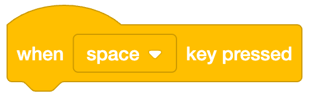
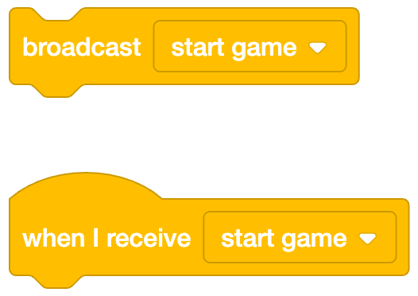
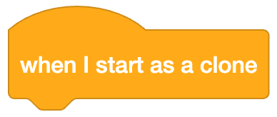
</div>
</div>

---

<!-- _class: kapitel -->

## 1
# Clones and Data

Clones, lists, and custom blocks

---

# Clone Blocks

Clones let one sprite create many temporary copies of itself at runtime.

<div class="columns" style="grid-template-columns: 1fr auto; gap: 2rem; align-items: start; font-size: 20px;">
<div style="display: grid; grid-template-columns: auto 1fr; gap: 1.2rem 1rem; align-items: center; margin-top: 2.2rem;">
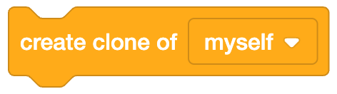
<div>creates a copy of a sprite</div>

<div>first script every new clone runs: set it up here</div>

<div>removes the clone again</div>
</div>
<div style="display: flex; gap: 2rem; align-items: flex-start;">
<div><strong>Original sprite</strong><br>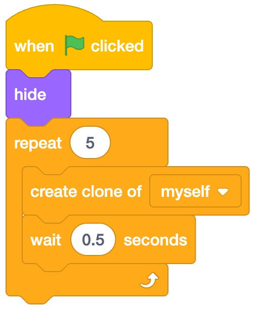</div>
<div><strong>Each clone</strong><br>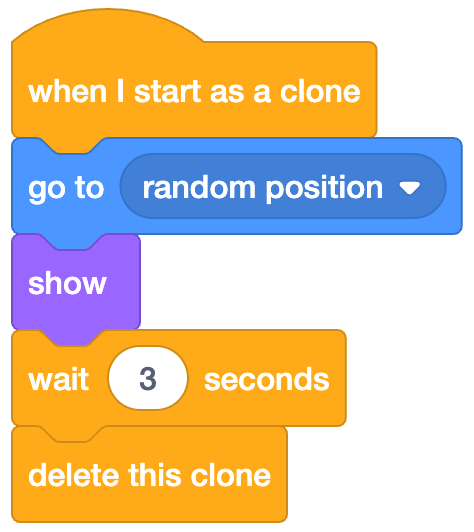</div>
</div>
</div>

---

# Clones: Sprite as Template, Clones as Objects

<div style="font-size: 21px;">

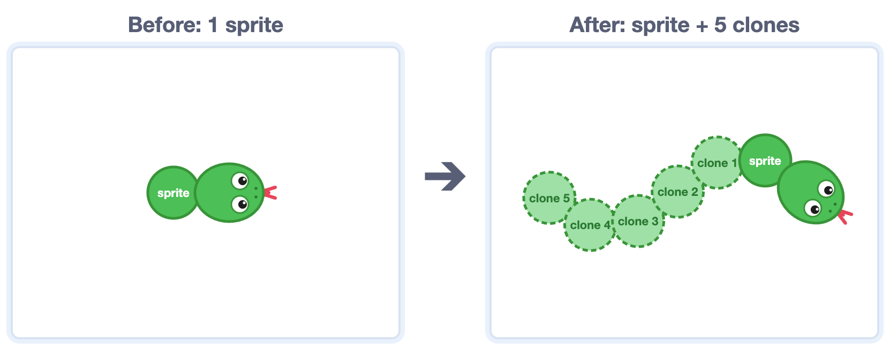

- The sprite acts like a **class**: a template that defines costumes, scripts, and variables once.
- Each clone is an **object** (instance) with its own position, costume, and its own copy of "for this sprite only" variables.
- All clones share the same scripts, but each one runs them independently with its own state.
- Typical uses: snake body segments, bullets, enemies, falling objects, or particle effects.
- Always define how clones are created, updated, and deleted, otherwise projects become slow and hard to control.

</div>

---

# From Clones to Classes and Objects

<div style="font-size: 19px;">

| Scratch | Java |
|---|---|
| Sprite (template with costumes, scripts, variables) | Class |
| Clone | Object (instance) |
| `create clone of myself` | `new Enemy(...)` |
| `when I start as a clone` | Constructor / initialization |
| Position, costume, "for this sprite only" variables per clone | Object state (fields) |
| Scripts shared by all clones | Methods |
| `delete this clone` | End of lifecycle (in Java: garbage collection once unreferenced) |

**Differences:** A clone copies the current state of its parent (prototype-style), while `new` builds a fresh object from the class. Scratch deletes clones explicitly; Java collects unreferenced objects automatically.

</div>

---

# Variables

<div class="columns" style="grid-template-columns: 1fr auto; gap: 2rem; align-items: start; font-size: 19px;">
<div style="display: grid; grid-template-columns: auto 1fr; gap: 0.7rem 1rem; align-items: center;">
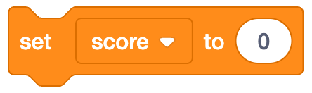
<div><strong>set</strong> a value, e.g. reset at game start</div>

<div><strong>change</strong> it relative to its current value</div>

<div><strong>read</strong> the value inside other blocks</div>
<div style="display: flex; flex-direction: column; gap: 0.3rem;">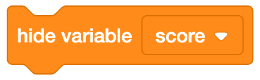</div>
<div>show or hide the variable's <strong>monitor</strong> on the stage</div>
</div>
<div style="display: flex; flex-direction: column; gap: 0.5rem; width: 330px;">
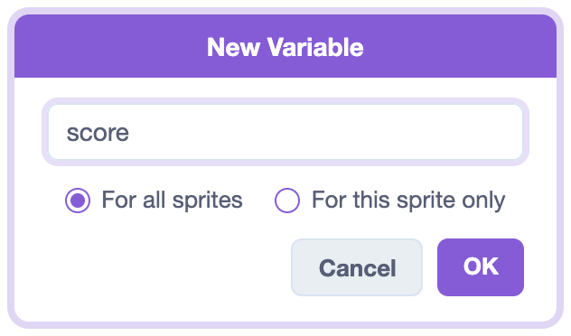
<div style="font-size: 17px;"><strong>Make a Variable:</strong> "for all sprites" is global; "for this sprite only" gives every clone its own copy.</div>
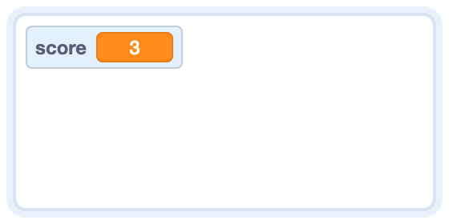
<div style="font-size: 17px;"><strong>Monitors</strong> show live values: the easiest way to debug when data changes unexpectedly.</div>
</div>
</div>

---

# Lists: Scratch's Only Data Structure

<div class="columns" style="grid-template-columns: 1fr auto; gap: 1.5rem; align-items: center; font-size: 18px;">
<div style="display: grid; grid-template-columns: auto 1fr; gap: 0.45rem 1rem; align-items: center;">

<div>append at the end</div>

<div>remove item at a position</div>

<div>insert at a position, the rest moves down</div>
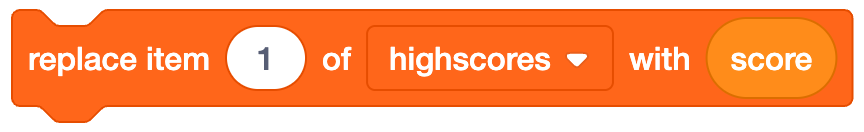
<div>overwrite one item</div>

<div>read one item</div>

<div>number of items</div>

<div>is a value in the list?</div>
</div>
<div style="display: flex; flex-direction: column; gap: 0.5rem; width: 230px;">
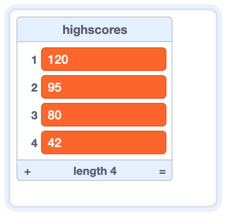
<div style="font-size: 17px;">Positions start at <strong>1</strong>, not 0 as in Java arrays.</div>
</div>
</div>

---

# Custom Blocks: Define Your Own

<div class="columns" style="grid-template-columns: 1fr auto; gap: 2rem; align-items: center; font-size: 20px;">
<div markdown="1">

- **Make a Block** (category *My Blocks*) defines a new block with a name and parameters (number/text or boolean inputs).
- The pink **define** hat holds the body; a call such as `jump (10)` runs it with a concrete value.
- Custom blocks can change variables, but they can **not** return a value: they are **procedures**, like `void` methods in Java.
- Custom blocks are local to the sprite that defines them (and its clones).
- **Run without screen refresh** executes the whole block in one frame: fast for calculations, but no visible animation in between.

</div>
<div style="display: flex; flex-direction: column; gap: 1.2rem; width: 280px;">
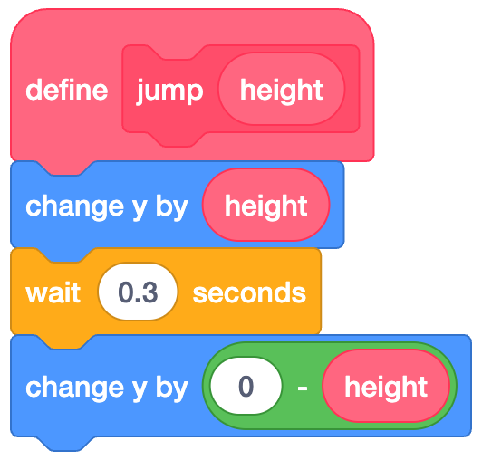
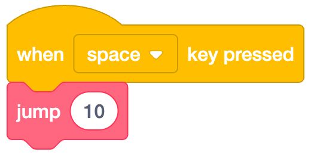
</div>
</div>

---

# Custom Blocks: Organizing Larger Projects

<div style="display: flex; justify-content: space-between; align-items: flex-start; gap: 1.2rem; margin-top: 0.6rem; font-size: 18px; color: #575e75;">
<div><strong>Snake: main script</strong><br></div>
<div><strong>defined once &hellip;</strong><br>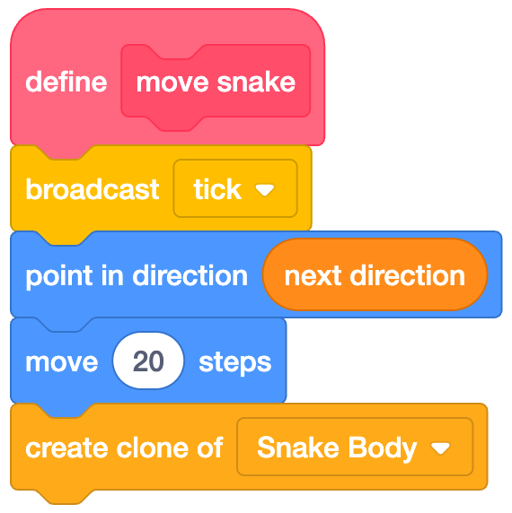</div>
<div><br>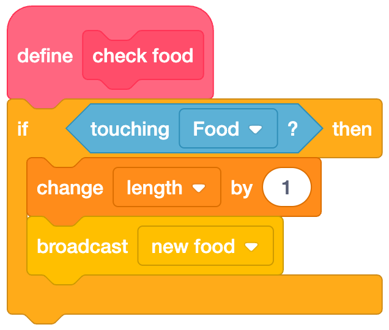</div>
<div><br>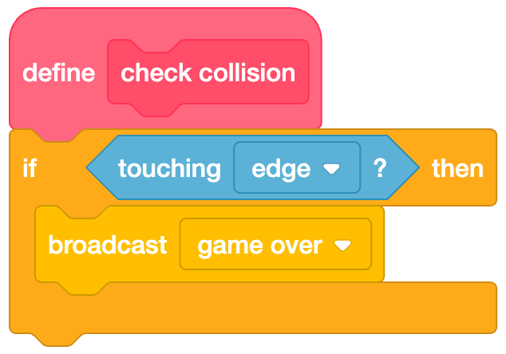</div>
</div>

<p style="text-align: center; font-size: 24px; margin-top: 1.4rem;"><strong>The main script reads like a table of contents.</strong></p>

---

# Game States and Screen Flow

<div style="display: flex; justify-content: space-between; align-items: flex-start; gap: 1.2rem; margin-top: 0.4rem; font-size: 18px; color: #575e75;">
<div style="display: flex; flex-direction: column; gap: 0.3rem;"><strong>Game controller</strong>
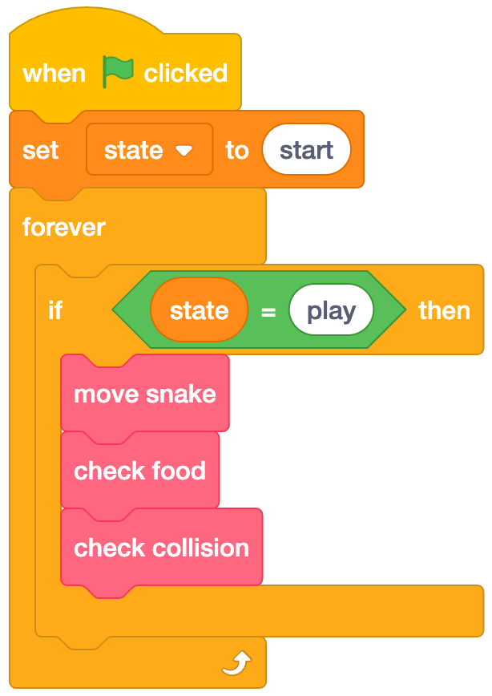
</div>
<div style="display: flex; flex-direction: column; gap: 0.3rem;"><strong>Screen flow via broadcasts</strong>
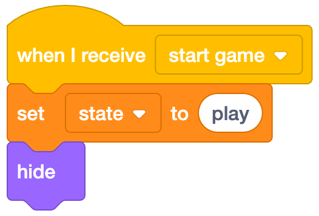
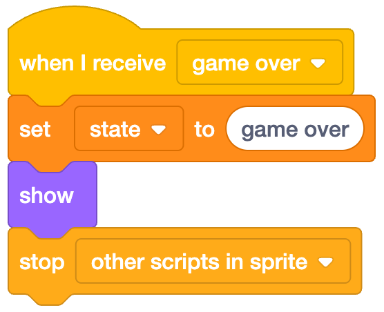
</div>
<div style="display: flex; flex-direction: column; gap: 0.3rem;"><strong>Pause and states</strong>
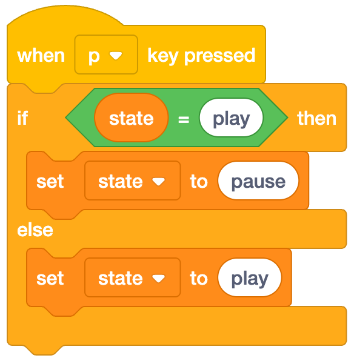
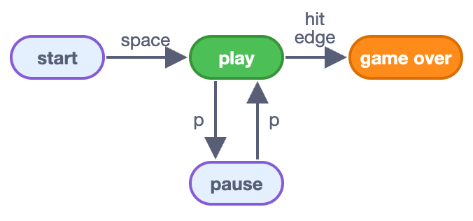
</div>
</div>

<p style="text-align: center; font-size: 24px; margin-top: 0.3rem;"><strong>States control the game flow.</strong></p>

---

# Collision Detection, Revisited

<div style="display: flex; justify-content: space-between; align-items: flex-start; gap: 1.2rem; margin-top: 0.4rem; font-size: 18px; color: #575e75;">
<div style="display: flex; flex-direction: column; gap: 0.3rem;"><strong>Colours: the red wall</strong>
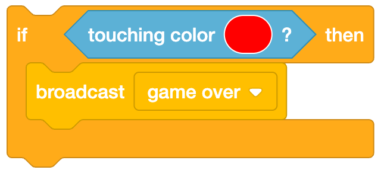
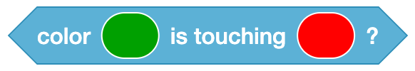
<div style="font-size: 16px; max-width: 290px;">the snake's green touches the red wall</div>
</div>
<div style="display: flex; flex-direction: column; gap: 0.3rem;"><strong>Clones count too</strong>
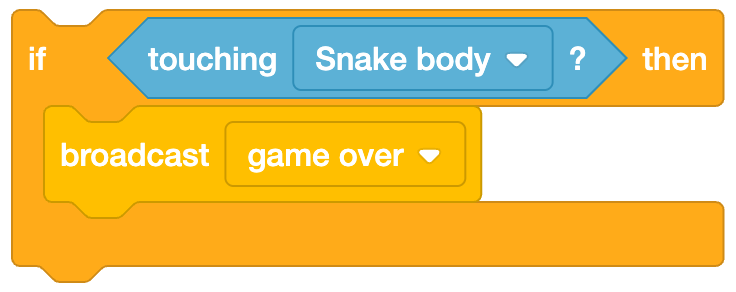
<div style="font-size: 16px; max-width: 290px;"><code>touching [Snake body]</code> detects the body sprite <strong>and all its clones</strong>: self-collision for free</div>
</div>
<div style="display: flex; flex-direction: column; gap: 0.3rem;"><strong>One-time hits</strong>
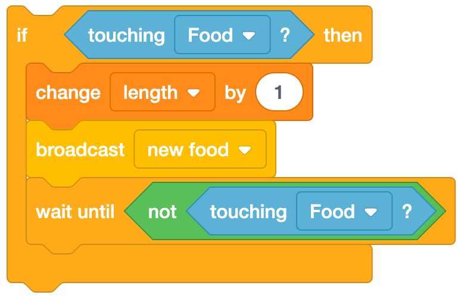
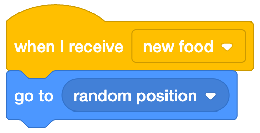
</div>
</div>

<p style="text-align: center; font-size: 24px; margin-top: 0.3rem;"><strong>From Pong you know touching. Now: colours, clones, and one-time hits.</strong></p>

---

# Timing, Randomness, and Balance

<div style="display: flex; justify-content: space-between; align-items: flex-start; gap: 1.2rem; margin-top: 0.4rem; font-size: 18px; color: #575e75;">
<div style="display: flex; flex-direction: column; gap: 0.3rem;"><strong>Timing blocks</strong>
<div style="display: grid; grid-template-columns: auto auto; gap: 0.45rem 0.8rem; align-items: center; font-size: 16px;">
<div style="display: flex; gap: 0.4rem; align-items: center;">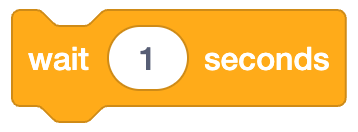</div>
<div>pause this script</div>
<div style="display: flex; gap: 0.4rem; align-items: center;">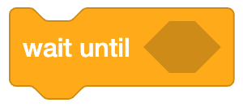</div>
<div>pause until a condition</div>
<div style="display: flex; gap: 0.4rem; align-items: center;">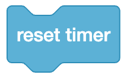</div>
<div>seconds since reset</div>
<div style="display: flex; gap: 0.4rem; align-items: center;"></div>
<div>clock time</div>
<div style="display: flex; gap: 0.4rem; align-items: center;"></div>
<div>date arithmetic</div>
</div>
</div>
<div style="display: flex; flex-direction: column; gap: 0.3rem;"><strong>Steady tick</strong>
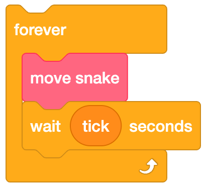
<strong>Randomness: new food</strong>
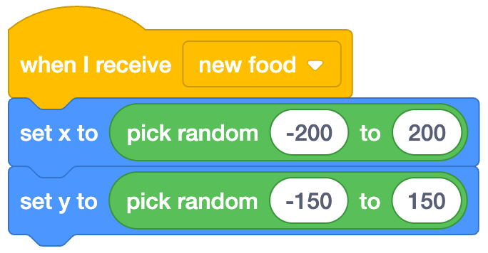
</div>
<div style="display: flex; flex-direction: column; gap: 0.3rem;"><strong>Balance: rising speed</strong>
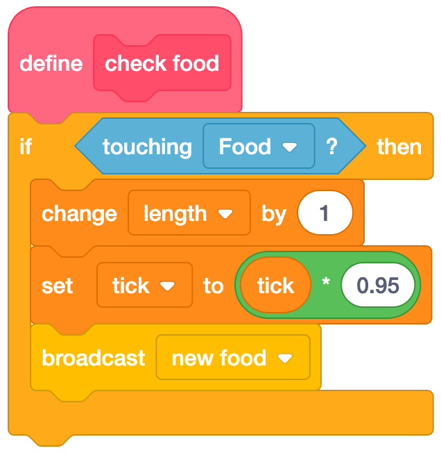
<div style="font-size: 16px; max-width: 280px;">every food makes the tick 5&nbsp;% shorter</div>
</div>
</div>

<p style="text-align: center; font-size: 24px; margin-top: 0.3rem;"><strong>Time makes games playable: steady ticks, fair waits, rising speed.</strong></p>

---

<!-- _class: kapitel -->

## 2
# Worked Example: Snake

Applying clones, lists, and game state

---

# Worked Example: Snake

<div class="columns" style="grid-template-columns: auto 1fr; gap: 1.6rem; align-items: start; margin-top: 0.3rem; font-size: 18px; color: #575e75;">
<div style="width: 420px;">
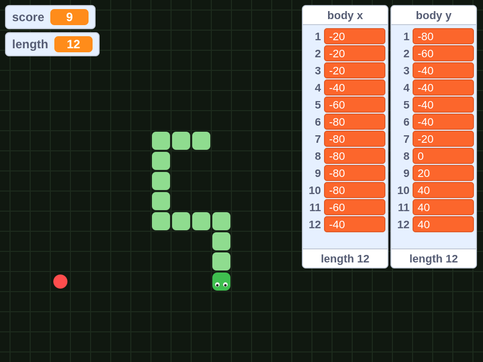
<div style="font-size: 16px; margin-top: 0.4rem;">Open <strong>Snake.sb3</strong> and click the green flag. Steer with the <strong>arrow keys</strong>.</div>
</div>
<div style="display: flex; flex-direction: column; gap: 0.7rem;">
<div style="display: flex; gap: 0.8rem; align-items: center; background: #fff; border: 2px solid #d9e3f2; border-radius: 12px; padding: 0.5rem 0.8rem;"><div><strong style="color: #222c37;">Snake Head</strong><br><span style="font-size: 16px;">runs the game loop, steers, and writes its trail into the lists <code>body x</code> / <code>body y</code></span></div></div>
<div style="display: flex; gap: 0.8rem; align-items: center; background: #fff; border: 2px solid #d9e3f2; border-radius: 12px; padding: 0.5rem 0.8rem;"><div><strong style="color: #222c37;">Snake Body</strong><br><span style="font-size: 16px;">hidden template: every clone is one segment and reads its position from the lists</span></div></div>
<div style="display: flex; gap: 0.8rem; align-items: center; background: #fff; border: 2px solid #d9e3f2; border-radius: 12px; padding: 0.5rem 0.8rem;"><div><strong style="color: #222c37;">Food</strong><br><span style="font-size: 16px;">hidden template: exactly one visible clone on a random grid cell</span></div></div>
<div style="font-size: 16px; margin-top: 0.3rem;"><strong>Global variables:</strong> <code>score</code>, <code>length</code>, <code>tick</code>, <code>next direction</code><br><strong>Global lists:</strong> <code>body x</code>, <code>body y</code><br><strong>For this sprite only:</strong> <code>index</code> (Snake Body)</div>
</div>
</div>

---

# Snake Head: Loop and Steering

<div style="display: flex; justify-content: space-between; align-items: flex-start; gap: 1.2rem; margin-top: 0.4rem; font-size: 18px; color: #575e75;">
<div style="display: flex; flex-direction: column; gap: 0.3rem;"><strong>Main loop</strong>
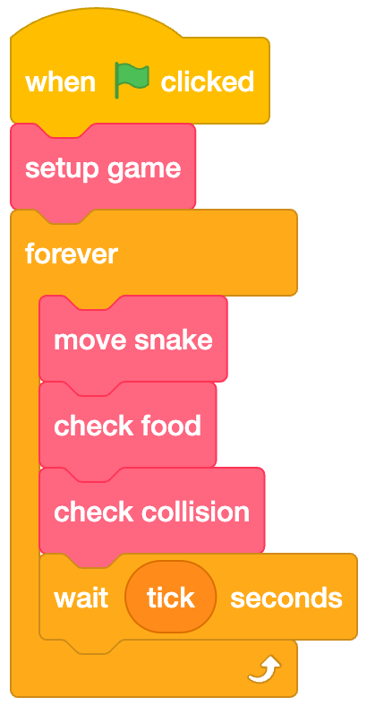
<div style="font-size: 16px; max-width: 230px;"><code>setup game</code> also empties both lists<br>(<code style="white-space: nowrap;">delete all of</code>)</div>
</div>
<div style="display: flex; flex-direction: column; gap: 0.3rem;"><strong>One step per tick</strong>
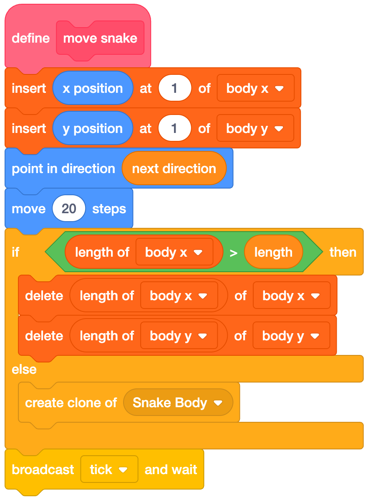
<div style="font-size: 16px; max-width: 270px;">20-pixel grid: one cell per tick</div>
</div>
<div style="display: flex; flex-direction: column; gap: 0.3rem;"><strong>Steering</strong>
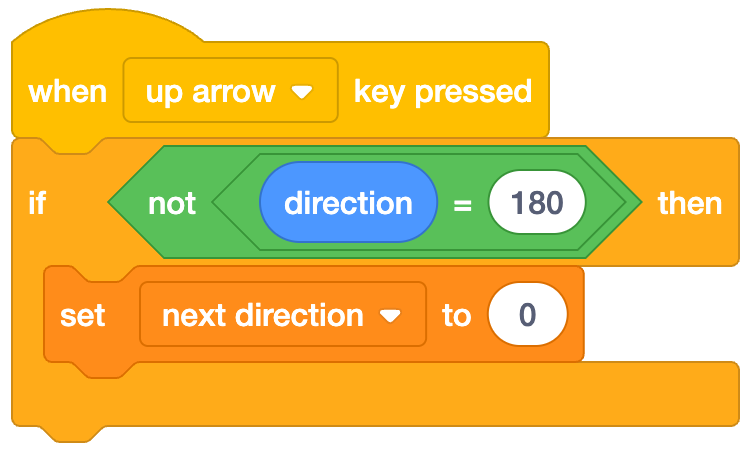
<div style="font-size: 16px; max-width: 300px;">same for the other three arrows; turning back into yourself is ignored</div>
</div>
</div>

<p style="text-align: center; font-size: 22px; margin-top: 0.3rem;"><strong>Keys only set <code>next direction</code>; the loop applies it once per tick.</strong></p>

---

# Body Segments: Clones Read the Lists

<div style="display: flex; justify-content: space-between; align-items: flex-start; gap: 1.2rem; margin-top: 0.2rem; font-size: 18px; color: #575e75;">
<div style="display: flex; flex-direction: column; gap: 0.3rem;"><strong>A new clone takes the last position &hellip;</strong>
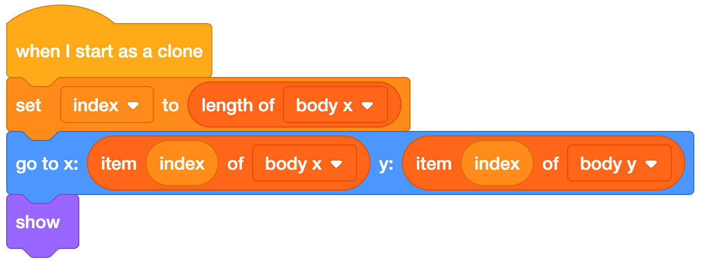
<div style="font-size: 16px; max-width: 430px;"><code>index</code> is <em>for this sprite only</em>: each clone keeps its own position in the lists</div>
<strong style="margin-top: 0.5rem;">&hellip; and follows its item every tick</strong>
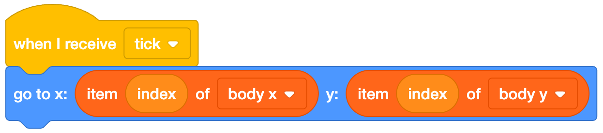
</div>
<div style="display: flex; flex-direction: column; gap: 0.3rem; max-width: 280px;"><strong>Each tick, the head &hellip;</strong>
<div style="font-size: 16px; line-height: 1.45;">
1. inserts its x / y at position 1: all items move one down<br>
2. moves one cell<br>
3. list longer than <code>length</code>? delete the last item (the old tail)<br>
&nbsp;&nbsp;&nbsp;&nbsp;otherwise: create one more clone<br>
4. <code>broadcast tick and wait</code>: all clones move to their item
</div>
</div>
<div style="display: flex; flex-direction: column; gap: 0.3rem; width: 200px;"><strong>The lists</strong>
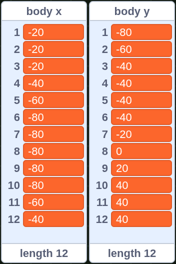
<div style="font-size: 15px;">item 1 = right behind the head, last item = tail</div>
</div>
</div>

<p style="text-align: center; font-size: 22px; margin-top: 0.4rem;"><strong>Growth = raising <code>length</code>: the lists keep one more item, and the head adds one more clone.</strong></p>

---

# Food and Game Over

<div style="display: flex; gap: 1.6rem; align-items: flex-start; margin-top: 0.2rem; font-size: 18px; color: #575e75;">
<div style="display: flex; flex-direction: column; gap: 0.3rem;"><strong>Food: hidden template, one clone</strong>
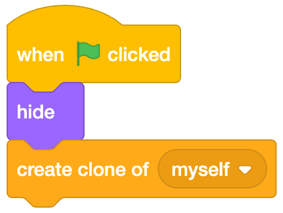
</div>
<div style="display: flex; flex-direction: column; gap: 0.3rem;"><strong>&nbsp;</strong>
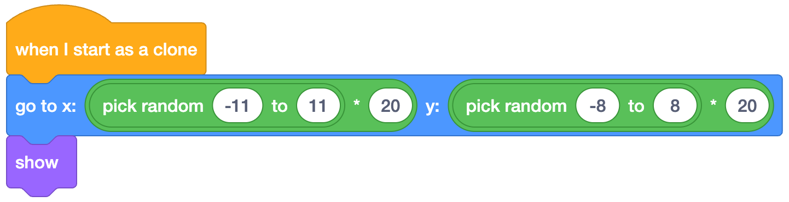
<div style="font-size: 16px; max-width: 400px;">random grid cell: 23 &times; 17 positions</div>
</div>
</div>

<div style="display: flex; justify-content: space-between; gap: 1.2rem; align-items: flex-start; margin-top: 0.3rem; font-size: 18px; color: #575e75;">
<div style="display: flex; flex-direction: column; gap: 0.3rem;"><strong>Eaten? Replace yourself</strong>
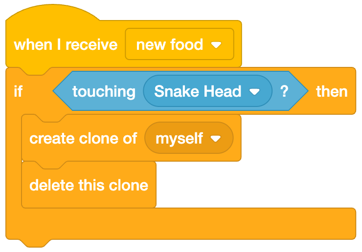
</div>
<div style="display: flex; flex-direction: column; gap: 0.3rem;"><strong>Game over</strong>
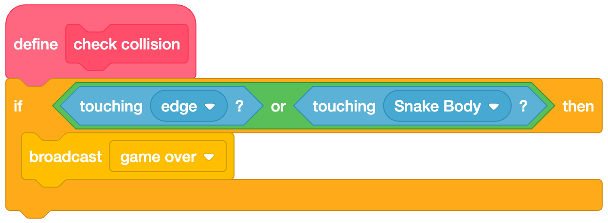
<div style="font-size: 16px; max-width: 400px;"><code>touching [Snake Body]</code> covers <strong>all</strong> body clones</div>
</div>
<div style="display: flex; flex-direction: column; gap: 0.3rem;"><strong>&nbsp;</strong>
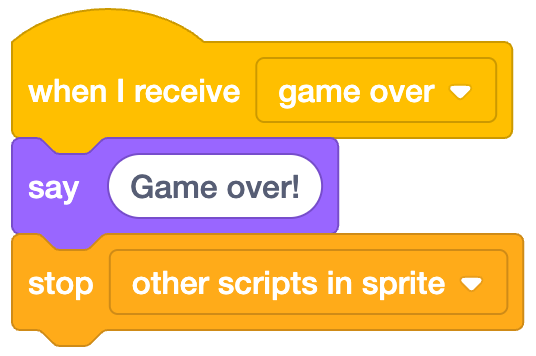
</div>
</div>

---

# Debugging with Monitors

<div style="display: flex; justify-content: space-between; align-items: flex-start; gap: 1.2rem; margin-top: 0.4rem; font-size: 18px; color: #575e75;">
<div style="display: flex; flex-direction: column; gap: 0.3rem;"><strong>1. Show the values</strong>

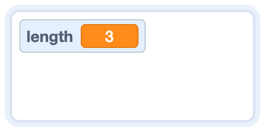
<strong>Tip for clones</strong>
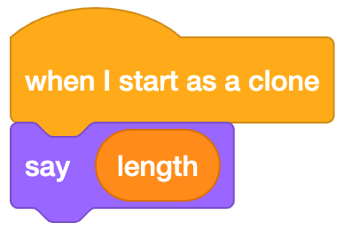
<div style="font-size: 16px; max-width: 200px;">monitors show only the original's value</div>
</div>
<div style="display: flex; flex-direction: column; gap: 0.3rem;"><strong>2. Watch it live</strong>
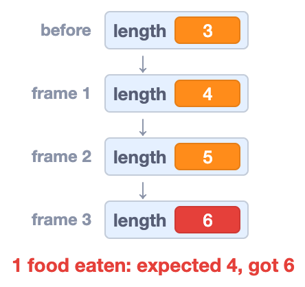
</div>
<div style="display: flex; flex-direction: column; gap: 0.3rem;"><strong>3. Find the cause</strong>
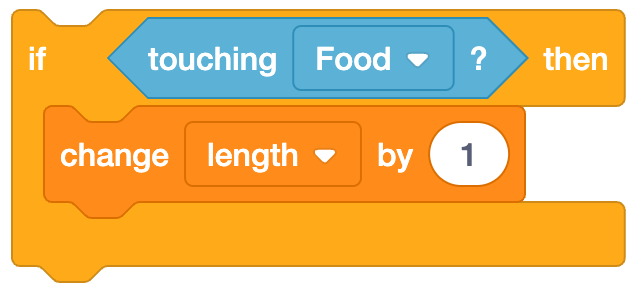
<div style="font-size: 16px; max-width: 240px;"><em>touching</em> stays true for several frames</div>
</div>
<div style="display: flex; flex-direction: column; gap: 0.3rem;"><strong>4. Fix: one-time hit</strong>

<div style="font-size: 16px; max-width: 240px;">the one-time-hit pattern from <em>Collision Detection, Revisited</em></div>
</div>
</div>

<p style="text-align: center; font-size: 24px; margin-top: 0.3rem;"><strong>Make values visible, then check instead of guess.</strong></p>

---

# Quick Intro: Scratch Concepts in Scala

<style scoped>
section { font-size: 17px; }
p { margin: 0.1em 0; }
pre { font-size: 12px; line-height: 1.22; margin: 0.1em 0; }
.pair { display: grid; grid-template-columns: 1.25fr 1fr; gap: 0.7em; align-items: start; margin-top: 0.15em; }
.pair h3 { margin: 0 0 0.2em 0; font-size: 1.02em; text-align: center; }
</style>

<div class="pair">
<div markdown="1">

### Scratch

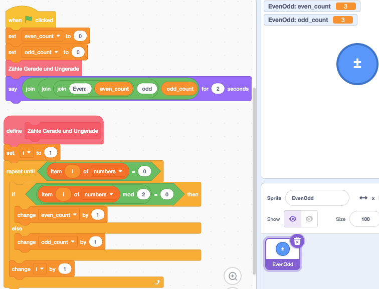

</div>
<div markdown="1">

### Scala

```scala
@main def runEvenOdd(): Unit =
  val (e, o) = EvenOdd.countOddEven()
  println(s"$e $o")  // 3 3

object EvenOdd:
  val numbers = List(4, 7, 2, 9, 1, 6, 0)

  def countOddEven(nums: List[Int] = numbers)
      : (Int, Int) =
    var even_count = 0
    var odd_count = 0
    for n <- nums.takeWhile(_ != 0) do
      if n % 2 == 0 then
        even_count += 1
      else
        odd_count += 1
    (even_count, odd_count)
```


</div>
</div>


---

# Three Basic Data Types: Int, String, Boolean

<style scoped>
section { font-size: 20px; }
.cols { display:grid; grid-template-columns:1fr 1fr; column-gap:2em; align-items:start; }
pre { font-size: 15px; line-height: 1.3; }
.typerow { display: grid; grid-template-columns: 200px 1fr; gap: 0.5rem 1rem; align-items: center; }
.typerow img { margin: 0; }
</style>

Every value in a program has a **type**. Scratch shows it by the **shape** of a block, Scala by a **type name**.

<div class="cols">
<div>

<div class="typerow">

<div><strong>Int</strong>: whole numbers<br><span style="font-size: 17px;">round reporter, e.g. <code>score</code>, <code>length</code></span></div>

<div><strong>String</strong>: text<br><span style="font-size: 17px;">round input, e.g. <code>Game over!</code></span></div>

<div><strong>Boolean</strong>: <code>true</code> or <code>false</code><br><span style="font-size: 17px;">hexagonal block, fits into <code>if</code></span></div>
</div>

</div>
<div>

```scala
var score: Int = 0
val message: String = "Game over!"
var state: String = "play"
val playing: Boolean = state == "play"

// Scala infers the type for you:
var length = 3        // Int
val name = "Snake"    // String
val hit = length > 5  // Boolean
```

</div>
</div>

<p style="text-align: center; font-size: 22px; margin-top: 0.6rem;"><strong>Scratch converts silently; Scala checks types before the program runs.</strong></p>

---

# Int: Variables and Arithmetic

<style scoped>
section { font-size: 20px; }
.cols { display:grid; grid-template-columns:1fr 1fr; column-gap:2em; align-items:start; }
pre { font-size: 15px; line-height: 1.3; }
.blocks { display: grid; grid-template-columns: auto 1fr; gap: 0.5rem 1rem; align-items: center; font-size: 17px; }
.blocks img { margin: 0; }
</style>

<div class="cols">
<div>

<div class="blocks">

<div><code>var score = 0</code></div>

<div><code>score += 1</code></div>
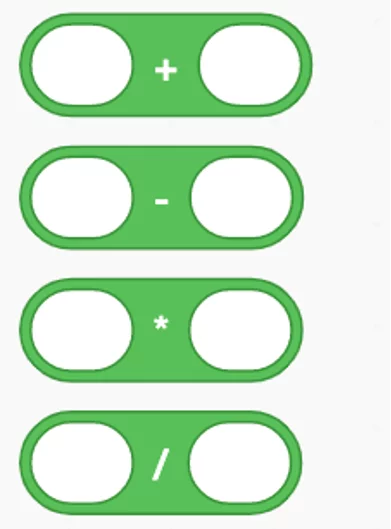
<div><code>+ - * /</code><br>Scratch: <code>7 / 2</code> = 3.5<br>Scala Int: <code>7 / 2</code> = 3</div>

<div><code>mod</code> is <code>%</code> in Scala<br>(EvenOdd, Quick Intro)</div>
</div>

</div>
<div>

```scala
var score = 0       // set score to 0
score += 1          // change score by 1
score = score + 1   // the same, written out

val lives = 3       // val: can never change
// lives = 2        // error: reassignment to val

7 + 2               // 9
7 - 2               // 5
7 * 20              // 140: 7 cells of 20 px
7 / 2               // 3: integer division!
7 % 2               // 1: remainder (mod)

val n = 6
n % 2 == 0          // true: n is even
```

</div>
</div>

---

# String: Text, join, and Letters

<style scoped>
section { font-size: 20px; }
.cols { display:grid; grid-template-columns:1fr 1fr; column-gap:2em; align-items:start; }
pre { font-size: 15px; line-height: 1.3; }
.blocks { display: flex; flex-direction: column; gap: 0.45rem; font-size: 17px; }
.blocks img { margin: 0; }
.op { display: inline-flex; align-items: center; gap: 0.4rem; background: #59c059; border: 1px solid #389438; color: #fff; border-radius: 999px; padding: 0.2rem 0.6rem; font-weight: 700; font-size: 16px; width: fit-content; }
.op .pill { background: #fff; color: #575e75; border-radius: 999px; padding: 0.05rem 0.55rem; }
</style>

<div class="cols">
<div>

<div class="blocks">

<div>Snake: a fixed text</div>
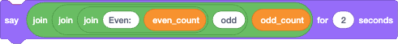
<div>EvenOdd: <code>join</code> glues text and numbers</div>
<span class="op">length of <span class="pill">apple</span></span>
<span class="op">letter <span class="pill">1</span> of <span class="pill">apple</span></span>
<div style="font-size: 15px; color: #575e75;">(Operators category, drawn here; Scratch counts letters from <strong>1</strong>, Scala from <strong>0</strong>)</div>
</div>

</div>
<div>

```scala
println("Game over!")      // say Game over!

val even_count = 3
val odd_count = 3
// join with +
println("Even: " + even_count + " odd " + odd_count)
// or with string interpolation s"..."
println(s"Even: $even_count odd $odd_count")

val fruit = "apple"
fruit.length               // 5    length of
fruit(0)                   // 'a'  letter 1 of
fruit.charAt(0)            // 'a'  the same
fruit + "pie"              // "applepie"
```

</div>
</div>

---

# Boolean: Comparisons

<style scoped>
section { font-size: 20px; }
.cols { display:grid; grid-template-columns:1fr 1fr; column-gap:2em; align-items:start; }
pre { font-size: 15px; line-height: 1.3; }
.blocks { display: grid; grid-template-columns: auto 1fr; gap: 0.6rem 1rem; align-items: center; font-size: 17px; }
.blocks img { margin: 0; }
</style>

<div class="cols">
<div>

<div class="blocks">
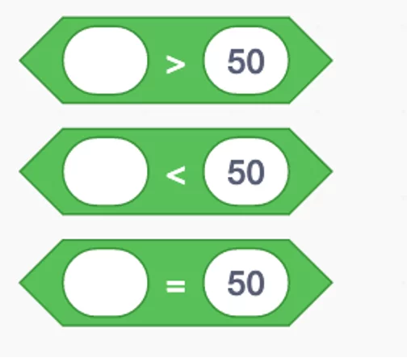
<div>Scratch has only <code>&gt;</code>, <code>&lt;</code>, <code>=</code></div>

<div>Snake: game states</div>
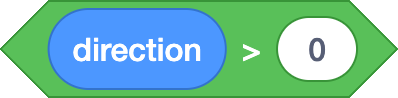 0" style="width: 199px;">
<div>Pong: ball moves right</div>
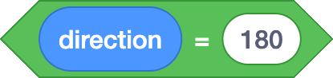
<div>Snake: moving down</div>
</div>

</div>
<div>

```scala
val state = "play"
val direction = 45

state == "play"     // true   state = play
direction > 0       // true   direction > 0
direction < 0       // false
direction == 180    // false  direction = 180
direction != 180    // true   not equal
direction >= 90     // false  no block in Scratch
```

- `=` assigns a value, `==` compares.
- Scratch's `=` ignores case (`Play` = `play`), Scala's `==` does not.

</div>
</div>

---

# Boolean: and, or, not

<style scoped>
section { font-size: 20px; }
.cols { display:grid; grid-template-columns:1fr 1fr; column-gap:2em; align-items:start; }
pre { font-size: 14px; line-height: 1.28; }
.blocks { display: flex; flex-direction: column; gap: 0.35rem; font-size: 17px; }
.blocks img { margin: 0; }
</style>

<div class="cols">
<div>

<div class="blocks">
<div><strong>and</strong> &rarr; <code>&amp;&amp;</code>: Pong, hit the right paddle</div>
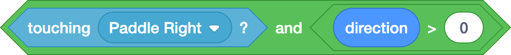 0" style="width: 480px;">
<div style="margin-top: 0.5rem;"><strong>or</strong> &rarr; <code>||</code>: Snake, game over</div>

<div style="margin-top: 0.5rem;"><strong>not</strong> &rarr; <code>!</code>: Snake, no U-turn</div>
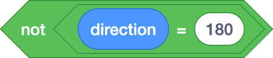
</div>

</div>
<div>

```scala
var direction = 45
var nextDirection = 90
val touchingPaddleRight = true
val touchingEdge = false
val touchingBody = false

if touchingPaddleRight && direction > 0 then
  direction = 0 - direction

if touchingEdge || touchingBody then
  println("Game over!")

if !(direction == 180) then
  nextDirection = 0
```

</div>
</div>

---

# Putting It Together: Pong

<style scoped>
section { font-size: 20px; }
.cols { display:grid; grid-template-columns:1fr 1fr; column-gap:2em; align-items:start; }
pre { font-size: 15px; line-height: 1.3; }
</style>

<div class="cols">
<div>

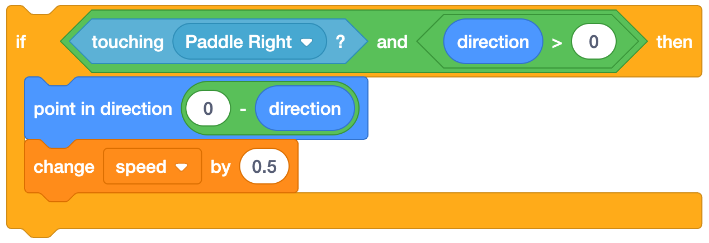

- **Int:** `direction`, `scoreLeft`, `scoreRight`
- **Boolean:** `touching ... and direction > 0`
- **String:** the score text on the screen
- `speed` changes by 0.5: a decimal number, type `Double` (next lectures)

</div>
<div>

```scala
var direction = 45            // Int
var speed = 8.0               // Double
var scoreLeft = 0             // Int
var scoreRight = 0            // Int
val touchingPaddleRight = true   // Boolean

if touchingPaddleRight && direction > 0 then
  direction = 0 - direction
  speed += 0.5

val scoreText = s"$scoreLeft : $scoreRight"
println(scoreText)            // 0 : 0
```

</div>
</div>

<p style="text-align: center; font-size: 22px; margin-top: 0.4rem;"><strong>Same blocks, same logic: Scala just writes them as text.</strong></p>

---

# EnergyBill: main and calculate bill

<style scoped>
section { font-size: 18px; padding-top: 40px; }
h1 { margin-bottom: 0.3em; }
.cols { display:grid; grid-template-columns:470px 1fr; column-gap:1.5em; align-items:start; }
pre { font-size: 13px; line-height: 1.5; white-space: pre-wrap; margin: 0; }
.cols h3 { margin: 0 0 0.25em 0; font-size: 1em; }
</style>

<div class="cols">
<div>

### Scratch

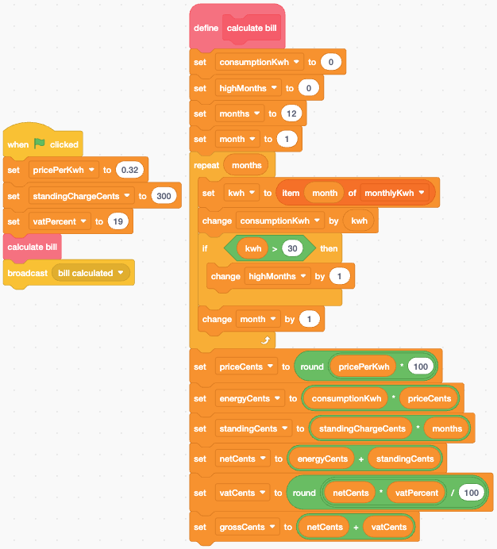 30 then change highMonths by 1, change month by 1; then set priceCents to round(pricePerKwh * 100), energyCents, standingCents, netCents, vatCents to round(netCents * vatPercent / 100), grossCents" style="width: 470px; margin: 0; border-radius: 8px; border: 2px solid #d9e3f2;">

</div>
<div>

### Scala

```scala
// custom block "calculate bill"
def calculateBill(): Bill =
  var consumptionKwh: Int = 0
  var highMonths: Int = 0
  val months: Int = billingPeriod.size
  for month <- billingPeriod do
    val kwh = monthlyKwh(month - 1)
    consumptionKwh = consumptionKwh + kwh
    if kwh > 30 then
      highMonths = highMonths + 1
  val priceCents: BigInt = math.round(pricePerKwh * 100)
  val energyCents: BigInt = consumptionKwh * priceCents
  val standingCents: BigInt = standingChargeCents * months
  val netCents: BigInt = energyCents + standingCents
  val vatCents: BigInt = (netCents * vatPercent + 50) / 100 // = round(net * 19 / 100)
  val grossCents: BigInt = netCents + vatCents
  Bill(months, consumptionKwh, highMonths, energyCents, standingCents, netCents, vatCents, grossCents)

// when green flag clicked
def main(args: Array[String]): Unit =
  val bill = calculateBill()
  BillPrinter.billCalculated(bill) // broadcast [bill calculated]
```

</div>
</div>

---

# The Road Ahead: Scratch → Scala → Unity

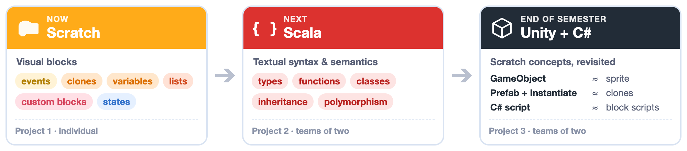

<p style="text-align: center; font-size: 22px; margin-top: 1.4rem;"><strong>Scratch has no textual syntax. To express more complex things we need a textual language:<br>we learn the concepts in Scala and bring them back to games in Unity with C#.</strong></p>

---

<!-- _class: inhalt -->

# Summary

<style scoped>section { font-size: 23px; }</style>

- Clones: sprite as template, clones as objects — like classes and instances
- Variables and lists store state; lists are Scratch's only data structure
- Custom blocks structure larger projects
- Control game flow with states (start, play, pause, game over) and broadcasts
- Collision, timing, and randomness shape game feel and balance
- Debug with monitors: make values visible instead of guessing
- Int, String, Boolean: the same values and operators in Scratch blocks and in Scala

---

<!-- _class: aufgabe -->

# Task

- Build a small advanced Scratch game or simulation.
- Your project should use clones, at least one list, custom blocks, and a clear game state model.
- Include one debugging strategy during development, such as visible variables or temporary tracing messages.
- Prepare to explain how your design avoids chaos when many scripts run at once.
- Focus on clarity, structure, and maintainability, not only on visual effects.

---

<!-- _class: abschluss -->

# Questions?

## Thank you!

marko.boger@htwg-konstanz.de
