### Prof. Dr. Marko Boger, Prof. Dr. Pascal Laube
## Programmiertechnik I
# Lecture 03: Programming Languages

How languages differ in abstraction level, paradigm, typing, execution model, and practical use.

---

<!-- _class: inhalt -->

# Goals

(Goals to fill)

---

# Quick Intro: Scratch Concepts in Scala

<style scoped>
section { font-size: 17px; }
p { margin: 0.15em 0; }
pre { font-size: 12.5px; line-height: 1.25; margin: 0.15em 0; }
.pair { display: grid; grid-template-columns: 1.1fr 1fr; gap: 1em; align-items: start; margin-top: 0.3em; }
.pair h3 { margin: 0 0 0.35em 0; font-size: 1.05em; text-align: center; }
</style>

Same even / odd counting task as in Lecture 03 (Assembler, Fortran, C): walk a list until `0`, count with two variables.

<div class="pair">
<div markdown="1">

### Scratch

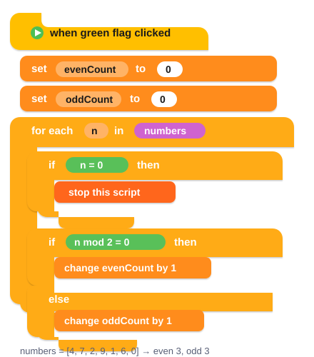


</div>
<div markdown="1">

### Scala

```scala
@main def runEvenOdd(): Unit =
  val (e, o) = EvenOdd.countOddEven()
  println(s"$e $o")  // 3 3

object EvenOdd:
  val numbers = List(4, 7, 2, 9, 1, 6, 0)

  def countOddEven(nums: List[Int] = numbers)
      : (Int, Int) =
    var even_count = 0
    var odd_count = 0
    for n <- nums.takeWhile(_ != 0) do
      if n % 2 == 0 then
        even_count += 1
      else
        odd_count += 1
    (even_count, odd_count)
```

List + loop + `if` / `else` + two counters — Scratch ideas as Scala text.


</div>
</div>


---

# Layer

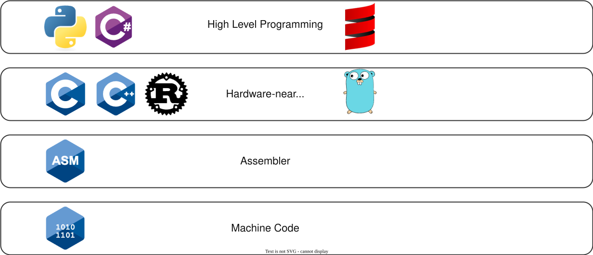

---

# Example: Assembler and Machine Code

<style scoped>
section { font-size: 19px; }
p { margin: 0.3em 0; }
pre { font-size: 14px; line-height: 1.45; margin: 0.3em 0; }
</style>

**The problem:** Read a series of numbers from memory beginning at x4000. Read until the number 0 is read. Count how many of the numbers are even and odd. Store the count of even numbers at x3200 and the number of odd numbers at x3201.

<div class="columns" style="grid-template-columns: 1.75fr 1fr; align-items: start;">
<div markdown="1">

**Assembler**

```asm
       .ORIG x3000       ; program starts at x3000
       LD R1, x00F       ; load address of data
       AND R4, R4, #0    ; set even-counter to 0
       AND R5, R5, #0    ; set odd-counter to 0
x3003  LDR R2, R1, #0    ; load next number
       BRz x00C          ; branch to end if zero
       AND R3, R2, #1    ; check least significant bit
       BRz x009          ; branch if even
       ADD R5, R5, #1    ; increment odd-count
       BRnzp x00A
x3009  ADD R4, R4, #1    ; increment even-count
x300A  ADD R1, R1, #1    ; next value
       BRnzp x003
x300C  STI R4, x010      ; store even count
       STI R5, x011      ; store odd count
       HALT
```

</div>
<div markdown="1">

**Machine code**

```asm
0011 0000 0000 0000
0010 001 0 0000 1111
0101 100 100 1 00000
0101 101 101 1 00000
0110 010 001 000000
0000 010 0 0000 1100
0101 011 010 1 00001
0000 010 0 0000 1001
0001 101 101 1 00001
0000 111 0 0000 1010
0001 100 100 1 00001
0001 001 001 1 00001
0000 111 0 0000 0011
1011 100 0 0001 0000
1011 101 0 0001 0001
1111 0000 0010 0101
```

</div>
</div>

Assembler is already more readable than pure bits, but it is still very close to the hardware model. Machine code is precise and executable, but for humans it is extremely hard to understand, debug, and maintain.

---

# Example in Fortran II

<style scoped>
section { font-size: 17px; }
p { margin: 0.25em 0; }
pre { font-size: 12px; line-height: 1.25; margin: 0; }
</style>

Same even/odd counting task as the assembler example (and later the C example): read numbers until `0`, count even and odd.

```fortran
C     COUNT EVEN AND ODD, FORTRAN II STYLE
C     SAME TASK AS C EXAMPLE (SLIDE 8)
C
C     VS MODERN FORTRAN:
C     - FIXED FORMAT, NOT FREE-FORMAT SOURCE
C     - STATEMENT NUMBERS IN COLS 1-5 (NOT LINE NOS)
C     - COL 6 = CONTINUATION, COLS 7-72 = CODE
C     - ARITHMETIC IF (NEG,ZERO,POS), NOT RELATIONAL IF
C     - GO TO JUMPS, NOT STRUCTURED DO/IF/END IF
C
      DIMENSION N(7)
      INTEGER N, I, IE, IO, M
      N(1) = 4
      N(2) = 7
      N(3) = 2
      N(4) = 9
      N(5) = 1
      N(6) = 6
      N(7) = 0
      IE = 0
      IO = 0
      I = 1
   10 IF (N(I)) 20, 50, 20
C     ZERO ENDS THE LIST (LIKE C)
   20 M = N(I) - (N(I)/2)*2
      IF (M) 40, 30, 40
   30 IE = IE + 1
      GO TO 45
   40 IO = IO + 1
   45 I = I + 1
      GO TO 10
   50 PRINT 100, IE, IO
  100 FORMAT (1X, I5, I5)
      STOP
      END
```


---

# Example in BASIC: Lunar Lander

<style scoped>
section { font-size: 19px; }
p { margin: 0.3em 0; }
pre { font-size: 12.5px; line-height: 1.3; margin: 0; }
</style>

<div class="columns" style="grid-template-columns: 1fr 1fr; align-items: start;">
<div markdown="1">

```basic
10 REM *** LUNAR LANDER ***
20 REM EXAMPLE FOR THE FIRST-SEMESTER LECTURE
30 REM H = HEIGHT IN METERS
40 REM V = VELOCITY IN M/S (POSITIVE = DOWNWARD)
50 REM F = FUEL, B = BURN (THRUST), T = TIME IN SECONDS
60 REM G = GRAVITY (EACH SECOND V GROWS BY G)
70 REM --- INITIAL VALUES ---
80 LET H = 500
90 LET V = 50
100 LET F = 250
110 LET T = 0
120 LET G = 5
130 PRINT "LUNAR LANDING: TOUCH DOWN AT 5 M/S OR LESS!"
140 PRINT "EACH TURN IS ONE SECOND. BURN 0 TO 30."
150 PRINT "EVERY 2 UNITS OF BURN SLOW YOU BY 1 M/S."
160 PRINT
170 REM --- MAIN LOOP: STATUS DISPLAY ---
180 PRINT "TIME"; T; "  HEIGHT"; H; "  SPEED"; V; "  FUEL"; F
190 IF F > 0 THEN 240
200 PRINT "OUT OF FUEL - FREE FALL!"
210 LET B = 0
220 GOTO 330
230 REM --- READ THE BURN ---
240 PRINT "BURN";
250 INPUT B
260 IF B < 0 THEN 290
270 IF B > 30 THEN 290
280 GOTO 310
290 PRINT "INVALID! PLEASE ENTER A VALUE FROM 0 TO 30."
300 GOTO 240
310 IF B <= F THEN 330
320 LET B = F
```

</div>
<div markdown="1">

```basic
330 REM --- PHYSICS: ONE SECOND PASSES ---
340 LET F = F - B
350 LET W = V
360 LET V = V + G - B / 2
370 LET H = H - (W + V) / 2
380 LET T = T + 1
390 IF H > 0 THEN 180
400 REM --- TOUCHDOWN: WIN OR LOSE ---
410 PRINT
420 PRINT "TOUCHDOWN AFTER"; T; "SECONDS AT"; V; "M/S."
430 IF V <= 5 THEN 490
440 IF V <= 15 THEN 470
450 PRINT "CRASH! YOU JUST MADE A NEW CRATER."
460 GOTO 520
470 PRINT "HARD LANDING. THE SHIP IS DAMAGED."
480 GOTO 520
490 PRINT "PERFECT LANDING! CONGRATULATIONS, COMMANDER."
500 PRINT "FUEL LEFT:"; F
510 REM --- PLAY AGAIN? ---
520 PRINT
530 PRINT "PLAY AGAIN (1 = YES, 0 = NO)";
540 INPUT A
550 IF A = 1 THEN 80
560 PRINT "END OF MISSION."
570 END
```

BASIC (Dartmouth, 1964) is already a high-level language, but control flow still works with line numbers and GOTO jumps, much like the branches in assembler.

</div>
</div>

---

# Lunar Lander: The Arcade Game (Atari, 1979)

<style scoped>
.video-link { position: relative; display: inline-block; line-height: 0; }
.video-link img { height: 430px; width: auto; border-radius: 12px; box-shadow: 0 10px 28px rgba(0, 0, 0, 0.18); }
.video-link .play { position: absolute; left: 50%; top: 50%; width: 96px; height: 96px; margin: -48px 0 0 -48px; border-radius: 50%; background: rgba(0, 155, 145, 0.8); border: 3px solid rgba(255, 255, 255, 0.9); box-sizing: border-box; }
.video-link .play::after { content: ""; position: absolute; left: 35px; top: 25px; border-style: solid; border-width: 20px 0 20px 32px; border-color: transparent transparent transparent #ffffff; }
</style>

<div class="visual-center">
<a class="video-link" href="https://www.youtube.com/embed/McAhSoAEbhM?start=0&end=60"><span class="play"></span></a>
</div>

Watch the first minute: [youtube.com/embed/McAhSoAEbhM](https://www.youtube.com/embed/McAhSoAEbhM?start=0&end=60) — Atari's 1979 arcade version: same idea as our BASIC program (fuel, height, speed), now with vector graphics.

---

# Example in C

<style scoped>
section { font-size: 18px; }
ul { margin: 0.15em 0; }
li { margin: 0.08em 0; }
p { margin: 0.25em 0; }
pre { font-size: 14px; line-height: 1.35; margin: 0; }
</style>

<div class="columns" style="grid-template-columns: 1.05fr 1fr; align-items: start;">
<div markdown="1">

```c
#include <stdio.h>

int main() {
    int numbers[] = {4, 7, 2, 9, 1, 6, 0};
    int even_count = 0;
    int odd_count = 0;
    int memory[2];
    int i = 0;

    while (numbers[i] != 0) {
        if (numbers[i] % 2 == 0) {
            even_count++;
        } else {
            odd_count++;
        }
        i++;
    }

    memory[0] = even_count;
    memory[1] = odd_count;
    printf("Even count: %d\n", memory[0]);
    printf("Odd count: %d\n", memory[1]);
}
```

</div>
<div markdown="1">

**Task** – the same as in assembler: count the even and odd numbers in a list that ends with `0`, and store both counts

**C specifics in the code**

- `#include <stdio.h>` imports the standard I/O library (for `printf`)
- `int main()` – execution starts here; without `return`, `main` returns `0` (since C99)
- every variable has a fixed **type** (`int`)
- `int numbers[] = {…}` – an **array**, size from the initializer; the `0` marks the end (like the 0 in memory at x4000); `memory[2]` stands for the two result cells x3200 / x3201
- no length check: the loop relies on the `0` – without it, C would read past the array
- `while`, `if`/`else`, `%` (remainder: even if `% 2 == 0`), `++`
- `printf` with **format string**: `%d` = integer, `\n` = new line

**Output** (compiled and run with gcc)

```text
Even count: 3
Odd count: 3
```

even: 4, 2, 6 – odd: 7, 9, 1

</div>
</div>

---

# A Short Language History


---

<!-- _class: kapitel -->

## 1
# Programming Paradigms

How languages organize computation

---

# Paradigm

A **paradigm** is a typical way of thinking about programs.

The three big families in this lecture are:

- **Procedural**
  - programs are organized as steps, commands, and routines
- **Object-oriented**
  - programs are organized around objects with state and behavior
- **Functional**
  - programs are organized around functions, expressions, and transformations

---

# Programming Paradigms


---

# Paradigms: Call Structures

<style scoped>
.p3 { display: grid; grid-template-columns: 1fr 1fr 1fr; gap: 28px; margin-top: 40px; }
.p3 h3 { text-align: center; margin: 0 0 18px 0; }
.p3 img { width: 100%; }
.p3 .bb { text-align: center; font-size: 18px; margin-top: 10px; color: #334152; }
.p3note { text-align: center; font-size: 19px; margin-top: 22px; }
</style>

<div class="p3">
<div>

### Procedural

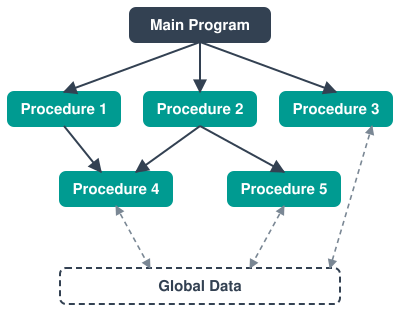

<div class="bb">Building block: procedures and control flow</div>

</div>
<div>

### Object-oriented

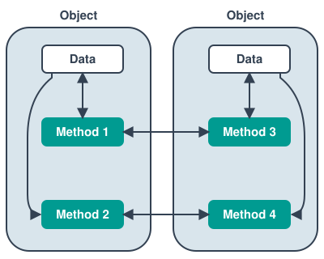

<div class="bb">Building block: objects and methods</div>

</div>
<div>

### Functional

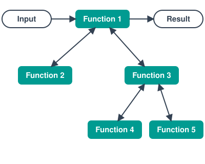

<div class="bb">Building block: functions and expressions</div>

</div>
</div>

<p class="p3note">Different paradigms encourage different program structure, testing style, and reasoning habits.</p>

---

# Platform

<style scoped>
.plat { display: grid; grid-template-columns: repeat(5, 1fr); gap: 16px; margin-top: 10px; }
.plat .card { border: 2px solid #D9E5EC; border-radius: 14px; padding: 16px 6px 14px; text-align: center; }
.plat .pi { height: 70px; width: 70px; object-fit: contain; }
.plat h3 { margin: 8px 0 14px; font-size: 24px; color: #334152; }
.plat .langs { display: flex; flex-wrap: wrap; justify-content: center; gap: 8px 6px; min-height: 76px; }
.plat .lang { width: 86px; display: flex; flex-direction: column; align-items: center; font-size: 15px; line-height: 1.2; }
.plat .lang img { height: 58px; width: 58px; object-fit: contain; margin-bottom: 6px; }
section p { margin: 0.4em 0; }
</style>

<div class="plat">
<div class="card"><h3>Unix</h3><div class="langs"><div class="lang">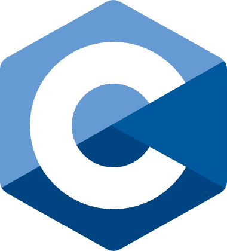<span>C</span></div></div></div>
<div class="card"><h3>Apple</h3><div class="langs"><div class="lang">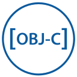<span>Objective-C</span></div><div class="lang">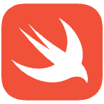<span>Swift</span></div></div></div>
<div class="card"><h3>Windows</h3><div class="langs"><div class="lang">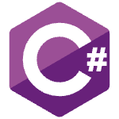<span>C#</span></div></div></div>
<div class="card"><h3>Browser</h3><div class="langs"><div class="lang">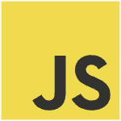<span>JavaScript</span></div></div></div>
<div class="card"><h3>Android</h3><div class="langs"><div class="lang">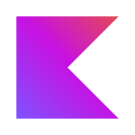<span>Kotlin</span></div></div></div>
</div>

Some languages are strongly tied to a platform; others are portable and can target several platforms. Platform influences tooling, distribution, performance and developer audience.

<p class="small">Android robot: Google, CC BY 3.0.</p>

---

# Typing

<style scoped>
.ty { display: grid; grid-template-columns: 1fr auto; column-gap: 40px; row-gap: 6px; align-items: center; }
.ty ul { margin: 0.2em 0 0.4em; }
.ty .icons { display: flex; gap: 22px; }
.ty .tl { display: flex; flex-direction: column; align-items: center; width: 90px; font-size: 16px; }
.ty .tl img { height: 64px; width: 64px; object-fit: contain; margin-bottom: 4px; }
</style>

Typing describes how a language treats values and their kinds.

<div class="ty">
<div markdown="1">

**Static typing**

- the compiler checks types before running the program
- many mistakes are found early
- refactoring is usually safer

</div>
<div class="icons"><div class="tl">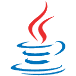<span>Java</span></div><div class="tl"><span>Scala</span></div></div>
<div markdown="1">

**Dynamic typing**

- types are checked while the program runs
- code can be concise and flexible
- some errors appear later

</div>
<div class="icons"><div class="tl"><span>Python</span></div><div class="tl"><span>JavaScript</span></div></div>
</div>

Neither side is magic. Each gives benefits and costs.

---

# Strong and Weak Typing

<style scoped>
section { font-size: 20px; }
p { margin: 0.3em 0; }
ul { margin: 0.15em 0; }
pre { font-size: 13.5px; line-height: 1.35; margin: 0.25em 0; }
</style>

<div class="columns" style="grid-template-columns: 1fr 1.15fr; align-items: start; gap: 36px;">
<div markdown="1">

**Strong typing** means the language enforces boundaries between types.

- fewer surprising implicit conversions
- less accidental mixing of incompatible values

**Weak typing** allows more implicit conversion.

This can feel convenient, but it may also create surprising behavior:

- `false + 7 = 7`
- `7 + true = 8`
- `"10" + 5 = "105"`

</div>
<div markdown="1">

**Strong: Java** stops at compile time

```java
int n = "5" * 2;
// javac: error: bad operand types for binary operator '*'
//   first type:  String
//   second type: int

int m = Integer.parseInt("5") * 2;   // explicit: 10
```


**Weak: JavaScript** converts silently

```javascript
"5" * 2    // 10
"5" + 2    // "52"
"5" - 2    // 3
```


<p class="small">Checked with javac/java 21 and Node.js 20.</p>

</div>
</div>

---

# Typing Matrix

<style scoped>
table { margin: 20px auto 0; font-size: 22px; }
th, td { padding: 14px 26px !important; text-align: center; vertical-align: middle; }
.ml { display: inline-flex; flex-direction: column; align-items: center; width: 110px; margin: 0 6px; font-size: 15px; line-height: 1.2; vertical-align: top; }
.ml img { height: 60px; width: 60px; object-fit: contain; margin-bottom: 6px; }
.ml em { font-size: 12px; color: #667; font-style: normal; }
</style>

We can combine the two distinctions:

|                | Strong typing | Weak typing |
|----------------|---------------|-------------|
| **Static typing**  | <span class="ml"><span>Scala</span></span><span class="ml"><span>Java</span></span><span class="ml"><span>Rust</span></span> | <span class="ml"><span>C</span><em>low-level pointer freedom</em></span> |
| **Dynamic typing** | <span class="ml"><span>Python</span></span> | <span class="ml"><span>JavaScript</span><em>in many everyday situations</em></span> |

---

# Execution

<style scoped>
section { font-size: 21px; }
p { margin: 0.3em 0; }
.ty { display: grid; grid-template-columns: 1fr auto; column-gap: 40px; row-gap: 2px; align-items: center; }
.ty ul, section > ul { margin: 0.15em 0 0.3em; }
.ty .icons { display: flex; gap: 22px; }
.ty .tl { display: flex; flex-direction: column; align-items: center; width: 90px; font-size: 16px; }
.ty .tl img { height: 60px; width: 60px; object-fit: contain; margin-bottom: 4px; }
</style>

There are two broad execution models:

<div class="ty">
<div markdown="1">

**Compiled**

- source code is translated first
- output may be machine code or bytecode
- many checks happen before execution

</div>
<div class="icons"><div class="tl"><span>C#</span></div><div class="tl"><span>Java</span></div></div>
<div markdown="1">

**Interpreted**

- the program is executed more directly by an interpreter
- checks often happen at runtime

</div>
<div class="icons"><div class="tl"><span>Python</span></div><div class="tl"><span>JavaScript</span></div></div>
</div>

In practice, modern runtimes mix ideas:

- bytecode
- JIT compilation
- virtual machines

---

# GPL and DSL

<style scoped>
.icons { display: flex; flex-wrap: wrap; gap: 14px; margin: 10px 0 26px; }
.tl { display: flex; flex-direction: column; align-items: center; width: 84px; font-size: 15px; line-height: 1.2; text-align: center; }
.tl img { height: 58px; width: 58px; object-fit: contain; margin-bottom: 5px; }
</style>

<div markdown="1">

**General-purpose languages (GPLs)** are designed for many different tasks.

<div class="icons"><div class="tl"><span>Java</span></div><div class="tl"><span>Python</span></div><div class="tl"><span>Scala</span></div><div class="tl"><span>C</span></div></div>

**Domain-specific languages (DSLs)** are tailored to a narrower problem space.

<div class="icons"><div class="tl"><span>SQL</span></div><div class="tl"><span>HTML</span></div><div class="tl"><span>CSS</span></div><div class="tl"><span>MATLAB</span></div></div>

</div>

---

# Language Families

<style scoped>
p { margin: 0.3em 0; }
.ft { position: relative; width: 1150px; height: 380px; margin: 26px auto 0; }
.ft .edges { position: absolute; left: 0; top: 0; }
.ft .n { position: absolute; width: 100px; display: flex; flex-direction: column; align-items: center; font-size: 16px; line-height: 1.2; background: #fff; }
.ft .n img { height: 56px; width: 56px; object-fit: contain; margin-bottom: 4px; }
.ft .fam { position: absolute; top: 18px; font-size: 18px; font-weight: 600; color: #009B91; }
</style>

Languages influence each other and form families.

<!-- Family tree: nodes are absolutely positioned (left = centre-50, top = level 0/140/290);
     to add a language (e.g. Java), add a node and extend the bus line of its level in the svg. -->
<div class="ft">
<svg class="edges" viewBox="0 0 1150 380" width="1150" height="380"><g stroke="#334152" stroke-width="2.5" fill="none" stroke-linecap="round"><line x1="280" y1="84" x2="280" y2="110"/><line x1="70" y1="110" x2="490" y2="110"/><line x1="70" y1="110" x2="70" y2="136"/><line x1="210" y1="110" x2="210" y2="136"/><line x1="350" y1="110" x2="350" y2="136"/><line x1="490" y1="110" x2="490" y2="136"/><line x1="70" y1="224" x2="70" y2="255"/><line x1="210" y1="224" x2="210" y2="255"/><line x1="350" y1="224" x2="350" y2="255"/><line x1="490" y1="224" x2="490" y2="255"/><line x1="860" y1="84" x2="860" y2="110"/><line x1="680" y1="110" x2="1040" y2="110"/><line x1="680" y1="110" x2="680" y2="136"/><line x1="860" y1="110" x2="860" y2="136"/><line x1="1040" y1="110" x2="1040" y2="136"/><line x1="680" y1="224" x2="680" y2="255"/><line x1="860" y1="224" x2="860" y2="255"/><line x1="1040" y1="224" x2="1040" y2="255"/><line x1="70" y1="255" x2="1040" y2="255"/><line x1="575" y1="255" x2="575" y2="286"/></g></svg>
<div class="n" style="left:230px;top:0px"><span>C</span></div>
<div class="n" style="left:20px;top:140px">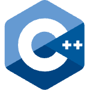<span>C++</span></div>
<div class="n" style="left:160px;top:140px"><span>Objective-C</span></div>
<div class="n" style="left:300px;top:140px"><span>C#</span></div>
<div class="n" style="left:440px;top:140px"><span>Java</span></div>
<div class="n" style="left:810px;top:0px">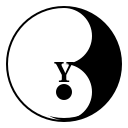<span>Lisp</span></div>
<div class="n" style="left:630px;top:140px">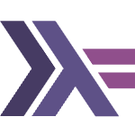<span>Haskell</span></div>
<div class="n" style="left:810px;top:140px">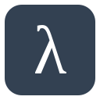<span>Scheme</span></div>
<div class="n" style="left:990px;top:140px"><span>Clojure</span></div>
<div class="n" style="left:525px;top:290px"><span>Scala</span></div>
<div class="fam" style="left:350px">C family</div>
<div class="fam" style="left:920px">Lisp family</div>
</div>

---

# VM Languages

<style scoped>
.vm { display: flex; flex-direction: column; gap: 18px; }
.vm .card { border: 2px solid #D9E5EC; border-radius: 14px; padding: 12px 16px; display: flex; align-items: center; gap: 18px; }
.vm .head { width: 120px; text-align: center; font-size: 30px; font-weight: 700; color: #334152; }
.vm .head img { height: 56px; width: 110px; object-fit: contain; }
.vm .langs { display: flex; gap: 10px; }
.vm .lang { width: 100px; display: flex; flex-direction: column; align-items: center; font-size: 15px; line-height: 1.2; text-align: center; }
.vm .lang img { height: 58px; width: 58px; object-fit: contain; margin-bottom: 6px; }
</style>

<div class="columns" style="align-items: center;">
<div markdown="1">

A **virtual machine** is a runtime layer between the program and the operating system.

Benefits:

- portability
- runtime services
- tooling
- memory management

</div>
<div class="vm">
<div class="card"><div class="head">JVM</div><div class="langs"><div class="lang"><span>Java</span></div><div class="lang"><span>Scala</span></div><div class="lang"><span>Clojure</span></div></div></div>
<div class="card"><div class="head"></div><div class="langs"><div class="lang"><span>C#</span></div><div class="lang"><span>F#</span></div><div class="lang"><span>VB.NET</span></div></div></div>
</div>
</div>

---

# Progress by Leaving Things Out

<style scoped>
section { font-size: 21px; }
.lt li { margin: 0.6em 0; }
</style>

<div class="columns" style="grid-template-columns: 1fr 2fr; gap: 30px; align-items: center;">
<div class="lt" markdown="1">

- We left out **goto** from languages like BASIC to get to procedural languages.
- We left out **pointers** from procedural languages to get to object-oriented languages.
- We left out **assignment** from object-oriented languages to get to functional programming languages.

</div>
<div markdown="1">

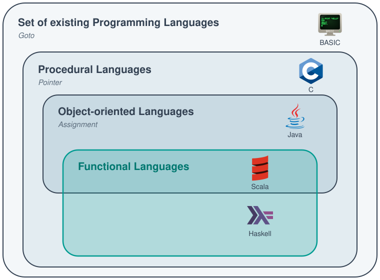

</div>
</div>

---

<!-- _class: kapitel -->

## 2
# Languages by Example

The same problem in many languages

---

# Jump Game

<style scoped>
.shogun { text-align: center; font-size: 15px; line-height: 1.3; }
.shogun img { width: 100%; max-width: 330px; border-radius: 6px; }
.shogun .src { font-size: 11px; color: #666; }
</style>

<div class="columns" style="grid-template-columns: 1.7fr 1fr; align-items: start;">
<div markdown="1">

We use the same problem in several languages to compare style.

Problem statement:

- you start at the first array position
- each number tells you the maximum jump length from that position
- return `true` if you can reach the last index
- otherwise return `false`

Examples:

- `[2, 3, 1, 1, 4]` -> `true`
- `[3, 2, 1, 0, 4]` -> `false`

The algorithm stays similar, but the expression of the solution changes from language to language.

</div>
<div class="shogun" markdown="1">

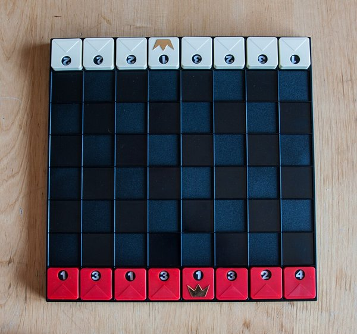

**Shogun (Ravensburger, 1979)**<br>
each piece shows 1–4 = number of fields to move

<span class="src">Photo: Achim Raschka, <a href="https://commons.wikimedia.org/wiki/File:160507_Shogun_Spielmaterial_06.jpg">Wikimedia Commons</a>, <a href="https://creativecommons.org/licenses/by-sa/4.0/">CC BY-SA 4.0</a> (scaled)</span>

</div>
</div>

---

# C

<style scoped>
section { font-size: 22px; }
pre { font-size: 15px; line-height: 1.35; margin: 0.2em 0; }
h3 { margin: 0 0 0.2em; }
.cicon { position: absolute; top: 40px; right: 70px; height: 96px; }
ul { margin-top: 0.4em; }
</style>


<div class="columns" style="grid-template-columns: 1.2fr 1fr; align-items: start;">
<div markdown="1">

### Jump Game

```c
bool canJump(int* nums, int numsSize){
    int jump = 0;
    for (int i = 0; i < numsSize; i++) {
        if (jump < i) {
            break;
        }
        if (jump < i + nums[i]) {
            jump = i + nums[i];
        }
        if (jump >= numsSize - 1) {
            return true;
        }
    }
    return false;
}
```

<p class="small">LeetCode 55, C, signature as on leetcode.com. Tested with gcc: [2,3,1,1,4] → true, [3,2,1,0,4] → false, [0] → true.</p>

</div>
<div markdown="1">

- 1972
- Dennis Ritchie
- hardware-near
- procedural
- compiled
- statically typed
- weakly typed (Pointer)
- no garbage collector

</div>
</div>

---

# C++

<style scoped>
section { font-size: 22px; }
pre { font-size: 15px; line-height: 1.35; margin: 0.2em 0; }
h3 { margin: 0 0 0.2em; }
.cicon { position: absolute; top: 40px; right: 70px; height: 96px; }
ul { margin-top: 0.4em;  }
</style>


<div class="columns" style="grid-template-columns: 1.2fr 1fr; align-items: start;">
<div markdown="1">

### Jump Game

```cpp
class Solution {
public:
    bool canJump(vector<int>& nums) {
        int targetNumIndex = nums.size() - 1;
        for (int i = nums.size() - 2; i >= 0; i--) {
            if (targetNumIndex <= i + nums[i]) {
                targetNumIndex = i;
            }
        }
        return targetNumIndex == 0;
    }
};
```

<p class="small">LeetCode 55, C++, signature as on leetcode.com. Tested with g++ (C++17): [2,3,1,1,4] → true, [3,2,1,0,4] → false, [0] → true.</p>

</div>
<div markdown="1">

- 1985
- by Bjarne Stroustrup
- high-level
- general-purpose
- object-oriented
- compiled
- statically typed
- weakly typed (Pointer)
- no garbage collector

</div>
</div>

---

# Java

<style scoped>
section { font-size: 22px; }
pre { font-size: 15px; line-height: 1.35; margin: 0.2em 0; }
h3 { margin: 0 0 0.2em; }
.cicon { position: absolute; top: 40px; right: 70px; height: 96px; }
ul { margin-top: 0.4em;  }
</style>


<div class="columns" style="grid-template-columns: 1.2fr 1fr; align-items: start;">
<div markdown="1">

### Jump Game

```java
class Solution {
    public boolean canJump(int[] nums) {
        int targetNumIndex = nums.length - 1;
        for (int i = nums.length - 2; i >= 0; i--) {
            if (targetNumIndex <= i + nums[i]) {
                targetNumIndex = i;
            }
        }
        return targetNumIndex == 0;
    }
}
```

<p class="small">LeetCode 55, Java, signature as on leetcode.com. Tested with javac/java (JDK 21): [2,3,1,1,4] → true, [3,2,1,0,4] → false, [0] → true.</p>

</div>
<div markdown="1">

- 1996
- by James Gosling @ Sun/Oracle
- open-source
- general-purpose
- object-oriented
- compiled
- JVM-based
- statically typed
- strongly typed (no Pointer)
- garbage collector

</div>
</div>

---

# Swift

<style scoped>
section { font-size: 22px; }
pre { font-size: 15px; line-height: 1.35; margin: 0.2em 0; }
h3 { margin: 0 0 0.2em; }
.cicon { position: absolute; top: 40px; right: 70px; height: 96px; }
ul { margin-top: 0.4em; font-size: 19px; }
</style>


<div class="columns" style="grid-template-columns: 1.2fr 1fr; align-items: start;">
<div markdown="1">

### Jump Game

```swift
class Solution {
    func canJump(_ nums: [Int]) -> Bool {
        var dpp = Array(repeating: nums.count, count: nums.count)
        dpp[0] = 0

        for i in 0...nums.count-1 {
            for j in 0...nums[i] {
                if j + i < nums.count {
                    dpp[i+j] = min(dpp[j+i], dpp[i] + 1)
                }
            }
        }
        return (dpp[nums.count-1] != nums.count)
    }
}
```

<p class="small">Dynamic programming: fewest jumps needed to reach each index. LeetCode 55, Swift, signature as on leetcode.com. Tested with Swift 6.2: [2,3,1,1,4] → true, [3,2,1,0,4] → false, [0] → true.</p>

</div>
<div markdown="1">

- 2014
- by Apple
- high-level
- general-purpose
- platform-bound
- object-oriented
- compiled
- statically typed
- strongly typed
- inferred types
- optional types
- garbage collector
- with playground

</div>
</div>

---

# JavaScript

<style scoped>
section { font-size: 22px; }
pre { font-size: 15px; line-height: 1.35; margin: 0.2em 0; }
h3 { margin: 0 0 0.2em; }
.cicon { position: absolute; top: 40px; right: 70px; height: 96px; }
ul { margin-top: 0.4em;  }
</style>


<div class="columns" style="grid-template-columns: 1.2fr 1fr; align-items: start;">
<div markdown="1">

### Jump Game

```javascript
var canJump = function(nums) {
    let targetNumIndex = nums.length - 1;
    for (let i = nums.length - 2; i >= 0; i--) {
        if (targetNumIndex <= i + nums[i]) {
            targetNumIndex = i;
        }
    }
    if (targetNumIndex == 0) return true;
    return false;
};
```

<p class="small">LeetCode 55, JavaScript, signature as on leetcode.com. Tested with Node.js: [2,3,1,1,4] → true, [3,2,1,0,4] → false, [0] → true.</p>

</div>
<div markdown="1">

- 1995
- Brendan Eich @ Netscape
- browser-based
- functional & object-oriented
- interpreted
- dynamically typed
- weakly typed
- garbage collector

</div>
</div>

---

# Rust

<style scoped>
section { font-size: 22px; }
pre { font-size: 14px; line-height: 1.35; margin: 0.2em 0; }
h3 { margin: 0 0 0.2em; }
.cicon { position: absolute; top: 40px; right: 70px; height: 96px; }
ul { margin-top: 0.4em;  }
</style>


<div class="columns" style="grid-template-columns: 1.2fr 1fr; align-items: start;">
<div markdown="1">

### Jump Game

```rust
use std::cmp;

impl Solution {
    pub fn can_jump(nums: Vec<i32>) -> bool {
        let mut ret: bool = true;
        let mut idx: usize = 0;
        for i in 0..nums.len() {
            if idx >= nums.len() - 1 {
                break;
            } else if i > idx {
                ret = false;
                break;
            } else {
                idx = cmp::max(nums[i] as usize + i, idx);
            }
        }
        return ret;
    }
}
```

<p class="small">LeetCode 55, Rust, signature as on leetcode.com. Tested with rustc (2021 edition): [2,3,1,1,4] → true, [3,2,1,0,4] → false, [0] → true.</p>

</div>
<div markdown="1">

- 2015
- by Graydon Hoare @ Mozilla
- hardware-near
- functional & object-oriented
- interpreted
- statically typed
- strongly typed
- no garbage collector

</div>
</div>

---

# Python

<style scoped>
section { font-size: 22px; }
pre { font-size: 15px; line-height: 1.35; margin: 0.2em 0; }
h3 { margin: 0 0 0.2em; }
.cicon { position: absolute; top: 40px; right: 70px; height: 96px; }
ul { margin-top: 0.4em;  }
</style>


<div class="columns" style="grid-template-columns: 1.2fr 1fr; align-items: start;">
<div markdown="1">

### Jump Game

```python
class Solution:
    def canJump(self, nums: List[int]) -> bool:
        reachable = 0
        for i in range(len(nums)):
            if i > reachable:
                return False
            reachable = max(reachable, i + nums[i])
        return True
```

<p class="small">LeetCode 55, Python, signature as on leetcode.com. Tested with Python 3: [2,3,1,1,4] → true, [3,2,1,0,4] → false, [0] → true.</p>

</div>
<div markdown="1">

- 1991
- by Guido von Rossum
- general-purpose
- multi-paradigm
- interpreted
- dynamically typed
- strongly typed
- garbage collector

</div>
</div>

---

# Scala with For

<style scoped>
section { font-size: 22px; }
pre { font-size: 15px; line-height: 1.35; margin: 0.2em 0; }
h3 { margin: 0 0 0.2em; }
.cicon { position: absolute; top: 40px; right: 70px; height: 96px; }
ul { margin-top: 0.4em; font-size: 19px; }
</style>


<div class="columns" style="grid-template-columns: 1.2fr 1fr; align-items: start;">
<div markdown="1">

### Jump Game

```scala
object Solution {
  def canJump(nums: Array[Int]): Boolean = {
    var minJump = nums.length - 1
    for (i <- nums.length - 2 to 0 by -1; if nums.length >= 2) {
      if (nums(i) + i >= minJump) {
        minJump = i
      }
    }
    minJump == 0
  }
}
```

<p class="small">LeetCode 55, Scala, signature as on leetcode.com. Tested with Scala 3.3.1: [2,3,1,1,4] → true, [3,2,1,0,4] → false, [0] → true.</p>

</div>
<div markdown="1">

- 2003
- by Martin Odersky
- open-source
- high-level
- general-purpose
- functional & object-oriented
- compiled
- JVM-based
- statically typed
- strongly typed
- optional types
- garbage collector
- with playground (worksheet)

</div>
</div>

---

# Scala with Recursion

<style scoped>
section { font-size: 22px; }
pre { font-size: 15px; line-height: 1.35; margin: 0.2em 0; }
h3 { margin: 0 0 0.2em; }
.cicon { position: absolute; top: 40px; right: 70px; height: 96px; }
ul { margin-top: 0.4em;  }
</style>


<div style="width: 75%;" markdown="1">

### Jump Game

```scala
object Solution {
  def canJump(nums: Array[Int]): Boolean = {
    @annotation.tailrec
    def isPossible(max: Int = 0, idx: Int = 0): Boolean =
      if (idx == nums.size - 1) true
      else if (nums(idx) == 0 && max == idx) false
      else isPossible(math.max(max, idx + nums(idx)), idx + 1)

    isPossible()
  }
}
```

<p class="small">Forward greedy (max reach) as a tail-recursive helper: no <code>var</code>, no loop. LeetCode 55, Scala, signature as on leetcode.com. Tested with Scala 3.3.1: [2,3,1,1,4] → true, [3,2,1,0,4] → false, [0] → true.</p>

</div>

---

# Scala with Fold

<style scoped>
section { font-size: 22px; }
pre { font-size: 15px; line-height: 1.35; margin: 0.2em 0; }
h3 { margin: 0 0 0.2em; }
.cicon { position: absolute; top: 40px; right: 70px; height: 96px; }
ul { margin-top: 0.4em;  }
</style>


<div style="width: 75%;" markdown="1">

### Jump Game

```scala
object Solution {
  def canJump(nums: Array[Int]): Boolean =
    nums.zipWithIndex.foldRight(nums.length - 1) { case ((n, i), leftmost) =>
      if (n + i >= leftmost) i else leftmost
    } == 0
}
```

<p class="small">Backward greedy as one <code>foldRight</code>: no <code>var</code>, no loop. LeetCode 55, Scala, signature as on leetcode.com. Tested with Scala 3.3.1: [2,3,1,1,4] → true, [3,2,1,0,4] → false, [0] → true.</p>

</div>

---

# Where Scala Sits

<div style="text-align: center; margin-top: 4px;">
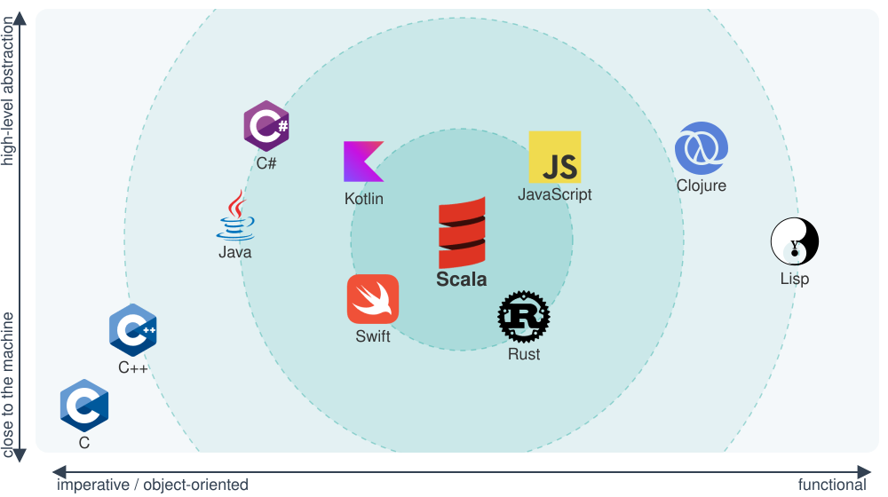
</div>

---

# Sprachen in AIN

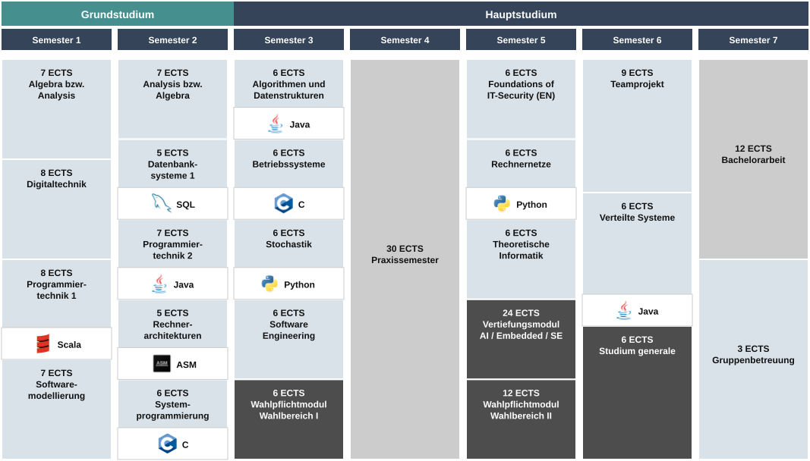

---

# Vertiefungsrichtungen in AIN


---

# Programming after Agile

Agile development increased the importance of:

- testability
- modularity
- fast feedback
- safe refactoring

Strengthens the case for functional ideas:

- avoid unnecessary `void`
- avoid unnecessary `null`
- reduce hidden state
- prefer explicit effects

Scala is a language that combines functional techniques with object orientation.

---

# Programming after Big Data

Big data systems need:

- parallelism
- distribution
- composition of transformations

That pushes us toward:

- associative operations
- algebraic thinking
- immutable data and pure transformations where possible

This is one reason functional programming became more influential again.
This trend leads directly to Apache Spark, which is written mostly in Scala.

---

# Programming after AI

If more code is generated automatically, then language design matters even more.

What becomes valuable:

- strong static typing
- modularity
- testability
- precise interfaces

The more code we create, review, and regenerate, the more we benefit from languages that make mistakes visible early.

---

<!-- _class: tools -->

## New Tools
# Scastie and LeetCode

Run Scala in the browser and practice with real exercises

---

<!-- _class: tools-page -->

# Scastie: Scala in the Browser

<style scoped>section { font-size: 18px; } ul { margin: 0.2em 0; } li { margin: 0.12em 0; }</style>

<div class="columns" style="grid-template-columns: 1fr 1.25fr; align-items: start;">
<div markdown="1">

**[scastie.scala-lang.org](https://scastie.scala-lang.org)** – the online playground of the Scala Center

- **no installation**: write and run Scala in any browser
- **Build Settings** → Target **Scala 3**, choose the version (default today: 3.9.0 LTS)
- **Run** (Cmd/Ctrl+Enter) compiles and runs; `println` output appears in the console
- **Worksheet** mode (on by default): the value and type of each line appear next to it. For `@main` programs, switch it off
- **share**: after Run, the address bar shows a link to your snippet; log in with GitHub to keep your snippets in your profile
- **libraries**: add them under Build Settings → Libraries

</div>
<div markdown="1">

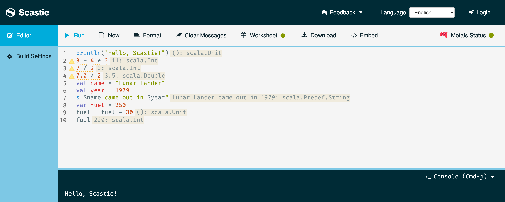

<p class="small">Worksheet mode: each line shows its result and type (the ⚠ marks are only hints). Open this snippet: <a href="https://scastie.scala-lang.org/FmX2urC7SSGKxQd1MHs82w">scastie.scala-lang.org/FmX2urC7SSGKxQd1MHs82w</a></p>

</div>
</div>

<p class="small">Sources: scastie.scala-lang.org (Help, Build Settings), github.com/scalacenter/scastie; screenshot taken on 4 Oct 2026.</p>

---

<!-- _class: tools-page -->

# First Steps in Scastie

<style scoped>section { font-size: 19px; } pre { font-size: 15px; margin: 0.3em 0; } p { margin: 0.3em 0; }</style>

Paste into [scastie.scala-lang.org](https://scastie.scala-lang.org), keep Worksheet mode on, press **Run**:

<div class="columns" style="grid-template-columns: 1fr 1fr; align-items: start;">
<div markdown="1">

```scala
println("Hello, Scastie!")
3 + 4 * 2          // 11
7 / 2              // 3   (Int division)
7.0 / 2            // 3.5 (Double)
val name = "Lunar Lander"
val year = 1979
s"$name came out in $year"
var fuel = 250
fuel = fuel - 30
fuel               // 220
```

Console: `Hello, Scastie!` – [open snippet](https://scastie.scala-lang.org/FmX2urC7SSGKxQd1MHs82w)

</div>
<div markdown="1">

```scala
// Lunar Lander: one second of the BASIC loop (lines 340-370)
val g = 5
val burn = 30
var height = 500
var speed = 50
var fuel = 250

fuel = fuel - burn
val oldSpeed = speed
speed = speed + g - burn / 2
height = height - (oldSpeed + speed) / 2
println(s"height $height, speed $speed, fuel $fuel")
```

Console: `height 455, speed 40, fuel 220` – [open snippet](https://scastie.scala-lang.org/1w7H0ZPVS9u2JTAhN3tp4g)

</div>
</div>

<p class="small">Outputs checked in Scastie (Scala 3.9.0) and locally with Scala 3.8.3. <code>val</code> = fixed value, <code>var</code> = variable (like BASIC's <code>LET</code>), <code>s"…$x"</code> inserts values into a string.</p>

---

<!-- _class: tools-page -->

# LeetCode: Programming Exercises Online

<style scoped>section { font-size: 19px; } ul { margin: 0.2em 0; } li { margin: 0.12em 0; }</style>

<div markdown="1">

**[leetcode.com](https://leetcode.com)** – thousands of programming problems

- sorted by difficulty: **Easy**, **Medium**, **Hard**
- online editor with a code template per language
- **Run** tries the examples, **Submit** runs automatic tests against many hidden test cases
- a free account is needed to submit
- **Scala is supported: Scala 3.3.1** (also Java, C, C++, Python, …)

**Getting started**

1. sign up (free)
2. Problems → filter **Difficulty: Easy**
3. pick **Scala** in the editor's language menu

**Our example:** [55. Jump Game](https://leetcode.com/problems/jump-game/) (Medium) – the problem from our language comparison

</div>

<p class="small">Sources: leetcode.com/problems/jump-game; LeetCode Help Center, "What are the environments for the programming languages?" (updated March 2026) and "Start your Coding Practice".</p>

---

<!-- _class: tools-page -->

# LeetCode in the Browser

<style scoped>
.lcshot { text-align: center; margin-top: 6px; }
.lcshot img { max-width: 100%; height: 455px; object-fit: contain; border: 1px solid #D9E5EC; border-radius: 6px; }
</style>

<div class="lcshot">
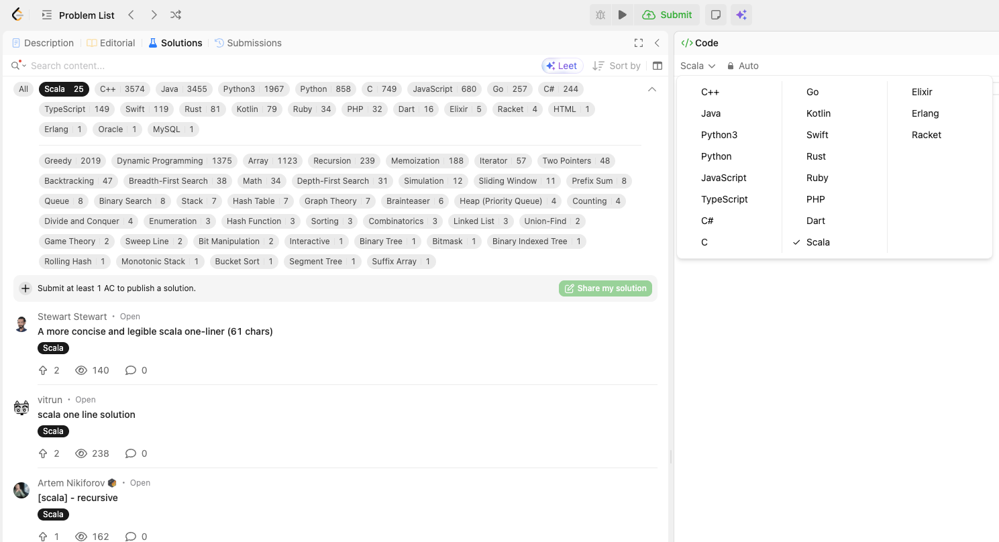
</div>

<p class="small" style="text-align: center;">Left: the <b>Solutions</b> tab filtered by <b>Scala</b>. Right: the editor's language menu with <b>Scala</b> selected. Screenshot: leetcode.com, 4 Oct 2026.</p>

---

<!-- _class: inhalt -->

<style scoped>
section { font-size: 23px; }
</style>

# Summary

- Languages differ by layer (machine/assembler → high level), history, and popularity
- Programming paradigms and call structures; platforms and execution models
- Typing: strong/weak and related trade-offs; GPL vs DSL; language families and VMs
- Progress by leaving things out; one problem (Jump Game) across C, C++, Java, Swift, JS, Rust, Python, Scala
- Where Scala sits; languages and Vertiefungen in AIN
- Industry shifts: after Agile, Big Data, and AI
- Tools: Scastie (Scala in the browser) and LeetCode for practice and comparison

---

<!-- _class: aufgabe -->

# Tasks

Tools: **Scastie** and **LeetCode**

- solve exercises in Scastie
- look at program examples on LeetCode: browse the solutions for Jump Game in different languages and compare them with the versions from the lecture

---

<!-- _class: abschluss -->

# Questions?

## Thank you!

marko.boger@htwg-konstanz.de
