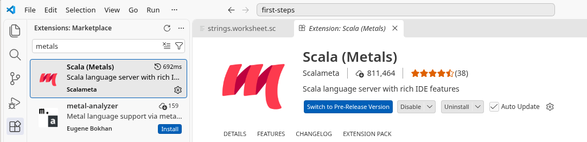
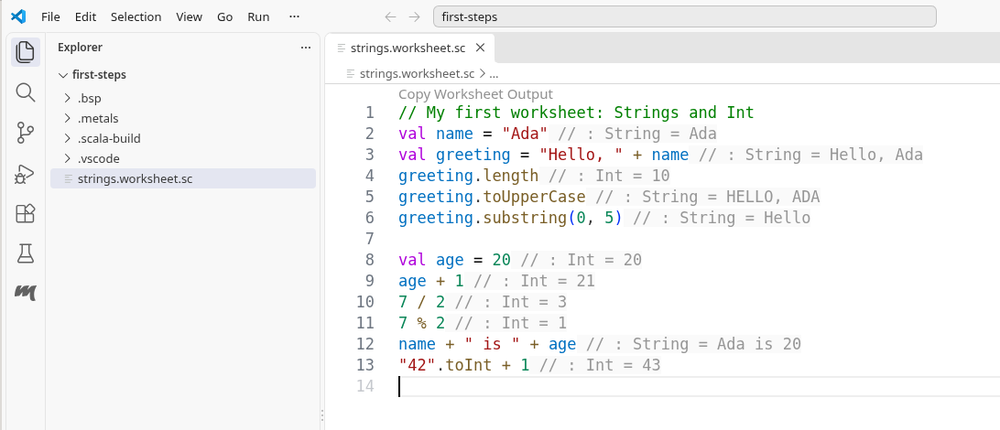

### Prof. Dr. Marko Boger, Prof. Dr. Pascal Laube
## Programmiertechnik I
# Lecture 04: Scala Strings and Int

First steps in Scala: setup, `Int` and `String` in the REPL, and a serial letter.

---

<!-- _class: inhalt -->

# Goals

<style scoped>section { font-size: 23px; }</style>

- Why Scala in PT1: hybrid OO + FP on the JVM
- Install Scala with Coursier; use the REPL
- First programs in VS Code / Metals, worksheets, and CodeTask
- `Int`, `String`, `val` / `var`, and simple `def` in the REPL
- Serial letter: interpolation, `stripMargin`, `Double` grades
- Run `scala SerialLetter.scala` from Terminal

---

# Why not Java?

Java is also incorporating functional elements into its core language since version 8. Functional programming is possible in Java, but it is not easy. For example, creating an immutable object is hard, since the default data structures are mutable. The syntax for immutable structures is longer than for mutable, state change is so common, it is hard to get away from it.

So, to become a good programmer with functional style available to you, it is easier to learn a language that makes functional programming easy and then switch back to Java and apply what you learned. If you ever go back...

---

# Language Properties (Researched)

<style scoped>
table { font-size: 0.95em; margin-top: 0.6em; }
th, td { text-align: center; padding: 0.25em 0.6em; }
td:first-child, th:first-child { text-align: left; }
.ok { color: #2E9E44; font-weight: 700; }
.no { color: #D32F2F; font-weight: 700; }
.mid { color: #E0A800; font-weight: 700; }
</style>

Legend: <span class="ok">✓</span> = core feature, <span class="mid">△</span> = mixed or limited, <span class="no">✗</span> = absent.
Type inference = earlier "implicit type system". Pure OOP* ≈ "everything is an object".

|                    | Scala | C | Java | JavaScript | Python | Haskell | Kotlin |
|--------------------|:-----:|:-:|:----:|:----------:|:------:|:-------:|:------:|
| Static typing      | <span class="ok">✓</span> | <span class="ok">✓</span> | <span class="ok">✓</span> | <span class="no">✗</span> | <span class="no">✗</span> | <span class="ok">✓</span> | <span class="ok">✓</span> |
| Strong typing      | <span class="ok">✓</span> | <span class="no">✗</span> | <span class="ok">✓</span> | <span class="no">✗</span> | <span class="ok">✓</span> | <span class="ok">✓</span> | <span class="ok">✓</span> |
| Type inference     | <span class="ok">✓</span> | <span class="no">✗</span> | <span class="mid">△</span> | <span class="no">✗</span> | <span class="no">✗</span> | <span class="ok">✓</span> | <span class="ok">✓</span> |
| Pure OOP*          | <span class="ok">✓</span> | <span class="no">✗</span> | <span class="no">✗</span> | <span class="mid">△</span> | <span class="ok">✓</span> | <span class="no">✗</span> | <span class="mid">△</span> |
| Functional support | <span class="ok">✓</span> | <span class="no">✗</span> | <span class="mid">△</span> | <span class="ok">✓</span> | <span class="mid">△</span> | <span class="ok">✓</span> | <span class="ok">✓</span> |

---

# Who invented Scala?

<div class="columns">
<div markdown="1">

Martin Odersky

- Built the Java compiler for Java 1.3 and 1.4
- Built the generic type system and compiler for Java 1.5
- Now a Professor at EPFL Lausanne
- Started to create a “Java how it should be”
- Founded the company Typesafe in 2011
- Typesafe was renamed to Lightbend in 2015

</div>
<div markdown="1">

<div class="visual-frame">

</div>

</div>
</div>

---

# Scala = a SCAlable LAnguage

- Scala is scalable in three dimensions
  - Program size
    - Interpreter, Scripts, Programs, Component Systems
  - Language extension
    - Java is a closed language
      - No operator overloading, no additional operators
    - Scala is open, it can be extended
      - Operators are methods and can be added and extended
      - Flexible syntax allows elegant extensions
      - Libraries can feel like extensions
  - Number of Processors
    - Good Concurrency System
    - Functional Programming is a good fit for concurrency

---

# Scala is a Hybrid Language

- Scala is an Object-Oriented Language
  - Much cleaner OO than Java
  - Everything is an object
- Scala is a Functional Language
  - Functional means
    - No state change
    - Same input produces same output
    - Functions as parameters
- Scala is the first language that combines OO and FP in a very clean, straightforward fashion

---

# JVM as Platform

Scala compiles to Java byte code
Scala compiles to .class files
Scala runs on the Java VM
Scala is fully interoperable with Java

- Call
  - Scala classes can call Java classes
  - Java classes can call almost all Scala classes
- Inherit
  - Scala classes can inherit from Java classes
  - Java classes can inherit from almost all Scala classes

---

<!-- _class: tools -->

## New Tools
# Installing Scala, the REPL and VS Code

From `cs setup` to your first worksheet

---

<!-- _class: tools-page -->

# Coursier (`cs`) – the Scala Installer

<style scoped>section { font-size: 20px; } p { margin: 0.3em 0; } ul { margin: 0.2em 0; } li { margin: 0.1em 0; }</style>

<div class="columns" style="grid-template-columns: 1fr 1fr; align-items: start;">
<div markdown="1">

**What is Coursier?**

- the official **Scala installer**, recommended on [scala-lang.org/download](https://www.scala-lang.org/download/)
- its command is called **`cs`**
- one command, **`cs setup`**, sets up everything you need on macOS, Windows and Linux
- manages **JVMs** and **Scala applications** for you, and keeps them up to date

**Versions (Oct 2026)**

- current release: **Scala 3.9.0**
- Scala 3 needs at least **JDK 17**; **JDK 25 (LTS) recommended**, 17 and 21 also work

</div>
<div markdown="1">

**What `cs setup` does**

1. checks for a **JDK** – installs one if none is found
2. installs the standard Scala tools:

| Command | What it is |
|---|---|
| `scala` | Scala runner and **REPL** |
| `scalac` | the Scala **compiler** |
| `scala-cli` | compile, run and package Scala code |
| `scalafmt` | code **formatter** |
| `cs` | Coursier itself |

3. adds the tools to your **PATH** (`~/.profile`, `~/.zprofile`; on Windows the user environment variables)

It asks before every step – answer `Y`.

</div>
</div>

<p class="small">Sources: scala-lang.org/download; get-coursier.io/docs/cli-installation; docs.scala-lang.org/getting-started/install-scala.html.</p>

---

<!-- _class: tools-page -->

# Installing Coursier and Scala

<style scoped>section { font-size: 19px; } pre { font-size: 12.5px; margin: 0.25em 0; } p { margin: 0.25em 0; } ul { margin: 0.2em 0; }</style>

**macOS** with Homebrew:

```bash
brew install coursier && coursier setup
```

**macOS** without Homebrew, Apple Silicon (M1, M2, …):

```bash
curl -fL https://github.com/coursier/coursier/releases/latest/download/cs-aarch64-apple-darwin.gz | gzip -d > cs \
  && chmod +x cs && (xattr -d com.apple.quarantine cs || true) && ./cs setup
```

**Linux** (x86-64; for ARM64 see the download page):

```bash
curl -fL https://github.com/coursier/coursier/releases/latest/download/cs-x86_64-pc-linux.gz | gzip -d > cs \
  && chmod +x cs && ./cs setup
```

<div class="columns" style="grid-template-columns: 1fr 1fr; align-items: start;">
<div markdown="1">

**Windows**

- download the **Scala installer for Windows** (based on Coursier) from scala-lang.org/download
- run it and follow the on-screen instructions

</div>
<div markdown="1">

**Afterwards**

- **close the terminal and open a new one**, so the new `PATH` is used
- still not found? Log out and in again (or reboot)

</div>
</div>

<p class="small">Commands from scala-lang.org/download, docs.scala-lang.org/getting-started/install-scala.html and get-coursier.io (Oct 2026).</p>

---

<!-- _class: tools-page -->

# What `cs setup` Prints – and Checking Your Setup

<style scoped>section { font-size: 19px; } pre { font-size: 13px; margin: 0.25em 0; } p { margin: 0.25em 0; } ul { margin: 0.2em 0; }</style>

<div class="columns" style="grid-template-columns: 1.1fr 0.9fr; align-items: start;">
<div markdown="1">

```text
$ ./cs setup --jvm 25
Checking if a JVM is installed
  No JVM found, should we try to install one? [Y/n] Y
Downloading https://github.com/adoptium/temurin25-binaries/…
Downloaded https://github.com/adoptium/temurin25-binaries/…
  Should we update ~/.profile? [Y/n] Y
Some shell configuration files were updated. It is recommended
to close this terminal once the setup command is done, …

Checking if ~/.local/share/coursier/bin is in PATH
  Should we add ~/.local/share/coursier/bin to your PATH
  via ~/.profile? [Y/n] Y

Checking if the standard Scala applications are installed
  Installed cs
  Installed coursier
  Installed scala
  Installed scalac
  Installed scala-cli
  …
  Installed scalafmt
```

</div>
<div markdown="1">

**Check in a new terminal:**

```text
$ scala -version
Scala code runner version: 1.16.0
Scala version (default): 3.9.0

$ java -version
openjdk version "25.0.4.1" 2026-08-18 LTS
```

**Useful options and commands**

- `cs setup --jvm 25` – install JDK 25 instead of the default JDK (21)
- `cs setup --yes` – answer all questions with yes
- `cs update` – update the installed tools
- `cs list` – show the installed tools

</div>
</div>

<p class="small">Outputs: Coursier 2.1.26 on a fresh Linux x86-64 account, Oct 2026 (paths shortened, lines left out: …). Source: get-coursier.io/docs/cli-installation.</p>

---

<!-- _class: tools-page -->

# The REPL: Read – Evaluate – Print – Loop

<style scoped>section { font-size: 20px; } pre { font-size: 16px; margin: 0.25em 0; } p { margin: 0.25em 0; } ul { margin: 0.2em 0; } li { margin: 0.1em 0; }</style>

<div class="columns" style="grid-template-columns: 0.8fr 1.2fr; align-items: start;">
<div markdown="1">

- start it with **`scala`** (no arguments) in a terminal
- type an expression, press **Enter**: the REPL **reads** it, **evaluates** it, **prints** result and type, and waits again (**loop**)
- a result without a name gets an automatic name: **`res0`**, **`res1`**, … You can use these names later
- `val` gives a result your own name
- leave with **`:quit`** (or `:exit`, or **Ctrl+D**)
- ideal for **first experiments** – nothing is saved

</div>
<div markdown="1">

```text
$ scala
Welcome to Scala 3.9.0 (25.0.4.1, Java OpenJDK 64-Bit Server VM).
Type in expressions for evaluation. Or try :help.

scala> 17 + 4
val res0: Int = 21

scala> res0 * 2
val res1: Int = 42

scala> "Hello" + " Scala"
val res2: String = "Hello Scala"

scala> val s = "Scala"
val s: String = "Scala"

scala> :quit
$
```

</div>
</div>

<p class="small">Outputs: Scala 3.9.0 REPL, JDK 25. Source: docs.scala-lang.org/scala3/book/taste-repl.html.</p>

---

<!-- _class: tools-page -->

# Strings and Ints in the REPL

<style scoped>section { font-size: 20px; } pre { font-size: 16px; margin: 0.25em 0; } p { margin: 0.25em 0; } ul { margin: 0.2em 0; }</style>

<div class="columns" style="grid-template-columns: 1fr 1fr; align-items: start;">
<div markdown="1">

```text
scala> val s = "Scala"
val s: String = "Scala"

scala> s.length
val res0: Int = 5

scala> s.toUpperCase
val res1: String = "SCALA"

scala> s.substring(1, 3)
val res2: String = "ca"

scala> s * 3
val res3: String = "ScalaScalaScala"

scala> "Age: " + 20
val res4: String = "Age: 20"
```

</div>
<div markdown="1">

```text
scala> 7 / 2
val res5: Int = 3

scala> 7 % 2
val res6: Int = 1

scala> Int.MaxValue
val res7: Int = 2147483647

scala> Int.MaxValue + 1
val res8: Int = -2147483648

scala> "42".toInt
val res9: Int = 42
```

- every line shows **name**, **type** and **value**
- Strings are printed **in quotes**
- `7 / 2` is `3`: Int division drops the rest
- `Int.MaxValue + 1` is negative: an Int has only 32 bits (more in lecture 05)

</div>
</div>

<p class="small">Outputs: Scala 3.9.0 REPL, JDK 25.</p>

---

<!-- _class: tools-page -->

# REPL: Commands, Multi-line Input, Completion

<style scoped>section { font-size: 19px; } pre { font-size: 12.5px; margin: 0.2em 0; } p { margin: 0.2em 0; } table { font-size: 15px; } th, td { padding: 1px 8px !important; }</style>

<div class="columns" style="grid-template-columns: 1fr 1fr; align-items: start;">
<div markdown="1">

**Multi-line input:** if a line is not complete (here it ends with `=`), the REPL waits for more. An **empty line** finishes the input:

```text
scala> def greet(name: String): String =
         "Hello, " + name + "!"

def greet(name: String): String

scala> greet("Ada")
val res0: String = "Hello, Ada!"
```

**Tab completion:** type `"Scala".toU` and press **Tab**: it completes to `toUpperCase`. Press Tab again to see the variants:

```text
scala> "Scala".toUpperCase
def toUpperCase(): String
def toUpperCase(x$0: java.util.Locale): String
```

</div>
<div markdown="1">

**Commands** start with a colon:

| Command | Does |
|---|---|
| `:help` | list all commands |
| `:type <expr>` | show only the type |
| `:doc <expr>` | show the documentation |
| `:reset` | forget all definitions |
| `:quit` | leave the REPL |

```text
scala> :type "Scala".length
Int
```

**Errors** are shown immediately:

```text
scala> val n: Int = "42"
-- [E007] Type Mismatch Error: ---------------------
1 |val n: Int = "42"
  |             ^^^^
  |             Found:    ("42" : String)
  |             Required: Int
```

</div>
</div>

<p class="small">Outputs: Scala 3.9.0 REPL (error output shortened). Command list from <code>:help</code>.</p>

---

<!-- _class: tools-page -->

# VS Code with the Metals Extension

<style scoped>section { font-size: 20px; } p { margin: 0.3em 0; } ul, ol { margin: 0.2em 0; } li { margin: 0.1em 0; }</style>

**Metals** is the Scala language server for VS Code (and other editors): completion, error checking, and code navigation.



<div class="columns" style="grid-template-columns: 1fr 1fr; align-items: start;">
<div markdown="1">

1. install **VS Code** from [code.visualstudio.com](https://code.visualstudio.com/)
2. open the **Extensions** view (**Cmd+Shift+X** on macOS, **Ctrl+Shift+X** on Windows/Linux)
3. search for **Metals**, install **Scala (Metals)** by Scalameta (it also installs *Scala Syntax*)

</div>
<div markdown="1">

4. **File › Open Folder…** – open a folder for your Scala files
5. open or create a `.scala` or `.sc` file: Metals starts
6. the first start downloads the Metals server – this takes a minute
7. Metals gives you highlighting, errors while you type, completion, and **worksheets**

</div>
</div>

<p class="small">Screenshot: VS Code 1.140 with Metals 1.72.0 (server 1.6.9). Source: scalameta.org/metals/docs/editors/vscode.</p>

---

<!-- _class: tools-page -->

# Running Scala from the Terminal

Later we will start Scala programs from the terminal — not only in the REPL.

<style scoped>
section { font-size: 20px; }
ul { margin: 0.2em 0; }
li { margin: 0.15em 0; }
pre { font-size: 15px; }
</style>

- In the folder with your `.scala` file: `scala MyProgram.scala`
- Scala looks for a **`main`** entry point — without it, nothing to launch
- We will use this soon (for example with `SerialLetter.scala`)

Two ways to define `main`:

<div class="columns" style="grid-template-columns: 1fr 1fr; align-items: start; gap: 1.2rem;">
<div markdown="1">

**1. `main` in an `object`**

```scala
object MyProgram:
  def main(args: Array[String]): Unit =
    println("hello")
```

</div>
<div markdown="1">

**2. `@main` annotation**

```scala
@main def run(): Unit =
  println("hello")
```

</div>
</div>


---

<!-- _class: tools-page -->

# Worksheets: the REPL in a File

<style scoped>section { font-size: 19px; } p { margin: 0.2em 0; } ul { margin: 0.1em 0; } li { margin: 0.05em 0; }</style>



<div class="columns" style="grid-template-columns: 1fr 1fr; align-items: start;">
<div markdown="1">

- a file whose name ends in **`.worksheet.sc`**
- create it with **Metals: New Scala File…** › **Worksheet** (command palette **Cmd/Ctrl+Shift+P**), or name a new file that way
- no `object` or `main` needed – code at the top level

</div>
<div markdown="1">

- **evaluated on every save** (**Cmd/Ctrl+S**)
- each result appears **at the end of its line** in grey; hover over it for long results
- like the REPL, but your code **stays** and you can change it

</div>
</div>

<p class="small">Screenshot: VS Code 1.140, Metals 1.72.0, Scala 3.9.0 – real evaluation. Source: scalameta.org/metals/docs/editors/vscode (Worksheets).</p>

---

<!-- _class: tools-page -->

# CodeTask: Practice Scala Online

<style scoped>section { font-size: 21px; } ul { margin: 0.2em 0; } li { margin: 0.25em 0; }</style>

<div class="columns" style="grid-template-columns: 1fr 1fr; align-items: center;">
<div markdown="1">

- **CodeTask** – "A Scala learning platform" of HTWG Konstanz: [codetask.in.htwg-konstanz.de](https://codetask.in.htwg-konstanz.de)
- sign in with your e-mail or HTWG e-mail; new here? Click **Registrieren**
- subscribe to the PT1 lecture: chapters with **video lessons** and **tasks**
- your tasks are **checked**, you earn **points** and see your **progress**
- the PT1 exercises were built by students last semester: videos, summaries and exercises

</div>
<div markdown="1">


</div>
</div>

<p class="small">Screenshot: CodeTask sign-in page, Oct 2026.</p>

---

# Int in the REPL

Int is used for whole numbers.
Typical operations are +, -, *, / and %.
The result of an arithmetic expression is again an Int.

```scala
scala> 7 + 5
val res0: Int = 12

scala> 9 * 3
val res1: Int = 27

scala> 17 % 5
val res2: Int = 2
```

---

# String in the REPL

String is used for text.
Strings are written in double quotes.
The + operator can concatenate strings.
A few useful first operations are length, toUpperCase, and substring.

```scala
scala> val s = "Scala"
val s: String = "Scala"

scala> s.length
val res0: Int = 5

scala> s + " 3"
val res1: String = "Scala 3"
```

---

# val and var

val defines a value that does not change.
var defines a variable that can be reassigned.
Use val by default. Use var only when change is really needed.

```scala
scala> val year = 2025
val year: Int = 2025

scala> var counter = 0
var counter: Int = 0

scala> counter = counter + 1
counter: Int = 1
```

---

# Simple def

def defines a function.
A simple function can often be written in one line.
Functions take input parameters and return a result.

```scala
scala> def inc(x: Int) = x + 1
def inc(x: Int): Int

scala> inc(5)
val res0: Int = 6

scala> def greet(name: String) = "Hello " + name
def greet(name: String): String
```

---

# Putting it together

The first useful programs combine Int, String, val, and def.
This is still only one line at a time in the REPL.

```scala
scala> val name = "Ada"
val name: String = "Ada"

scala> val age = 20
val age: Int = 20

scala> def nextAge(x: Int) = x + 1
def nextAge(x: Int): Int

scala> name + " will soon be " + nextAge(age)
val res0: String = "Ada will soon be 21"
```

---

# Serial Letters (Form Letters)

A **serial letter** is the same template filled with different data — here: exam results.

This example builds a letter from `String`, `Int`, and `Double`, then prints one letter per student.

<style scoped>
section { font-size: 24px; }
ul { margin: 0.35em 0; }
li { margin: 0.28em 0; }
</style>

- **String interpolation:** `$name`, `$matriculationNumber`, `$result` inside an `s"""..."""` string
- **`stripMargin`:** each content line starts with `|`; indentation before `|` is removed
- **`Double` grades** and formatting: `f"$grade%.1f"` → one decimal place
- **Pass / fail:** `passed` when `grade <= 4.0`

Source: `SerialLetter.scala` in the Programming I workspace.

Run it from that directory:

```bash
scala SerialLetter.scala
```

---

# letterText: Build the Letter

`letterText` returns the full letter as one `String`.

<style scoped>
section { font-size: 18px; }
pre { font-size: 15px; }
</style>

```scala
def letterText(name: String, matriculationNumber: Int, grade: Double): String =
  val passed = grade <= 4.0
  val result =
    if passed then "passed"
    else "failed"

  s"""Subject: Result of the Programming I exam
    |
    |Dear $name,
    |
    |regarding your matriculation number $matriculationNumber we would like to inform you:
    |
    |  Grade: ${f"$grade%.1f"} ($result)
    |
    |Best regards
    |Your Examination Office
    |----------------------------------------""".stripMargin
```

---

# writeLetter: One Student

`writeLetter` prints the letter for **one** student (`Unit` = no return value, only a side effect).

<style scoped>
section { font-size: 22px; }
pre { font-size: 18px; }
</style>

```scala
def writeLetter(name: String, matriculationNumber: Int, grade: Double): Unit =
  println(letterText(name, matriculationNumber, grade))
```

Call it with three arguments: name, matriculation number, and grade.

```scala
writeLetter("Anna Müller", 512341, 1.0)
```

---

# main: Four Students from Lists

`main` keeps three **parallel** `List`s and calls `writeLetter` with matching indices `0` … `3`.

<style scoped>
section { font-size: 18px; }
pre { font-size: 15px; }
</style>

```scala
def main(args: Array[String]): Unit =
  val names =
    List("Anna Müller", "Ben Schmidt", "Clara Weber", "David Braun")
  val matriculationNumbers =
    List(512341, 512342, 512343, 512344)
  val grades =
    List(1.0, 3.3, 5.0, 2.7)

  writeLetter(names(0), matriculationNumbers(0), grades(0))
  writeLetter(names(1), matriculationNumbers(1), grades(1))
  writeLetter(names(2), matriculationNumbers(2), grades(2))
  writeLetter(names(3), matriculationNumbers(3), grades(3))
```

Clara’s grade `5.0` is above `4.0` → letter says **failed**; the others **passed**.

From `programmingI`: `scala SerialLetter.scala`

---

<!-- _class: inhalt -->

<style scoped>
section { font-size: 23px; }
</style>

# Summary

- Why Scala (not only Java): hybrid OO + FP language on the JVM; designed to scale
- Language properties and Scala’s inventors / “SCAlable LAnguage”
- Tools: Coursier (`cs`) installs JDK and Scala; verify with `scala -version`
- REPL: evaluate expressions, `resN`, help/quit, multi-line input, tab completion
- VS Code + Metals; worksheets (`.worksheet.sc`) show results inline
- CodeTask for online Scala practice
- Core REPL topics: `Int`, `String`, `val`/`var`, simple `def`
- Serial letters: `s"""...""".stripMargin`, interpolation, `Double` grades, parallel lists in `main`

---

<!-- _class: aufgabe -->

# Task 1.1: First REPL Experiments

Start the Scala REPL.
Try at least three Int expressions.
Create one String value and combine it with another String.
Define one val and one var.
Write one one-line function with def.
Finally, combine String and Int in one expression and explain the result.

---

<!-- _class: abschluss -->

# Questions?

## Thank you!

marko.boger@htwg-konstanz.de
