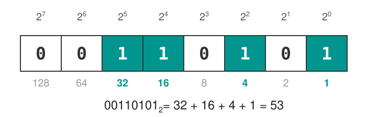
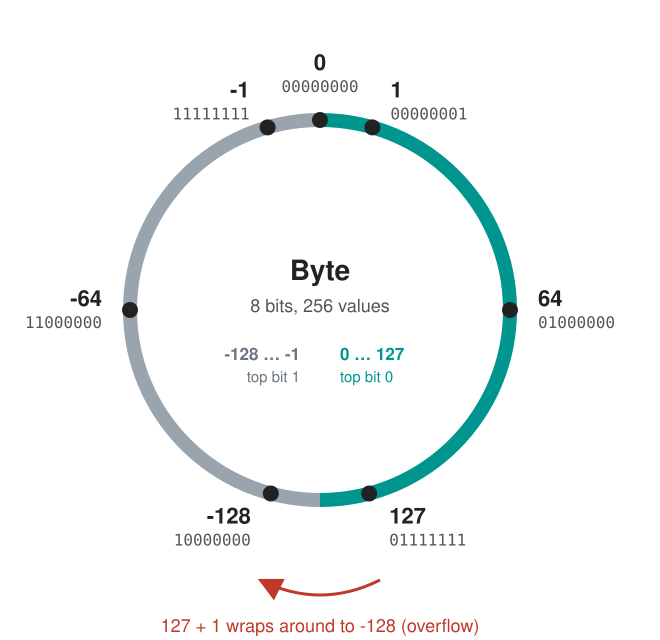
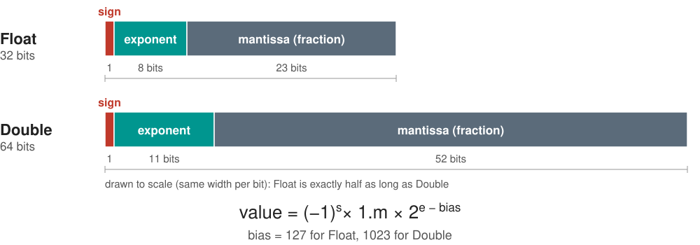
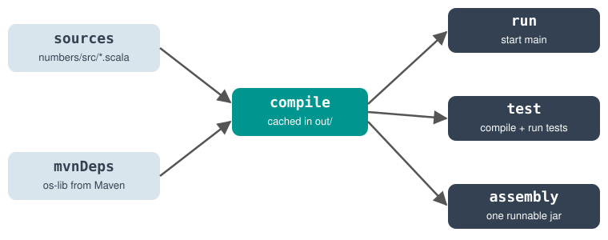

### Prof. Dr. Marko Boger, Prof. Dr. Pascal Laube
## Programmiertechnik I
# Lecture 05: Numbers, Binary and Data Types

---

<!-- _class: inhalt -->

# Goals

<div class="columns" style="grid-template-columns: 1fr 260px; align-items: start;">
<div markdown="1">

In this lecture you will learn about

- Scala's numeric data types: Int, Long, Float, Double, …
- how numbers are stored as bits: binary, hex, two's complement
- floating point numbers and their limits
- BigInt, BigDecimal, Char, Boolean and Range

Supporting literature:

- Learn Scala 3 the Fast Way, chapters 16-19, 51

New Tools:

- VS Code worksheets
- mill, a build tool for Scala

</div>
<div markdown="1">


</div>
</div>

---

<!-- _class: kapitel -->

## 1
# Numbers and Bits

Integer and floating-point representation

---

# Numeric Data Types

<style scoped>section { font-size: 24px; }</style>

<div class="columns" style="grid-template-columns: 1fr 1fr; align-items: start;">
<div markdown="1">

Scala comes with these built-in numeric types:

- `Byte`, `Short`, `Int`, `Long` (whole numbers)
- `Float`, `Double` (floating point numbers)

For extremely large numbers:

- `BigInt`, `BigDecimal`

</div>
<div markdown="1">

`Int` and `Double` are the defaults:

```scala
scala> val x = 42
val x: Int = 42

scala> val y = 42.0
val y: Double = 42.0
```

</div>
</div>

Scala infers `Int` for `42` and `Double` for `42.0`. Use the other types only when you need them.

<p class="small">Examples: Alvin Alexander, Learn Scala 3 the Fast Way, ch. 16 "Numeric Data Types".</p>

---

# Declaring Numeric Types

<style scoped>section { font-size: 23px; } pre { font-size: 19px; }</style>

<div class="columns" style="grid-template-columns: 1fr 1fr; align-items: start;">
<div markdown="1">

Declare the type explicitly:

```scala
scala> val a: Byte = 1
val a: Byte = 1

scala> val b: Long = 1
val b: Long = 1L

scala> val c: Short = 1
val c: Short = 1

scala> val d: Float = 1.0
val d: Float = 1.0F
```

</div>
<div markdown="1">

Underscores make big numbers readable:

```scala
scala> val g = 1_000
val g: Int = 1000

scala> val h = 1_000_000
val h: Int = 1000000

scala> val i = 1_000_000L
val i: Long = 1000000L

scala> val j = 1_234.56
val j: Double = 1234.56
```

</div>
</div>

The suffix `L` makes a `Long` literal, `F` (or `f`) a `Float` literal.

<p class="small">Examples: Alvin Alexander, Learn Scala 3 the Fast Way, ch. 16.</p>

---

# Mathematical Expressions

<style scoped>section { font-size: 23px; } pre { font-size: 19px; }</style>

<div class="columns" style="grid-template-columns: 1fr 1fr; align-items: start;">
<div markdown="1">

With `val`, each step gets a new name:

```scala
val a = 1
val b = a + 10   // 11
val c = b * 2    // 22
val d = c - 2    // 20
val e = d / 2    // 10
val f = e % 3    // 1 (modulus)
```

</div>
<div markdown="1">

With `var`, use `+=` and `-=` (Scala has no `++` or `--`):

```scala
var a = 1
a += 1           // 2
a -= 1           // 1

var x = 10.0     // a Double
x += 1.5         // 11.5
x -= 3.0         // 8.5
```

</div>
</div>

`+`, `-`, `*`, `/` and `%` look like operators, but they are methods of the numeric types.

<p class="small">Examples: Alvin Alexander, Learn Scala 3 the Fast Way, ch. 17 "Mathematical Expressions".</p>

---

# Everything is Bits

<style scoped>section { font-size: 24px; }</style>

In a positional number system, each digit is multiplied by a power of the base:

- decimal (base 10): 365 = 3·10² + 6·10¹ + 5·10⁰
- binary (base 2): 110101 = 1·2⁵ + 1·2⁴ + 0·2³ + 1·2² + 0·2¹ + 1·2⁰ = 53

A computer stores all numbers as **bits** (0 or 1). 8 bits make one **byte**.



<p class="small">Based on: Mark C. Lewis, Introduction to the Art of Programming Using Scala, ch. 3.4.</p>

---

# Decimal to Binary by Hand

<style scoped>
section { font-size: 19px; }
p { margin: 0.2em 0; }
table { font-size: 16px; margin: 0; }
th, td { padding: 1px 9px !important; }
.m { display: flex; align-items: flex-end; gap: 6px; }
.m img { height: 270px; }
</style>

<div class="columns" style="grid-template-columns: 1fr 1fr; align-items: start;">
<div>

<p><strong>Method 1: subtract powers of 2</strong><br>Does the power fit into the number? Then bit 1 and subtract.</p>

<div class="m">
<table>
<thead><tr><th>Number</th><th>Power of 2</th><th>Bit</th><th>Rest</th></tr></thead>
<tbody>
<tr><td>296</td><td>256 = 2⁸</td><td><b>1</b></td><td>40</td></tr>
<tr><td>40</td><td>128 = 2⁷</td><td><b>0</b></td><td>40</td></tr>
<tr><td>40</td><td>64 = 2⁶</td><td><b>0</b></td><td>40</td></tr>
<tr><td>40</td><td>32 = 2⁵</td><td><b>1</b></td><td>8</td></tr>
<tr><td>8</td><td>16 = 2⁴</td><td><b>0</b></td><td>8</td></tr>
<tr><td>8</td><td>8 = 2³</td><td><b>1</b></td><td>0</td></tr>
<tr><td>0</td><td>4 = 2²</td><td><b>0</b></td><td>0</td></tr>
<tr><td>0</td><td>2 = 2¹</td><td><b>0</b></td><td>0</td></tr>
<tr><td>0</td><td>1 = 2⁰</td><td><b>0</b></td><td>0</td></tr>
</tbody>
</table>

</div>

</div>
<div>

<p><strong>Method 2: divide by 2</strong><br>Divide by 2 and note the remainder, until the number is 0.</p>

<div class="m">
<table>
<thead><tr><th>Number</th><th>÷ 2</th><th>Remainder</th><th>Place value</th></tr></thead>
<tbody>
<tr><td>296</td><td>148</td><td><b>0</b></td><td>1 = 2⁰</td></tr>
<tr><td>148</td><td>74</td><td><b>0</b></td><td>2 = 2¹</td></tr>
<tr><td>74</td><td>37</td><td><b>0</b></td><td>4 = 2²</td></tr>
<tr><td>37</td><td>18</td><td><b>1</b></td><td>8 = 2³</td></tr>
<tr><td>18</td><td>9</td><td><b>0</b></td><td>16 = 2⁴</td></tr>
<tr><td>9</td><td>4</td><td><b>1</b></td><td>32 = 2⁵</td></tr>
<tr><td>4</td><td>2</td><td><b>0</b></td><td>64 = 2⁶</td></tr>
<tr><td>2</td><td>1</td><td><b>0</b></td><td>128 = 2⁷</td></tr>
<tr><td>1</td><td>0</td><td><b>1</b></td><td>256 = 2⁸</td></tr>
</tbody>
</table>

</div>

</div>
</div>

Both give 296 = **100101000**₂ = 256 + 32 + 8

---

# Binary in Scala

<style scoped>section { font-size: 24px; }</style>

```scala
scala> 53.toBinaryString
val res0: String = "110101"

scala> 296.toBinaryString
val res1: String = "100101000"

scala> Integer.parseInt("110101", 2)
val res2: Int = 53

scala> 0b110101
val res3: Int = 53
```

- `toBinaryString` turns an `Int` into a String of bits
- `Integer.parseInt(s, 2)` reads a String in base 2 (a Java method you can call from Scala)
- binary literals with `0b` (or `0B`) exist since Scala 3.5 (SIP-42)

---

# Hexadecimal and Octal

<style scoped>
section { font-size: 19px; }
p { margin: 0.25em 0; }
ul { margin: 0.2em 0; }
table { font-size: 16px; margin: 0.3em 0; }
th, td { padding: 2px 9px !important; }
pre { font-size: 16px; }
</style>

<div class="columns" style="grid-template-columns: 1.5fr 1fr; align-items: start;">
<div markdown="1">

Long bit strings are hard to read, so we group them:

- **hex** (base 16): 4 bits per digit, digits 0–9 and A=10, B=11, C=12, D=13, E=14, F=15
- **octal** (base 8): 3 bits per digit, digits 0–7

| Hex | Binary (4-bit groups) | Decimal | Octal |
|-----|-----------------------|--------:|------:|
| `CAFE` | 1100 1010 1111 1110 | 51966 | 145376 |
| `BEEF` | 1011 1110 1110 1111 | 48879 | 137357 |
| `7D3A` | 0111 1101 0011 1010 | 32058 | 76472 |

7D3A₁₆ = 7·16³ + 13·16² + 3·16 + 10 = 28672 + 3328 + 48 + 10 = 32058

Octal, 3-bit groups from the right: 111 110 100 111 010₂ = 76472₈

`0x` starts a hex literal. Scala 3 has **no** octal literals (a leading `0` does not mean octal), so use `Integer.parseInt(s, 8)`.

</div>
<div markdown="1">

```scala
scala> 0xCAFE
val res0: Int = 51966

scala> 0xBEEF
val res1: Int = 48879

scala> 0x7D3A
val res2: Int = 32058

scala> 51966.toHexString
val res3: String = "cafe"

scala> 32058.toOctalString
val res4: String = "76472"

scala> Integer.parseInt("76472", 8)
val res5: Int = 32058
```

</div>
</div>

---

# Integer Types and Their Ranges

<style scoped>
section { font-size: 19px; }
p { margin: 0.25em 0; }
ul { margin: 0.2em 0; }
table { font-size: 17px; margin: 0.2em 0; }
th, td { padding: 2px 10px !important; }
pre { font-size: 16px; }
.bits { font-family: ui-monospace, Menlo, Consolas, monospace; font-size: 18px; line-height: 1.6; background: #f6f8fa; border-radius: 6px; padding: 4px 12px; display: inline-block; }
.sb { color: #00968f; font-weight: 700; }
</style>

<div class="columns" style="grid-template-columns: 1.4fr 1fr; align-items: start;">
<div markdown="1">

| Type | Bits | Range |
|------|-----:|-------|
| `Byte` | 8 | −128 to 127 |
| `Short` | 16 | −32,768 to 32,767 |
| `Int` | 32 | −2³¹ to 2³¹−1 (about ±2.1 billion) |
| `Long` | 64 | −2⁶³ to 2⁶³−1 (about ±9.2·10¹⁸) |

All four are **signed two's complement** integers with n bits:

- the highest bit is the **sign bit**; it has the weight −2ⁿ⁻¹ (8 bits: −2⁷ = −128)
- the other n−1 bits have the usual positive weights; together they reach at most 2ⁿ⁻¹ − 1 (8 bits: 127)
- so the range is −2ⁿ⁻¹ to 2ⁿ⁻¹ − 1, e.g. `Byte` −128 to 127

Example in 8 bits (sign bit in teal):

<div class="bits">
+5 = <span class="sb">0</span>000 0101 = 4 + 1 = 5<br>
−5 = <span class="sb">1</span>111 1011 = −128 + 123 = −5
</div>

</div>
<div markdown="1">

```scala
scala> Byte.MinValue
val res0: Byte = -128

scala> Byte.MaxValue
val res1: Byte = 127

scala> Int.MinValue
val res2: Int = -2147483648

scala> Int.MaxValue
val res3: Int = 2147483647

scala> (-5 & 0xFF).toBinaryString
val res4: String = "11111011"
```

<p class="small">Table: Alvin Alexander, Learn Scala 3 the Fast Way, ch. 16 "Data type sizes".</p>

</div>
</div>

---

# Overflow

<style scoped>section { font-size: 22px; } pre { font-size: 18px; }</style>

<div class="columns" style="grid-template-columns: 1fr 1fr; align-items: start;">
<div markdown="1">

An `Int` has only 32 bits. If a result does not fit, it silently **wraps around**:

```scala
scala> 1500000000 + 1500000000
val res0: Int = -1294967296

scala> Int.MaxValue
val res1: Int = 2147483647

scala> Int.MaxValue + 1
val res2: Int = -2147483648
```

No error, no warning – just a wrong result!

</div>
<div markdown="1">

Use `Long` for larger numbers:

```scala
scala> 1500000000L + 1500000000L
val res3: Long = 3000000000L

scala> 5000000000
-- Error: ----------------------
1 |5000000000
  |^^^^^^^^^^
  |number too large

scala> 5000000000L
val res4: Long = 5000000000L
```

</div>
</div>

<p class="small">Example values: Mark C. Lewis, Introduction to the Art of Programming Using Scala, ch. 3.4.</p>

---

# Negative Numbers: Two's Complement

<style scoped>section { font-size: 22px; } pre { font-size: 18px; }</style>

Scala integers are **signed two's complement** numbers (see slide 10). How do we store −53? Rule: **flip all bits, then add 1**.

<div class="columns" style="grid-template-columns: 1fr 1fr; align-items: start;">
<div markdown="1">

```text
   53 = 0011 0101
 flip = 1100 1010
  + 1 = 1100 1011  = -53

   53 + (-53):
     0011 0101
   + 1100 1011
   -----------
   1 0000 0000   (9th bit is dropped)
```

</div>
<div markdown="1">

```scala
scala> (-53).toBinaryString
val res0: String =
  "11111111111111111111111111001011"

scala> (-53 & 0xFF).toBinaryString
val res1: String = "11001011"

scala> (-1).toBinaryString
val res2: String =
  "11111111111111111111111111111111"
```

</div>
</div>

The top bit is the sign: 0 = positive, 1 = negative. Addition works without special cases.

---

# Signed Two's Complement as a Circle

<style scoped>section { font-size: 22px; } pre { font-size: 18px; }</style>

<div class="columns" style="grid-template-columns: 1.1fr 1fr; align-items: center;">
<div markdown="1">



</div>
<div markdown="1">

Counting past the largest value continues at the smallest:

```scala
scala> (127 + 1).toByte
val res0: Byte = -128

scala> 300.toByte
val res1: Byte = 44
```

300 = 1 0010 1100₂. `toByte` keeps only the lower 8 bits: 0010 1100₂ = 44.

</div>
</div>

---

# Floating Point Numbers

<style scoped>section { font-size: 22px; } pre { font-size: 18px; }</style>

<div class="columns" style="grid-template-columns: 1fr 1fr; align-items: start;">
<div markdown="1">

- `Double`: 64 bits, about 15–16 significant digits (default)
- `Float`: 32 bits, about 7 significant digits, suffix `f`
- scientific notation: `1.5e4` = 1.5 · 10⁴

```scala
scala> 1.5e4
val res0: Double = 15000.0

scala> 3.0f
val res1: Float = 3.0F
```

</div>
<div markdown="1">

```scala
scala> val f = 1.0f / 3
val f: Float = 0.33333334F

scala> val d = 1.0 / 3
val d: Double = 0.3333333333333333

scala> Float.MaxValue
val res2: Float = 3.4028235E38F

scala> Double.MaxValue
val res3: Double = 1.7976931348623157E308
```

</div>
</div>

Huge range, but limited precision: most results are rounded.

---

# IEEE 754: How Float and Double are Stored

<style scoped>section { font-size: 21px; } pre { font-size: 17px; }</style>



Example: 5.75 = 101.11₂ = 1.0111₂ · 2² → s = 0, e = 2 + 127 = 129 = 10000001₂, m = 0111000…

```scala
scala> Integer.toBinaryString(java.lang.Float.floatToIntBits(5.75f))
val res0: String = "1000000101110000000000000000000"
```

(The leading sign bit 0 is not printed.)

---

# Precision Problems

<style scoped>section { font-size: 23px; } pre { font-size: 19px; }</style>

<div class="columns" style="grid-template-columns: 1fr 1fr; align-items: start;">
<div markdown="1">

```scala
scala> 0.1 + 0.2
val res0: Double = 0.30000000000000004

scala> 0.1 + 0.2 == 0.3
val res1: Boolean = false
```

</div>
<div markdown="1">

0.1 in binary is a never-ending fraction:
0.0001100110011…₂

It must be cut off after 52 bits, so a tiny error remains.

</div>
</div>

Consequences:

- never compare floating point numbers with `==`
- do **not** use `Double` for money – use `BigDecimal` (or count cents in a `Long`)

---

# BigInt

<style scoped>section { font-size: 21px; } pre { font-size: 16px; } p { margin: 0.3em 0; }</style>

<div class="columns" style="grid-template-columns: 1fr 1fr; align-items: start;">
<div markdown="1">

US national debt: **$40,260,641,972,390.03** – too big for an `Int`, but fits into a `Long`, even in cents:

```scala
scala> val debt = 40_260_641_972_390L
val debt: Long = 40260641972390L

scala> val debtInt: Int = 40_260_641_972_390
-- Error: ----------------------------------
1 |val debtInt: Int = 40_260_641_972_390
  |                   ^^^^^^^^^^^^^^^^^^
  |                   number too large

scala> val debtCents = 4_026_064_197_239_003L
val debtCents: Long = 4026064197239003L
```

</div>
<div markdown="1">

But a `Long` has its limit, too. Square the debt and it overflows; `BigInt` grows as large as needed:

```scala
scala> Long.MaxValue
val res0: Long = 9223372036854775807L

scala> Long.MaxValue + 1
val res1: Long = -9223372036854775808L

scala> debtCents * debtCents
val res2: Long = -4804024992199132327L

scala> BigInt(debtCents) * debtCents
val res3: BigInt =
  16209192920289737651608304434009
```

Use `BigInt` for whole numbers larger than `Long`. It is slower than `Int` and `Long`.

</div>
</div>

<p class="small">Source: US Treasury, Debt to the Penny, 1 Oct 2026. BigInt for numbers larger than Long: Alvin Alexander, Learn Scala 3 the Fast Way, ch. 16.</p>

---

# BigDecimal

<style scoped>section { font-size: 20px; } pre { font-size: 15px; margin: 0.3em 0; } p { margin: 0.3em 0; } ul { margin: 0.2em 0; }</style>

π has infinitely many decimal places, but a `Double` keeps only about 15–17 significant digits. A `BigDecimal` is also finite – but **you** choose how many digits:

```scala
scala> math.Pi
val res0: Double = 3.141592653589793

scala> val pi = BigDecimal("3.14159265358979323846264338327950288419716939937510")
val pi: BigDecimal = 3.14159265358979323846264338327950288419716939937510
```

<div class="columns" style="grid-template-columns: 1.35fr 1fr; align-items: start;">
<div markdown="1">

Division: 34 digits by default, more with a `MathContext`:

```scala
scala> 1.0 / 3
val res1: Double = 0.3333333333333333

scala> BigDecimal(1) / 3
val res2: BigDecimal = 0.3333333333333333333333333333333333

scala> import java.math.MathContext

scala> BigDecimal(1, MathContext(50)) / 3
val res3: BigDecimal =
  0.33333333333333333333333333333333333333333333333333
```

</div>
<div markdown="1">

Decimal digits are exact – good for money:

```scala
scala> BigDecimal("0.1") + BigDecimal("0.2")
val res4: BigDecimal = 0.3
```

- use `BigDecimal` for money, not `Double`
- create it from a **String** like `"0.1"`, so that no `Double` rounding gets in first

</div>
</div>

<p class="small">π: first 50 decimal places. BigDecimal for currency: Alvin Alexander, Learn Scala 3 the Fast Way, ch. 16.</p>

---

# Char: Characters are Numbers

<style scoped>
section { font-size: 19px; }
p { margin: 0.25em 0; }
ul { margin: 0.2em 0; }
pre { font-size: 16px; }
table { font-size: 15px; margin: 0.3em 0; }
th, td { padding: 1px 9px !important; }
</style>

<div class="columns" style="grid-template-columns: 1.25fr 1fr; align-items: start;">
<div markdown="1">

A `Char` is a 16-bit unsigned number (0 to 65,535) that stands for a Unicode character.

- `Char` literals use single quotes: `'A'`, `String` literals double quotes: `"A"`
- a `String` is a sequence of `Char` values

| Char | Code point | Decimal | Script / category |
|:----:|-----------|--------:|-------------------|
| A | U+0041 | 65 | Latin |
| ä | U+00E4 | 228 | Latin-1 (German umlaut) |
| π | U+03C0 | 960 | Greek |
| Ж | U+0416 | 1046 | Cyrillic |
| א | U+05D0 | 1488 | Hebrew |
| → | U+2192 | 8594 | Symbol (arrow) |
| € | U+20AC | 8364 | Currency |
| ♔ | U+2654 | 9812 | Chess (white king) |
| ♣ | U+2663 | 9827 | Card suit (clubs) |
| 中 | U+4E2D | 20013 | CJK (Chinese) |
| 😀 | U+1F600 | 128512 | Emoji – > 65,535: needs **two** Chars |

</div>
<div markdown="1">

```scala
scala> 'A'.toInt
val res0: Int = 65

scala> 97.toChar
val res1: Char = 'a'

scala> 'A' + 1
val res2: Int = 66

scala> ('A' + 1).toChar
val res3: Char = 'B'

scala> Char.MaxValue.toInt
val res4: Int = 65535

scala> Character.toChars(0x1F600).length
val res5: Int = 2
```

</div>
</div>

---

# Boolean

<style scoped>section { font-size: 24px; }</style>

<div class="columns" style="grid-template-columns: 1fr 1fr; align-items: start;">
<div markdown="1">

A `Boolean` has exactly two values: `true` and `false`.

- `&&` and, `||` or, `!` not
- comparisons `<`, `<=`, `>`, `>=`, `==`, `!=` return a `Boolean`

Booleans will control `if` and loops in the next lectures.

</div>
<div markdown="1">

```scala
scala> true && false
val res0: Boolean = false

scala> !true
val res1: Boolean = false

scala> 3 < 5
val res2: Boolean = true
```

</div>
</div>

---

# Numeric Conversions

<style scoped>section { font-size: 21px; } pre { font-size: 17px; }</style>

<div class="columns" style="grid-template-columns: 1fr 1fr; align-items: start;">
<div markdown="1">

**Widening** (no information lost) happens automatically:

```scala
scala> val big: Long = 42
val big: Long = 42L

scala> val dbl: Double = 42
val dbl: Double = 42.0
```

**Narrowing** must be explicit and may lose information:

```scala
scala> 3.99.toInt
val res0: Int = 3

scala> math.round(3.5)
val res1: Long = 4L
```

</div>
<div markdown="1">

Integer division cuts off the fraction:

```scala
scala> 7 / 2
val res2: Int = 3

scala> 7 / 2.0
val res3: Double = 3.5

scala> 7.toDouble / 2
val res4: Double = 3.5
```

From a String:

```scala
scala> "42".toInt
val res5: Int = 42
```

</div>
</div>

---

# Range

<style scoped>section { font-size: 22px; } pre { font-size: 17px; }</style>

<div class="columns" style="grid-template-columns: 1fr 1fr; align-items: start;">
<div markdown="1">

A `Range` is a sequence of evenly spaced numbers:

- `to`: end is included
- `until`: end is excluded
- `by`: step size

```scala
scala> 1 to 5
val res0: collection.immutable.Range.Inclusive =
  Range(1, 2, 3, 4, 5)

scala> 1 until 3
val res1: Range = Range(1, 2)

scala> 1 to 10 by 2
val res2: Range = Range(1, 3, 5, 7, 9)

scala> 10 to 1 by -3
val res3: Range = Range(10, 7, 4, 1)
```

</div>
<div markdown="1">

```scala
scala> val r = 1 to 10
val r: collection.immutable.Range.Inclusive =
  Range(1, 2, 3, 4, 5, 6, 7, 8, 9, 10)

scala> r.toList
val res4: List[Int] =
  List(1, 2, 3, 4, 5, 6, 7, 8, 9, 10)

scala> r.size
val res5: Int = 10

scala> r.min
val res6: Int = 1

scala> r.max
val res7: Int = 10

scala> r.sum
val res8: Int = 55
```

</div>
</div>

<p class="small">Examples: Alvin Alexander, Learn Scala 3 the Fast Way, chapter "Ranges".</p>

---

# More Ranges

<style scoped>section { font-size: 22px; } pre { font-size: 18px; }</style>

<div class="columns" style="grid-template-columns: 1fr 1fr; align-items: start;">
<div markdown="1">

Ranges also work with characters:

```scala
scala> ('a' to 'e').toList
val res0: List[Char] = List('a', 'b', 'c', 'd', 'e')

scala> ('a' until 'e').toList
val res1: List[Char] = List('a', 'b', 'c', 'd')

scala> ('a' to 'e' by 2).toList
val res2: List[Char] = List('a', 'c', 'e')
```

</div>
<div markdown="1">

A Range only stores start, end and step. It does not create all elements in memory:

```scala
scala> (1 to Int.MaxValue).size
val res3: Int = 2147483647

scala> (1 until 10 by 3).toList
val res4: List[Int] = List(1, 4, 7)
```

</div>
</div>

<p class="small">Examples: Alvin Alexander, Learn Scala 3 the Fast Way, chapter "Ranges".</p>

---

<!-- _class: tools -->

## New Tools
# Worksheets and Mill

From quick experiments to real projects – and editing code fast in VS Code

---

<!-- _class: tools-page -->

# From Worksheets to a Build Tool

<style scoped>section { font-size: 20px; } p { margin: 0.3em 0; } ul { margin: 0.2em 0; }</style>

<div class="columns" style="grid-template-columns: 0.8fr 1.3fr; align-items: start;">
<div markdown="1">

**Worksheets (so far)**

- a file `*.worksheet.sc` in VS Code
- Metals evaluates it on every save and shows each result next to its line
- great for small experiments – like the REPL, but you keep your code

</div>
<div markdown="1">

**Now our programs grow:** several files, libraries, tests. We need a **build tool**. It does the chores around your code:

- fetch libraries (**dependencies**)
- **compile**, **run** and **test** your code
- **package** it into a jar

Our first build tool is **Mill**:

- for Scala (also Java and Kotlin), simple to set up and fast
- **Mill was created by Li Haoyi** (also author of Ammonite, uPickle and the book *Hands-on Scala Programming*)
- first release 0.1.0 in February 2018; current stable version 1.1.10 (Sept 2026)

</div>
</div>

<p class="small">Sources: mill-build.org; github.com/com-lihaoyi/mill (releases); Li Haoyi, "Mill: Better Scala Builds", lihaoyi.com, 2018; Mill 0.1.0 announcement, users.scala-lang.org, 18 Feb 2018.</p>

---

<!-- _class: tools-page -->

# How Mill Works

<style scoped>section { font-size: 19px; } ul { margin: 0.2em 0; } li { margin: 0.1em 0; }</style>

<div class="columns" style="grid-template-columns: 1fr 1fr; align-items: center;">
<div markdown="1">



</div>
<div markdown="1">

- every step is a **task**: `compile`, `run`, `test`, `assembly`. Tasks use the results of other tasks, so they form a **graph**
- **caching**: a task runs again only if its inputs changed. A second `./mill numbers.compile` prints nothing – there is nothing to do
- **modules**: `object numbers` in the build file gives the tasks `numbers.compile`, `numbers.run`, …; sources live in `numbers/src/`
- **`out/`**: all results, e.g. `out/numbers/compile.dest/classes`. Safe to delete, do not commit it
- **`./mill`**: a small bootstrap script in the project. It downloads the right Mill version and a JVM; a background daemon keeps later commands fast

</div>
</div>

---

<!-- _class: tools-page -->

# Installing Mill

<style scoped>section { font-size: 19px; } pre { font-size: 14px; margin: 0.3em 0; } ul { margin: 0.2em 0; }</style>

One bootstrap script per project (Mac/Linux), here for the stable version 1.1.10:

```bash
curl -L https://repo1.maven.org/maven2/com/lihaoyi/mill-dist/1.1.10/mill-dist-1.1.10-mill.sh -o mill
chmod +x mill
./mill version
1.1.10
```

<div class="columns" style="grid-template-columns: 1fr 1fr; align-items: start;">
<div markdown="1">

- **Java:** no installation needed – on the first call Mill downloads its own JVM (Mill 1.1.10: Zulu JDK 21)
- keep `mill` in the project folder, so everyone uses the same version
- global install: `sudo curl -L <same URL> -o /usr/local/bin/mill`
- Homebrew, Coursier etc. are third-party and not officially supported

</div>
<div markdown="1">

**VS Code**

- install the **Metals** extension
- open the folder with the build file – Metals offers to import the Mill build
- or create the connection file yourself:

```bash
./mill --bsp-install
Creating BSP connection file: …/.bsp/mill-bsp.json
```

</div>
</div>

<p class="small">Source: mill-build.org/mill/cli/installation-ide.html (Installation &amp; IDE Setup).</p>

---

<!-- _class: tools-page -->

# Zero Configuration: Single-File Scripts

<style scoped>section { font-size: 19px; } pre { font-size: 14px; margin: 0.3em 0; } p { margin: 0.3em 0; }</style>

A single `.scala` file runs **without any build file**. Mill compiles and runs it:

<div class="columns" style="grid-template-columns: 1fr 1fr; align-items: start;">
<div markdown="1">

```scala
// Hello.scala
def main(name: String) =
  println(s"Hello, $name! 2^10 = ${1 << 10}")
```

```bash
./mill Hello.scala --name Marko
compiling 1 Scala source to out/Hello.scala/compile0.dest/classes ...
[warn] there was 1 deprecation warning; ...
done compiling
Hello, Marko! 2^10 = 1024

./mill Hello.scala --name Marko
Hello, Marko! 2^10 = 1024
```

The second run is cached. (The warning comes from code Mill generates around the script.)

</div>
<div markdown="1">

Libraries go into a `//|` header – still no build file:

```scala
// Files.scala
//| mvnDeps:
//| - com.lihaoyi::os-lib:0.11.5
def main() =
  val files = os.list(os.pwd).map(_.last)
  println(s"${files.size} entries: ${files.mkString(", ")}")
```

```bash
./mill Files.scala
compiling 1 Scala source to out/Files.scala/compile0.dest/classes ...
...
5 entries: Files.scala, Hello.scala, mill, out, out.txt
```

</div>
</div>

<p class="small">Mill 1.1.10, scripts use Scala 3.8.2 by default. Source: mill-build.org/mill/scalalib/intro.html (Single-File Scripts).</p>

---

<!-- _class: tools-page -->

# Projects: `build.mill.yaml` or `build.mill`

<style scoped>section { font-size: 18px; } pre { font-size: 13.5px; margin: 0.25em 0; } p { margin: 0.25em 0; }</style>

<div class="columns" style="grid-template-columns: 0.9fr 1.1fr; align-items: start;">
<div markdown="1">

A folder with `src/Main.scala` but **no** build file: Mill starts, but finds no sources:

```bash
./mill run
[error] finalMainClass No main class specified or found
```

**Minimal project:** two lines of YAML (`scalaVersion` is required):

```yaml
# build.mill.yaml – sources in src/
extends: ScalaModule
scalaVersion: 3.8.3
```

```bash
./mill run
compiling 1 Scala source to out/compile.dest/classes ...
done compiling
Hello from src/
```

</div>
<div markdown="1">

**Programmable:** `build.mill` is Scala code – module `numbers` with a library and a test module:

```scala
package build
import mill.*, scalalib.*

object numbers extends ScalaModule {
  def scalaVersion = "3.8.3"
  def mvnDeps = Seq(mvn"com.lihaoyi::os-lib:0.11.5")

  object test extends ScalaTests, TestModule.Munit {
    def mvnDeps = Seq(mvn"org.scalameta::munit:1.1.1")
  }
}
```

```text
build.mill
mill
numbers/src/Numbers.scala
numbers/test/src/NumbersTests.scala
```

</div>
</div>

<p class="small">Mill 1.1.10. Source: mill-build.org/mill/scalalib/intro.html (Declarative and Programmable Configuration).</p>

---

<!-- _class: tools-page -->

# Working with Mill

<style scoped>section { font-size: 17px; } pre { font-size: 13px; margin: 0.25em 0; } table { font-size: 14px; } th, td { padding: 1px 8px !important; } ul { margin: 0.2em 0; }</style>

<div class="columns" style="grid-template-columns: 1fr 1fr; align-items: start;">
<div markdown="1">

```bash
./mill numbers.run
51966 = 0xCAFE
Int.MaxValue + 1 = -2147483648
0.1 + 0.2 = 0.30000000000000004
written to /workspace/milltest/p3/numbers.txt

./mill numbers.test
Running Test Class NumbersTests
NumbersTests:
  + hex 0.012s
  + overflow 0.001s

./mill run
[error] Cannot resolve run. Try `mill resolve _`, `mill resolve
__.run` to see what's available, or `mill __.run` to run all `run` tasks
```

</div>
<div markdown="1">

| Command | Does |
|---|---|
| `./mill resolve _` | list modules and commands |
| `./mill numbers.compile` | compile (cached) |
| `./mill numbers.run` | run the main method |
| `./mill numbers.test` | run the tests |
| `./mill numbers.repl` | Scala REPL with your code |
| `./mill numbers.assembly` | jar: `out/numbers/assembly.dest/out.jar` |
| `./mill -w numbers.run` | watch: run again on every save |
| `./mill clean` | delete cached results |

**Good to know**

- name the module: `numbers.run` (only a `build.mill.yaml` root module runs with `./mill run`)
- each command is a separate call; the first one is slow (downloads), later ones are fast
- `os.pwd` in `run` is the project folder

</div>
</div>

<p class="small">Outputs: Mill 1.1.10, run on Linux; `-w` from the docs only. Source: mill-build.org/mill/scalalib/intro.html.</p>

---

<!-- _class: tools-page -->

# VS Code: Your Editor

<style scoped>section { font-size: 19px; } ul { margin: 0.2em 0; } li { margin: 0.1em 0; } table { font-size: 16px; } td code { font-family: "Helvetica Neue", Helvetica, Arial, sans-serif; font-size: 0.95em; }</style>

<div class="columns" style="grid-template-columns: 1fr 1.1fr; align-items: start;">
<div markdown="1">

**Why VS Code?**

- free, runs on macOS, Windows and Linux
- the **Metals** extension adds Scala support: errors while you type, completion, worksheets
- Metals imports Mill builds (`./mill --bsp-install`)
- built-in terminal for `./mill` commands
- the same editor for Scala, Markdown, Java, …

**Two keys to remember:** the Command Palette finds *every* command by name, Quick Open finds every file by name.

</div>
<div markdown="1">

| Action | macOS | Windows / Linux |
|---|---|---|
| Command Palette | `⇧⌘P` or `F1` | `Ctrl+Shift+P` or `F1` |
| Quick Open (go to file) | `⌘P` | `Ctrl+P` |
| Show terminal | `` ⌃` `` | `` Ctrl+` `` |
| Rename symbol (Metals) | `F2` | `F2` |
| Format document | `⇧⌥F` | `Shift+Alt+F` (Linux: `Ctrl+Shift+I`) |
| Toggle line comment | `⌘/` | `Ctrl+/` |
| Move line up / down | `⌥↑` / `⌥↓` | `Alt+↑` / `Alt+↓` |
| Copy line up / down | `⇧⌥↑` / `⇧⌥↓` | `Shift+Alt+↑` / `Shift+Alt+↓` |

`⌥` = Option, `⇧` = Shift, `⌘` = Command, `⌃` = Control

</div>
</div>

<p class="small">Sources: code.visualstudio.com/docs/editing/codebasics; Keyboard Shortcuts PDFs for macOS, Windows and Linux (code.visualstudio.com/shortcuts); docs/reference/default-keybindings. For Scala, Format Document uses scalafmt via Metals.</p>

---

<!-- _class: tools-page -->

# Multiple Cursors

<style scoped>section { font-size: 19px; } ul { margin: 0.2em 0; } li { margin: 0.1em 0; } pre { font-size: 15px; margin: 0.3em 0; } table { font-size: 16px; } p { margin: 0.3em 0; } td code { font-family: "Helvetica Neue", Helvetica, Arial, sans-serif; font-size: 0.95em; }</style>

<div class="columns" style="grid-template-columns: 1.15fr 1fr; align-items: start;">
<div markdown="1">

Several cursors type at the same time – every edit happens at every cursor.

| Action | macOS | Windows / Linux |
|---|---|---|
| Add a cursor by clicking | `⌥`+Click | `Alt`+Click |
| Add cursor above / below | `⌥⌘↑` / `⌥⌘↓` | `Ctrl+Alt+↑` / `↓` (Linux: `Shift+Alt+↑` / `↓`) |
| Select next occurrence | `⌘D` | `Ctrl+D` |
| Skip this occurrence | `⌘K ⌘D` | `Ctrl+K Ctrl+D` |
| Select all occurrences | `⇧⌘L` | `Ctrl+Shift+L` |
| Undo last cursor | `⌘U` | `Ctrl+U` |
| Back to one cursor | `Esc` | `Esc` |

</div>
<div markdown="1">

**Example:** rename `fuel` (three times)

```scala
var fuel = 250
fuel = fuel - 30
```

double-click the first `fuel`, press `⌘D` twice (`Ctrl+D`), type `tank`:

```scala
var tank = 250
tank = tank - 30
```

`⌘D` only matches **text**. To rename a variable everywhere it is *used*, `F2` (Rename Symbol with Metals) is safer.

</div>
</div>

<p class="small">Sources: code.visualstudio.com/docs/editing/codebasics ("Multiple selections"); Keyboard Shortcuts PDFs for macOS, Windows and Linux.</p>

---

<!-- _class: tools-page -->

# Editing Several Lines: Column Selection

<style scoped>section { font-size: 19px; } ul { margin: 0.2em 0; } li { margin: 0.1em 0; } pre { font-size: 15px; margin: 0.3em 0; } p { margin: 0.3em 0; } td code { font-family: "Helvetica Neue", Helvetica, Arial, sans-serif; font-size: 0.95em; }</style>

- **Column (box) selection:** hold `⇧⌥` (Windows/Linux `Shift+Alt`) and drag the mouse; keyboard on macOS `⇧⌥⌘` + arrows, on Windows `Ctrl+Shift+Alt` + arrows
- **Cursor at the end of each selected line:** select some lines, then `⇧⌥I` (`Shift+Alt+I`)

<div class="columns" style="grid-template-columns: 1fr 1fr; align-items: start;">
<div markdown="1">

**1. `val` → `var` in three lines**

```scala
val height = 500
val speed  = 50
val fuel   = 250
```

box-select the three `val` (`⇧⌥`+drag), type `var`:

```scala
var height = 500
var speed  = 50
var fuel   = 250
```

</div>
<div markdown="1">

**2. A column of numbers → a `List`**

```scala
51966
0xCAFE
0x7D3A
```

select the three lines, `⇧⌥I`, type `,` then `Esc`; add `List(` above and `)` below:

```scala
List(
51966,
0xCAFE,
0x7D3A,
)  // trailing comma is fine before a new line
```

</div>
</div>

<p class="small">Sources: code.visualstudio.com/docs/editing/codebasics ("Column (box) selection"); Keyboard Shortcuts PDFs. There is no default keyboard shortcut for column selection on Linux.</p>

---

<!-- _class: tools-page -->

# Find and Replace in a File

<style scoped>section { font-size: 19px; } ul { margin: 0.2em 0; } li { margin: 0.1em 0; } pre { font-size: 15px; margin: 0.3em 0; } table { font-size: 16px; } p { margin: 0.3em 0; } td code { font-family: "Helvetica Neue", Helvetica, Arial, sans-serif; font-size: 0.95em; }</style>

<div class="columns" style="grid-template-columns: 1.1fr 1fr; align-items: start;">
<div markdown="1">

| Action | macOS | Windows / Linux |
|---|---|---|
| Find | `⌘F` | `Ctrl+F` |
| Replace | `⌥⌘F` | `Ctrl+H` |
| Next / previous match | `Enter` / `⇧Enter` | `Enter` / `Shift+Enter` |
| Match case `Aa` | `⌥⌘C` | `Alt+C` |
| Whole word `ab` | `⌥⌘W` | `Alt+W` |
| Regular expression `.*` | `⌥⌘R` | `Alt+R` |
| Find in selection | `⌥⌘L` | `Alt+L` |
| All matches → cursors | `⌥Enter` | `Alt+Enter` |

**Preserve case** (button `AB` in the Replace box): replacing `fuel` with `tank` turns `Fuel` into `Tank` and `FUEL` into `TANK`.

</div>
<div markdown="1">

**Regex replace with groups**

Find (`.*` on): `val (\w+) = `
Replace: `var $1 = `

```scala
val height = 500     // before
var height = 500     // after
```

`$1` is the text of the first group `(\w+)`.

Case modifiers in the replacement: `\u` / `\l` change the next letter, `\U` / `\L` the whole group – e.g. `\U$1` turns `height` into `HEIGHT`.

</div>
</div>

<p class="small">Sources: code.visualstudio.com/docs/editing/codebasics ("Find and replace", "Case changing in regex replace"); docs/reference/default-keybindings; Keyboard Shortcuts PDFs.</p>

---

<!-- _class: tools-page -->

# Search and Replace in the Whole Project

<style scoped>section { font-size: 19px; } ul { margin: 0.2em 0; } li { margin: 0.12em 0; } table { font-size: 16px; } p { margin: 0.3em 0; } td code { font-family: "Helvetica Neue", Helvetica, Arial, sans-serif; font-size: 0.95em; }</style>

<div class="columns" style="grid-template-columns: 1fr 1fr; align-items: start;">
<div markdown="1">

| Action | macOS | Windows / Linux |
|---|---|---|
| Search in all files | `⇧⌘F` | `Ctrl+Shift+F` |
| Replace in all files | `⇧⌘H` | `Ctrl+Shift+H` |
| Files to include / exclude | `⇧⌘J` | `Ctrl+Shift+J` |

- searches every file in the **opened folder** – so open the project folder, not single files
- results are grouped by file; click a hit to jump there
- the same toggles as in a file: `Aa`, `ab`, `.*` (regex)

</div>
<div markdown="1">

**Replacing across files**

- type the new text in the Replace box: VS Code shows a **diff preview** of every change
- replace **one** hit, **all in one file**, or **all** files
- **files to include**, e.g. `*.scala`; **files to exclude**, e.g. `out/` (Mill's build results)
- the toggle "Use Exclude Settings and Ignore Files" skips files listed in `.gitignore`
- not sure? **Undo** (`⌘Z` / `Ctrl+Z`) or compare with Git before you commit

</div>
</div>

<p class="small">Sources: code.visualstudio.com/docs/editing/codebasics ("Search across files", "Search and replace", "Advanced search options"); Keyboard Shortcuts PDFs.</p>

---

<!-- _class: tools-page -->

# VS Code Cheat Sheet

<style scoped>section { font-size: 18px; } table { font-size: 17px; } th, td { padding: 2px 10px !important; } td code { font-family: "Helvetica Neue", Helvetica, Arial, sans-serif; font-size: 0.95em; }</style>

<div class="columns" style="grid-template-columns: 1fr 1fr; align-items: start;">
<div markdown="1">

| Action | macOS | Windows / Linux |
|---|---|---|
| Command Palette | `⇧⌘P` | `Ctrl+Shift+P` |
| Quick Open | `⌘P` | `Ctrl+P` |
| Terminal | `` ⌃` `` | `` Ctrl+` `` |
| Rename symbol | `F2` | `F2` |
| Format document | `⇧⌥F` | `Shift+Alt+F` ¹ |
| Toggle comment | `⌘/` | `Ctrl+/` |
| Move line | `⌥↑` `⌥↓` | `Alt+↑` `Alt+↓` |
| Copy line | `⇧⌥↑` `⇧⌥↓` | `Shift+Alt+↑` `↓` |
| Select line | `⌘L` | `Ctrl+L` |

</div>
<div markdown="1">

| Action | macOS | Windows / Linux |
|---|---|---|
| Cursor by click | `⌥`+Click | `Alt`+Click |
| Cursor above / below | `⌥⌘↑` `⌥⌘↓` | `Ctrl+Alt+↑` `↓` ² |
| Next occurrence | `⌘D` | `Ctrl+D` |
| All occurrences | `⇧⌘L` | `Ctrl+Shift+L` |
| Cursor at line ends | `⇧⌥I` | `Shift+Alt+I` |
| Box selection | `⇧⌥`+drag | `Shift+Alt`+drag |
| Find / Replace | `⌘F` / `⌥⌘F` | `Ctrl+F` / `Ctrl+H` |
| Search all files | `⇧⌘F` | `Ctrl+Shift+F` |
| Replace in files | `⇧⌘H` | `Ctrl+Shift+H` |

</div>
</div>

¹ Linux: `Ctrl+Shift+I`  ² Linux: `Shift+Alt+↑` / `↓`. All shortcuts can be changed: Keyboard Shortcuts `⌘K ⌘S` / `Ctrl+K Ctrl+S`.

<p class="small">Sources: Keyboard Shortcuts PDFs for macOS, Windows and Linux (code.visualstudio.com/shortcuts); code.visualstudio.com/docs/editing/codebasics; docs/reference/default-keybindings (checked 4 Oct 2026).</p>

---

<!-- _class: inhalt -->

# Summary

<style scoped>section { font-size: 23px; }</style>

- `Int` and `Double` are the default number types; also `Byte`, `Short`, `Long`, `Float`
- numbers are stored as bits; hex groups 4 bits per digit
- negative integers use two's complement: flip the bits and add 1
- integers overflow silently: `Int.MaxValue + 1` is negative
- floating point numbers are rounded: `0.1 + 0.2 != 0.3`
- `BigInt` and `BigDecimal` for very large numbers and money
- `Char` is a 16-bit number, `Boolean` is `true` or `false`
- `Range`: `1 to 10`, `1 until 10`, `1 to 10 by 2`
- Mill: `./mill Foo.scala` runs a script, `build.mill` describes a project

---

<!-- _class: aufgabe -->

# Tasks

In CodeTask:

- complete chapters 16-19 and 51

Install the Metals extension in VS Code and try the examples of this lecture in a worksheet

---

<!-- _class: aufgabe -->

# Tasks: Numbers by Hand

<style scoped>section { font-size: 22px; }</style>

On paper, no computer – this is not a CodeTask exercise:

- convert 77 and 200 to binary and to hex
- write −77 as an 8-bit two's complement number
- predict the results of `Int.MaxValue + 1`, `0.1 + 0.2`, `200.toByte` and `(1 to 20 by 4).toList`

Then check your answers in a worksheet.

---

<!-- _class: aufgabe -->

# Tasks: Install and Work with Mill

<style scoped>section { font-size: 18px; } li { margin: 0.05em 0; }</style>

1. Install Mill 1.1.10 with the bootstrap script (`curl … -o mill`, `chmod +x mill`, `./mill version`) and the Metals extension in VS Code
2. Write a script `Numbers.scala` with a `def main()` and run it with `./mill Numbers.scala`
3. Do the number examples twice – in a worksheet `numbers.worksheet.sc` **and** in your Mill script: `51966.toBinaryString` and `.toHexString`, `Int.MaxValue + 1`, `0.1 + 0.2`, the factorial of 25 as `BigInt`, `(1 to 20 by 4).toList`. Do both give the same results?
4. Turn the script into a project: a module `numbers` in `build.mill`, then `./mill numbers.run` (or a two-line `build.mill.yaml` with sources in `src/`, then `./mill run`)
5. Optional: add a munit test in `numbers/test/src/` and run `./mill numbers.test`

---

<!-- _class: abschluss -->

# Questions?

## Thank you!

marko.boger@htwg-konstanz.de
