### Prof. Dr. Marko Boger, Prof. Dr. Pascal Laube
## Programmiertechnik I
# Lecture 06: Arrays and Lists

<p class="small">Migrated from the Google Slides deck "PR-06-Arrays and Lists".</p>

---

<!-- _class: inhalt -->

# Goals

<style scoped>section { font-size: 21px; } p { margin: 0.25em 0; } ul { margin: 0.15em 0; }</style>

<div class="columns" style="grid-template-columns: 1fr 260px; align-items: start;">
<div markdown="1">

In this lecture you will learn about

- the fundamental data structures Array and List
- mutability and immutability
- value types and reference types

Supporting literature:

- Learn Scala 3 the Fast Way, chapter 21-22

New Tools:

- scalafmt, the Scala formatting tool
- GitHub Copilot, an AI assistant for coding

</div>
<div markdown="1">


</div>
</div>

---

# Data Structures

<style scoped>section { font-size: 22px; } ul { columns: 3; margin: 0.2rem 0; }</style>

Data structures are fundamental building blocks in programming that store and organize data. Examples are

- Arrays,
- Lists,
- Stacks,
- Queues,
- Sets,
- Maps,
- Trees and
- Graphs.

These have different advantages and disadvantages. We choose a data structure to optimize performance for specific tasks.
There is an entire lecture on “Data Structures and Algorithms” in Semester 3.
Here we will look at Arrays and Lists.

---

# Array

An Array is a linear data structure that stores a collection of elements, all of the same type, in a contiguous block of memory. Each element in an array is accessed using an index, which represents its position in the sequence, typically starting at 0.

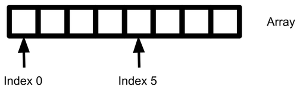

---

# Arrays for one Type of Data

It is import to note that each of the data elements in the Array has the same data type. For example, here is an Array of Character:

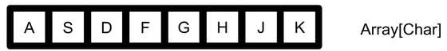

And here is an Array of Integers:

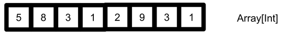

In Scala, the type of this Array is written as Array[Char] and Array[Int]. More generically, we can speak of an Array[T], where T is the Type of the data contained in the Array.

---

# Arrays are Static

<style scoped>section { font-size: 23px; } p, ul { margin: 0.3rem 0; }</style>

Arrays have a fixed size. That is, when an Array is created, a section of memory is allocated and reserved for this Array.

- If we do not use all of the fields of the array, the memory is blocked anyways and we might be wasting space.
- If we want to use more space than we originally allocated, the whole Array needs to be moved to a freshly created larger place in memory. It is possible, but expensive.

This property of Arrays is referred to as static.


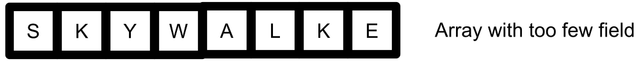

---

# Creating an Array

<div class="columns" style="grid-template-columns: 1fr 1.2fr; align-items: start;">
<div markdown="1">

First we need a field to store the array. Then the array is created with the type of its content and its size.
Fields can be accessed by their index.
The length of the array depends on the allocated space, not the space used, so here, length is 5.

</div>
<div markdown="1">

```scala
val robots = new Array[String](5)
robots(0) = "R2D2"
robots(1) = "C3PO"
robots(2) = "Optimus"
robots(3) = "Bumblebee"
robots(4) = "Figure1"

robots.length // : Int = 5
robots(0) // : String = "R2D2"
robots(1) // : String = "C3PO"
```

</div>
</div>

---

# Iterating over Arrays

To access the fields of an Array we can iterate over the index of an Array. Usually, this is done in a for-loop with a counting variable, usually i for index.

```scala
for (i <- 0 until robots.length) {
 println(robots(i))
}
```

In Scala, this can simply be written like this:

```scala
for (robot <- robots) {
 println(robot)
}
```

---

# Arrays are mutable

The fields of an Array can be modified.

```scala
val robots = new Array[String](5)
robots(0) = "R2D2"
robots(0) // : String = "R2D2"

robots(0) = "HAL"
robots(0) // : String = "HAL"
```

 This is the case even if the Array itself is declared as immutable (val).

---

# Lists

A List is also a linear data structure that stores a collection of elements, all of the same type. But in contrast to Arrays, it does not use a contiguous block of memory. Instead, Lists have a data field and a reference to the next List element.

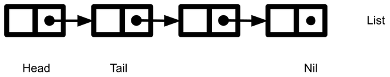

---

# Example of Lists

Here is a List of Characters

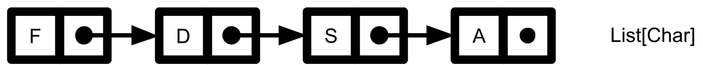

And a List of Integers

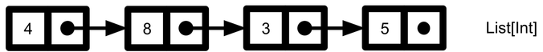

---

# Adding Elements to a List

The easiest way to add an element to a list is at its head.

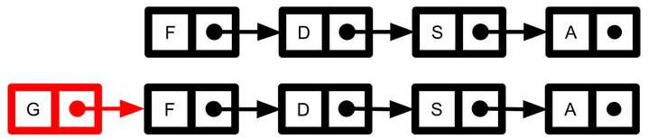

But we can also add elements anywhere in the structure.

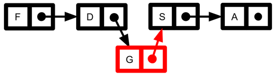

---

# Removing Elements from a List

<style scoped>section { font-size: 22px; } p { margin: 0.2rem 0; }</style>

Elements can be removed by redirecting the reference.

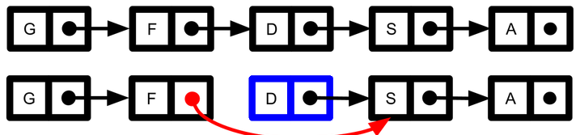

The memory management keeps track of references, so called reference counting. If no references point to a field, it can be deleted, this is called Garbage Collection.


In some languages like Scala and Java, Garbage Collection is automatic.

---

# Creating Lists

The fields of an Arrays can be empty. Lists, though, can not contain empty fields. They always need to be initialized.

```scala
val numbers: List[Int] = List(1, 2, 3, 4, 5)
val nums = List(1, 2, 3, 4, 5)
val robots = List("R2D2", "C3PO", "Optimus")
```

The empty list is represented by the object Nil.

```scala
val emptyList: List[Int] = List()
val empty = Nil
emptyList == empty // : Boolean = true
```

---

# Adding to List

<style scoped>section { font-size: 23px; } p { margin: 0.25rem 0; } pre { margin: 0.25rem 0; }</style>

Adding a new element to the list is fast and easy at the head.
But adding it to the end of the list is slow, the whole list needs to be traversed. But it is possible.

```scala
val nums = List(1, 2, 3 ) // List(1, 2, 3)
val prependedList = 0 +: nums // List(0, 1, 2, 3)
val appendedList = nums :+ 4 // List(1, 2, 3, 4)
```

Prepending is usually written as :: instead of +:

```scala
val prependedList2 = 0 :: nums // List(0, 1, 2, 3)
```

This notation can also be used to create a List

```scala
val prependedList3 = 0 :: 1 :: 2 :: 3 :: Nil
```

---

# Immutability

In Scala, Lists are immutable. That is, all operations do not change the fields or the structure of the list itself, but always construct a new data structure: A copy.

---

# Value Types and Reference Types

<style scoped>section { font-size: 22px; } p { margin: 0.2rem 0; }</style>

In the graphical List examples we saw so far, we showed the values of the fields in the box, indicating that the value of this data is actually stored there. This is only efficient for data types that are short, like Int, Double, Boolean or Char.

For data types with larger data, like Strings, Lists, objects or instances of classes, this is actually done by a reference.

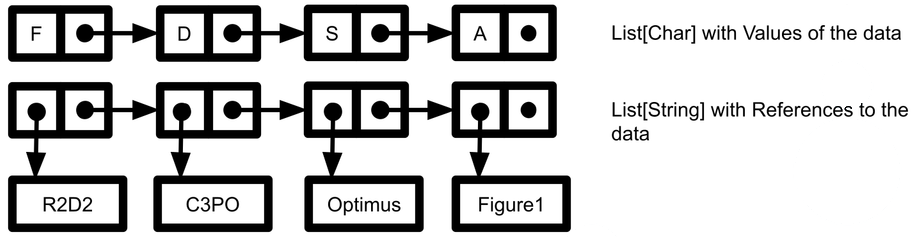

---

<!-- _footer: "" -->

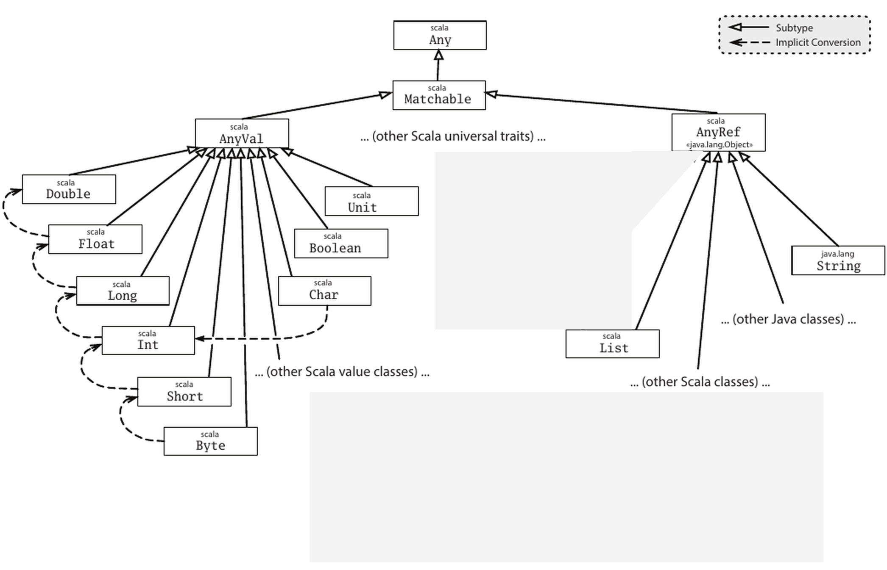

---

# Copies of Referenced Types

Operations on a List do not change the List, they produce a new List. The References to the data are copied. This works well, if all data types are immutable

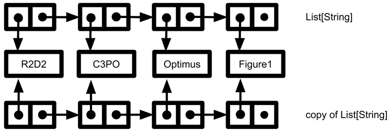

---

# Filter on a List

Many operations on Lists return a new List. Here is an example for a filter on a List. We call this a shallow copy. For immutable data structure, shallow copies work very fast and efficient.

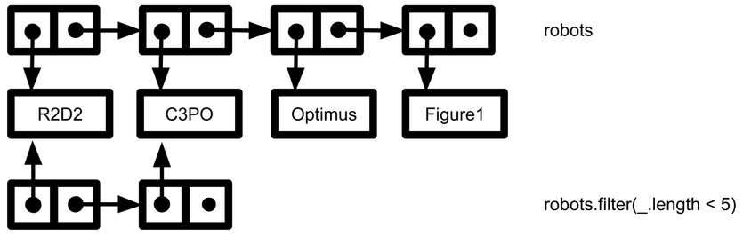

---

# Three Paradigms compared

<div class="columns" style="grid-template-columns: 1fr 1fr 1fr; align-items: start;">
<div markdown="1">

**Procedural**

- Array is typical
- global data

- mutable data
- for-loops

</div>
<div markdown="1">

**Object-oriented**

- Array and List
- data encapsulated

- mutable data
- for-loops

</div>
<div markdown="1">

**Functional**

- List is typical
- data is passed as parameter
- immutable data
- recursion preferred
- avoid side-effects

</div>
</div>

---

<!-- _class: tools -->

## New Tools
# Scalafmt (FMT)

Automatic, consistent code formatting for Scala

---

<!-- _class: tools-page -->

<!-- Scalafmt block (self-contained, movable) -->
<style scoped>
h3 { margin: 0.2rem 0 0.4rem 0; }
</style>

# Scalafmt: Consistent Code Formatting

<div class="columns" style="align-items: start; gap: 2em;">
<div>

### What is it?
- Code formatter for **Scala 2 and Scala 3**
- Open source, part of the **scalameta** project: scalameta.org/scalafmt
- Reformats whole files, driven by one config file **`.scalafmt.conf`** in the project root
- The same result in the IDE, on the command line and in CI

</div>
<div>

### Why does a team need it?
- **Readable diffs:** commits show real changes, not moved spaces and braces
- **No style debates** in code reviews: the formatter decides
- **Fewer merge conflicts** from different editor settings
- **CI check:** the build fails if code is not formatted

</div>
</div>

---

<!-- _class: tools-page -->

<style scoped>
section { padding-top: 30px; }
h1 { margin-bottom: 0.3rem; }
pre { font-size: 19px; line-height: 1.4; margin: 0; }
table { font-size: 16px; width: 100%; }
th, td { padding: 4px 7px; }
td code { font-size: 14.5px; }
.src { position: absolute; left: 80px; bottom: 58px; font-size: 13px; color: #8a94a0; }
</style>

# Scalafmt Configuration: `.scalafmt.conf`

<div class="columns" style="grid-template-columns: 440px minmax(0, 1fr); align-items: start; gap: 1em;">
<div>

```properties
version = "3.11.5"
runner.dialect = scala3
maxColumn = 80
align.preset = more
indent.main = 2
rewrite.rules = [RedundantBraces, SortModifiers]
rewrite.scala3.convertToNewSyntax = true
rewrite.scala3.optionalBraces.enabled = true
```

</div>
<div>

| Setting | Meaning |
|---|---|
| `version` | scalafmt version (required) |
| `runner.dialect` | Scala dialect (required) |
| `maxColumn` | max. line length (default 80) |
| `align.preset` | alignment: `none`, `some` (default), `more`, `most` |
| `indent.main` | indentation (default 2) |
| `RedundantBraces` | removes unnecessary `{ }` |
| `SortModifiers` | fixed modifier order |
| `convertToNewSyntax` | `if (…)` → `if … then`, `for … do` |
| `optionalBraces` | indentation, no braces (was `removeOptionalBraces`) |

</div>
</div>

<div class="src">Latest release v3.11.5 (July 2026), github.com/scalameta/scalafmt · docs: scalameta.org/scalafmt/docs/configuration.html</div>

---

<!-- _class: tools-page -->

<style scoped>
section { padding-top: 30px; }
h1 { margin-bottom: 0.3rem; }
h3 { margin: 0.3rem 0 0.3rem 0; font-size: 23px; }
pre { font-size: 18px; margin: 0.1rem 0 0.4rem 0; }
table { font-size: 18px; }
th, td { padding: 4px 10px; }
td code { font-size: 17px; }
ul { margin: 0; } li { margin: 0.15rem 0; }
</style>

# Running Scalafmt

<div class="columns" style="grid-template-columns: 1.1fr 1fr; align-items: start; gap: 1.4em;">
<div>

### Command line (scala-cli or `scalafmt`)
```zsh
% scala-cli fmt .           # format
% scala-cli fmt --check .   # CI check
```

Or install the standalone tool with Coursier:
```zsh
% cs install scalafmt
% scalafmt                  # format
% scalafmt --test           # check only
```

</div>
<div>

### IDE
- **VS Code / Cursor with Metals:** uses `.scalafmt.conf`
- run *Format Document* or set `"editor.formatOnSave": true`

</div>
</div>

---

<!-- _class: tools-page -->

<style scoped>
section { padding-top: 30px; }
h1 { margin-bottom: 0.3rem; }
h3 { margin: 0 0 0.25rem 0; font-size: 22px; }
pre { font-size: 15.5px; line-height: 1.4; margin: 0; }
.note { font-size: 17px; color: #575e75; margin-top: 0.6rem; }
</style>

# Scalafmt: Before and After

<div class="columns" style="align-items: start; gap: 1.2em;">
<div>

### Before
```scala
object Shop {
  case class Item(name:String,price:Double,qty:Int)
  def total(items:List[Item]):Double = {
    items.map(i=>i.price*i.qty).sum
  }
  def label(item:Item):String = {
    if (item.qty>10) { "bulk" } else { "single" }
  }
  def main(args:Array[String]):Unit = {
    val cart=List(Item("tea",4.5,12),Item("jam",3,1))
    for (i <- cart) { println(s"${i.name}: ${label(i)}") }
    println(total(cart))
  }
}
```

</div>
<div>

### After `scalafmt Shop.scala`
```scala
object Shop:
  case class Item(name: String, price: Double, qty: Int)
  def total(items: List[Item]): Double =
    items.map(i => i.price * i.qty).sum
  def label(item: Item): String =
    if item.qty > 10 then "bulk" else "single"
  def main(args: Array[String]): Unit =
    val cart = List(Item("tea", 4.5, 12), Item("jam", 3, 1))
    for i <- cart do println(s"${i.name}: ${label(i)}")
    println(total(cart))
```

</div>
</div>

<div class="note">Real output of scalafmt 3.11.5 with the <code>.scalafmt.conf</code> shown before: spaces added, braces removed, <code>if … then</code> and <code>for … do</code>. A second run changes nothing (<code>scalafmt --test</code>: “All files are formatted”).</div>

---

<!-- _class: tools -->

## New Tools
# GitHub Copilot

An AI assistant for coding in VS Code

---

<!-- _class: tools-page -->

# GitHub Copilot: an AI Assistant for Coding

<style scoped>section { font-size: 20px; } p { margin: 0.3em 0; } ul, ol { margin: 0.2em 0; } li { margin: 0.1em 0; }</style>

<div class="columns" style="grid-template-columns: 1fr 1fr; align-items: start;">
<div markdown="1">

**What does it do?**

- **inline suggestions**: while you type, Copilot proposes the rest of the line or a whole function as grey *ghost text* – **Tab** accepts, **Esc** rejects
- **Copilot Chat**: ask questions about your code, let it explain code or an error message, suggest a fix or write tests
- built into VS Code; it uses large language models that run on GitHub's servers – your code is sent there

**Set up in VS Code**

- click the Copilot icon in the Status Bar → **Use AI Features** → sign in with your GitHub account
- if you have no plan yet, you get **Copilot Free** (limited: e.g. 2,000 completions per month)

</div>
<div markdown="1">

**Free for students: Copilot Student**

1. apply for **GitHub Education** at github.com/settings/education/benefits – with proof of enrollment, e.g. your HTWG e-mail address or student ID
2. after approval, activate **Copilot Student** there (can take a few days)
3. sign in to VS Code with the same GitHub account

- free for verified students, with a monthly allowance of AI credits; the model is chosen automatically
- GitHub rechecks your eligibility every month

</div>
</div>

<p class="small">Sources: docs.github.com/en/copilot – "Plans for GitHub Copilot", "Access GitHub Copilot for free as a student"; docs.github.com/en/education – "Apply to GitHub Education as a student"; code.visualstudio.com/docs/copilot/setup (as of Oct 2026).</p>

---

<!-- _class: tools-page -->

# Using Copilot Wisely

<style scoped>section { font-size: 20px; } p { margin: 0.3em 0; } ul { margin: 0.2em 0; } li { margin: 0.15em 0; } pre { font-size: 15px; margin: 0.3em 0; } .ghost { color: #8a8a8a; font-style: italic; }</style>

<div class="columns" style="grid-template-columns: 1fr 1fr; align-items: start;">
<div markdown="1">

**Example** (illustrative, not a recorded Copilot session): you type the comment and the first line, Copilot suggests the grey part

<pre><code>// the longest robot name in the array
def longestName(robots: Array[String]): String =
<span class="ghost">  robots.maxBy(_.length)</span></code></pre>

Looks good – and works:

```scala
longestName(Array("R2D2", "C3PO", "Optimus"))  // "Optimus"
longestName(Array.empty[String])
// UnsupportedOperationException: empty.maxBy
```

The suggestion ignores the **empty Array**. Did you think of it?

</div>
<div markdown="1">

**Rules of thumb**

- Copilot produces *plausible* code, not *checked* code: it can be wrong, incomplete or insecure – **read and test** every suggestion, especially edge cases
- only accept code you **understand** and could explain – you are responsible for it
- you learn programming by writing code yourself: solve the CodeTask exercises on your own first; AI features can be switched off in VS Code
- **exams and graded work**: use AI tools only where the rules explicitly allow it
- suggestions can match public code – mind licenses

</div>
</div>

<p class="small">Sources: docs.github.com/en/copilot/responsible-use/inline-suggestions; code.visualstudio.com/docs/copilot/setup. Example outputs: Scala 3 on Linux.</p>

---

<!-- _class: inhalt -->

# Summary

<style scoped>section { font-size: 22px; } li { margin: 0.1em 0; }</style>

- Arrays have a fixed size and a contiguous block of memory; index starts at 0
- Arrays are mutable – even when declared with `val`
- Lists are linked nodes (head, tail, `Nil`), immutable and never have empty fields
- prepending is fast (`0 :: nums`), appending is slow (`nums :+ 4`)
- List operations like `filter` return a new List (a shallow copy)
- value types (`Int`, `Char`, …) vs. reference types (`String`, `List`, …)
- scalafmt formats your code with the rules in `.scalafmt.conf`
- GitHub Copilot suggests code – read, understand and test it

---

<!-- _class: aufgabe -->

# Tasks

In CodeTask:

- complete chapters 21-23

Configure fmt

Sign up for Co-Pilot and add the plugin to VS Code

---

<!-- _class: abschluss -->

# Questions?

## Thank you!

marko.boger@htwg-konstanz.de
