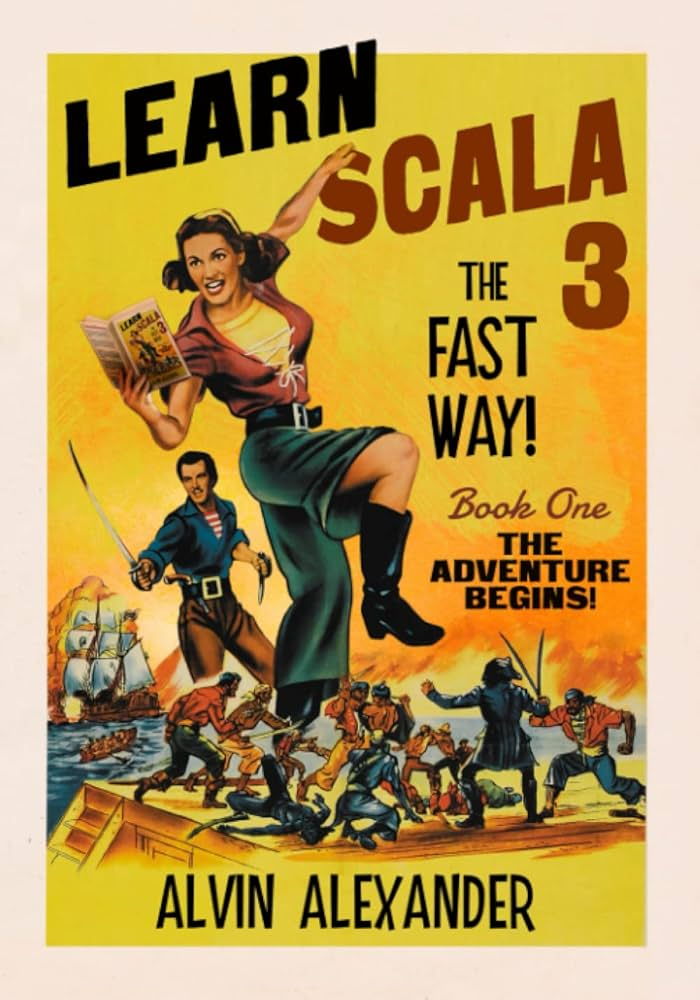
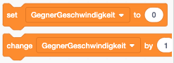
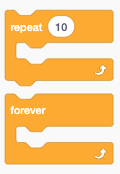
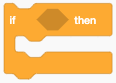

### Prof. Dr. Marko Boger, Prof. Dr. Pascal Laube
## Programmiertechnik I
# Lecture 07: Control Structures

<p class="small">Migrated from the Google Slides deck "PR-07-Control Structures".</p>

---

# Goals

<div class="columns" style="grid-template-columns: 1fr 260px; align-items: start;">
<div markdown="1">

In this lecture you will learn about

- Statements and Expressions
- Conditionals
- Iterations

Supporting literature:

- Learn Scala 3 the Fast Way,chapters

New Tools:

</div>
<div markdown="1">



</div>
</div>

---

# The fundamental building blocks of programming languages

<style scoped>
.blocks { display: grid; grid-template-columns: auto auto auto; gap: 0.4rem 1.6rem; align-items: start; justify-content: end; }
.blocks div { text-align: center; font-size: 20px; }
.blocks img { display: block; margin: 0.4rem auto 0 auto; }
</style>

<div class="columns" style="grid-template-columns: 0.8fr 1.2fr; align-items: start;">
<div markdown="1">

Most programming languages consist of these fundamental building blocks

- Assignment
- Conditionals
- Iterations

We already saw them im Scratch.

</div>
<div class="blocks">
<div>Assignment</div>
<div>Conditionals</div>
<div>Iterations</div>
</div>
</div>

---

# Assignment

An assignment stores a data value into a variable, usually written with the equals sign (=)

```scala
var x = 42
x = 21

var anakin: String = "Anakin Skywalker"
anakin = "Darth Vader"

var theForceIsStrong = true
```

This differs from Math, were = denotes an equality relationship, not assignment.

---

# Equality

In programming, the equality is usually written with two equal signs (==) and is a boolean condition.

```scala
x==21
x==42

anakin=="Anakin Skywalker"
anakin=="Darth Vader"

theForceIsStrong==true
theForceIsStrong==false
```

---

# Types in Assignment

<style scoped>section { font-size: 23px; } p { margin: 0.25rem 0; } pre { margin: 0.25rem 0; } .lbl { font-size: 18px; font-weight: 700; color: #575e75; }</style>

<div class="columns" style="grid-template-columns: 1.25fr 0.75fr; align-items: start;">
<div markdown="1">

Data values have a type, like Int or String.
In statically typed languages, the variable that should store this data value must match its type.
In some programming languages, like Java, this type needs to be declared before assignment.

```scala
var padme: String = "Padme Amidala"
var age: Int = 26
```

In Scala, this type is often inferred by the compiler
and can be omitted

```scala
var padme = "Padme Amidala"
var age = 26
```

</div>
<div markdown="1" style="margin-top: 5rem;">

<div class="lbl">Java</div>

```java
String padme = "Padme Amidala";
int age = 26;
```

</div>
</div>

---

# Values and Variables

<style scoped>p { margin: 0.3rem 0; } pre { margin: 0.3rem 0; }</style>

Variables can be assigned a new value

```scala
var anakin: String = "Anakin Skywalker"
anakin = "Darth Vader"
```

But variables can be declared as non-reassignable or constant. In Scala, these are called values

```scala
val pi = 3.14159
val luke = "Luke Skywalker"
```

In functional programming, the re-assignment is avoided. It is regarded as a side-effect and makes code difficult to test and reason about.

---

# Scope

<style scoped>section { font-size: 22px; } p { margin: 0.2rem 0; } pre { margin: 0.2rem 0; font-size: 18px; line-height: 1.25; }</style>

The declaration of a variable is only visible within the block of code it is defined in. This is called the scope of a variable.
A block of code is usually defined by brackets { … }

```scala
{
   val anakin = "Anakin Skywalker"
}
{
   val anakin = "Darth Vader"
}
```

Variables on the top-most block are visible everywhere, this is called global scope.

```scala
val pi = 3.14159
```

We should usually be very careful with global scope. It can interfere with other code, like libraries.

---

# Shadowing

<style scoped>section { font-size: 23px; } p { margin: 0.25rem 0; } pre { margin: 0.25rem 0; font-size: 19px; }</style>

Blocks of Code can be nested inside each other. Accordingly variables can be declared at different depth of the scope.
If a variable of same name and type is declared on an inner nested scope, this is called Shadowing.

```scala
{
   val anakin = "Anakin Skywalker"
   {
       val anakin = "Darth Vader"
       println (anakin)
   }
   println (anakin)
}
```

This can lead to difficult to find bugs and should generally be avoided.

---

# Statements and Expressions

<style scoped>section { font-size: 21px; } p { margin: 0.25rem 0; } pre { margin: 0.25rem 0; font-size: 18px; }</style>

Statement: A statement is a complete unit of code that performs an action but does not produce a value. It’s like a command that the program executes, often causing side effects (e.g., printing to the console, modifying a variable). Statements are typically executed for their effect rather than their result.

```scala
val meaningOfLife = 42; println(meaningOfLife)
```

Expression: An expression is a piece of code that evaluates to a value. It can be used wherever a value is expected (e.g., in assignments, function arguments). Expressions may or may not cause side effects, but their primary purpose is to produce a result.

```scala
17+4
sin(x) * log(1 + x * x) + exp(x / pi)
theForceIsStrong==true
```

---

# Statements and Expressions

<style scoped>section { font-size: 22px; } p { margin: 0.25rem 0; } pre { margin: 0.25rem 0; font-size: 19px; }</style>

Expressions can be combined with Expressions or Statements. An Expression evaluates to a value, this can be compiled with another value, assigned to a variable, passed to a function or printed

```scala
val blackjack = 17+4
println(sin(x) * log(1 + x * x) + exp(x / pi))
```

Note that Statements do not combine with Expressions or other Statements.
Statements are only combined in sequence.
In many languages, the sequence of Statements is separated by a semicolon (;)

```scala
val meaningOfLife = 42; println(meaningOfLife)
```

In Scala, this is only necessary if used on the same line.

---

# If Conditional

<div class="columns" style="grid-template-columns: 1.4fr 0.6fr; align-items: start;">
<div markdown="1">

If is a fundamental control structure and found in all programming languages.

In Scala, its basic form is

```scala
if boolean_expression then statement
```

</div>
<div markdown="1">



</div>
</div>

---

# Syntax Alternatives

<style scoped>p { margin: 0.3rem 0; } pre { margin: 0.3rem 0; }</style>

Scala offers syntax alternatives.
A style close to C or Java is

```scala
if (boolean_expression) { statement }
```

The more modern version close to pseudo notations is

```scala
if boolean_expression then statement
```

And you can mix these as you like.

```scala
if (boolean_expression) then { statement }
if (boolean_expression) then statement
```

---

# if then else

<div class="columns" style="grid-template-columns: 1.6fr 0.4fr; align-items: start;">
<div markdown="1">

The if expression also has an else in Scala

```scala
if (boolean_expression) { statement } else { statement }
if boolean_expression then statement else statement
```

This is often formatted over several lines

```scala
if boolean_expression
then statement
else statement
```

</div>
<div markdown="1">


</div>
</div>

---

# If as expression

<style scoped>p { margin: 0.3rem 0; } pre { margin: 0.3rem 0; font-size: 19px; }</style>

In Scala, the if can also be used as an expression

```scala
if (boolean_expression) { expression } else { expression }
if boolean_expression then expression else expression
```

The importance of this is that expressions can be composed

```scala
val result = if (boolean_expression)
then expression
else expression

(if boolean_expression then expression else expression) + (if boolean_expression then expression else expression)
```

---

# If Conditional

Here is a more practical example. First as a Statement

```scala
if (points  > 21) println("Busted!")
else if (points == 21) println("Blackjack!")
else println("Points: " + points)
```

And as an expression.

```scala
val result = if (points  > 21) "Busted!"
else if (points == 21) "Blackjack!"
else "Points: " + points
println(result)
```

---

# if without Parentheses

Here is another example, here without parentheses

```scala
// if without parentheses as statement
if age >= 18
then println("Adult")
else println("Minor")

// if without parentheses as expression
val ageGroup = if age >= 18 then "Adult" else "Minor"
println(ageGroup)
```

---

# The Type of an if expression

The if expression’s return type is the least upper bound of the types of the then and else branches.
That is, the next common super type of the then branch and the else branch.

The least upper bound of Int and Boolean is AnyVal.
The least upper bound of Double and String is Matchable.

So, in general it is advisable to always use an else branch when if is used as expression. And the type of the then and else branch should match.

---

<!-- _footer: "" -->


---

# If in Functional Programming

<style scoped>
section { font-size: 22px; }
pre { font-size: 15px; line-height: 1.25; margin: 0; }
.lbl { font-size: 17px; font-weight: 700; color: #575e75; margin: 0.4rem 0 0.1rem 0; }
.lbl.first { margin-top: 0; }
</style>

<div class="columns" style="grid-template-columns: 1fr 1fr; align-items: start; gap: 1.2rem;">
<div markdown="1">

Most programming languages only offer if as a statement. Java has if as an expression, but it is rarely used.

In the functional programming style, the expression is preferred.
In general Scala is an expression-oriented language, Java is statement-oriented.

<div class="lbl">Java</div>

```java
String result = points > 21 ? "Busted!" :
       points == 21 ? "Blackjack!" :
       "Points: " + points;
```

</div>
<div markdown="1">

<div class="lbl first">C</div>

```c
if (points > 21) {
    printf("Busted!\n");
} else if (points == 21) {
    printf("Blackjack!\n");
} else {
    printf("Points: %d\n", points);
}
```

<div class="lbl">Java</div>

```java
int points = 22;
if (points > 21) {
    System.out.println("Busted!");
} else if (points == 21) {
    System.out.println("Blackjack!");
} else {
    System.out.println("Points: " + points);
}
```

</div>
</div>

---

# for loop

<style scoped>section { font-size: 23px; } p { margin: 0.25rem 0; } pre { margin: 0.25rem 0; font-size: 20px; }</style>

<div class="columns" style="grid-template-columns: 1.6fr 0.4fr; align-items: start;">
<div markdown="1">

Another fundamental control structure in all programming languages is the for loop.

```scala
for (i <- 0 until 10) println(i)
for (i <- 1 to 10) println(i)
```

Note: read the <- arrow as “take i from the Range 1 to 10”

For loops are often used to access the index of an Array.

```scala
val array = Array(1, 2, 3, 4, 5)
for (i <- 0 until array.length) println(array(i))
```

Here, the for loop is used as a statement.

</div>
<div markdown="1">


</div>
</div>

---

# More Features of for

<style scoped>section { font-size: 22px; } p { margin: 0.2rem 0; } pre { margin: 0.2rem 0; font-size: 18px; }</style>

The for loop has a few more tricks up its sleeve.
The general form is

```scala
for (generator) statement
```

The generator can have a step size

```scala
for (i <- 0 until array.length by 2) println(array(i))
```

The generator can also have a condition

```scala
for (i <- 0 until array.length if array(i) % 2 == 0)
    println(array(i))
```

Or both

```scala
for (i <- 0 until array.length by 3 if array(i) % 2 == 0) println(array(i))
```

---

# For as an Expression

<style scoped>section { font-size: 22px; } p { margin: 0.25rem 0; } pre { margin: 0.25rem 0; font-size: 20px; }</style>

The for loop can also be used as an Expression. For this to work, every iteration has to return a single result. This is expressed with the keyword yield.
The general form is

```scala
for (generator) yield expression
```

The return type of the for loop now is a collection. The type of the collection depends on the collection used in the generator. If the generator does not have a suitable collection, the type is IndexedSeq or more specifically a Vector.

```scala
var vector: IndexedSeq[Int] = Vector()
vector = for (i <- 0 until array.length) yield i
```

---

# Step by and Condition

<style scoped>pre { font-size: 19px; line-height: 1.3; }</style>

Also as expression, step by and conditions can be used.

```scala
// for loop as an expression, using yield with a step
vector = for (i <- 0 until array.length by 2)
    yield i
// for loop using yield with a condition
vector = for (i <- 0 until array.length if array(i) % 2 == 0)
    yield i
// for loop using yield with a step and a condition
vector = for (i <- 0 until array.length by 3
    if array(i) % 2 == 0)
    yield i
```

---

# For over a List

<style scoped>section { font-size: 22px; } p { margin: 0.2rem 0; } pre { margin: 0.2rem 0; font-size: 19px; }</style>

In Scala, the Array is generally avoided. Instead the List is preferred. This becomes evident in the context of the for loop.
Instead of iterating over an index, we directly iterate over the List.

```scala
val list: List[Int] = List(1, 2, 3, 4, 5)
val result3 : List[Int] = for (elem <- list) yield elem

val result4 : List[Int] =
   for (elem <- list if elem % 2 == 0) yield elem
```

In this case, the resulting collection is a List, because we started with a List. But the compiler knows this, we can leave that out.

```scala
val result4 =
   for (elem <- list if elem % 2 == 0) yield elem
```

---

# For over an Array

<style scoped>section { font-size: 23px; } p { margin: 0.25rem 0; } pre { margin: 0.25rem 0; font-size: 20px; }</style>

Scala can also directly iterate over an Array, without explicitly using the index.

```scala
val array = Array(1, 2, 3, 4, 5)
val result5 : Array[Int] = for (elem <- array) yield elem
```

In this case the result type is an Array. We can again leave out the type.

```scala
val result5 = for (elem <- array) yield elem
```

Because we do not need an index anymore, but directly iterate over the elements of the collection, in Scala the List is preferred over the Array. Reading sequentially is exactly what it is built for.

---

# Summary

<style scoped>section { font-size: 23px; }</style>

Assignment, if conditions and for loops are fundamental building blocks of programming languages.
**var** allows re-assignment, **val** does not. val is preferred in FP.
**if** can be used as a statement or an expression. In FP expressions are preferred.
Also **for** can be used as a statement or an expression.
for can loop over a Range of the index of an Array.
A **Range** has **to** and **until**, as well as **by** operators.
In Scala, **for** can also directly iterate over an Array or a List.
It is often used as expression using **yield**.
Then the return type is the same as used in the generator.

---

<!-- _class: aufgabe -->

# Tasks

In CodeTask:

---

<!-- _class: abschluss -->

# Questions?

## Thank you!

marko.boger@htwg-konstanz.de
