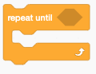

### Prof. Dr. Marko Boger, Prof. Dr. Pascal Laube
## Programmiertechnik I
# Lecture 09: Generic Types, Pattern Matching

<p class="small">Migrated from the Google Slides deck "PR-09-Generic Types, Pattern Matching".</p>

---

<!-- _class: inhalt -->

# Goals

<div class="columns" style="grid-template-columns: 1fr 260px; align-items: start;">
<div markdown="1">

In this lecture you will learn about

- Lists that contain other types than Int or String
- more control structures, `while` and `foreach`
- the control structure `match`
- pattern matching
- classes that can be used for pattern matching

Supporting literature:

- Learn Scala 3 the Fast Way, chapter

New Tools:

</div>
<div markdown="1">


</div>
</div>

---

<!-- _class: kapitel -->

## 1
# Generics and Pattern Matching

Lists, match, and extracting structure

---

# Review of Lecture 08

Tuples, Objects, Enums and Classes all define **Types** – like `Int`, `String`, `Boolean`, or `Array` and `List`.

- `Int`, `String`, and `Boolean` are used for just one datum
- Arrays are used for a fixed number of data of the same type
- Lists are used for a variable number of data of the same type
- **Tuples** are used for spontaneous data types of mixed data types
- **Objects** are used for a single instance of a data structure of mixed data types
- **Enums** are used for a small and fixed number of data structures
- **Classes** are used for a variable number of data structures
- Objects, Enums and Classes can have functions, then called **methods**

---

# More on Lists

So far, we have seen Lists of Int or List of String.
Now that we know more types, we can extend our idea of Lists.
Lists can be formed over **any type** in Scala. Here are examples:

```scala
val list1: List[Int] = List(1, 2, 3, 4, 5)
val list2: List[String] = List("a", "b", "c", "d", "e")
val list3: List[(Int, String)] = List((1, "a"), (2, "b"), (3, "c"), (4, "d"), (5, "e"))
val list4: List[Weekday] = List(Monday, Tuesday, Wednesday, Thursday, Friday, Saturday, Sunday)
val list5: List[Person] = List(Person("Anakin", 30), Person("Padme", 25))
val list6: List[List[Int]] = List(List(1, 2, 3), List(4, 5, 6), List(7, 8, 9))
```

---

# Generic Type

This ability to hold data of a type that is only specified when it is used, is called a **generic type**.
The class `List` is specified over a generic type referenced as `T`.
`T` now is a variable over the type.
This is written as `List[T]`.

We can build our own class with a generic type:

```scala
class Box[T](value: T)
val box1: Box[Int] = Box(1)
val box2: Box[String] = Box("Hello")
val box3: Box[Person] = Box(Person("Anakin", 30))
```

---

# Methods on List

Here are the most commonly used methods of `List`:

```scala
val list = List(5, 2, 3, 2)
list.head
list.tail
list.length
list.reverse
list.sorted
list.distinct
list.toString
list.mkString("|", " - ", "|")
list.sum
list.product
list.max
list.min
list.contains(2)
list.zipWithIndex
list.zip(list2)
```

---

# Methods on List II

Here are some less known methods:

```scala
val list = List(5, 2, 3, 2)

list.take(2)
list.drop(2)
list.takeRight(2)
list.dropRight(2)
list.slice(1, 3)
list.patch(1, List(6, 7), 2)
```

---

# Methods on List III

Some methods return an **iterator**.

```scala
val list = List(5, 2, 3, 2)

val iterator1 = list.sliding(2)
iterator1.next
iterator1.next
val iterator2 = list.grouped(2)
iterator2.next
iterator2.next
```

---

# The method foreach

Then there is also a method called `foreach`.
This method is somewhat different: its parameter is a statement with an element of the list as argument.
It is a function with return type `Unit`. That statement is executed on each element of the list.

```scala
list.foreach(elem => println(elem))
```

It can be written a little shorter:

```scala
list.foreach(println)
```

It is very similar to the for loop:

```scala
for (elem <- list) println(elem)
```

---

# The method map

The method `map` also takes an argument, but this time the argument is a function that returns a value.

```scala
list.map(elem => elem * 2)
```

Also this can be shortened:

```scala
val list8 = list.map(_ * 2)
```

This is equivalent to a for loop with `yield`:

```scala
val list9 = for (elem <- list) yield elem * 2
```

Thus `foreach` and `map` are like control structures in FP.
Functions that take a function as parameter are called **higher-order functions** and we will see them again a little later.

---

# While loop

<div class="columns" style="grid-template-columns: 1.2fr 0.8fr; align-items: start;">
<div markdown="1">

Another control structure is the `while` loop.
It has a boolean condition and loops while it is true.
Scratch has a similar construct, that loops until a condition is not true.

```scala
var i = 0
while (i < list.length) {
  println(list(i))
  i += 1
}
```

In the FP style, the while loop is avoided. It is common in the procedural style.

</div>
<div markdown="1">



</div>
</div>

---

# match Statement

A very powerful control statement in Scala is `match`.

```scala
val character = "Luke"
character match {
  case "Luke"   => println("The power of the Force is strong with you.")
  case "Anakin" => println("I am your father.")
  case "Padme"  => println("I am your mother.")
  case _        => println("Do or do not. There is no try.")
}
```

The character is matched against a matching case.
If the case matches, the following statement is executed.
It is like an if on steroids.
In Java a similar construct is called `switch`.

---

# match on a List

Match and for loops are often combined.

```scala
val characterList = List("Luke", "Anakin", "Padme")
for (character <- characterList) character match {
  case "Luke"   => println("The power of the Force is strong with you.")
  case "Anakin" => println("I am your father.")
  case "Padme"  => println("I am your mother.")
  case _        => println("Do or do not. There is no try.")
}
```

- Only one case is executed
- The underscore (`_`) is called a **catch all**. If no other case matches, this is executed

---

# match as Expression

`match` can also be used as an Expression. In FP it usually is.

```scala
for (character <- characterList) {
  val theForceIsStrong = character match {
    case "Luke"   => true
    case "Anakin" => true
    case "Padme"  => false
    case _        => false
  }
}
```

---

# match on Value

The match can be on the value of a variable.

```scala
val y: Int = 42
y match {
  case 42 => println("The answer to life, the universe, and everything")
  case _  => println("Unknown value")
}
```

Or a value in a list as expression:

```scala
val list10 = List(13, 21, 42, 63)
val shoutout = for (x <- list10) yield x match {
  case 21 => "Blackjack!"
  case 42 => "The answer to life, the universe, and everything"
  case _  => "Unknown value"
}
```

---

# match with Guards

Each case can have a **guard** expression, similar to an if:

```scala
val number: Int = 42
number match {
  case positiveNumber if positiveNumber > 0 => println("Positive")
  case negativeNumber if negativeNumber < 0 => println("Negative")
  case zero if zero == 0                    => println("Zero")
}
```

---

# match on Enum

`match` can be executed on Enums:

```scala
enum Status {
  case Jedi, SithLord, Senator
}
import Status._
val status = Jedi
val theForceIsStrong = status match {
  case Jedi     => true
  case SithLord => true
  case Senator  => false
  case _        => false
}
```

---

# match on Types

`match` can be used to differentiate on the type of a variable:

```scala
val x: Any = 42
x match {
  case i: Int    => println("Integer: " + i)
  case s: String => println("String: " + s)
  case _         => println("Unknown type")
}
```

During this process, the value of `x` is matched against the type `Int` or `String`
and if it matches then renamed to `i` or `s` with a tighter type.

---

# Roman Numbers

```scala
def romanCharToNumber(romanChar: Char): Int = {
  romanChar match {
    case 'I' => 1
    case 'V' => 5
    case 'X' => 10
    case 'L' => 50
    case 'C' => 100
    case 'D' => 500
    case 'M' => 1000
    case _   => 0
  }
}
romanCharToNumber('X')
```

---

# Pattern Matching

We had seen how Tuples were matched to a structure:

```scala
def div(x: Int, y: Int): (Int, Int) = (x / y, x % y)
val (quotient, remainder) = div(10, 3)
```

This is also possible with Lists.
The structure of a List of Int is `head :: tail`, where `head` is an Int and `tail` is a List of Int:

```scala
List(1, 2, 3) match {
  case head :: tail => println("Head: " + head + " Tail: " + tail)
  case Nil          => println("Empty list")
}
```

This is called **pattern matching**.

---

<style scoped>
section { font-size: 20px; }
pre { font-size: 14px; }
</style>

# Roman Numbers

```scala
def romanToNumber(roman: List[Char]): Int = {
  roman match {
    case 'I' :: 'V' :: tail => 4 + romanToNumber(tail)
    case 'I' :: 'X' :: tail => 9 + romanToNumber(tail)
    case 'X' :: 'L' :: tail => 40 + romanToNumber(tail)
    case 'X' :: 'C' :: tail => 90 + romanToNumber(tail)
    case 'C' :: 'D' :: tail => 400 + romanToNumber(tail)
    case 'C' :: 'M' :: tail => 900 + romanToNumber(tail)
    case 'I' :: tail => 1 + romanToNumber(tail)
    case 'V' :: tail => 5 + romanToNumber(tail)
    case 'X' :: tail => 10 + romanToNumber(tail)
    case 'L' :: tail => 50 + romanToNumber(tail)
    case 'C' :: tail => 100 + romanToNumber(tail)
    case 'D' :: tail => 500 + romanToNumber(tail)
    case 'M' :: tail => 1000 + romanToNumber(tail)
    case Nil => 0
  }
}
romanToNumber("XVI".toList)
romanToNumber("MCMXCIV".toList)
```

---

# Pattern Matching on Classes

Pattern Matching works for all classes that are declared as `case class`:

```scala
case class Person(name: String, age: Int)
```

Case classes provide additional magic to enable pattern matching.
They can be used as types in the case clause. Thus the name.

```scala
val person = Person("Anakin", 30)
person match {
  case Person(name, age) => println("Name: " + name + " Age: " + age)
}
```

---

# Pattern Matching with templates

In the case statement we can use place holders.
In this case we are looking for any person that matches the template.

```scala
val jedis = List(Person("Anakin", "Skywalker"), Person("Luke", "Skywalker"))
for (jedi <- jedis) jedi match {
  case Person(_, "Skywalker") => println("The Force is strong with you.")
  case _                      => println("Do or do not. There is no try.")
}
```

---

<!-- _class: inhalt -->

# Summary

- Lists are **generic** and have powerful methods available
- `foreach` and `map` are **higher-order functions** – they take a function as parameter
- `foreach` is equivalent to a for statement
- `map` is equivalent to a for expression
- `while` is also a control structure but rarely used in FP
- `match` is a powerful control statement or expression
- Pattern matching works on Tuple and Lists
- It actually works on classes defined as `case class`
- Pattern matching even works with templates

---

<!-- _class: aufgabe -->

# Task

(Task to fill)

---

<!-- _class: abschluss -->

# Questions?

## Thank you!

marko.boger@htwg-konstanz.de
