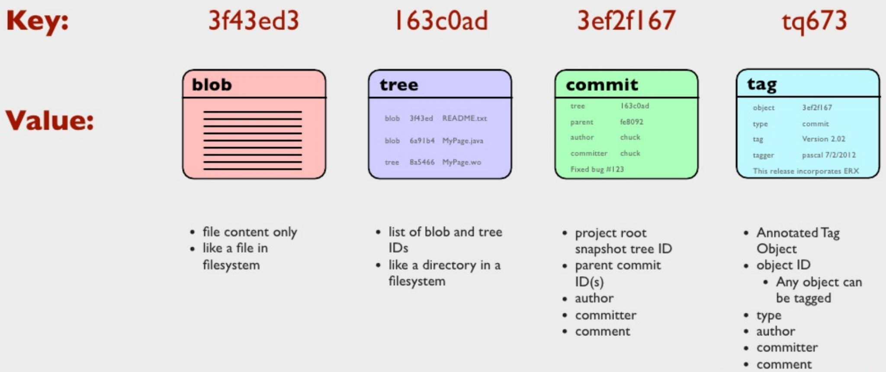
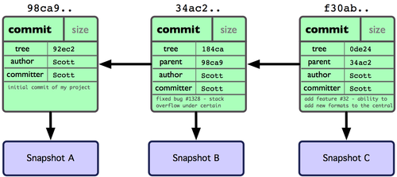
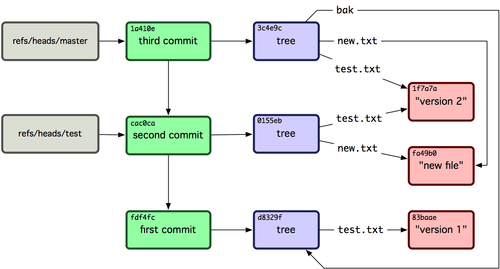
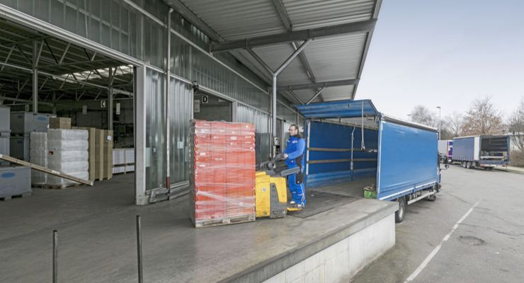
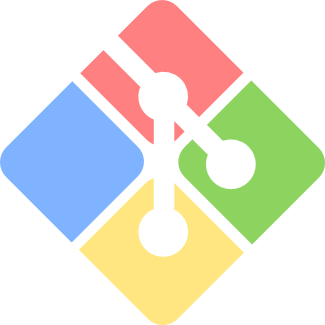

### Prof. Dr. Marko Boger, Prof. Dr. Pascal Laube
## Programmiertechnik I
# Lecture 11: Version Control with Git

<p class="small">Adapted from Software Engineering Lecture 02 (Git and GitHub sections).</p>

---

<!-- _class: inhalt -->

# Goals

In this lecture you will learn about

- What **version control** is and why teams need it
- The history and core ideas of **Git**
- Commits, the staging area, and the basic workflow
- Working with a desktop app and on the command line (zsh)
- `.gitignore`
- **GitHub**: clone, branch, merge, rebase, fetch, fork, and conflicts
- Git inside **Cursor** / VS Code

New Tools:

- Git, GitHub Desktop, GitHub

---

<!-- _class: tools -->

## New Tools
# Git

History, objects, workflow, and the command line

---

# Version Control

- Almost no software project is done in isolation.
- So we need collaboration mechanisms.
- In software development different members of a team access shared resources.
- This requires a coordination strategy and tooling:
  - To synchronise access
  - To avoid loss of changes

---

<style scoped>
section { font-size: 19px; }
.gens { display: grid; grid-template-columns: 1fr auto 1fr auto 1fr; gap: 0.5rem; align-items: stretch; margin-top: 0.1rem; }
.gen { border: 2px solid #d9e3f2; border-radius: 12px; padding: 0.45rem 0.8rem; background: #fff; }
.gen h3 { margin: 0; font-size: 21px; color: #009B91; }
.gen .who { font-size: 15px; color: #575e75; margin: 0 0 0.2rem 0; }
.gen svg { display: block; height: 92px; margin: 0.15rem auto 0.25rem auto; }
.gen ul { margin: 0; padding-left: 1.1em; }
.gen li { margin: 0.08rem 0; }
.gens .arr { align-self: center; font-size: 30px; color: #334152; }
.won { margin-top: 0.7rem; }
.won ul { margin: 0.1rem 0; }
</style>

# A Short History of Version Control

<div class="gens">
<div class="gen">
<h3>1. Local</h3>
<div class="who">RCS (1982)</div>
<svg viewBox="0 0 200 92"><rect x="55" y="8" width="90" height="58" rx="6" fill="#cfe2f3" stroke="#3d85c6" stroke-width="2.5"/><rect x="88" y="66" width="24" height="10" fill="#3d85c6"/><rect x="70" y="76" width="60" height="6" rx="3" fill="#3d85c6"/><ellipse cx="100" cy="30" rx="18" ry="6" fill="#d9f0ee" stroke="#009B91" stroke-width="2"/><path d="M82 30v18a18 6 0 0 0 36 0v-18" fill="#d9f0ee" stroke="#009B91" stroke-width="2"/></svg>
<ul>
<li>History of single files on <strong>one computer</strong></li>
<li>Locking: one person edits a file at a time</li>
</ul>
</div>
<div class="arr">&rarr;</div>
<div class="gen">
<h3>2. Central</h3>
<div class="who">CVS (1990), SVN (2004)</div>
<svg viewBox="0 0 200 92"><ellipse cx="100" cy="12" rx="22" ry="7" fill="#e4dcf3" stroke="#674ea7" stroke-width="2"/><path d="M78 12v22a22 7 0 0 0 44 0v-22" fill="#e4dcf3" stroke="#674ea7" stroke-width="2"/><line x1="88" y1="44" x2="45" y2="62" stroke="#334152" stroke-width="2"/><line x1="100" y1="44" x2="100" y2="62" stroke="#334152" stroke-width="2"/><line x1="112" y1="44" x2="155" y2="62" stroke="#334152" stroke-width="2"/><rect x="25" y="62" width="40" height="26" rx="4" fill="#cfe2f3" stroke="#3d85c6" stroke-width="2"/><rect x="80" y="62" width="40" height="26" rx="4" fill="#cfe2f3" stroke="#3d85c6" stroke-width="2"/><rect x="135" y="62" width="40" height="26" rx="4" fill="#cfe2f3" stroke="#3d85c6" stroke-width="2"/></svg>
<ul>
<li>One <strong>server</strong> holds the whole history</li>
<li>Commit, log and branch need the server</li>
<li>Revision numbers 1, 2, 3, …</li>
</ul>
</div>
<div class="arr">&rarr;</div>
<div class="gen">
<h3>3. Distributed</h3>
<div class="who">Git, Mercurial (2005)</div>
<svg viewBox="0 0 200 92"><line x1="100" y1="22" x2="45" y2="70" stroke="#334152" stroke-width="2"/><line x1="100" y1="22" x2="155" y2="70" stroke="#334152" stroke-width="2"/><line x1="45" y1="70" x2="155" y2="70" stroke="#334152" stroke-width="2" stroke-dasharray="4 4"/><g fill="#d9f0ee" stroke="#009B91" stroke-width="2"><ellipse cx="100" cy="8" rx="18" ry="6"/><path d="M82 8v18a18 6 0 0 0 36 0v-18"/><ellipse cx="45" cy="58" rx="18" ry="6"/><path d="M27 58v18a18 6 0 0 0 36 0v-18"/><ellipse cx="155" cy="58" rx="18" ry="6"/><path d="M137 58v18a18 6 0 0 0 36 0v-18"/></g></svg>
<ul>
<li>Every clone is a <strong>complete repository</strong></li>
<li>Server and local copy are equivalent</li>
<li>Commits are identified by a hash of their content</li>
</ul>
</div>
</div>

<div class="won">

**Why Git won**

- Works **offline**: commit, history and diff are local and fast.
- **Branching and merging are cheap**, so a branch for every feature becomes normal.
- **GitHub** (2008) made sharing, forks and pull requests easy.

</div>

---

<style scoped>
section { font-size: 18px; }
.tl { position: relative; margin: 0.2rem 0 0 0.4rem; padding-left: 1.4rem; border-left: 4px solid #009B91; }
.tl > div { position: relative; margin: 0 0 0.5rem 0; }
.tl > div::before { content: ""; position: absolute; left: -1.95rem; top: 0.25rem; width: 14px; height: 14px; border-radius: 50%; background: #fff; border: 3px solid #009B91; }
.tl b.y { display: inline-block; min-width: 5.2em; color: #009B91; }
.tl ul { margin: 0.1rem 0 0 5.4em; padding-left: 1em; }
.src { position: absolute; left: 70px; right: 70px; bottom: 58px; font-size: 12px; color: #575e75; }
</style>

# History of Git (1): 2005–2018

<div class="tl">
<div><b class="y">2002</b> The Linux kernel project starts using the proprietary DVCS BitKeeper.</div>
<div><b class="y">2005</b> The free BitKeeper license is revoked. <strong>Linus Torvalds</strong> writes his own tool: <strong>Git</strong>. Design goals:
<ul>
<li>speed, simple design, fully distributed</li>
<li>strong support for non-linear development (thousands of parallel branches)</li>
<li>able to handle large projects like the Linux kernel</li>
<li>integrity: every object is identified by the SHA-1 hash of its content</li>
</ul></div>
<div><b class="y">Jul 2005</b> Torvalds hands over maintenance to <strong>Junio Hamano</strong>, who releases Git 1.0 in December 2005.</div>
<div><b class="y">2008</b> <strong>GitHub</strong> launches: hosting plus forks and pull requests make contributing easy. Bitbucket also starts in 2008 (Atlassian from 2010), <strong>GitLab</strong> follows in 2011.</div>
<div><b class="y">2014</b> Git 2.0, the last breaking release so far.</div>
<div><b class="y">2018</b> <strong>Microsoft</strong> acquires GitHub for $7.5 billion.</div>
</div>

<div class="src">Sources: Pro Git, ch. 1.2 "A Short History of Git" and 1.3 (git-scm.com, CC BY-NC-SA 3.0); L. Torvalds, "Meet the new maintainer..", git mailing list, 27 Jul 2005; Git Documentation/BreakingChanges; github.blog (10 Apr 2008, 4 Jun 2018); about.gitlab.com/company/history; Wikipedia "Bitbucket".</div>

---

<style scoped>
section { font-size: 18px; }
.tl { position: relative; margin: 0.2rem 0 0 0.4rem; padding-left: 1.4rem; border-left: 4px solid #009B91; }
.tl > div { position: relative; margin: 0 0 0.5rem 0; }
.tl > div::before { content: ""; position: absolute; left: -1.95rem; top: 0.25rem; width: 14px; height: 14px; border-radius: 50%; background: #fff; border: 3px solid #009B91; }
.tl b.y { display: inline-block; min-width: 5.2em; color: #009B91; }
.tl ul { margin: 0.1rem 0 0 5.4em; padding-left: 1em; }
.src { position: absolute; left: 70px; right: 70px; bottom: 58px; font-size: 12px; color: #575e75; }
</style>

# History of Git (2): 2020 until Today

<div class="tl">
<div><b class="y">2020</b> <code>master</code> &rarr; <code>main</code>: Git 2.28 makes the default branch name configurable (<code>init.defaultBranch</code>); new GitHub repositories use <code>main</code> since 1 Oct 2020.</div>
<div><b class="y">2020</b> Git 2.29 adds <strong>SHA-256</strong> repositories (experimental); since Git 2.42 (2023) they are no longer called an experimental curiosity. There is no interoperability with SHA-1 repositories yet.</div>
<div><b class="y">2022</b> Stack Overflow Developer Survey: <strong>93 %</strong> of all respondents and <strong>96.65 %</strong> of professional developers use Git; second place SVN with 5.96 %.</div>
<div><b class="y">2022&ndash;</b> AI enters the Git workflow: GitHub Copilot is generally available (June 2022). Since 2025 coding agents work on their own branches and deliver pull requests: Copilot's coding agent pushes commits to a draft PR (May 2025), Cursor's cloud agents create a branch and open a PR.</div>
<div><b class="y">Git 3.0</b> Planned, <strong>no release date yet</strong>. For new repositories: SHA-256 as default hash, <code>main</code> as default branch, the "reftable" reference format; Rust becomes mandatory for building Git. Current release: Git 2.56.</div>
</div>

<div class="src">Sources: Git RelNotes 2.28, 2.29, 2.42; github.com/github/renaming and github.blog changelog 2020-10-01; stackoverflow.blog (22 Jun 2022, 9 Jan 2023) and survey.stackoverflow.co/2022; github.blog (21 Jun 2022, 19 May 2025); cursor.com/docs/agent/review; Git Documentation/BreakingChanges; git-scm.com (latest source release, Sep 2026).</div>

---

<style scoped>
section { font-size: 22px; }
ul { margin: 0; }
</style>

# Git Object Types

<div class="columns" style="grid-template-columns: 1fr 1fr; align-items: start; gap: 1em;">
<div>

- Git has 4 different main data types
  - Blob - Binary Large OBjects, the content of a file
  - Tree - similar to a directory, links to blobs
  - Commit - links to a snapshot (a tree)

</div>
<div>

- References to Commits
  - Branches
  - Tags
  - References
  - HEAD

</div>
</div>



---

<div style="display: flex; flex-direction: column; align-items: center; gap: 1.2rem; margin-top: 0.6rem;">


</div>

<div style="position: absolute; right: 70px; bottom: 80px; width: 220px; text-align: right; font-size: 13px; line-height: 1.35; color: #8a94a0;">Figures: Scott Chacon, Ben Straub, <i>Pro Git</i> (2nd ed.), git-scm.com/book, CC BY-NC-SA 3.0</div>

---

# Git Workflow

Branch for every new feature or bugfix

<svg viewBox="0 0 1090 400" style="display: block; width: 1100px; margin: 0.4rem auto 0 auto; font-family: sans-serif;">
<line x1="170" y1="70" x2="1080" y2="70" stroke="#009B91" stroke-opacity="0.18" stroke-width="10" stroke-linecap="round"/>
<rect x="10" y="53" width="160" height="34" rx="17" fill="#009B91"/><text x="90" y="76" text-anchor="middle" fill="#fff" font-size="17" font-weight="bold" font-family="monospace">main</text>
<line x1="170" y1="155" x2="1080" y2="155" stroke="#0b3c68" stroke-opacity="0.18" stroke-width="10" stroke-linecap="round"/>
<rect x="10" y="138" width="160" height="34" rx="17" fill="#0b3c68"/><text x="90" y="161" text-anchor="middle" fill="#fff" font-size="17" font-weight="bold" font-family="monospace">develop</text>
<line x1="170" y1="240" x2="1080" y2="240" stroke="#c55a11" stroke-opacity="0.18" stroke-width="10" stroke-linecap="round"/>
<rect x="10" y="223" width="160" height="34" rx="17" fill="#c55a11"/><text x="90" y="246" text-anchor="middle" fill="#fff" font-size="17" font-weight="bold" font-family="monospace">feature/login</text>
<line x1="170" y1="325" x2="1080" y2="325" stroke="#674ea7" stroke-opacity="0.18" stroke-width="10" stroke-linecap="round"/>
<rect x="10" y="308" width="160" height="34" rx="17" fill="#674ea7"/><text x="90" y="331" text-anchor="middle" fill="#fff" font-size="17" font-weight="bold" font-family="monospace">feature/search</text>
<line x1="220" y1="70" x2="960" y2="70" stroke="#009B91" stroke-width="4"/>
<line x1="290" y1="155" x2="860" y2="155" stroke="#0b3c68" stroke-width="4"/>
<line x1="360" y1="240" x2="480" y2="240" stroke="#c55a11" stroke-width="4"/>
<line x1="470" y1="325" x2="720" y2="325" stroke="#674ea7" stroke-width="4"/>
<path d="M220 70 C255.0 70 255.0 155 290 155" fill="none" stroke="#0b3c68" stroke-width="4"/>
<path d="M290 155 C325.0 155 325.0 240 360 240" fill="none" stroke="#c55a11" stroke-width="4"/>
<path d="M480 240 C510.0 240 510.0 155 540 155" fill="none" stroke="#c55a11" stroke-width="4"/>
<path d="M400 155 C435.0 155 435.0 325 470 325" fill="none" stroke="#674ea7" stroke-width="4"/>
<path d="M720 325 C750.0 325 750.0 155 780 155" fill="none" stroke="#674ea7" stroke-width="4"/>
<path d="M860 155 C910.0 155 910.0 70 960 70" fill="none" stroke="#0b3c68" stroke-width="4"/>
<circle cx="220" cy="70" r="10" fill="#fff" stroke="#009B91" stroke-width="4"/>
<circle cx="960" cy="70" r="13" fill="#009B91"/><circle cx="960" cy="70" r="5" fill="#fff"/>
<circle cx="290" cy="155" r="10" fill="#fff" stroke="#0b3c68" stroke-width="4"/>
<circle cx="540" cy="155" r="13" fill="#0b3c68"/><circle cx="540" cy="155" r="5" fill="#fff"/>
<text x="540" y="133" text-anchor="middle" font-size="15" fill="#0b3c68" font-weight="bold">PR #1</text>
<circle cx="780" cy="155" r="13" fill="#0b3c68"/><circle cx="780" cy="155" r="5" fill="#fff"/>
<text x="780" y="133" text-anchor="middle" font-size="15" fill="#0b3c68" font-weight="bold">PR #2</text>
<circle cx="860" cy="155" r="10" fill="#fff" stroke="#0b3c68" stroke-width="4"/>
<circle cx="360" cy="240" r="10" fill="#fff" stroke="#c55a11" stroke-width="4"/>
<circle cx="420" cy="240" r="10" fill="#fff" stroke="#c55a11" stroke-width="4"/>
<circle cx="480" cy="240" r="10" fill="#fff" stroke="#c55a11" stroke-width="4"/>
<circle cx="400" cy="155" r="10" fill="#fff" stroke="#0b3c68" stroke-width="4"/>
<circle cx="470" cy="325" r="10" fill="#fff" stroke="#674ea7" stroke-width="4"/>
<circle cx="560" cy="325" r="10" fill="#fff" stroke="#674ea7" stroke-width="4"/>
<circle cx="640" cy="325" r="10" fill="#fff" stroke="#674ea7" stroke-width="4"/>
<circle cx="720" cy="325" r="10" fill="#fff" stroke="#674ea7" stroke-width="4"/>
<path d="M934 16 h52 v26 h-19 l-7 9 l-7 -9 h-19z" fill="#fff" stroke="#009B91" stroke-width="2"/><text x="960" y="35" text-anchor="middle" font-size="15" font-weight="bold" fill="#009B91" font-family="monospace">v1.0</text>
<path d="M194 16 h52 v26 h-19 l-7 9 l-7 -9 h-19z" fill="#fff" stroke="#009B91" stroke-width="2"/><text x="220" y="35" text-anchor="middle" font-size="15" font-weight="bold" fill="#009B91" font-family="monospace">v0.1</text>
<text x="910" y="106" text-anchor="middle" font-size="14" fill="#575e75">release: merge develop into main</text>
<g font-size="15" fill="#575e75"><circle cx="200" cy="385" r="8" fill="#fff" stroke="#575e75" stroke-width="3"/><text x="216" y="390">commit</text>
<circle cx="310" cy="385" r="10" fill="#575e75"/><circle cx="310" cy="385" r="4" fill="#fff"/><text x="328" y="390">merge commit (merged pull request)</text>
<path d="M600 373 h40 v20 h-14 l-6 7 l-6 -7 h-14z" fill="#fff" stroke="#009B91" stroke-width="2"/><text x="652" y="390">tag (release)</text>
<text x="780" y="390">branch = lane, merges point back into the lane above</text></g>
</svg>

---

<style scoped>
section { padding-top: 30px; }
h1 { margin-bottom: 0.2rem; }
.leg { font-size: 16px; color: #575e75; margin: 0.15rem 40px 0 40px; line-height: 1.45; }
.leg code { font-size: 15px; color: #0b3c68; background: none; padding: 0; font-weight: bold; }
</style>

# Git Storage and Commands

<svg viewBox="-15 0 1105 510" style="display: block; width: 1030px; margin: 0 auto; font-family: sans-serif;">
<defs><marker id="se02gv-a0" viewBox="0 0 10 10" refX="9" refY="5" markerWidth="6" markerHeight="6" orient="auto"><path d="M0 0L10 5L0 10z" fill="#0b3c68"/></marker><marker id="se02gv-a1" viewBox="0 0 10 10" refX="9" refY="5" markerWidth="6" markerHeight="6" orient="auto"><path d="M0 0L10 5L0 10z" fill="#c55a11"/></marker></defs>
<rect x="-12" y="4" width="837" height="502" rx="18" fill="none" stroke="#b8c2cc" stroke-width="1.5" stroke-dasharray="3 5"/>
<text x="16" y="496" font-size="14" fill="#8a94a0">your computer</text>
<line x1="120" y1="120" x2="120" y2="502" stroke="#3d85c6" stroke-width="2" stroke-dasharray="5 5"/>
<rect x="-5" y="20" width="250" height="100" rx="14" fill="#cfe2f3" stroke="#3d85c6" stroke-width="2.5"/>
<text x="120" y="62" text-anchor="middle" font-size="21" font-weight="bold" fill="#222">Working Directory</text>
<text x="120" y="92" text-anchor="middle" font-size="16" fill="#575e75">your files on disk</text>
<line x1="400" y1="120" x2="400" y2="502" stroke="#e69138" stroke-width="2" stroke-dasharray="5 5"/>
<rect x="275" y="20" width="250" height="100" rx="14" fill="#fce5cd" stroke="#e69138" stroke-width="2.5"/>
<text x="400" y="62" text-anchor="middle" font-size="21" font-weight="bold" fill="#222">Staging Area (Index)</text>
<text x="400" y="92" text-anchor="middle" font-size="16" fill="#575e75">the next commit</text>
<line x1="680" y1="120" x2="680" y2="502" stroke="#009B91" stroke-width="2" stroke-dasharray="5 5"/>
<rect x="555" y="20" width="250" height="100" rx="14" fill="#d9f0ee" stroke="#009B91" stroke-width="2.5"/>
<text x="680" y="62" text-anchor="middle" font-size="21" font-weight="bold" fill="#222">Local Repository</text>
<text x="680" y="92" text-anchor="middle" font-size="16" fill="#575e75">.git: all commits</text>
<line x1="960" y1="120" x2="960" y2="502" stroke="#674ea7" stroke-width="2" stroke-dasharray="5 5"/>
<rect x="835" y="20" width="250" height="100" rx="14" fill="#e4dcf3" stroke="#674ea7" stroke-width="2.5"/>
<text x="960" y="62" text-anchor="middle" font-size="21" font-weight="bold" fill="#222">Remote Repository</text>
<text x="960" y="92" text-anchor="middle" font-size="16" fill="#575e75">e.g. origin on GitHub</text>
<line x1="126" y1="178" x2="392" y2="178" stroke="#0b3c68" stroke-width="3" marker-end="url(#se02gv-a0)"/>
<circle cx="120" cy="178" r="5" fill="#0b3c68"/>
<text x="260.0" y="170" text-anchor="middle"><tspan font-family="monospace" font-weight="bold" fill="#0b3c68" font-size="17">git add</tspan><tspan dx="8" fill="#575e75" font-size="14">stage changes</tspan></text>
<line x1="406" y1="216" x2="672" y2="216" stroke="#0b3c68" stroke-width="3" marker-end="url(#se02gv-a0)"/>
<circle cx="400" cy="216" r="5" fill="#0b3c68"/>
<text x="540.0" y="208" text-anchor="middle"><tspan font-family="monospace" font-weight="bold" fill="#0b3c68" font-size="17">git commit</tspan><tspan dx="8" fill="#575e75" font-size="14">save a snapshot</tspan></text>
<line x1="126" y1="254" x2="672" y2="254" stroke="#0b3c68" stroke-width="3" marker-end="url(#se02gv-a0)"/>
<circle cx="120" cy="254" r="5" fill="#0b3c68"/>
<text x="400.0" y="246" text-anchor="middle"><tspan font-family="monospace" font-weight="bold" fill="#0b3c68" font-size="17">git commit -a</tspan><tspan dx="8" fill="#575e75" font-size="14">add tracked files + commit</tspan></text>
<line x1="686" y1="292" x2="952" y2="292" stroke="#0b3c68" stroke-width="3" marker-end="url(#se02gv-a0)"/>
<circle cx="680" cy="292" r="5" fill="#0b3c68"/>
<text x="820.0" y="284" text-anchor="middle"><tspan font-family="monospace" font-weight="bold" fill="#0b3c68" font-size="17">git push</tspan><tspan dx="8" fill="#575e75" font-size="14">upload commits</tspan></text>
<line x1="954" y1="330" x2="688" y2="330" stroke="#c55a11" stroke-width="3" marker-end="url(#se02gv-a1)"/>
<circle cx="960" cy="330" r="5" fill="#c55a11"/>
<text x="820.0" y="322" text-anchor="middle"><tspan font-family="monospace" font-weight="bold" fill="#c55a11" font-size="17">git fetch</tspan><tspan dx="8" fill="#575e75" font-size="14">download commits</tspan></text>
<line x1="954" y1="368" x2="128" y2="368" stroke="#c55a11" stroke-width="3" marker-end="url(#se02gv-a1)"/>
<circle cx="960" cy="368" r="5" fill="#c55a11"/>
<text x="540.0" y="360" text-anchor="middle"><tspan font-family="monospace" font-weight="bold" fill="#c55a11" font-size="17">git pull</tspan><tspan dx="8" fill="#575e75" font-size="14">fetch + merge</tspan></text>
<line x1="674" y1="406" x2="128" y2="406" stroke="#c55a11" stroke-width="3" marker-end="url(#se02gv-a1)"/>
<circle cx="680" cy="406" r="5" fill="#c55a11"/>
<text x="400.0" y="398" text-anchor="middle"><tspan font-family="monospace" font-weight="bold" fill="#c55a11" font-size="17">git switch / git checkout</tspan><tspan dx="8" fill="#575e75" font-size="14">change branch</tspan></text>
<line x1="674" y1="444" x2="408" y2="444" stroke="#c55a11" stroke-width="3" marker-end="url(#se02gv-a1)"/>
<circle cx="680" cy="444" r="5" fill="#c55a11"/>
<text x="540.0" y="436" text-anchor="middle"><tspan font-family="monospace" font-weight="bold" fill="#c55a11" font-size="15">git restore --staged</tspan><tspan dx="6" fill="#575e75" font-size="13">unstage</tspan></text>
<line x1="394" y1="482" x2="128" y2="482" stroke="#c55a11" stroke-width="3" marker-end="url(#se02gv-a1)"/>
<circle cx="400" cy="482" r="5" fill="#c55a11"/>
<text x="260.0" y="474" text-anchor="middle"><tspan font-family="monospace" font-weight="bold" fill="#c55a11" font-size="17">git restore</tspan><tspan dx="8" fill="#575e75" font-size="14">discard changes</tspan></text>
</svg>

<div class="leg"><span style="color:#0b3c68; font-weight:bold;">&#9632;</span> towards the remote: save and share &nbsp;&nbsp; <span style="color:#c55a11; font-weight:bold;">&#9632;</span> back towards your files: get and restore<br>
<b>Inspect anytime:</b> <code>git status</code> what changed &nbsp;·&nbsp; <code>git diff</code> working dir vs. index &nbsp;·&nbsp; <code>git diff --staged</code> index vs. last commit &nbsp;·&nbsp; <code>git log</code> history<br>
<b>Park changes:</b> <code>git stash</code> / <code>git stash pop</code> &nbsp;·&nbsp; <b>Undo commits:</b> <code>git reset</code> (moves the branch back; <code>--hard</code> also resets your files)</div>

---

# Staging Area, Stage or Index

<div class="columns" style="align-items: start; gap: 1.5em;">
<div>

**Stage** (German: *Bühne*)


</div>
<div>

**Loading dock** (German: *Laderampe*)


</div>
</div>

---

<style scoped>
section { padding-top: 30px; }
h1 { margin-bottom: 0.1rem; }
.facts { font-size: 19px; color: #575e75; margin: 0 0 0.5rem 0; }
.n { display: inline-block; width: 26px; height: 26px; line-height: 26px; border-radius: 13px; background: #c55a11; color: #fff; font-weight: bold; font-size: 16px; text-align: center; margin-right: 8px; text-indent: 0; }
.steps p { font-size: 20px; margin: 0 0 0.55rem 0; line-height: 1.3; padding-left: 34px; text-indent: -34px; }
.src { position: absolute; left: 80px; bottom: 58px; font-size: 13px; color: #8a94a0; }
</style>

# Step 1: A Git Desktop App – GitHub Desktop

<div class="facts">Free, open-source Git GUI by GitHub &nbsp;·&nbsp; macOS 12+ and Windows 10 (64-bit), no Linux &nbsp;·&nbsp; also works with other Git hosts</div>

<div class="columns" style="grid-template-columns: 1.45fr 1fr; gap: 1.2em; align-items: start;">
<svg viewBox="0 0 760 480" style="display: block; width: 100%; font-family: sans-serif;">
<rect x="1" y="1" width="758" height="478" rx="12" fill="#fff" stroke="#b8c2cc" stroke-width="2"/>
<path d="M1 30 V13 a12 12 0 0 1 12 -12 H747 a12 12 0 0 1 12 12 V30z" fill="#eef1f4"/>
<circle cx="20" cy="16" r="5.5" fill="#ec6a5e"/>
<circle cx="38" cy="16" r="5.5" fill="#f4bf4f"/>
<circle cx="56" cy="16" r="5.5" fill="#61c554"/>
<text x="380" y="21" text-anchor="middle" font-size="13" fill="#575e75">GitHub Desktop (simplified sketch)</text>
<rect x="1" y="30" width="758" height="58" fill="#0b3c68"/>
<line x1="250" y1="30" x2="250" y2="88" stroke="#35587e" stroke-width="1.5"/>
<line x1="500" y1="30" x2="500" y2="88" stroke="#35587e" stroke-width="1.5"/>
<text x="20" y="52" font-size="12" fill="#b9c7d6">Current repository</text><text x="20" y="74" font-size="16" font-weight="bold" fill="#fff">hello-scala  ▾</text>
<text x="270" y="52" font-size="12" fill="#b9c7d6">Current branch</text><text x="270" y="74" font-size="16" font-weight="bold" fill="#fff">main  ▾</text>
<text x="520" y="52" font-size="12" fill="#b9c7d6">Push origin  ↑1</text><text x="520" y="74" font-size="16" font-weight="bold" fill="#fff">Last fetched just now</text>
<rect x="1" y="88" width="249" height="391" fill="#fafbfc"/><line x1="250" y1="88" x2="250" y2="479" stroke="#d0d7de" stroke-width="1.5"/>
<rect x="1" y="88" width="125" height="34" fill="#fff"/><line x1="1" y1="121" x2="126" y2="121" stroke="#c55a11" stroke-width="3"/>
<text x="30" y="110" font-size="15" font-weight="bold" fill="#222">Changes</text><circle cx="104" cy="105" r="10" fill="#d0d7de"/><text x="104" y="110" text-anchor="middle" font-size="12" fill="#222">2</text>
<text x="160" y="110" font-size="15" fill="#575e75">History</text><line x1="1" y1="122" x2="250" y2="122" stroke="#d0d7de"/>
<rect x="14" y="134" width="15" height="15" rx="3" fill="#009B91"/><path d="M17.5 142 l3 3 l5 -6" fill="none" stroke="#fff" stroke-width="2"/><text x="38" y="146" font-size="13" fill="#575e75">2 changed files</text><line x1="1" y1="158" x2="250" y2="158" stroke="#e5e8eb"/>
<rect x="1" y="159" width="249" height="32" fill="#dcebfa"/>
<rect x="14" y="167" width="15" height="15" rx="3" fill="#009B91"/><path d="M17.5 175 l3 3 l5 -6" fill="none" stroke="#fff" stroke-width="2"/><text x="38" y="179" font-size="13" fill="#222">src/main/scala/Main.scala</text><rect x="222" y="167" width="15" height="15" rx="3" fill="none" stroke="#d29922" stroke-width="2"/><circle cx="229.5" cy="174.5" r="2.5" fill="#d29922"/>
<rect x="14" y="200" width="15" height="15" rx="3" fill="#009B91"/><path d="M17.5 208 l3 3 l5 -6" fill="none" stroke="#fff" stroke-width="2"/><text x="38" y="212" font-size="13" fill="#222">README.md</text><rect x="222" y="200" width="15" height="15" rx="3" fill="none" stroke="#2da44e" stroke-width="2"/><path d="M229.5 203.5v8M225.5 207.5h8" stroke="#2da44e" stroke-width="2"/>
<line x1="1" y1="330" x2="250" y2="330" stroke="#d0d7de" stroke-width="1.5"/>
<circle cx="26" cy="356" r="12" fill="#cfe2f3" stroke="#3d85c6"/><rect x="46" y="342" width="190" height="28" rx="5" fill="#fff" stroke="#b8c2cc"/><text x="54" y="361" font-size="13" fill="#222">Add greeting</text>
<rect x="14" y="378" width="222" height="44" rx="5" fill="#fff" stroke="#b8c2cc"/><text x="22" y="396" font-size="12" fill="#9aa3ad">Description</text>
<rect x="14" y="432" width="222" height="32" rx="6" fill="#009B91"/><text x="125" y="453" text-anchor="middle" font-size="14" font-weight="bold" fill="#fff">Commit to main</text>
<rect x="251" y="88" width="508" height="34" fill="#f6f8fa"/><text x="266" y="110" font-size="13" font-family="monospace" fill="#222">src/main/scala/Main.scala</text><line x1="251" y1="122" x2="759" y2="122" stroke="#d0d7de"/>
<text x="270" y="155" font-size="12" font-family="monospace" fill="#9aa3ad">1</text><text x="296" y="155" font-size="13" font-family="monospace" fill="#222">  @main def hello(): Unit =</text>
<rect x="251" y="164" width="508" height="26" fill="#ffebe9"/>
<text x="270" y="181" font-size="12" font-family="monospace" fill="#9aa3ad">2</text><text x="296" y="181" font-size="13" font-family="monospace" fill="#cf222e">-   println("Hello")</text>
<rect x="251" y="190" width="508" height="26" fill="#dafbe1"/>
<text x="270" y="207" font-size="12" font-family="monospace" fill="#9aa3ad">2</text><text x="296" y="207" font-size="13" font-family="monospace" fill="#1a7f37">+   println("Hello, Luke!")</text>
<rect x="251" y="216" width="508" height="26" fill="#dafbe1"/>
<text x="270" y="233" font-size="12" font-family="monospace" fill="#9aa3ad">3</text><text x="296" y="233" font-size="13" font-family="monospace" fill="#1a7f37">+   println("May the Source be with you")</text>
<text x="270" y="259" font-size="12" font-family="monospace" fill="#9aa3ad">4</text><text x="296" y="259" font-size="13" font-family="monospace" fill="#222">  </text>
<circle cx="232" cy="44" r="14" fill="#c55a11" stroke="#fff" stroke-width="2.5"/><text x="232" y="49.5" text-anchor="middle" font-size="16" font-weight="bold" fill="#fff">1</text>
<circle cx="140" cy="104" r="14" fill="#c55a11" stroke="#fff" stroke-width="2.5"/><text x="140" y="109.5" text-anchor="middle" font-size="16" font-weight="bold" fill="#fff">2</text>
<circle cx="244" cy="448" r="14" fill="#c55a11" stroke="#fff" stroke-width="2.5"/><text x="244" y="453.5" text-anchor="middle" font-size="16" font-weight="bold" fill="#fff">3</text>
<circle cx="744" cy="44" r="14" fill="#c55a11" stroke="#fff" stroke-width="2.5"/><text x="744" y="49.5" text-anchor="middle" font-size="16" font-weight="bold" fill="#fff">4</text>
<circle cx="482" cy="44" r="14" fill="#c55a11" stroke="#fff" stroke-width="2.5"/><text x="482" y="49.5" text-anchor="middle" font-size="16" font-weight="bold" fill="#fff">5</text>
</svg>
<div class="steps">

<span class="n">1</span>**Clone:** *File › Clone repository…*, paste the URL

<span class="n">2</span>**See changes:** the *Changes* tab lists changed files, the diff is on the right

<span class="n">3</span>**Stage & commit:** tick the files to include (= staging), write a *Summary*, click *Commit to main*

<span class="n">4</span>**Push / pull:** *Push origin* uploads your commits; *Fetch origin* / *Pull origin* gets new ones

<span class="n">5</span>**Branch:** *Current branch › New branch* to create, pick a branch to switch, then *Publish branch*

</div>
</div>

<div class="src">Sketch, not a screenshot. Facts: docs.github.com/desktop</div>

---

# The Command Line

<div class="columns" style="grid-template-columns: 1fr auto;">
<div>

- Git is a command-line tool at heart: GitHub Desktop and Cursor run the same Git commands for you.
- The command line shows what really happens and works everywhere (servers, CI, scripts).
- **macOS:** *Terminal* app, default shell **zsh** (since macOS 10.15 Catalina; before: bash)
- **Linux:** a terminal, usually bash
- **Windows:** *Git Bash* (bash, installed with Git for Windows) or WSL
- Cursor and VS Code have a built-in terminal

</div>

</div>

---

<style scoped>
section { padding-top: 30px; font-size: 21px; }
h1 { margin-bottom: 0.2rem; }
h3 { margin: 0.3rem 0 0.2rem 0; font-size: 23px; }
ul { margin: 0; } li { margin: 0.1rem 0; }
pre { font-size: 16px; margin: 0.2rem 0 0.3rem 0; padding: 0.4rem 0.7rem; }
p { margin: 0.2rem 0; }
.src { position: absolute; left: 80px; bottom: 58px; font-size: 13px; color: #8a94a0; }
</style>

# zsh – the Z Shell

<div class="columns" style="grid-template-columns: 1fr 1fr; gap: 1.4em; align-items: start;">
<div>

### What and why?
- Unix shell, highly compatible with sh and mostly with bash
- Default on macOS since **10.15 Catalina (2019)** for new accounts; before: bash
- Why? macOS only had the old **bash 3.2** (GPLv2); bash 4+ is **GPLv3**, which Apple avoids. zsh has an MIT-like license. *(Apple gave no official reason.)*

### Differences from bash
- Everyday commands are identical
- Better Tab completion (e.g. git branches, options)
- Recursive globbing: `ls **/*.scala`
- Arrays start at 1 (bash: 0)
- Config in `~/.zshrc` instead of `~/.bashrc`
- **Windows:** Git Bash or WSL instead

</div>
<div>

### Basics
```zsh
% pwd                 # where am I?
% ls -la              # list all files
% mkdir hello && cd hello
% cat README.md       # show a file
% cd ..               # one level up
```
Prompt: `%` in zsh, `$` in bash<br>**Tab** completes &nbsp;·&nbsp; **↑** / `history` &nbsp;·&nbsp; **Ctrl+R** searches the history

### `~/.zshrc` example
```zsh
alias gs="git status"
export PATH="$HOME/bin:$PATH"
```
Optional: *Oh My Zsh* (themes, plugins, git aliases)

</div>
</div>

<div class="src">Sources: support.apple.com/102360 (“Use zsh as the default shell on Mac”); licensing: The Verge, InfoQ, June 2019</div>

---

<style scoped>
section { padding-top: 30px; }
h1 { margin-bottom: 0.3rem; }
table { font-size: 17px; border-collapse: collapse; }
th, td { padding: 4px 10px; }
td code { font-size: 16px; }
pre { font-size: 18px; margin: 0; }
.n { display: inline-block; width: 22px; height: 22px; line-height: 22px; border-radius: 11px; background: #c55a11; color: #fff; font-weight: bold; font-size: 14px; text-align: center; }
.note { font-size: 18px; color: #575e75; margin-top: 0.7rem; }
</style>

# Step 2: The Same Steps on the Command Line

<div class="columns" style="grid-template-columns: 1.15fr 1fr; gap: 1.2em; align-items: start;">
<div>

| | GitHub Desktop | Command line |
|---|---|---|
| <span class="n">1</span> | *File › Clone repository…* | `git clone <url>` |
| <span class="n">2</span> | *Changes* tab, diff | `git status`, `git diff` |
| <span class="n">3</span> | tick a file (checkbox) | `git add <file>` |
| <span class="n">3</span> | *Summary* + *Commit to main* | `git commit -m "…"` |
| <span class="n">4</span> | *Push origin* | `git push` |
| <span class="n">4</span> | *Fetch origin* / *Pull origin* | `git fetch` / `git pull` |
| <span class="n">5</span> | *Current branch › New branch* | `git switch -c <name>` |
| <span class="n">5</span> | select a branch | `git switch <name>` |
| <span class="n">5</span> | *Publish branch* | `git push -u origin <name>` |
| | *History* tab | `git log` |

</div>
<div>

```zsh
% git clone https://github.com/lskywalker/hello-scala.git
% cd hello-scala
# edit src/main/scala/Main.scala
% git status
% git add src/main/scala/Main.scala
% git commit -m "Add greeting"
% git push
% git switch -c feature/login
% git push -u origin feature/login
```

<div class="note">The next slides explain each command in detail. Cursor has the same operations built in, see <b>Git in Cursor</b> (slides 56–57).</div>

</div>
</div>

---

<style scoped>
pre { font-size: 22px; margin: 0.3rem 0 0.6rem 0; }
</style>

# Before you use git

Take a look at the git configuration

```shell
$ git config --list
core.trustctime=false
credential.helper=osxkeychain
user.name=lskywalker
user.email=luke.skywalker@example.com
core.autocrlf=input
```

Change your name and email if needed

```shell
$ git config --global user.name "Luke Skywalker"
$ git config --global user.email luke.skywalker@example.com
```

---

# git ignore

- Some files should not be shared in a repository.
- This includes
  - files generated by compilation (.class files) or generation
  - files for local configuration or local tools
    - IDEs
- git keeps a list of regex to exclude files or file pattern. These regex are stored in a .gitignore file
- Without it, coding does not properly work.
- GitHub can create a default .gitignore file for you

---

<style scoped>
section { padding-top: 30px; }
h1 { margin-bottom: 0.4rem; }
pre { font-size: 20px; line-height: 1.35; margin: 0; }
</style>

# Example .gitignore file

<div class="columns" style="align-items: start; gap: 1.5em;">

```bash
# Keep in the repo: sources, .scalafmt.conf,
# README, and other project config you share

# Build / tool output
target/
.scala-build/
.history
dist/
```

```bash
# Metals / BSP / Bloop
.bsp/
.bloop/
.metals/
.ammonite/

# Compiler output
*.class
*.tasty

# Logs & JVM crash dumps
*.log
hs_err_pid*
replay_pid*
```

</div>

---

<!-- _class: tools -->

## New Tools
# GitHub

Remotes, branches, merge, rebase, and collaboration

---

# GitHub


- GitHub is a commercial service that serves as central server for git projects. Open source projects can be stored free of charge.
- You need to create an account at GitHub.
- Create a project on GitHub
  - with .gitignore
  - Readme.md
  - License MIT
- Then clone this to your local machine and add code.
- Add collaborators, so that team partners can push.

---

# git clone

- git clone copies a repo from a server to the local machine.
- Projects are referenced using a URL.
- Protocol is usually https.

<svg viewBox="0 0 1100 380" style="display: block; width: 1060px; margin: 0.2rem auto 0 auto; font-family: sans-serif;">
<defs><marker id="se02gc-n" viewBox="0 0 10 10" refX="8" refY="5" markerWidth="6" markerHeight="6" orient="auto"><path d="M0 0L10 5L0 10z" fill="#575e75"/></marker><marker id="se02gc-g" viewBox="0 0 10 10" refX="8" refY="5" markerWidth="6" markerHeight="6" orient="auto"><path d="M0 0L10 5L0 10z" fill="#b0b4bf"/></marker><marker id="se02gc-h" viewBox="0 0 10 10" refX="8" refY="5" markerWidth="6" markerHeight="6" orient="auto"><path d="M0 0L10 5L0 10z" fill="#333"/></marker><marker id="se02gc-b009B91" viewBox="0 0 10 10" refX="8" refY="5" markerWidth="6" markerHeight="6" orient="auto"><path d="M0 0L10 5L0 10z" fill="#009B91"/></marker><marker id="se02gc-b0b3c68" viewBox="0 0 10 10" refX="8" refY="5" markerWidth="6" markerHeight="6" orient="auto"><path d="M0 0L10 5L0 10z" fill="#0b3c68"/></marker><marker id="se02gc-b674ea7" viewBox="0 0 10 10" refX="8" refY="5" markerWidth="6" markerHeight="6" orient="auto"><path d="M0 0L10 5L0 10z" fill="#674ea7"/></marker></defs>
<rect x="0" y="2" width="400" height="370" rx="14" fill="#e9e4f4" stroke="#674ea7" stroke-width="2.5"/>
<rect x="590" y="2" width="510" height="370" rx="14" fill="#d9f0ee" stroke="#009B91" stroke-width="2.5"/>
<line x1="415" y1="175" x2="575" y2="175" stroke="#0b3c68" stroke-width="4" marker-end="url(#se02gc-b0b3c68)"/>
<rect x="610" y="282" width="470" height="70" rx="10" fill="#cfe2f3" stroke="#3d85c6" stroke-width="2.5"/>
<line x1="168.0" y1="175.0" x2="103.0" y2="175.0" stroke="#575e75" stroke-width="2.5" marker-end="url(#se02gc-n)"/>
<line x1="278.0" y1="175.0" x2="213.0" y2="175.0" stroke="#575e75" stroke-width="2.5" marker-end="url(#se02gc-n)"/>
<line x1="728.0" y1="175.0" x2="663.0" y2="175.0" stroke="#575e75" stroke-width="2.5" marker-end="url(#se02gc-n)"/>
<line x1="838.0" y1="175.0" x2="773.0" y2="175.0" stroke="#575e75" stroke-width="2.5" marker-end="url(#se02gc-n)"/>
<circle cx="80" cy="175" r="20" fill="#fff" stroke="#575e75" stroke-width="4"/><text x="80" y="180" text-anchor="middle" font-size="15" font-weight="bold" font-family="monospace" fill="#575e75">C1</text>
<circle cx="190" cy="175" r="20" fill="#fff" stroke="#575e75" stroke-width="4"/><text x="190" y="180" text-anchor="middle" font-size="15" font-weight="bold" font-family="monospace" fill="#575e75">C2</text>
<circle cx="300" cy="175" r="20" fill="#fff" stroke="#575e75" stroke-width="4"/><text x="300" y="180" text-anchor="middle" font-size="15" font-weight="bold" font-family="monospace" fill="#575e75">C3</text>
<circle cx="640" cy="175" r="20" fill="#fff" stroke="#575e75" stroke-width="4"/><text x="640" y="180" text-anchor="middle" font-size="15" font-weight="bold" font-family="monospace" fill="#575e75">C1</text>
<circle cx="750" cy="175" r="20" fill="#fff" stroke="#575e75" stroke-width="4"/><text x="750" y="180" text-anchor="middle" font-size="15" font-weight="bold" font-family="monospace" fill="#575e75">C2</text>
<circle cx="860" cy="175" r="20" fill="#fff" stroke="#575e75" stroke-width="4"/><text x="860" y="180" text-anchor="middle" font-size="15" font-weight="bold" font-family="monospace" fill="#575e75">C3</text>
<text x="200.0" y="32" font-size="18" fill="#222" text-anchor="middle" font-weight="bold">Remote repository</text>
<text x="200.0" y="54" font-size="14" fill="#575e75" text-anchor="middle">on GitHub</text>
<text x="845.0" y="32" font-size="18" fill="#222" text-anchor="middle" font-weight="bold">Local copy</text>
<text x="845.0" y="54" font-size="14" fill="#575e75" text-anchor="middle">on your computer</text>
<line x1="300" y1="224.0" x2="300" y2="198" stroke="#009B91" stroke-width="2.5" marker-end="url(#se02gc-b009B91)"/>
<rect x="270.6" y="224.0" width="58.8" height="26" rx="13" fill="#009B91"/><text x="300" y="242" text-anchor="middle" font-size="15" font-weight="bold" font-family="monospace" fill="#fff">main</text>
<text x="495.0" y="163" font-size="16" fill="#0b3c68" text-anchor="middle" font-weight="bold" font-family="monospace">git clone &lt;url&gt;</text>
<text x="495.0" y="199" font-size="13" fill="#575e75" text-anchor="middle">copy all commits</text>
<line x1="860" y1="130.0" x2="860" y2="152" stroke="#674ea7" stroke-width="2.5" marker-end="url(#se02gc-b674ea7)"/>
<rect x="798.4" y="104.0" width="123.2" height="26" rx="13" fill="#674ea7"/><text x="860" y="122" text-anchor="middle" font-size="15" font-weight="bold" font-family="monospace" fill="#fff">origin/main</text>
<text x="928" y="122" font-size="13" fill="#674ea7" text-anchor="start" font-weight="bold">remote-tracking</text>
<line x1="860" y1="220.0" x2="860" y2="198" stroke="#009B91" stroke-width="2.5" marker-end="url(#se02gc-b009B91)"/>
<rect x="830.6" y="220.0" width="58.8" height="26" rx="13" fill="#009B91"/><text x="860" y="238" text-anchor="middle" font-size="15" font-weight="bold" font-family="monospace" fill="#fff">main</text>
<line x1="910.4" y1="233" x2="892.4" y2="233" stroke="#333" stroke-width="2" marker-end="url(#se02gc-h)"/>
<rect x="911.4" y="220.0" width="58.8" height="26" rx="13" fill="#fff" stroke="#333" stroke-width="2.5"/><text x="940.8" y="238" text-anchor="middle" font-size="15" font-weight="bold" font-family="monospace" fill="#333">HEAD</text>
<text x="845" y="310" font-size="16" fill="#222" text-anchor="middle" font-weight="bold">Working directory</text>
<text x="845" y="334" font-size="14" fill="#575e75" text-anchor="middle">files of C3 (main) checked out, ready to edit</text>
</svg>

---

# git add and commit

- `git add` puts files on the stage.
- `git commit` moves files from the stage into the repo.
- `git commit -a` does both.
- `git commit` needs a comment. Comments should be in English and descriptive for the set of changes.
  - `git commit -m "commit message"`
- If you omit the comment, the editor `vim` will open and require a comment there.

---

# git branch

- All development should be done in a separate branch. After development was successful, the branch is merged back.
- `git branch` - lists existing branches
- `git branch <newbranch>` creates a new branch

<svg viewBox="0 0 1100 280" style="display: block; width: 1060px; margin: 0.4rem auto 0 auto; font-family: sans-serif;">
<defs><marker id="se02gb-n" viewBox="0 0 10 10" refX="8" refY="5" markerWidth="6" markerHeight="6" orient="auto"><path d="M0 0L10 5L0 10z" fill="#575e75"/></marker><marker id="se02gb-g" viewBox="0 0 10 10" refX="8" refY="5" markerWidth="6" markerHeight="6" orient="auto"><path d="M0 0L10 5L0 10z" fill="#b0b4bf"/></marker><marker id="se02gb-h" viewBox="0 0 10 10" refX="8" refY="5" markerWidth="6" markerHeight="6" orient="auto"><path d="M0 0L10 5L0 10z" fill="#333"/></marker><marker id="se02gb-b009B91" viewBox="0 0 10 10" refX="8" refY="5" markerWidth="6" markerHeight="6" orient="auto"><path d="M0 0L10 5L0 10z" fill="#009B91"/></marker><marker id="se02gb-bc55a11" viewBox="0 0 10 10" refX="8" refY="5" markerWidth="6" markerHeight="6" orient="auto"><path d="M0 0L10 5L0 10z" fill="#c55a11"/></marker></defs>
<line x1="350" y1="0" x2="350" y2="280" stroke="#d0d4dc" stroke-width="1.5" stroke-dasharray="4 5"/>
<line x1="700" y1="0" x2="700" y2="280" stroke="#d0d4dc" stroke-width="1.5" stroke-dasharray="4 5"/>
<line x1="88.0" y1="165.0" x2="53.0" y2="165.0" stroke="#575e75" stroke-width="2.5" marker-end="url(#se02gb-n)"/>
<line x1="168.0" y1="165.0" x2="133.0" y2="165.0" stroke="#575e75" stroke-width="2.5" marker-end="url(#se02gb-n)"/>
<line x1="438.0" y1="165.0" x2="403.0" y2="165.0" stroke="#575e75" stroke-width="2.5" marker-end="url(#se02gb-n)"/>
<line x1="518.0" y1="165.0" x2="483.0" y2="165.0" stroke="#575e75" stroke-width="2.5" marker-end="url(#se02gb-n)"/>
<line x1="788.0" y1="165.0" x2="753.0" y2="165.0" stroke="#575e75" stroke-width="2.5" marker-end="url(#se02gb-n)"/>
<line x1="868.0" y1="165.0" x2="833.0" y2="165.0" stroke="#575e75" stroke-width="2.5" marker-end="url(#se02gb-n)"/>
<line x1="948.0" y1="165.0" x2="913.0" y2="165.0" stroke="#575e75" stroke-width="2.5" marker-end="url(#se02gb-n)"/>
<circle cx="30" cy="165" r="20" fill="#fff" stroke="#575e75" stroke-width="4"/><text x="30" y="170" text-anchor="middle" font-size="15" font-weight="bold" font-family="monospace" fill="#575e75">C1</text>
<circle cx="110" cy="165" r="20" fill="#fff" stroke="#575e75" stroke-width="4"/><text x="110" y="170" text-anchor="middle" font-size="15" font-weight="bold" font-family="monospace" fill="#575e75">C2</text>
<circle cx="190" cy="165" r="20" fill="#fff" stroke="#575e75" stroke-width="4"/><text x="190" y="170" text-anchor="middle" font-size="15" font-weight="bold" font-family="monospace" fill="#575e75">C3</text>
<circle cx="380" cy="165" r="20" fill="#fff" stroke="#575e75" stroke-width="4"/><text x="380" y="170" text-anchor="middle" font-size="15" font-weight="bold" font-family="monospace" fill="#575e75">C1</text>
<circle cx="460" cy="165" r="20" fill="#fff" stroke="#575e75" stroke-width="4"/><text x="460" y="170" text-anchor="middle" font-size="15" font-weight="bold" font-family="monospace" fill="#575e75">C2</text>
<circle cx="540" cy="165" r="20" fill="#fff" stroke="#575e75" stroke-width="4"/><text x="540" y="170" text-anchor="middle" font-size="15" font-weight="bold" font-family="monospace" fill="#575e75">C3</text>
<circle cx="730" cy="165" r="20" fill="#fff" stroke="#575e75" stroke-width="4"/><text x="730" y="170" text-anchor="middle" font-size="15" font-weight="bold" font-family="monospace" fill="#575e75">C1</text>
<circle cx="810" cy="165" r="20" fill="#fff" stroke="#575e75" stroke-width="4"/><text x="810" y="170" text-anchor="middle" font-size="15" font-weight="bold" font-family="monospace" fill="#575e75">C2</text>
<circle cx="890" cy="165" r="20" fill="#fff" stroke="#575e75" stroke-width="4"/><text x="890" y="170" text-anchor="middle" font-size="15" font-weight="bold" font-family="monospace" fill="#575e75">C3</text>
<circle cx="970" cy="165" r="20" fill="#fff" stroke="#c55a11" stroke-width="4"/><text x="970" y="170" text-anchor="middle" font-size="15" font-weight="bold" font-family="monospace" fill="#c55a11">C4</text>
<text x="175.0" y="24" font-size="18" fill="#0b3c68" text-anchor="middle" font-weight="bold" font-family="monospace">git branch feature</text>
<text x="175.0" y="46" font-size="15" fill="#575e75" text-anchor="middle">new pointer on the same commit</text>
<line x1="190" y1="120.0" x2="190" y2="142" stroke="#c55a11" stroke-width="2.5" marker-end="url(#se02gb-bc55a11)"/>
<rect x="146.8" y="94.0" width="86.4" height="26" rx="13" fill="#c55a11"/><text x="190" y="112" text-anchor="middle" font-size="15" font-weight="bold" font-family="monospace" fill="#fff">feature</text>
<line x1="190" y1="210.0" x2="190" y2="188" stroke="#009B91" stroke-width="2.5" marker-end="url(#se02gb-b009B91)"/>
<rect x="160.6" y="210.0" width="58.8" height="26" rx="13" fill="#009B91"/><text x="190" y="228" text-anchor="middle" font-size="15" font-weight="bold" font-family="monospace" fill="#fff">main</text>
<line x1="240.4" y1="223" x2="222.4" y2="223" stroke="#333" stroke-width="2" marker-end="url(#se02gb-h)"/>
<rect x="241.4" y="210.0" width="58.8" height="26" rx="13" fill="#fff" stroke="#333" stroke-width="2.5"/><text x="270.8" y="228" text-anchor="middle" font-size="15" font-weight="bold" font-family="monospace" fill="#333">HEAD</text>
<text x="525.0" y="24" font-size="18" fill="#0b3c68" text-anchor="middle" font-weight="bold" font-family="monospace">git switch feature</text>
<text x="525.0" y="46" font-size="15" fill="#575e75" text-anchor="middle">HEAD moves to feature</text>
<line x1="540" y1="120.0" x2="540" y2="142" stroke="#c55a11" stroke-width="2.5" marker-end="url(#se02gb-bc55a11)"/>
<rect x="496.8" y="94.0" width="86.4" height="26" rx="13" fill="#c55a11"/><text x="540" y="112" text-anchor="middle" font-size="15" font-weight="bold" font-family="monospace" fill="#fff">feature</text>
<line x1="540" y1="210.0" x2="540" y2="188" stroke="#009B91" stroke-width="2.5" marker-end="url(#se02gb-b009B91)"/>
<rect x="510.6" y="210.0" width="58.8" height="26" rx="13" fill="#009B91"/><text x="540" y="228" text-anchor="middle" font-size="15" font-weight="bold" font-family="monospace" fill="#fff">main</text>
<line x1="604.2" y1="107" x2="586.2" y2="107" stroke="#333" stroke-width="2" marker-end="url(#se02gb-h)"/>
<rect x="605.2" y="94.0" width="58.8" height="26" rx="13" fill="#fff" stroke="#333" stroke-width="2.5"/><text x="634.6" y="112" text-anchor="middle" font-size="15" font-weight="bold" font-family="monospace" fill="#333">HEAD</text>
<text x="900.0" y="24" font-size="18" fill="#0b3c68" text-anchor="middle" font-weight="bold" font-family="monospace">git commit</text>
<text x="900.0" y="46" font-size="15" fill="#575e75" text-anchor="middle">feature + HEAD move on, main stays</text>
<line x1="970" y1="120.0" x2="970" y2="142" stroke="#c55a11" stroke-width="2.5" marker-end="url(#se02gb-bc55a11)"/>
<rect x="926.8" y="94.0" width="86.4" height="26" rx="13" fill="#c55a11"/><text x="970" y="112" text-anchor="middle" font-size="15" font-weight="bold" font-family="monospace" fill="#fff">feature</text>
<line x1="890" y1="210.0" x2="890" y2="188" stroke="#009B91" stroke-width="2.5" marker-end="url(#se02gb-b009B91)"/>
<rect x="860.6" y="210.0" width="58.8" height="26" rx="13" fill="#009B91"/><text x="890" y="228" text-anchor="middle" font-size="15" font-weight="bold" font-family="monospace" fill="#fff">main</text>
<line x1="1034.2" y1="107" x2="1016.2" y2="107" stroke="#333" stroke-width="2" marker-end="url(#se02gb-h)"/>
<rect x="1035.2" y="94.0" width="58.8" height="26" rx="13" fill="#fff" stroke="#333" stroke-width="2.5"/><text x="1064.6000000000001" y="112" text-anchor="middle" font-size="15" font-weight="bold" font-family="monospace" fill="#333">HEAD</text>
</svg>

---

# git merge

- Merges different branches back to one.
- Merge is done from the current branch.
- Switch to main, then merge the feature branch

<svg viewBox="0 0 1100 290" style="display: block; width: 1060px; margin: 0.4rem auto 0 auto; font-family: sans-serif;">
<defs><marker id="se02gm-n" viewBox="0 0 10 10" refX="8" refY="5" markerWidth="6" markerHeight="6" orient="auto"><path d="M0 0L10 5L0 10z" fill="#575e75"/></marker><marker id="se02gm-g" viewBox="0 0 10 10" refX="8" refY="5" markerWidth="6" markerHeight="6" orient="auto"><path d="M0 0L10 5L0 10z" fill="#b0b4bf"/></marker><marker id="se02gm-h" viewBox="0 0 10 10" refX="8" refY="5" markerWidth="6" markerHeight="6" orient="auto"><path d="M0 0L10 5L0 10z" fill="#333"/></marker><marker id="se02gm-b009B91" viewBox="0 0 10 10" refX="8" refY="5" markerWidth="6" markerHeight="6" orient="auto"><path d="M0 0L10 5L0 10z" fill="#009B91"/></marker><marker id="se02gm-b0b3c68" viewBox="0 0 10 10" refX="8" refY="5" markerWidth="6" markerHeight="6" orient="auto"><path d="M0 0L10 5L0 10z" fill="#0b3c68"/></marker><marker id="se02gm-bc55a11" viewBox="0 0 10 10" refX="8" refY="5" markerWidth="6" markerHeight="6" orient="auto"><path d="M0 0L10 5L0 10z" fill="#c55a11"/></marker></defs>
<line x1="350" y1="170" x2="520" y2="170" stroke="#0b3c68" stroke-width="4" marker-end="url(#se02gm-b0b3c68)"/>
<line x1="118.0" y1="205.0" x2="63.0" y2="205.0" stroke="#575e75" stroke-width="2.5" marker-end="url(#se02gm-n)"/>
<line x1="122.4" y1="143.2" x2="58.4" y2="191.2" stroke="#575e75" stroke-width="2.5" marker-end="url(#se02gm-n)"/>
<line x1="218.0" y1="130.0" x2="163.0" y2="130.0" stroke="#575e75" stroke-width="2.5" marker-end="url(#se02gm-n)"/>
<line x1="698.0" y1="205.0" x2="643.0" y2="205.0" stroke="#575e75" stroke-width="2.5" marker-end="url(#se02gm-n)"/>
<line x1="702.4" y1="143.2" x2="638.4" y2="191.2" stroke="#575e75" stroke-width="2.5" marker-end="url(#se02gm-n)"/>
<line x1="798.0" y1="130.0" x2="743.0" y2="130.0" stroke="#575e75" stroke-width="2.5" marker-end="url(#se02gm-n)"/>
<line x1="898.0" y1="205.0" x2="743.0" y2="205.0" stroke="#575e75" stroke-width="2.5" marker-end="url(#se02gm-n)"/>
<line x1="902.4" y1="191.8" x2="838.4" y2="143.8" stroke="#575e75" stroke-width="2.5" marker-end="url(#se02gm-n)"/>
<circle cx="40" cy="205" r="20" fill="#fff" stroke="#575e75" stroke-width="4"/><text x="40" y="210" text-anchor="middle" font-size="15" font-weight="bold" font-family="monospace" fill="#575e75">C1</text>
<circle cx="140" cy="205" r="20" fill="#fff" stroke="#575e75" stroke-width="4"/><text x="140" y="210" text-anchor="middle" font-size="15" font-weight="bold" font-family="monospace" fill="#575e75">C2</text>
<circle cx="140" cy="130" r="20" fill="#fff" stroke="#c55a11" stroke-width="4"/><text x="140" y="135" text-anchor="middle" font-size="15" font-weight="bold" font-family="monospace" fill="#c55a11">C3</text>
<circle cx="240" cy="130" r="20" fill="#fff" stroke="#c55a11" stroke-width="4"/><text x="240" y="135" text-anchor="middle" font-size="15" font-weight="bold" font-family="monospace" fill="#c55a11">C4</text>
<circle cx="620" cy="205" r="20" fill="#fff" stroke="#575e75" stroke-width="4"/><text x="620" y="210" text-anchor="middle" font-size="15" font-weight="bold" font-family="monospace" fill="#575e75">C1</text>
<circle cx="720" cy="205" r="20" fill="#fff" stroke="#575e75" stroke-width="4"/><text x="720" y="210" text-anchor="middle" font-size="15" font-weight="bold" font-family="monospace" fill="#575e75">C2</text>
<circle cx="720" cy="130" r="20" fill="#fff" stroke="#c55a11" stroke-width="4"/><text x="720" y="135" text-anchor="middle" font-size="15" font-weight="bold" font-family="monospace" fill="#c55a11">C3</text>
<circle cx="820" cy="130" r="20" fill="#fff" stroke="#c55a11" stroke-width="4"/><text x="820" y="135" text-anchor="middle" font-size="15" font-weight="bold" font-family="monospace" fill="#c55a11">C4</text>
<circle cx="920" cy="205" r="20" fill="#fff" stroke="#009B91" stroke-width="4"/><text x="920" y="210" text-anchor="middle" font-size="15" font-weight="bold" font-family="monospace" fill="#009B91">C5</text>
<line x1="240" y1="88.0" x2="240" y2="107" stroke="#c55a11" stroke-width="2.5" marker-end="url(#se02gm-bc55a11)"/>
<rect x="196.8" y="62.0" width="86.4" height="26" rx="13" fill="#c55a11"/><text x="240" y="80" text-anchor="middle" font-size="15" font-weight="bold" font-family="monospace" fill="#fff">feature</text>
<line x1="140" y1="247.0" x2="140" y2="228" stroke="#009B91" stroke-width="2.5" marker-end="url(#se02gm-b009B91)"/>
<rect x="110.6" y="247.0" width="58.8" height="26" rx="13" fill="#009B91"/><text x="140" y="265" text-anchor="middle" font-size="15" font-weight="bold" font-family="monospace" fill="#fff">main</text>
<line x1="190.4" y1="260" x2="172.4" y2="260" stroke="#333" stroke-width="2" marker-end="url(#se02gm-h)"/>
<rect x="191.4" y="247.0" width="58.8" height="26" rx="13" fill="#fff" stroke="#333" stroke-width="2.5"/><text x="220.8" y="265" text-anchor="middle" font-size="15" font-weight="bold" font-family="monospace" fill="#333">HEAD</text>
<text x="170" y="24" font-size="18" fill="#0b3c68" text-anchor="middle" font-weight="bold" font-family="monospace">before</text>
<text x="170" y="46" font-size="15" fill="#575e75" text-anchor="middle">HEAD on main (git switch main)</text>
<text x="435.0" y="156" font-size="16" fill="#0b3c68" text-anchor="middle" font-weight="bold" font-family="monospace">git merge feature</text>
<line x1="820" y1="88.0" x2="820" y2="107" stroke="#c55a11" stroke-width="2.5" marker-end="url(#se02gm-bc55a11)"/>
<rect x="776.8" y="62.0" width="86.4" height="26" rx="13" fill="#c55a11"/><text x="820" y="80" text-anchor="middle" font-size="15" font-weight="bold" font-family="monospace" fill="#fff">feature</text>
<line x1="920" y1="247.0" x2="920" y2="228" stroke="#009B91" stroke-width="2.5" marker-end="url(#se02gm-b009B91)"/>
<rect x="890.6" y="247.0" width="58.8" height="26" rx="13" fill="#009B91"/><text x="920" y="265" text-anchor="middle" font-size="15" font-weight="bold" font-family="monospace" fill="#fff">main</text>
<line x1="970.4" y1="260" x2="952.4" y2="260" stroke="#333" stroke-width="2" marker-end="url(#se02gm-h)"/>
<rect x="971.4" y="247.0" width="58.8" height="26" rx="13" fill="#fff" stroke="#333" stroke-width="2.5"/><text x="1000.8" y="265" text-anchor="middle" font-size="15" font-weight="bold" font-family="monospace" fill="#333">HEAD</text>
<text x="950" y="183" font-size="14" fill="#009B91" text-anchor="start" font-weight="bold">2 parents</text>
<text x="810" y="24" font-size="18" fill="#0b3c68" text-anchor="middle" font-weight="bold" font-family="monospace">after</text>
<text x="810" y="46" font-size="15" fill="#575e75" text-anchor="middle">merge commit C5 with two parents (C2, C4)</text>
</svg>

---

# git rebase

- changes the commit tree, or history. This is sometimes used to linearize a commit tree. It should be used rarely and with caution.
- It replays your changes on the new commit.

<svg viewBox="0 0 1100 290" style="display: block; width: 1060px; margin: 0.4rem auto 0 auto; font-family: sans-serif;">
<defs><marker id="se02gr-n" viewBox="0 0 10 10" refX="8" refY="5" markerWidth="6" markerHeight="6" orient="auto"><path d="M0 0L10 5L0 10z" fill="#575e75"/></marker><marker id="se02gr-g" viewBox="0 0 10 10" refX="8" refY="5" markerWidth="6" markerHeight="6" orient="auto"><path d="M0 0L10 5L0 10z" fill="#b0b4bf"/></marker><marker id="se02gr-h" viewBox="0 0 10 10" refX="8" refY="5" markerWidth="6" markerHeight="6" orient="auto"><path d="M0 0L10 5L0 10z" fill="#333"/></marker><marker id="se02gr-b009B91" viewBox="0 0 10 10" refX="8" refY="5" markerWidth="6" markerHeight="6" orient="auto"><path d="M0 0L10 5L0 10z" fill="#009B91"/></marker><marker id="se02gr-b0b3c68" viewBox="0 0 10 10" refX="8" refY="5" markerWidth="6" markerHeight="6" orient="auto"><path d="M0 0L10 5L0 10z" fill="#0b3c68"/></marker><marker id="se02gr-bc55a11" viewBox="0 0 10 10" refX="8" refY="5" markerWidth="6" markerHeight="6" orient="auto"><path d="M0 0L10 5L0 10z" fill="#c55a11"/></marker></defs>
<line x1="380" y1="170" x2="540" y2="170" stroke="#0b3c68" stroke-width="4" marker-end="url(#se02gr-b0b3c68)"/>
<line x1="118.0" y1="205.0" x2="63.0" y2="205.0" stroke="#575e75" stroke-width="2.5" marker-end="url(#se02gr-n)"/>
<line x1="122.4" y1="143.2" x2="58.4" y2="191.2" stroke="#575e75" stroke-width="2.5" marker-end="url(#se02gr-n)"/>
<line x1="218.0" y1="130.0" x2="163.0" y2="130.0" stroke="#575e75" stroke-width="2.5" marker-end="url(#se02gr-n)"/>
<line x1="702.4" y1="143.2" x2="638.4" y2="191.2" stroke="#b0b4bf" stroke-width="2.5" stroke-dasharray="5 4" marker-end="url(#se02gr-g)"/>
<line x1="798.0" y1="130.0" x2="743.0" y2="130.0" stroke="#b0b4bf" stroke-width="2.5" stroke-dasharray="5 4" marker-end="url(#se02gr-g)"/>
<line x1="698.0" y1="205.0" x2="643.0" y2="205.0" stroke="#575e75" stroke-width="2.5" marker-end="url(#se02gr-n)"/>
<line x1="798.0" y1="205.0" x2="743.0" y2="205.0" stroke="#575e75" stroke-width="2.5" marker-end="url(#se02gr-n)"/>
<line x1="898.0" y1="205.0" x2="843.0" y2="205.0" stroke="#575e75" stroke-width="2.5" marker-end="url(#se02gr-n)"/>
<circle cx="40" cy="205" r="20" fill="#fff" stroke="#575e75" stroke-width="4"/><text x="40" y="210" text-anchor="middle" font-size="15" font-weight="bold" font-family="monospace" fill="#575e75">C1</text>
<circle cx="140" cy="205" r="20" fill="#fff" stroke="#575e75" stroke-width="4"/><text x="140" y="210" text-anchor="middle" font-size="15" font-weight="bold" font-family="monospace" fill="#575e75">C2</text>
<circle cx="140" cy="130" r="20" fill="#fff" stroke="#c55a11" stroke-width="4"/><text x="140" y="135" text-anchor="middle" font-size="15" font-weight="bold" font-family="monospace" fill="#c55a11">C3</text>
<circle cx="240" cy="130" r="20" fill="#fff" stroke="#c55a11" stroke-width="4"/><text x="240" y="135" text-anchor="middle" font-size="15" font-weight="bold" font-family="monospace" fill="#c55a11">C4</text>
<circle cx="720" cy="130" r="20" fill="#fff" stroke="#b0b4bf" stroke-width="3" stroke-dasharray="5 4"/><text x="720" y="135" text-anchor="middle" font-size="15" font-weight="bold" font-family="monospace" fill="#b0b4bf">C3</text>
<circle cx="820" cy="130" r="20" fill="#fff" stroke="#b0b4bf" stroke-width="3" stroke-dasharray="5 4"/><text x="820" y="135" text-anchor="middle" font-size="15" font-weight="bold" font-family="monospace" fill="#b0b4bf">C4</text>
<circle cx="620" cy="205" r="20" fill="#fff" stroke="#575e75" stroke-width="4"/><text x="620" y="210" text-anchor="middle" font-size="15" font-weight="bold" font-family="monospace" fill="#575e75">C1</text>
<circle cx="720" cy="205" r="20" fill="#fff" stroke="#575e75" stroke-width="4"/><text x="720" y="210" text-anchor="middle" font-size="15" font-weight="bold" font-family="monospace" fill="#575e75">C2</text>
<circle cx="820" cy="205" r="20" fill="#fff" stroke="#c55a11" stroke-width="4"/><text x="820" y="210" text-anchor="middle" font-size="15" font-weight="bold" font-family="monospace" fill="#c55a11">C3'</text>
<circle cx="920" cy="205" r="20" fill="#fff" stroke="#c55a11" stroke-width="4"/><text x="920" y="210" text-anchor="middle" font-size="15" font-weight="bold" font-family="monospace" fill="#c55a11">C4'</text>
<line x1="240" y1="88.0" x2="240" y2="107" stroke="#c55a11" stroke-width="2.5" marker-end="url(#se02gr-bc55a11)"/>
<rect x="196.8" y="62.0" width="86.4" height="26" rx="13" fill="#c55a11"/><text x="240" y="80" text-anchor="middle" font-size="15" font-weight="bold" font-family="monospace" fill="#fff">feature</text>
<line x1="304.2" y1="75" x2="286.2" y2="75" stroke="#333" stroke-width="2" marker-end="url(#se02gr-h)"/>
<rect x="305.2" y="62.0" width="58.8" height="26" rx="13" fill="#fff" stroke="#333" stroke-width="2.5"/><text x="334.59999999999997" y="80" text-anchor="middle" font-size="15" font-weight="bold" font-family="monospace" fill="#333">HEAD</text>
<line x1="140" y1="247.0" x2="140" y2="228" stroke="#009B91" stroke-width="2.5" marker-end="url(#se02gr-b009B91)"/>
<rect x="110.6" y="247.0" width="58.8" height="26" rx="13" fill="#009B91"/><text x="140" y="265" text-anchor="middle" font-size="15" font-weight="bold" font-family="monospace" fill="#fff">main</text>
<text x="170" y="24" font-size="18" fill="#0b3c68" text-anchor="middle" font-weight="bold" font-family="monospace">before</text>
<text x="170" y="46" font-size="15" fill="#575e75" text-anchor="middle">same start as merge, HEAD on feature</text>
<text x="460.0" y="156" font-size="16" fill="#0b3c68" text-anchor="middle" font-weight="bold" font-family="monospace">git rebase main</text>
<line x1="920" y1="88.0" x2="920" y2="182" stroke="#c55a11" stroke-width="2.5" marker-end="url(#se02gr-bc55a11)"/>
<rect x="876.8" y="62.0" width="86.4" height="26" rx="13" fill="#c55a11"/><text x="920" y="80" text-anchor="middle" font-size="15" font-weight="bold" font-family="monospace" fill="#fff">feature</text>
<line x1="984.2" y1="75" x2="966.2" y2="75" stroke="#333" stroke-width="2" marker-end="url(#se02gr-h)"/>
<rect x="985.2" y="62.0" width="58.8" height="26" rx="13" fill="#fff" stroke="#333" stroke-width="2.5"/><text x="1014.6" y="80" text-anchor="middle" font-size="15" font-weight="bold" font-family="monospace" fill="#333">HEAD</text>
<line x1="720" y1="247.0" x2="720" y2="228" stroke="#009B91" stroke-width="2.5" marker-end="url(#se02gr-b009B91)"/>
<rect x="690.6" y="247.0" width="58.8" height="26" rx="13" fill="#009B91"/><text x="720" y="265" text-anchor="middle" font-size="15" font-weight="bold" font-family="monospace" fill="#fff">main</text>
<text x="820" y="24" font-size="18" fill="#0b3c68" text-anchor="middle" font-weight="bold" font-family="monospace">after</text>
<text x="820" y="46" font-size="15" fill="#575e75" text-anchor="middle">C3, C4 replayed as C3', C4' (new IDs): linear history</text>
<text x="770" y="105" font-size="13" fill="#b0b4bf" text-anchor="middle" font-weight="bold">old commits (grey) are dropped</text>
</svg>

---

# git fetch

- fetches branches from the remote server.
- Use merge to integrate changes into local branch.
- pull is the combination of fetch and merge.

<svg viewBox="0 0 1100 380" style="display: block; width: 1060px; margin: 0.2rem auto 0 auto; font-family: sans-serif;">
<defs><marker id="se02gf-n" viewBox="0 0 10 10" refX="8" refY="5" markerWidth="6" markerHeight="6" orient="auto"><path d="M0 0L10 5L0 10z" fill="#575e75"/></marker><marker id="se02gf-g" viewBox="0 0 10 10" refX="8" refY="5" markerWidth="6" markerHeight="6" orient="auto"><path d="M0 0L10 5L0 10z" fill="#b0b4bf"/></marker><marker id="se02gf-h" viewBox="0 0 10 10" refX="8" refY="5" markerWidth="6" markerHeight="6" orient="auto"><path d="M0 0L10 5L0 10z" fill="#333"/></marker><marker id="se02gf-b009B91" viewBox="0 0 10 10" refX="8" refY="5" markerWidth="6" markerHeight="6" orient="auto"><path d="M0 0L10 5L0 10z" fill="#009B91"/></marker><marker id="se02gf-b0b3c68" viewBox="0 0 10 10" refX="8" refY="5" markerWidth="6" markerHeight="6" orient="auto"><path d="M0 0L10 5L0 10z" fill="#0b3c68"/></marker><marker id="se02gf-b674ea7" viewBox="0 0 10 10" refX="8" refY="5" markerWidth="6" markerHeight="6" orient="auto"><path d="M0 0L10 5L0 10z" fill="#674ea7"/></marker></defs>
<rect x="0" y="2" width="430" height="330" rx="14" fill="#e9e4f4" stroke="#674ea7" stroke-width="2.5"/>
<rect x="610" y="2" width="490" height="330" rx="14" fill="#d9f0ee" stroke="#009B91" stroke-width="2.5"/>
<line x1="445" y1="200" x2="595" y2="200" stroke="#0b3c68" stroke-width="4" marker-end="url(#se02gf-b0b3c68)"/>
<line x1="138.0" y1="200.0" x2="83.0" y2="200.0" stroke="#575e75" stroke-width="2.5" marker-end="url(#se02gf-n)"/>
<line x1="238.0" y1="200.0" x2="183.0" y2="200.0" stroke="#575e75" stroke-width="2.5" marker-end="url(#se02gf-n)"/>
<line x1="338.0" y1="200.0" x2="283.0" y2="200.0" stroke="#575e75" stroke-width="2.5" marker-end="url(#se02gf-n)"/>
<line x1="748.0" y1="250.0" x2="693.0" y2="250.0" stroke="#575e75" stroke-width="2.5" marker-end="url(#se02gf-n)"/>
<line x1="848.0" y1="250.0" x2="793.0" y2="250.0" stroke="#575e75" stroke-width="2.5" marker-end="url(#se02gf-n)"/>
<line x1="854.4" y1="165.6" x2="786.3" y2="233.7" stroke="#575e75" stroke-width="2.5" marker-end="url(#se02gf-n)"/>
<line x1="948.0" y1="150.0" x2="893.0" y2="150.0" stroke="#575e75" stroke-width="2.5" marker-end="url(#se02gf-n)"/>
<circle cx="60" cy="200" r="20" fill="#fff" stroke="#575e75" stroke-width="4"/><text x="60" y="205" text-anchor="middle" font-size="15" font-weight="bold" font-family="monospace" fill="#575e75">C1</text>
<circle cx="160" cy="200" r="20" fill="#fff" stroke="#575e75" stroke-width="4"/><text x="160" y="205" text-anchor="middle" font-size="15" font-weight="bold" font-family="monospace" fill="#575e75">C2</text>
<circle cx="260" cy="200" r="20" fill="#fff" stroke="#674ea7" stroke-width="4"/><text x="260" y="205" text-anchor="middle" font-size="15" font-weight="bold" font-family="monospace" fill="#674ea7">C4</text>
<circle cx="360" cy="200" r="20" fill="#fff" stroke="#674ea7" stroke-width="4"/><text x="360" y="205" text-anchor="middle" font-size="15" font-weight="bold" font-family="monospace" fill="#674ea7">C5</text>
<circle cx="670" cy="250" r="20" fill="#fff" stroke="#575e75" stroke-width="4"/><text x="670" y="255" text-anchor="middle" font-size="15" font-weight="bold" font-family="monospace" fill="#575e75">C1</text>
<circle cx="770" cy="250" r="20" fill="#fff" stroke="#575e75" stroke-width="4"/><text x="770" y="255" text-anchor="middle" font-size="15" font-weight="bold" font-family="monospace" fill="#575e75">C2</text>
<circle cx="870" cy="250" r="20" fill="#fff" stroke="#009B91" stroke-width="4"/><text x="870" y="255" text-anchor="middle" font-size="15" font-weight="bold" font-family="monospace" fill="#009B91">C3</text>
<circle cx="870" cy="150" r="20" fill="#f3effa" stroke="#674ea7" stroke-width="4"/><text x="870" y="155" text-anchor="middle" font-size="15" font-weight="bold" font-family="monospace" fill="#674ea7">C4</text>
<circle cx="970" cy="150" r="20" fill="#f3effa" stroke="#674ea7" stroke-width="4"/><text x="970" y="155" text-anchor="middle" font-size="15" font-weight="bold" font-family="monospace" fill="#674ea7">C5</text>
<text x="215.0" y="32" font-size="18" fill="#222" text-anchor="middle" font-weight="bold">Remote: origin</text>
<text x="215.0" y="54" font-size="14" fill="#575e75" text-anchor="middle">e.g. the repository on GitHub</text>
<text x="855.0" y="32" font-size="18" fill="#222" text-anchor="middle" font-weight="bold">Local repository</text>
<text x="855.0" y="54" font-size="14" fill="#575e75" text-anchor="middle">after git fetch origin</text>
<line x1="360" y1="249.0" x2="360" y2="223" stroke="#009B91" stroke-width="2.5" marker-end="url(#se02gf-b009B91)"/>
<rect x="330.6" y="249.0" width="58.8" height="26" rx="13" fill="#009B91"/><text x="360" y="267" text-anchor="middle" font-size="15" font-weight="bold" font-family="monospace" fill="#fff">main</text>
<text x="210" y="155" font-size="13" fill="#674ea7" text-anchor="middle">teammates pushed C4, C5</text>
<text x="520.0" y="188" font-size="16" fill="#0b3c68" text-anchor="middle" font-weight="bold" font-family="monospace">git fetch</text>
<text x="520.0" y="224" font-size="13" fill="#575e75" text-anchor="middle">download new commits</text>
<line x1="970" y1="111.0" x2="970" y2="127" stroke="#674ea7" stroke-width="2.5" marker-end="url(#se02gf-b674ea7)"/>
<rect x="908.4" y="85.0" width="123.2" height="26" rx="13" fill="#674ea7"/><text x="970" y="103" text-anchor="middle" font-size="15" font-weight="bold" font-family="monospace" fill="#fff">origin/main</text>
<text x="898" y="103" font-size="13" fill="#674ea7" text-anchor="end" font-weight="bold">updated: C2 → C5</text>
<line x1="870" y1="289.0" x2="870" y2="273" stroke="#009B91" stroke-width="2.5" marker-end="url(#se02gf-b009B91)"/>
<rect x="840.6" y="289.0" width="58.8" height="26" rx="13" fill="#009B91"/><text x="870" y="307" text-anchor="middle" font-size="15" font-weight="bold" font-family="monospace" fill="#fff">main</text>
<line x1="920.4" y1="302" x2="902.4" y2="302" stroke="#333" stroke-width="2" marker-end="url(#se02gf-h)"/>
<rect x="921.4" y="289.0" width="58.8" height="26" rx="13" fill="#fff" stroke="#333" stroke-width="2.5"/><text x="950.8" y="307" text-anchor="middle" font-size="15" font-weight="bold" font-family="monospace" fill="#333">HEAD</text>
<text x="830" y="307" font-size="13" fill="#009B91" text-anchor="end" font-weight="bold">local main unchanged</text>
<text x="550" y="366" font-size="15" fill="#0b3c68" text-anchor="middle" font-weight="bold">git pull = git fetch + git merge origin/main (integrates C4, C5 into the local main)</text>
</svg>

---

<style scoped>
pre { font-size: 20px; }
</style>

# Merge conflicts

<div class="columns" style="grid-template-columns: 1fr 1fr; align-items: start;">
<div>

- If a line or some lines are edited in the same position in different branches during a merge, a conflict is raised.
- Text markers with the conflicting code are added.
- The text markers need to be removed manually and the code fixed with the correct version.
- Then add and commit the changes to resolve the conflict

</div>

```java
public static void main(String[] args) {
    // TODO code application logic here
<<<<<<< HEAD
    // My name is Jeff
=======
    // Tyrannosaurus rex
>>>>>>> origin/master
}
```

</div>

---

# Fork

- Projects on GitHub can be forked.
- From the forked project changes can be proposed to the original using pull request.
- The owner of the original can choose to pull changes from the fork.

<svg viewBox="0 0 1104 345" style="display: block; width: 1060px; margin: 0.4rem auto 0 auto; font-family: sans-serif;">
<defs><marker id="se02gk-n" viewBox="0 0 10 10" refX="8" refY="5" markerWidth="6" markerHeight="6" orient="auto"><path d="M0 0L10 5L0 10z" fill="#575e75"/></marker><marker id="se02gk-g" viewBox="0 0 10 10" refX="8" refY="5" markerWidth="6" markerHeight="6" orient="auto"><path d="M0 0L10 5L0 10z" fill="#b0b4bf"/></marker><marker id="se02gk-h" viewBox="0 0 10 10" refX="8" refY="5" markerWidth="6" markerHeight="6" orient="auto"><path d="M0 0L10 5L0 10z" fill="#333"/></marker><marker id="se02gk-b009B91" viewBox="0 0 10 10" refX="8" refY="5" markerWidth="6" markerHeight="6" orient="auto"><path d="M0 0L10 5L0 10z" fill="#009B91"/></marker><marker id="se02gk-b0b3c68" viewBox="0 0 10 10" refX="8" refY="5" markerWidth="6" markerHeight="6" orient="auto"><path d="M0 0L10 5L0 10z" fill="#0b3c68"/></marker><marker id="se02gk-b575e75" viewBox="0 0 10 10" refX="8" refY="5" markerWidth="6" markerHeight="6" orient="auto"><path d="M0 0L10 5L0 10z" fill="#575e75"/></marker><marker id="se02gk-b674ea7" viewBox="0 0 10 10" refX="8" refY="5" markerWidth="6" markerHeight="6" orient="auto"><path d="M0 0L10 5L0 10z" fill="#674ea7"/></marker><marker id="se02gk-bc55a11" viewBox="0 0 10 10" refX="8" refY="5" markerWidth="6" markerHeight="6" orient="auto"><path d="M0 0L10 5L0 10z" fill="#c55a11"/></marker></defs>
<rect x="2" y="2" width="270" height="265" rx="14" fill="#e9e4f4" stroke="#674ea7" stroke-width="2.5"/>
<rect x="417" y="2" width="270" height="265" rx="14" fill="#e9e4f4" stroke="#674ea7" stroke-width="2.5"/>
<rect x="832" y="2" width="270" height="265" rx="14" fill="#d9f0ee" stroke="#009B91" stroke-width="2.5"/>
<line x1="280" y1="105" x2="409" y2="105" stroke="#674ea7" stroke-width="4" marker-end="url(#se02gk-b674ea7)"/>
<line x1="409" y1="215" x2="280" y2="215" stroke="#c55a11" stroke-width="4" marker-end="url(#se02gk-bc55a11)"/>
<line x1="695" y1="105" x2="824" y2="105" stroke="#0b3c68" stroke-width="4" marker-end="url(#se02gk-b0b3c68)"/>
<line x1="824" y1="215" x2="695" y2="215" stroke="#c55a11" stroke-width="4" marker-end="url(#se02gk-bc55a11)"/>
<path d="M142 268 C142 330, 967 330, 967 274" fill="none" stroke="#575e75" stroke-width="3" stroke-dasharray="7 5" marker-end="url(#se02gk-b575e75)"/>
<line x1="80.0" y1="200.0" x2="65.0" y2="200.0" stroke="#575e75" stroke-width="2.5" marker-end="url(#se02gk-n)"/>
<line x1="140.0" y1="200.0" x2="125.0" y2="200.0" stroke="#575e75" stroke-width="2.5" marker-end="url(#se02gk-n)"/>
<line x1="495.0" y1="200.0" x2="480.0" y2="200.0" stroke="#575e75" stroke-width="2.5" marker-end="url(#se02gk-n)"/>
<line x1="555.0" y1="200.0" x2="540.0" y2="200.0" stroke="#575e75" stroke-width="2.5" marker-end="url(#se02gk-n)"/>
<line x1="625.8" y1="154.9" x2="593.9" y2="184.4" stroke="#575e75" stroke-width="2.5" marker-end="url(#se02gk-n)"/>
<line x1="910.0" y1="200.0" x2="895.0" y2="200.0" stroke="#575e75" stroke-width="2.5" marker-end="url(#se02gk-n)"/>
<line x1="970.0" y1="200.0" x2="955.0" y2="200.0" stroke="#575e75" stroke-width="2.5" marker-end="url(#se02gk-n)"/>
<line x1="1040.8" y1="154.9" x2="1008.9" y2="184.4" stroke="#575e75" stroke-width="2.5" marker-end="url(#se02gk-n)"/>
<circle cx="42" cy="200" r="20" fill="#fff" stroke="#575e75" stroke-width="4"/><text x="42" y="205" text-anchor="middle" font-size="15" font-weight="bold" font-family="monospace" fill="#575e75">C1</text>
<circle cx="102" cy="200" r="20" fill="#fff" stroke="#575e75" stroke-width="4"/><text x="102" y="205" text-anchor="middle" font-size="15" font-weight="bold" font-family="monospace" fill="#575e75">C2</text>
<circle cx="162" cy="200" r="20" fill="#fff" stroke="#575e75" stroke-width="4"/><text x="162" y="205" text-anchor="middle" font-size="15" font-weight="bold" font-family="monospace" fill="#575e75">C3</text>
<circle cx="457" cy="200" r="20" fill="#fff" stroke="#575e75" stroke-width="4"/><text x="457" y="205" text-anchor="middle" font-size="15" font-weight="bold" font-family="monospace" fill="#575e75">C1</text>
<circle cx="517" cy="200" r="20" fill="#fff" stroke="#575e75" stroke-width="4"/><text x="517" y="205" text-anchor="middle" font-size="15" font-weight="bold" font-family="monospace" fill="#575e75">C2</text>
<circle cx="577" cy="200" r="20" fill="#fff" stroke="#575e75" stroke-width="4"/><text x="577" y="205" text-anchor="middle" font-size="15" font-weight="bold" font-family="monospace" fill="#575e75">C3</text>
<circle cx="642" cy="140" r="20" fill="#fff" stroke="#c55a11" stroke-width="4"/><text x="642" y="145" text-anchor="middle" font-size="15" font-weight="bold" font-family="monospace" fill="#c55a11">C4</text>
<circle cx="872" cy="200" r="20" fill="#fff" stroke="#575e75" stroke-width="4"/><text x="872" y="205" text-anchor="middle" font-size="15" font-weight="bold" font-family="monospace" fill="#575e75">C1</text>
<circle cx="932" cy="200" r="20" fill="#fff" stroke="#575e75" stroke-width="4"/><text x="932" y="205" text-anchor="middle" font-size="15" font-weight="bold" font-family="monospace" fill="#575e75">C2</text>
<circle cx="992" cy="200" r="20" fill="#fff" stroke="#575e75" stroke-width="4"/><text x="992" y="205" text-anchor="middle" font-size="15" font-weight="bold" font-family="monospace" fill="#575e75">C3</text>
<circle cx="1057" cy="140" r="20" fill="#fff" stroke="#c55a11" stroke-width="4"/><text x="1057" y="145" text-anchor="middle" font-size="15" font-weight="bold" font-family="monospace" fill="#c55a11">C4</text>
<text x="137.0" y="30" font-size="18" fill="#222" text-anchor="middle" font-weight="bold">upstream</text>
<text x="137.0" y="51" font-size="14" fill="#575e75" text-anchor="middle">original repo on GitHub</text>
<text x="552.0" y="30" font-size="18" fill="#222" text-anchor="middle" font-weight="bold">origin</text>
<text x="552.0" y="51" font-size="14" fill="#575e75" text-anchor="middle">your fork on GitHub</text>
<text x="967.0" y="30" font-size="18" fill="#222" text-anchor="middle" font-weight="bold">local clone</text>
<text x="967.0" y="51" font-size="14" fill="#575e75" text-anchor="middle">on your computer</text>
<line x1="162" y1="237.0" x2="162" y2="223" stroke="#009B91" stroke-width="2.5" marker-end="url(#se02gk-b009B91)"/>
<rect x="132.6" y="237.0" width="58.8" height="26" rx="13" fill="#009B91"/><text x="162" y="255" text-anchor="middle" font-size="15" font-weight="bold" font-family="monospace" fill="#fff">main</text>
<line x1="577" y1="237.0" x2="577" y2="223" stroke="#009B91" stroke-width="2.5" marker-end="url(#se02gk-b009B91)"/>
<rect x="547.6" y="237.0" width="58.8" height="26" rx="13" fill="#009B91"/><text x="577" y="255" text-anchor="middle" font-size="15" font-weight="bold" font-family="monospace" fill="#fff">main</text>
<line x1="642" y1="105.0" x2="642" y2="117" stroke="#c55a11" stroke-width="2.5" marker-end="url(#se02gk-bc55a11)"/>
<rect x="598.8" y="79.0" width="86.4" height="26" rx="13" fill="#c55a11"/><text x="642" y="97" text-anchor="middle" font-size="15" font-weight="bold" font-family="monospace" fill="#fff">feature</text>
<line x1="992" y1="237.0" x2="992" y2="223" stroke="#009B91" stroke-width="2.5" marker-end="url(#se02gk-b009B91)"/>
<rect x="962.6" y="237.0" width="58.8" height="26" rx="13" fill="#009B91"/><text x="992" y="255" text-anchor="middle" font-size="15" font-weight="bold" font-family="monospace" fill="#fff">main</text>
<line x1="1057" y1="105.0" x2="1057" y2="117" stroke="#c55a11" stroke-width="2.5" marker-end="url(#se02gk-bc55a11)"/>
<rect x="1013.8" y="79.0" width="86.4" height="26" rx="13" fill="#c55a11"/><text x="1057" y="97" text-anchor="middle" font-size="15" font-weight="bold" font-family="monospace" fill="#fff">feature</text>
<line x1="999.0" y1="92" x2="1011.0" y2="92" stroke="#333" stroke-width="2" marker-end="url(#se02gk-h)"/>
<rect x="939.2" y="79.0" width="58.8" height="26" rx="13" fill="#fff" stroke="#333" stroke-width="2.5"/><text x="968.6" y="97" text-anchor="middle" font-size="15" font-weight="bold" font-family="monospace" fill="#333">HEAD</text>
<text x="142" y="130" font-size="13" fill="#674ea7" text-anchor="middle">owner: e.g. the course</text>
<text x="344.5" y="94" font-size="14" fill="#674ea7" text-anchor="middle" font-weight="bold" font-family="monospace">fork</text>
<text x="344.5" y="125" font-size="12" fill="#575e75" text-anchor="middle">copy on GitHub</text>
<text x="344.5" y="204" font-size="14" fill="#c55a11" text-anchor="middle" font-weight="bold" font-family="monospace">pull request</text>
<text x="344.5" y="235" font-size="12" fill="#575e75" text-anchor="middle">propose C4</text>
<text x="759.5" y="94" font-size="14" fill="#0b3c68" text-anchor="middle" font-weight="bold" font-family="monospace">git clone</text>
<text x="759.5" y="125" font-size="12" fill="#575e75" text-anchor="middle">your fork</text>
<text x="759.5" y="204" font-size="14" fill="#c55a11" text-anchor="middle" font-weight="bold" font-family="monospace">git push</text>
<text x="759.5" y="235" font-size="12" fill="#575e75" text-anchor="middle">C4 to origin</text>
<text x="552" y="335" font-size="14" fill="#575e75" text-anchor="middle" font-weight="bold">optional: git fetch upstream – get new commits of the original (git remote add upstream &lt;url&gt; once)</text>
</svg>

---

<style scoped>
section { font-size: 18px; }
table { font-size: 16px; }
th, td { padding: 0.28rem 0.55rem; }
.scm { width: 320px; border: 1px solid #c8cdd4; border-radius: 8px; background: #f7f8fa; font-size: 14px; font-family: sans-serif; overflow: hidden; }
.scm .hdr { background: #e9ecf0; padding: 0.3rem 0.6rem; font-size: 12px; letter-spacing: 0.05em; color: #444; }
.scm .msg { margin: 0.5rem 0.6rem 0.3rem 0.6rem; border: 1px solid #9aa4b0; background: #fff; padding: 0.3rem 0.4rem; display: flex; justify-content: space-between; }
.scm .btn { margin: 0 0.6rem 0.5rem 0.6rem; background: #009B91; color: #fff; text-align: center; border-radius: 4px; padding: 0.25rem; }
.scm .grp { padding: 0.2rem 0.6rem; font-weight: bold; color: #333; display: flex; justify-content: space-between; }
.scm .file { padding: 0.15rem 0.6rem 0.15rem 1.3rem; display: flex; justify-content: space-between; }
.scm .file em { font-style: normal; font-weight: bold; }
.scm .status { background: #334152; color: #fff; padding: 0.25rem 0.6rem; margin-top: 0.5rem; font-size: 13px; }
.cap { font-size: 14px; color: #575e75; margin-top: 0.3rem; width: 320px; }
</style>

# Git in Cursor: Commands and UI

<div class="columns" style="grid-template-columns: minmax(0, 1fr) 320px; align-items: start; gap: 1.2em;">
<div>

| Git command (from this lecture) | In Cursor (built-in VS Code Git support) |
|---|---|
| `git status` | Source Control view (<kbd>Cmd/Ctrl+Shift+G</kbd>): *Changes* and *Staged Changes* |
| `git diff` | click a file: diff editor, side by side or inline |
| `git add <file>` | **+** (Stage Changes) on a file, or on single lines in the diff |
| `git restore --staged <file>` | **&minus;** (Unstage Changes) |
| `git commit -m "…"` | message box + **Commit**; the sparkle icon (✦) generates a message from the staged diff |
| `git push` / `git pull` | **Sync Changes** (pull, then push), or Push / Pull in the &hellip; menu |
| `git branch`, `git checkout` | branch name in the status bar: switch or create a branch |
| merge conflict | *Accept Current / Incoming / Both Changes*, or the 3-way merge editor |

</div>
<div>
<div class="scm">
<div class="hdr">SOURCE CONTROL</div>
<div class="msg"><span>Add tests for Field</span><span>✦</span></div>
<div class="btn">✓ Commit</div>
<div class="grp"><span>Staged Changes</span><span>1</span></div>
<div class="file"><span>Field.scala</span><span><em>M</em> &nbsp;&minus;</span></div>
<div class="grp"><span>Changes</span><span>1</span></div>
<div class="file"><span>FieldSpec.scala</span><span><em>U</em> &nbsp;+</span></div>
<div class="status">⎇ main* &nbsp;&nbsp; ⟳ 0↓ 1↑</div>
</div>
<div class="cap">Simplified sketch of the Source Control view. The same repository: command line and UI can be mixed.</div>
</div>
</div>

---

<style scoped>
section { font-size: 19px; }
ol { margin: 0.1rem 0; padding-left: 1.2em; }
li { margin: 0.18rem 0; }
.cf { font-family: monospace; font-size: 16px; border: 1px solid #d0d7de; border-radius: 6px; background: #f6f8fa; overflow: hidden; }
.cf .lens { font-family: sans-serif; font-size: 12px; color: #6a737d; padding: 0.2rem 0.6rem; }
.cf .lens span { color: #0969da; }
.cf .ln { padding: 0 0.6rem; white-space: pre; }
.cf .cur { background: #dff5e3; }
.cf .inc { background: #ddeeff; }
.cf .mk { color: #6a737d; }
</style>

# Git in Cursor: AI Changes and Conflicts

<div class="columns" style="grid-template-columns: 1fr 1.1fr; align-items: start; gap: 1.4em;">
<div>

**Review agent changes before committing**

1. Agent edits appear as red/green inline diffs: **Keep** or **Undo** them.
2. Checkpoints roll back an agent session; they are local and no replacement for Git.
3. In Source Control: check the diff, stage, let the sparkle icon (✦) suggest a commit message, correct it, commit.
4. Optional: *Agent Review* in the Source Control tab checks all local changes against the main branch.
5. Commits made by the agent can carry a `Made with Cursor` trailer (setting *Attribution*).

</div>
<div>

**Merge conflicts in the editor**

<div class="cf">
<div class="lens"><span>Accept Current Change</span> | <span>Accept Incoming Change</span> | <span>Accept Both Changes</span> | <span>Compare Changes</span></div>
<div class="ln mk cur">&lt;&lt;&lt;&lt;&lt;&lt;&lt; HEAD (Current Change)</div>
<div class="ln cur">    // My name is Jeff</div>
<div class="ln mk">=======</div>
<div class="ln inc">    // Tyrannosaurus rex</div>
<div class="ln mk inc">&gt;&gt;&gt;&gt;&gt;&gt;&gt; origin/master (Incoming Change)</div>
</div>

- For complex conflicts: *Resolve in Merge Editor* (3-way view).
- *Resolve in Chat*: the agent proposes a resolution. Check it like any other change.
- Then stage the file (**+**) and commit to complete the merge.

</div>
</div>

---

<!-- _class: inhalt -->

<style scoped>
section { font-size: 23px; }
</style>

# Summary

- Version control history: local → central → distributed; Git’s origins and recent changes
- Git objects: blob, tree, commit (and tag); commits as snapshots
- Workflow: working tree, staging area (index), local repo, remote
- Desktop (GitHub Desktop) and the same steps on the command line (zsh)
- `.gitignore` keeps build/tool output out of the repo
- GitHub: clone, add/commit, branch, merge, rebase, fetch, conflicts, fork
- Git inside Cursor: Source Control UI, reviewing AI diffs and conflicts

---

<!-- _class: aufgabe -->

# Task: Git and GitHub

- Create a project on GitHub
- Connect all team members to it
- Push and Pull from all members
- Merge changes
- Try to cause a merge conflict and resolve it

---

<!-- _class: abschluss -->

# Questions?

## Thank you!

marko.boger@htwg-konstanz.de
