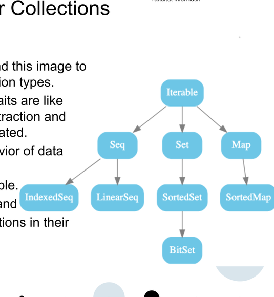
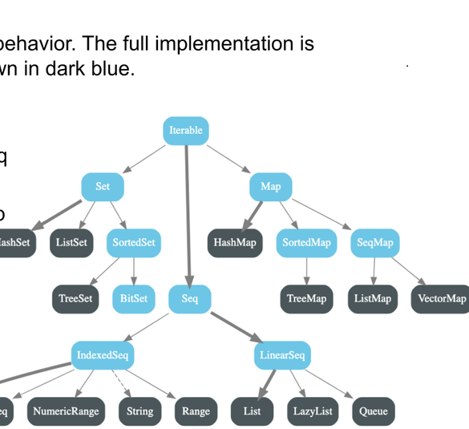

### Prof. Dr. Marko Boger, Prof. Dr. Pascal Laube
## Programmiertechnik I
# Lecture 12: Collections

<p class="small">Migrated from the Google Slides deck "PR-12-Collections" ("12 - Collections").</p>

---

<!-- _class: inhalt -->

# Goals

<div class="columns" style="grid-template-columns: 1fr 260px; align-items: start;">
<div markdown="1">

In this lecture you will learn about

- other generic types
- a type inheritance hierarchy
- traits

Supporting literature:

- Learn Scala 3 the Fast Way, chapter (to fill)

New Tools:

- ScalaDoc

</div>
<div markdown="1">


</div>
</div>

---

<!-- _class: kapitel -->

## 1
# Collections

Seq, Set, Map, and higher-order functions

---

# Review of Collections

We have seen List and Array.

- **Array** is mutable and allows random access at an index
- **List** is immutable and optimized for `head :: tail` operations
- We have also briefly touched **Range**, which is used in for loops
- **Vector** also had a mention – Vector is the immutable variant of Array

All these are **Collections**.

We have seen a number of methods on List, including two higher-order functions, `foreach` and `map`.
Now we will look at a few more Collections and their methods.

---

# Seq, Set, and Map

There are three fundamental types of Collections:

- **Seq**, a sequence of elements. List, Array, Vector and Range are Seqs.
  - Seqs can be **linear** or **indexed**. List is linear; Array, Vector and Range are indexed.
- **Set**, similar to Seq but elements are always unique.
  - Sets can be sorted or not sorted.
- **Map**, a data structure that allows the lookup of some data by a key, like a telephone book.
  - Also Maps can be sorted or not sorted.

---

<style scoped>
section { font-size: 20px; }
</style>

# A Hierarchy for Collections

<div class="columns" style="grid-template-columns: 1fr 1fr; align-items: start;">
<div markdown="1">

In the Scala documentation we find this image to represent the fundamental collection types.

- This hierarchy is built up of **traits**
- Traits are like classes that only describe an abstraction and cannot by themselves be instantiated
- Traits describe the common behavior of data types
- All collections share the trait **Iterable**
- **Seq**, **Set** and **Map** are also traits and describe the behavior of all collections in their branch

</div>
<div markdown="1">



</div>
</div>

---

<style scoped>
section { font-size: 18px; }
ul { margin: 0.15em 0; }
li { margin: 0.05em 0; }
</style>

# Traits and Classes

Traits only describe common behavior. The full implementation is provided in **classes** (dark blue).

- Default Set → `HashSet` · Default Iterable → `Seq` · Default Seq → `LinearSeq` → `List` · Default Map → `HashMap`
- We can create any of these – focus on **Set**, **Seq** and **Map**



---

# Trait Iterable

`Iterable` provides fundamental properties of all Collections.
`Iterable` implements:

- `foreach` and `for`
- iterator operations like `group` and `slide`
- `map` and `flatMap`
- `filter` and `filterNot`
- `take` and `drop`
- `zip`
- `partition`
- `fold` and `reduce`
- `exists` and `forall`
- `isEmpty` and `nonEmpty`

Many of these are **higher-order functions** – they take a function as parameter. So let’s take a look at that.

---

<style scoped>
pre { font-size: 15px; }
</style>

# Higher Order Functions – filterOdds

Let’s take a look at a filter algorithm. First, let’s filter all odds from a list:

```scala
def filterOdds(numbers: List[Int]): List[Int] = {
  numbers match {
    case Nil => Nil
    case head :: tail =>
      if (head % 2 != 0) head :: filterOdds(tail)
      else filterOdds(tail)
  }
}

filterOdds(List(5, 2, 3, 5, 3))
```

---

<style scoped>
pre { font-size: 15px; }
</style>

# Higher Order Functions – filterEvens

Now let’s filter all even numbers from a list:

```scala
def filterEvens(numbers: List[Int]): List[Int] = {
  numbers match {
    case Nil => Nil
    case head :: tail =>
      if (head % 2 == 0) head :: filterEvens(tail)
      else filterEvens(tail)
  }
}

filterEvens(List(5, 2, 3, 5, 3))
```

Note: the algorithm is identical except for the conditions `head % 2 != 0` and `head % 2 == 0`.

---

<style scoped>
pre { font-size: 15px; }
</style>

# Higher Order Functions – filterWith

So, let’s make the condition a parameter of the function:

```scala
def filterWith(numbers: List[Int], condition: (Int) => Boolean): List[Int] = {
  numbers match {
    case Nil => Nil
    case head :: tail =>
      if (condition(head)) head :: filterWith(tail, condition)
      else filterWith(tail, condition)
  }
}

filterWith(List(5, 2, 3, 5, 3), _ % 2 == 0)
```

---

# Higher Order Functions – filter

Now we can pass different functions as parameter:

```scala
filterWith(List(5, 2, 3, 5, 3), _ % 2 == 0)
filterWith(List(5, 2, 3, 5, 3), _ % 2 != 0)
filterWith(List(5, 2, 3, 5, 3), _ > 3)
filterWith(List(5, 2, 3, 5, 3), _ < 5)
filterWith(List(5, 2, 3, 5, 3), _ == 2)
```

Of course List already has a function `filter` and it looks like this:

```scala
List(5, 2, 3, 5, 3).filter(_ % 2 == 0)
List(5, 2, 3, 5, 3).filter(_ % 2 != 0)
List(5, 2, 3, 5, 3).filter(_ > 3)
List(5, 2, 3, 5, 3).filter(_ < 5)
List(5, 2, 3, 5, 3).filter(_ == 2)
```

Note: the first approach is procedural, the second object-oriented. Both are functional.

---

# Higher Order Function – partition

In a similar way, `partition` filters by a condition, but it returns **both** lists – those that do fulfill and don’t fulfill the condition – as a tuple:

```scala
case class Person(name: String, age: Int)
val people = List(
  Person("Anakin", 35), Person("Padme", 25),
  Person("Luke", 12), Person("Lea", 14)
)
val (minors, majors) = people.partition(_.age < 18)
```

---

<style scoped>
pre { font-size: 15px; }
</style>

# Higher Order Function – sum, product

Let’s implement a function `sum` over a list of Int:

```scala
def sum(numbers: List[Int], f: Int => Int): Int = {
  numbers match {
    case Nil          => 0
    case head :: tail => head + sum(tail, f)
  }
}
```

And a function for the product over a list of Int:

```scala
def product(numbers: List[Int], f: Int => Int): Int = {
  numbers match {
    case Nil          => 1
    case head :: tail => head * product(tail, f)
  }
}
```

Note: the difference is the `(0, 1)` and `(+, *)`.

---

<style scoped>
pre { font-size: 14px; }
</style>

# Higher Order Function – fold, reduce

If we pass these two differences in as parameter, we have an abstraction over sum and product:

```scala
def fold(numbers: List[Int], f: (Int, Int) => Int, initial: Int): Int = {
  numbers match {
    case Nil          => initial
    case head :: tail => f(head, fold(tail, f, initial))
  }
}
fold(List(1, 2, 3, 4, 5), _ + _, 0)
fold(List(1, 2, 3, 4, 5), _ * _, 1)
```

Of course, this already exists. Without initial value, it is called `reduce`:

```scala
List(1, 2, 3, 4, 5).reduce(_ + _)
List(1, 2, 3, 4, 5).reduce(_ * _)
```

With initial value, it is called `fold`; fold can operate from the left or right:

```scala
List(1, 2, 3, 4, 5).foldLeft(0)(_ + _)
List(1, 2, 3, 4, 5).foldLeft(1)(_ * _)
```

---

<style scoped>
pre { font-size: 15px; }
</style>

# Higher Order Functions – map

`map` is the mother of all higher-order functions. It just calls a function on every member of a collection.

```scala
def map(numbers: List[Int], f: Int => Int): List[Int] = {
  numbers match {
    case Nil          => Nil
    case head :: tail => f(head) :: map(tail, f)
  }
}

map(List(1, 2, 3, 4, 5), _ * 2)
```

It exists for all Collections and is implemented in the trait `Iterable`:

```scala
List(1, 2, 3, 4, 5).map(_ * 2)
```

---

<!-- _class: tools -->

## New Tools
# ScalaDoc

API documentation for the Scala standard library

---

<!-- _class: tools-page -->

# ScalaDoc

(Tool details to fill)

---

<!-- _class: inhalt -->

<style scoped>
section { font-size: 23px; }
</style>

# Summary

- Review: Array (mutable, random access) vs List (immutable, `head`/`tail`)
- Core collection kinds: `Seq`, `Set`, and `Map` (linear vs indexed sequences)
- Hierarchy built from traits; classes provide the default implementations
- `Iterable` shares `foreach`/`for`, iterators, and common HOFs
- Higher-order functions: `filter`, `partition`, `sum`/`product`, `fold`/`reduce`, `map`
- Tool mentioned: ScalaDoc for the standard library API

---

<!-- _class: aufgabe -->

# Task

(Task to fill)

---

<!-- _class: abschluss -->

# Questions?

## Thank you!

marko.boger@htwg-konstanz.de
