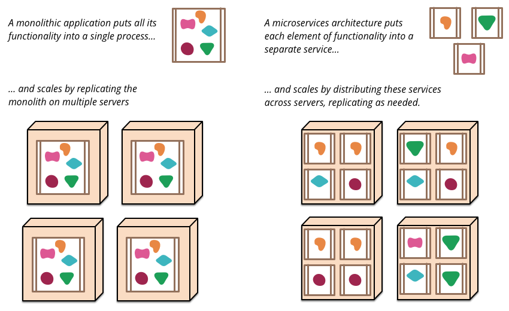
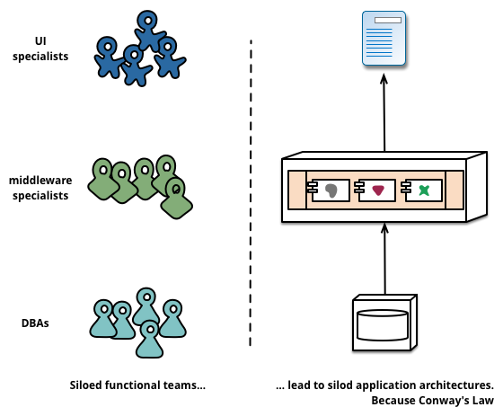
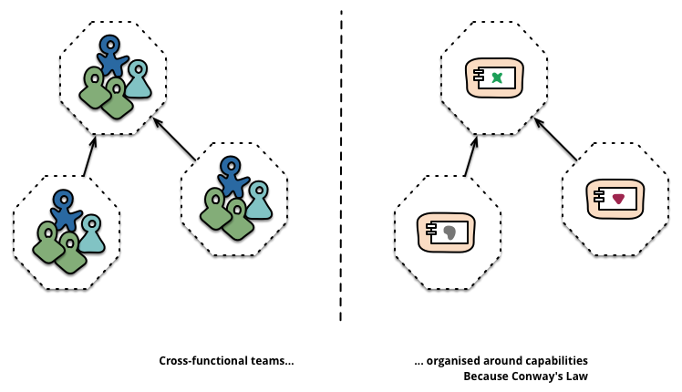
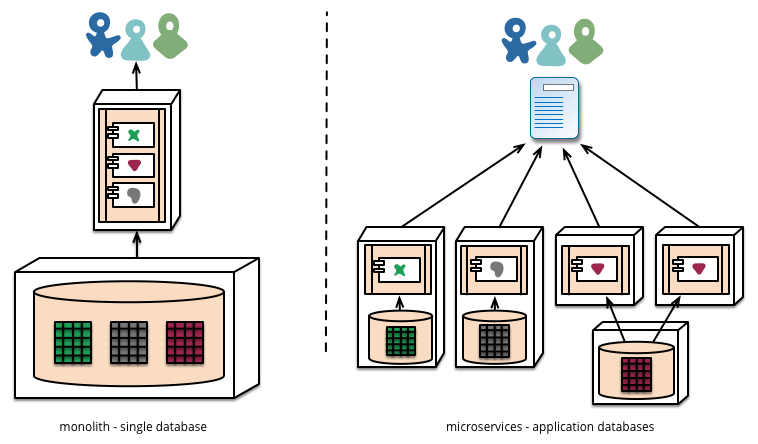
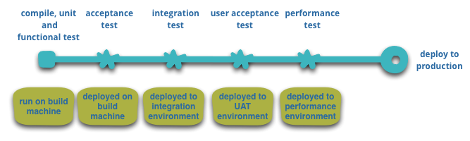
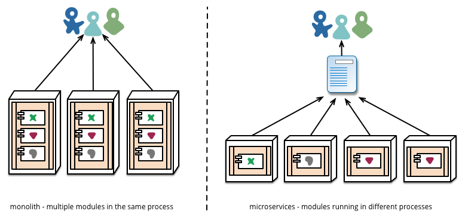

## Software Architecture with AI
# Lecture 05: Microservices

From monolith to independently deployable services.

Based on Martin Fowler / James Lewis, Spotify engineering publications, and AWS / Amazon material.

---

# Learning Goals

By the end of today, students should be able to:

- explain why teams split monoliths into services
- describe the core characteristics of a microservice architecture
- recognize the operational costs that come with distribution
- compare platform support at Spotify and Amazon
- decide when microservices are justified and when they are overkill

---

# From Monolith to Services

- a monolith is one deployable unit with one process boundary
- a microservice system is a suite of small, independently deployable services
- the goal is not "small code"
- the goal is better autonomy, deployability, and alignment with business capabilities

**Fowler's key point:** services become explicit boundaries in code, runtime, deployment, and team ownership.

---

# Why Teams Move Beyond the Monolith

- one small change can require rebuilding and redeploying the whole application
- scaling is often coarse-grained: the whole system scales together
- module boundaries tend to erode over time
- large codebases make ownership and reasoning harder

Microservices try to reduce coupling between change cycles.

---

# Business Capabilities, Not Technology Layers

- Fowler argues that service boundaries should follow business capabilities
- this means a team owns UI, logic, data, and operations for its area
- cross-functional teams reduce handovers between "frontend", "backend", and "database" silos

Typical service examples:

- ordering
- catalog
- payment
- recommendation
- notification

---

# Team Boundaries Reinforce Service Boundaries

- Conway's Law matters: organizations design systems that mirror communication structures
- if one team owns one bounded area end-to-end, the architecture tends to become clearer
- this is why microservices are as much an organization design choice as a technical one

Architecture and team topology evolve together.

---

# Core Characteristics of Microservices

- independently deployable services
- organization around business capability
- smart endpoints and dumb pipes
- decentralized governance
- decentralized data management
- strong infrastructure automation
- explicit design for failure
- evolutionary design instead of big upfront decomposition

Microservices are less a framework and more a bundle of architectural and operational practices.

---

# Smart Endpoints, Dumb Pipes

- put business logic into the services, not into a central integration monster
- prefer simple communication styles:
  - HTTP APIs
  - asynchronous messaging
  - coarse-grained contracts
- avoid recreating a distributed monolith through chatty RPC calls

Good question for every API call:

**Is this a real service boundary, or did we just move in-process method calls over the network?**

---

# Each Service Owns Its Data

- Fowler highlights decentralized data management as a major shift
- each service may own its own schema and even its own database technology
- this supports autonomy, but makes reporting and consistency harder

Consequences:

- no giant shared database as the integration hub
- more duplication of reference data
- eventual consistency becomes normal
- compensating actions become part of the design

---

# Infrastructure Automation Is Not Optional

- a monolith can survive with a mediocre deployment process
- dozens of services cannot
- microservices require automation in:
  - build
  - test
  - deployment
  - provisioning
  - monitoring
  - rollback

Without platform support, teams drown in operational complexity.

---

# Operating Many Services Changes Everything

- deployment topologies become more complex
- local debugging gets harder
- observability becomes a first-class requirement
- resilience patterns matter:
  - timeouts
  - retries
  - circuit breakers
  - bulkheads

Distributed systems fail in partial and surprising ways.

---

# The Hidden Costs

- network latency replaces local method calls
- failures become partial, asynchronous, and harder to reproduce
- testing needs contract, integration, and end-to-end layers
- data consistency becomes a business decision, not just a database setting
- developers need platform, logging, tracing, and deployment literacy

Microservices buy team autonomy by increasing system complexity.

---

# Spotify Example: Platform First

- Spotify built Backstage as an internal developer portal to reduce infrastructure fragmentation
- Backstage gives engineers one place to find service ownership, APIs, docs, templates, and tooling
- Spotify describes it as a central software catalog and abstraction layer over infrastructure
- published Spotify material highlights service discovery, software templates, documentation, and plugin-based workflows in one portal

Why this matters:

- microservices multiply cognitive load
- platform engineering is how large organizations keep service sprawl manageable

---

# Spotify Infrastructure Lessons

- self-service service creation matters
- ownership metadata matters
- discoverability matters
- a plugin platform matters because one tool never covers everything

Published Spotify examples emphasize:

- automated templates for creating new services
- a centralized catalog of software components and APIs
- TechDocs and catalog metadata to make ownership explicit
- a common developer portal instead of tribal knowledge

For us, the lesson is simple:

**Microservices scale better when platform capabilities scale first.**

---

# Amazon Example: Services and Two-Pizza Teams

- Amazon describes a move from tightly coupled systems toward a vast network of standalone services
- their organizational counterpart was the two-pizza team: small autonomous teams with end-to-end ownership
- each team focuses on a single service or offering, stays close to customers, and owns operations as well as delivery
- AWS material connects this directly to speed, agility, and experimentation

Architecture decision:

- split systems so that teams can move independently

Organization decision:

- give those teams single-threaded ownership

---

# Amazon Infrastructure Lessons

- "you build it, you run it" requires strong operational engineering
- Amazon's Builders' Library highlights practices for large-scale operation:
  - very high deployment automation
  - resilience patterns such as shuffle sharding
  - fault isolation
  - gradual rollout
  - deep metrics and observability

Amazon has publicly described software delivery at a scale of more than 150 million deployments per year across Amazon builders.

Microservices were not the whole answer at Amazon.

They were paired with:

- autonomous teams
- engineering guardrails
- operational excellence
- strong internal platforms

---

# When Microservices Make Sense

- multiple teams need to deliver independently
- different parts of the system scale differently
- domains are clear enough to separate responsibly
- deployment frequency is high
- the organization can invest in platform engineering and observability

Good fit:

- large products
- long-lived systems
- organizations with multiple product teams

---

# When a Monolith Is Better

- the product is early and still searching for its domain boundaries
- one team can still understand the whole system
- operations capacity is limited
- deployment is infrequent
- transactional consistency is more important than independent releases

Rule of thumb:

**A well-structured monolith is often the right starting point.**

---

# Migration Guidance

1. start from business capabilities, not from classes or packages
2. improve modularity inside the monolith first
3. extract only where a boundary is already painful and clear
4. automate build, test, deploy, logging, and tracing before large-scale extraction
5. keep service interfaces coarse-grained
6. expect organizational change, not just code movement

Microservices are a socio-technical refactoring.

---

# Takeaways

- microservices are about independent deployability and bounded ownership
- team structure and system structure shape each other
- decentralized data and automation are core parts of the model
- Spotify shows the value of internal platform tooling
- Amazon shows the value of small autonomous teams plus operational discipline
- use microservices when the benefits of autonomy outweigh the cost of distribution

---

# Sources

- Martin Fowler / James Lewis: <https://martinfowler.com/articles/microservices.html>
- Spotify Engineering, "How We Use Backstage at Spotify": <https://engineering.atspotify.com/2020/04/how-we-use-backstage-at-spotify>
- Spotify Engineering, "Supercharged Developer Portals": <https://engineering.atspotify.com/2024/04/supercharged-developer-portals/>
- Backstage docs, "The Spotify Story": <https://backstage.io/docs/overview/background>
- AWS Executive Insights, "Amazon's Two Pizza Teams": <https://aws.amazon.com/executive-insights/content/amazon-two-pizza-team/>
- AWS, "The Amazon Builders' Library": <https://aws.amazon.com/builders-library/>
