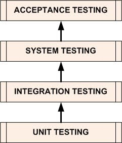

<!-- _class: title -->
## Software Architecture with AI
# Lecture 08: Performance Testing

From “it works” to **it stays fast under load**.

<p class="small">k6, modern test design, and JVM benchmarking (JMH)</p>

---
<div class="columns">
<div>

# Types of Testing

- Unit Testing
  - Individual units of a software like functions, classes or components are tested in isolation.
- Integration Testing
  - Individual units are combined and tested as a group. 
- System Testing
  - A complete, integrated system is tested.
- Acceptance Testing
 - A system and how it is used by its users is tested.

</div>

<div>



</div>
</div>

---
<div class="columns">
<div>

# Unit Testing

Unit testing validates the correct functionality of individual components in isolation.

- Done during development
- Focuses on smallest testable parts (methods, functions)
- Does not focus on non-functional aspects
- Does not put application under strain

</div>

<div>


</div>
</div>

---

<div class="columns">
<div>

# Integration Testing

Integration testing validates how components work together.

- Individual units combined and tested as a group
- Exposes faults in interaction between integrated units
- Uses test drivers and test stubs
- **Black Box**: internal structure unknown to tester
- **White Box**: internal structure known to tester

</div>

<div>


</div>
</div>

---

<div class="columns">
<div>

# System Testing

System testing validates the complete integrated system.

- Entire system tested as a whole
- Focus shifts from functional to non-functional aspects
- **Performance testing** is an important form of system testing

</div>

<div>


</div>
</div>

---

<div class="columns">
<div>

# Acceptance Testing

Acceptance testing ensures the system meets user needs.

- Done after the system functions as a whole
- Tests if all business requirements are met
- Validates system suitability for intended users
- Usually done by the client, not the provider

</div>

<div>


</div>
</div>

----

<div class="columns">
<div>

# Performance Testing

Performance testing is **non-functional testing** to determine how a system performs in terms of:

- **responsiveness** (latency)
- **stability** (error behavior under load)
- **scalability** (how performance changes as load increases)
- **resource usage** (CPU, memory, IO, network)

Goal: **find bottlenecks, fix them, and prove the improvement.**

</div>
<div>


</div>
</div>

---

<div class="columns">
<div>

# Types of Performance Testing

- **Load testing**
  - expected (realistic) workload
- **Stress testing**
  - push beyond capacity until degradation/failure
- **Volume testing**
  - large datasets (e.g. DB size, payload size)
- **Endurance testing**
  - steady load for a long time (leaks, fragmentation, slow degradation)
- **Spike testing**
  - sudden load increase (autoscaling, queues, rate limiting)

</div>
<div>


</div>
</div>

---
<div class="columns">
<div>

# Load Testing

A load test answers:

- what happens under **expected concurrency / request rate**?
- do latency SLOs still hold?
- do error rates stay low?
- do we have enough headroom?

Load tests should be:

- repeatable
- measurable
- comparable across runs (same version, same environment, same data)

</div>
<div>


</div>
</div>

---
<div class="columns">
<div>

# Stress Testing

Stress testing answers:

- where is the **capacity limit**?
- how does the system fail (gracefully, or catastrophically)?
- what breaks first: CPU, DB pool, GC, external dependency, network?

Good stress tests include:

- clear stop criteria (too many errors / too slow)
- clear recovery criteria (system returns to normal after load drops)

</div>
<div>


</div>
</div>

---
<div class="columns">
<div>

# Volume / Endurance / Spike

**Volume**
- the data is the “load”
- typical failures: slow queries, indexes missing, caches ineffective

**Endurance (soak)**
- typical failures: memory leaks, connection leaks, queue growth, GC pressure

**Spike**
- typical failures: thread pool exhaustion, rate-limits, autoscaling delays

</div>
<div>


</div>
</div>

---
<div class="columns">
<div>

# Performance Metrics

Common meanings of “performance”:

- **Throughput**
  - measures the system's ability to handle a large number of requests or transactions in a given time period
  - system perspective
  - requests/second, jobs/minute, messages/second
- **Response time**
  - measures the time it takes for the system to respond to a request
  - user perspective
  - milliseconds, seconds
- **Scalability**
  - how throughput/latency change with users, data size, and resources
- **Resource utilization**
  - CPU, memory, disk, network, database connections
  - hardware perspective
- **Reliability**
  - system uptime, mean time between failures (MTBF), mean time to recovery (MTTR)
  - operational perspective
  - Error rate (HTTP 5xx, timeouts)

---
<div class="columns">  
<div>
# Before You Optimize

> “Premature optimization is the root of all evil.”  
> — Donald Knuth

Reasons not to optimize first:

- you will introduce bugs
- you will reduce maintainability
- you may optimize the wrong thing

Rule of thumb:

**Measure first. Optimize where it matters. Re-measure.**

</div>
<div>


</div>
</div>

---


# General Rule

- first build the system
- then make it fast
- bottlenecks are not where you expect them
- improve only where you get measurable benefit

Key insight:

**Large performance improvements are often architectural, not micro-level tweaks.**

---

# Modern Tooling Overview

You need two different kinds of tests:

- **System-level load tests** (HTTP, queues, services)
  - focus: end-to-end latency, errors, saturation
  - tool today: **k6**
- **Microbenchmarks** (hot loops, algorithms, parsing, serialization)
  - focus: CPU cost of a small unit
  - tool today: **JMH** (Java Microbenchmark Harness)

They answer different questions.

---

# What We Test in a Web System

Define “critical user journeys”:

- login / session creation
- search / browse / list view
- “write” operations (create/update)
- import/export

For each journey define:

- concurrency or request rate
- realistic payloads and data sizes
- success criteria (SLOs) and stop criteria

---

# From “Script” to “Experiment”

Performance tests are experiments:

- control variables: version, config, data, environment, load model
- observe: latency, throughput, errors, saturation, logs/traces
- compare: baseline vs. change

Deliverable is not “a script”.

Deliverable is **evidence**.

---

<!-- _class: compact -->
# k6

## Why k6?

- modern developer workflow (JS/TS test scripts)
- good load models (stages, arrival-rate, scenarios)
- thresholds (pass/fail) for CI
- easy outputs (JSON, Prometheus remote write, Cloud)

---

# k6: Minimal Example

```javascript
import http from "k6/http";
import { check, sleep } from "k6";

export const options = {
  stages: [
    { duration: "30s", target: 10 },
    { duration: "1m", target: 10 },
    { duration: "30s", target: 0 },
  ],
  thresholds: {
    http_req_failed: ["rate<0.01"],
    http_req_duration: ["p(95)<400"],
  },
};

export default function () {
  const res = http.get("http://localhost:8080/api/health");
  check(res, { "status is 200": (r) => r.status === 200 });
  sleep(1);
}
```

---

# k6: Test Design Notes

Avoid common mistakes:

- do not load test with a single endpoint only
- do not ignore **data realism**
- do not ignore **p95/p99**
- do not test without observing system saturation

Good practice:

- start with a short smoke load
- add one scenario at a time
- add thresholds early so CI can fail fast

---

# k6: Scenarios (multiple journeys)

```javascript
import http from "k6/http";
import { sleep } from "k6";

export const options = {
  scenarios: {
    browse: {
      executor: "ramping-vus",
      stages: [
        { duration: "30s", target: 20 },
        { duration: "2m", target: 50 },
        { duration: "30s", target: 0 },
      ],
      exec: "browse",
    },
    write: {
      executor: "constant-arrival-rate",
      rate: 30,
      timeUnit: "1s",
      duration: "2m",
      preAllocatedVUs: 50,
      maxVUs: 200,
      exec: "write",
    },
  },
};

export function browse() {
  http.get("http://localhost:8080/api/items?limit=20");
  sleep(0.3);
}

export function write() {
  http.post("http://localhost:8080/api/items", JSON.stringify({ name: "x" }), {
    headers: { "Content-Type": "application/json" },
  });
  sleep(0.1);
}
```

---

<!-- _class: compact -->
# Gatling

## Why Gatling?

- **Code-first** approach (Scala DSL)
- Powerful scenario design and composition
- Excellent reporting and visualization
- Mature ecosystem with commercial support
- Strong integration with CI/CD pipelines

---

# Gatling: Open Source vs Commercial

Gatling has a **split model**:

**Gatling Open Source**
- Free, Apache 2.0 licensed
- Core load testing engine
- Scala DSL for test scenarios
- HTML reports
- Ideal for most use cases

**Gatling Enterprise**
- Commercial offering by Gatling Corp
- Advanced reporting and dashboards
- SaaS or self-hosted options
- Team collaboration features
- Advanced analytics and alerting

Both use the same test scripts—portable between versions.

---

# Gatling: Code-First Philosophy

Gatling treats performance tests as **code**, not GUI configurations:

- Tests are written in **Scala** (or Java)
- Version-controlled like application code
- Composable and reusable
- IDE support with autocomplete and refactoring
- Easy to parameterize and generate data

Benefits:

- Maintainable test suites
- Easy code review
- Can be tested and validated like regular code
- Enables test generation and automation

---

# Gatling: Minimal Example

```scala
import io.gatling.core.Predef._
import io.gatling.http.Predef._
import scala.concurrent.duration._

class BasicSimulation extends Simulation {

  val httpProtocol = http
    .baseUrl("http://localhost:8080")
    .acceptHeader("application/json")

  val scn = scenario("Basic Load Test")
    .exec(http("Health Check")
      .get("/api/health")
      .check(status.is(200)))

  setUp(
    scn.inject(
      rampUsers(10) during (30 seconds),
      constantUsersPerSec(10) during (1 minute),
      rampUsers(0) during (30 seconds)
    )
  ).protocols(httpProtocol)
}
```

---

# Gatling: Scenario Composition

```scala
import io.gatling.core.Predef._
import io.gatling.http.Predef._
import scala.concurrent.duration._

class UserJourneySimulation extends Simulation {

  val httpProtocol = http
    .baseUrl("http://localhost:8080")
    .acceptHeader("application/json")

  val browse = scenario("Browse Items")
    .exec(http("List Items")
      .get("/api/items?limit=20")
      .check(status.is(200)))
    .pause(300 milliseconds)

  val write = scenario("Create Item")
    .exec(http("Create Item")
      .post("/api/items")
      .body(StringBody("""{"name": "test"}""")).asJson
      .check(status.is(201)))
    .pause(100 milliseconds)

  setUp(
    browse.inject(rampUsers(20) during (30 seconds)),
    write.inject(constantUsersPerSec(30) during (2 minutes))
  ).protocols(httpProtocol)
}
```

---

# Gatling: Feeder Pattern

Gatling makes it easy to inject realistic test data:

```scala
val feeder = csv("users.csv").circular // random, queue, circular

val scn = scenario("Login Flow")
    .feed(feeder)
    .exec(http("Login")
      .post("/api/login")
      .body(StringBody("""{"username": "${username}", "password": "${password}"}""")).asJson
      .check(status.is(200)))

// users.csv:
// username,password
// alice,secret1
// bob,secret2
// charlie,secret3
```

Feeders support CSV, JSON, JDBC, and custom data sources.

---

# Performance Observability (minimum)

For meaningful load tests you need:

- **metrics**: CPU, memory, GC, DB pool, queue length, request latency
- **logs**: errors, timeouts, backpressure signals
- **traces** (optional but powerful): where the latency is spent

Rule:

**If you cannot observe, you cannot tune.**

---

# CI Integration Idea

Make performance tests part of engineering discipline:

- run a **short smoke load** on every pull request (minutes)
- run a **heavier nightly test** (tens of minutes)
- store artifacts: k6 summary, JSON output, charts

Pass/fail:

- use k6 **thresholds** as the gate

---

<!-- _class: compact -->
# JVM Benchmarking

## When load tests are the wrong tool

Load tests are great for:
- DB pools
- network latency
- caches
- distributed dependencies

But load tests are bad to answer:
- “is algorithm A faster than B?”
- “is parsing function X faster after my change?”

For that, use **JMH**.

---

# Why Microbenchmarking is Hard

On the JVM, performance is affected by:

- JIT compilation (warmup!)
- inlining and dead-code elimination
- GC behavior and allocation rate
- CPU frequency scaling and OS noise

This is why “just measure time in a unit test” is unreliable.

---

# JMH: Minimal Example

```java
import org.openjdk.jmh.annotations.*;
import java.util.concurrent.TimeUnit;

@BenchmarkMode(Mode.AverageTime)
@OutputTimeUnit(TimeUnit.NANOSECONDS)
@Warmup(iterations = 5, time = 1)
@Measurement(iterations = 5, time = 1)
@Fork(2)
@State(Scope.Thread)
public class ParseBenchmark {

  private String input;

  @Setup
  public void setup() {
    input = "e2e4";
  }

  @Benchmark
  public int parseMove() {
    return input.hashCode(); // placeholder for real parsing work
  }
}
```

Key ideas:

- warmup + measurement
- forks (separate JVMs)
- controlled state

---

# Combining Both Worlds

Use both kinds of evidence:

- **k6** tells you: end-to-end behavior and bottlenecks under load
- **JMH** tells you: CPU cost of a small unit (hot code path)

Typical workflow:

1. k6 reveals slow endpoint
2. profiling reveals hot function
3. JMH compares alternative implementations
4. k6 validates system-level improvement

---

# Alternatives to “Micro-Optimization”

Often cheaper and safer than low-level tweaks:

- better caching strategy
- batching and reducing round trips
- indexing and query shaping
- asynchronous processing and queues
- backpressure and rate limiting
- right-sized connection pools
- avoid N+1 calls across services

Architecture dominates.

---

# Architecture-Level Performance Patterns

Some patterns commonly used for performance:

- **Flyweight** (share intrinsic state, reduce memory footprint)
- **Object Pool** (avoid expensive creation, but watch contention and leaks)
- **Prototype** (clone vs. construct)
- **Proxy** (defer work, cache results, control access)

Design note:

Use patterns as **tools**, not as decorations.

---

<!-- _class: compact -->
# Task Assignment (updated)

## Performance testing + benchmarking loop

1. Create a **k6** test:
2. Create a **Gatling** test
3. Define **thresholds** (p95 latency + error rate) and make the run reproducible.
4. Add one **JMH benchmark** for a hot function in your codebase (e.g. parsing/serialization).
5. Run baseline → optimize → rerun.
6. Deliver evidence:
   - k6 summary + a short note about bottleneck and fix
   - Gatling summary + a short note about bottleneck and fix
   - JMH before/after numbers
7. Establish a baseline 
8. Find optimization and measure improvement

