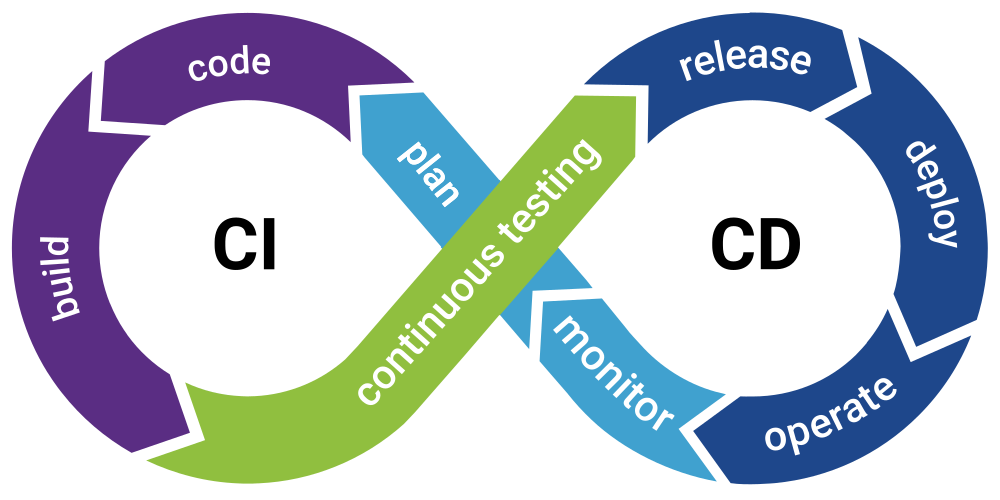
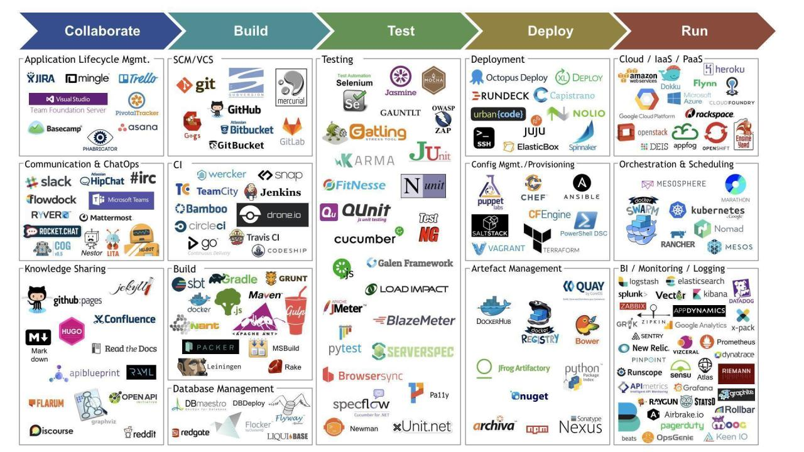
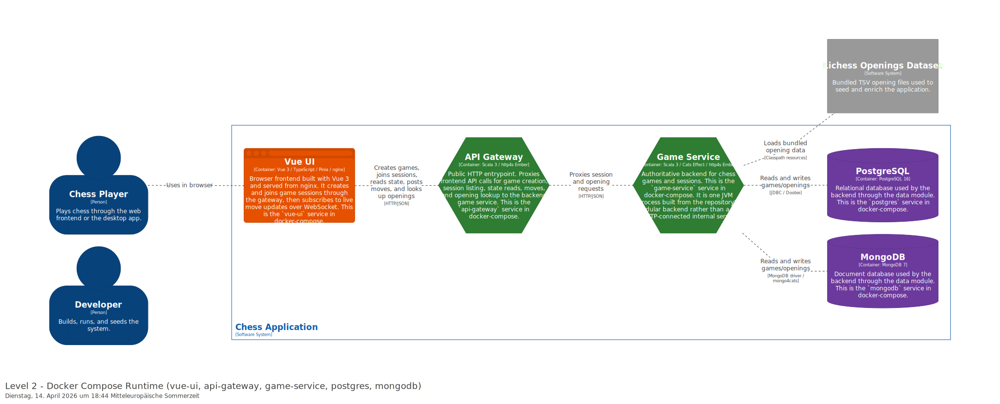
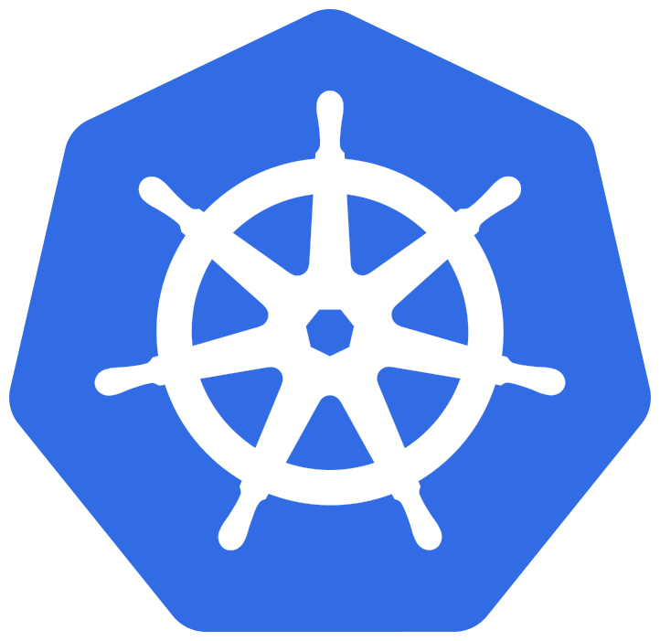

### Prof. Dr. Marko Boger
## Software Architecture 
# Lecture 09: Deployment

From development to production.

<p class="small">Docker → Compose → Kubernetes → k3s → k3d → Keycloak</p>

---

# Learning Goals

- review **docker containers** for local development
- extend to **Docker Compose** as a local multi-service runtime 
- introduction to **Kubernetes** as a production deployment environment
- compare **k3s** vs. “full” Kubernetes and when each fits
- use **k3d** to spin up a disposable cluster on a laptop
- position **Keycloak** as identity and access management in front of services

---

# Continuous Integration/ Continuous Deployment
## CI/CD

Continuous integration (CI) is the practice integrating code changes continuously to their shared code base. Integration is done every time all tests for a new feature/bug fix pass. It triggers automated testing on a centralized server.


Continuous delivery (CD) is the automated delivery of completed code to deployment environment for integration and acceptance tests. CD provides an automated and consistent way for code to be delivered to these environments.


Continuous deployment is the next step of continuous delivery. Every change that passes the automated tests is automatically placed in production, resulting in many production deployments.


Continuous deployment should be the goal of most companies that are not constrained by regulatory or other requirements.



---


# DevOps
DevOps is a cultural and technical approach merging software development (Dev) and IT operations (Ops) to accelerate delivery, improve software quality, and increase reliability through automation, collaboration, and shared responsibility. It breaks down silos between teams, enabling faster, more frequent, and reliable releases using tools like CI/CD, monitoring, and cloud services.

What made DevOps possible is Docker. Docker makes the know-how of operators accessible in open-source deployment patterns and makes it repeatable.



---

<div class="columns">

<div markdown="1">

# Docker

## What it does

- packages your app with its **runtime dependencies** into an **image**
- runs that image as an **isolated container** on a shared Linux kernel
- uses **layers** and a union filesystem for efficient storage and caching

Docker is not a VM: it virtualizes **userspace**, not a full hardware machine.

</div>

<div markdown="1">


</div>

</div>

---

# Docker: Typical Commands

```bash
docker version
docker build -t myapp:1.0 .
docker run --rm -p 8080:8080 myapp:1.0
docker ps
docker logs <container_id>
docker stop <container_id>
```

Concepts to remember:

- **image** = blueprint
- **container** = running instance
- **registry** = image storage (Docker Hub, GHCR, ECR, …)

---

# Docker: Install

**macOS / Windows (recommended for beginners)**

- install **Docker Desktop** from Docker’s documentation: <https://docs.docker.com/desktop/>

**Linux**

- follow the **engine** install guide for your distribution: <https://docs.docker.com/engine/install/>

Verify:

```bash
docker run --rm hello-world
```

---

# Example: `Dockerfile`

```dockerfile
# syntax=docker/dockerfile:1
FROM eclipse-temurin:21-jre-alpine
WORKDIR /app
COPY target/myapp.jar /app/app.jar
EXPOSE 8080
USER nobody
ENTRYPOINT ["java", "-jar", "/app/app.jar"]
```

Build and run:

```bash
docker build -t chess-api:local .
docker run --rm -p 8080:8080 chess-api:local
```

---

<div class="columns">
<div markdown="1">

# Docker Compose

## What it does

- describes **multiple containers** (services), networks, and volumes in **one file**
- gives you **one command** to start the whole dev stack (`docker compose up`)
- encodes **dependencies** between services (start order, health checks)

Compose is ideal for **local development** and **small staging** setups.

</div>
<div markdown="1">



<p class="small">Course example: multi-container chess stack (Vue UI, gateway, game service, databases).</p>

</div>
</div>

---

# Docker Compose: Install

Modern Docker Desktop ships the **Compose v2 plugin** (`docker compose`).

Check:

```bash
docker compose version
```

On Linux without Desktop, install the **Compose plugin** per Docker docs: <https://docs.docker.com/compose/install/linux/>

---

# Example: `compose.yaml`

```yaml
services:
  api:
    build: ./api
    ports:
      - "8080:8080"
    environment:
      - DATABASE_URL=postgres://db:5432/app
    depends_on:
      - db

  db:
    image: postgres:16-alpine
    environment:
      POSTGRES_PASSWORD: example
    volumes:
      - pgdata:/var/lib/postgresql/data

volumes:
  pgdata: {}
```

Run:

```bash
docker compose up --build
```

---

# Compose vs. Kubernetes (mental model)

| | **Compose** | **Kubernetes** |
| --- | --- | --- |
| **Best for** | laptop / CI / small stacks | production clusters |
| **Scheduling** | single engine node | many nodes, controllers |
| **Scaling** | `scale` (limited) | replicas, HPA, PDBs |
| **Networking** | bridge networks | Services, Ingress, CNI |

Compose teaches **service graphs**. Kubernetes adds **cluster operations**.

---

<div class="columns">
<div markdown="1">

# Kubernetes

*(English “Kubernetes”, often abbreviated **K8s**.)*

## What it does

- places **Pods** (one or more containers) onto **Nodes**
- keeps **desired state** (replicas, rolling updates, rollbacks)
- exposes workloads via **Services** and **Ingress**
- attaches storage with **PersistentVolumes**

The **control plane** decides *what runs where*; **kubelet** on each node makes it real.

</div>
<div markdown="1">



<p class="small">Official-style mark (Wikimedia).</p>

</div>
</div>

---

# Kubernetes: Control Plane (diagram)


<p class="small">Source: Kubernetes documentation (<code>kubernetes.io</code>).</p>

---

# Kubernetes: Install `kubectl`

`kubectl` is the CLI to talk to **any** Kubernetes API server.

**macOS (Homebrew)**

```bash
brew install kubectl
```

**Linux**

```bash
curl -LO "https://dl.k8s.io/release/$(curl -L -s https://dl.k8s.io/release/stable.txt)/bin/linux/amd64/kubectl"
sudo install -o root -g root -m 0755 kubectl /usr/local/bin/kubectl
kubectl version --client
```

Docs: <https://kubernetes.io/docs/tasks/tools/>

---

# Example: `deployment.yaml`

```yaml
apiVersion: apps/v1
kind: Deployment
metadata:
  name: api
spec:
  replicas: 2
  selector:
    matchLabels:
      app: api
  template:
    metadata:
      labels:
        app: api
    spec:
      containers:
        - name: api
          image: ghcr.io/example/chess-api:1.0.0
          ports:
            - containerPort: 8080
```

Apply:

```bash
kubectl apply -f deployment.yaml
kubectl get pods
```

---

# Example: `service.yaml`

```yaml
apiVersion: v1
kind: Service
metadata:
  name: api
spec:
  selector:
    app: api
  ports:
    - port: 80
      targetPort: 8080
```

Inside the cluster, other Pods reach `http://api`.

---

<div class="columns">
<div markdown="1">

# k3s

## What it does

- a **minimal, certified Kubernetes distribution** by SUSE / Rancher
- ships as a **single binary** plus bundled container runtime
- targets **edge**, **CI**, **IoT**, and **small clusters** where you want K8s APIs without full platform weight

Think: “Kubernetes semantics, smaller footprint.”

</div>
<div markdown="1">


<p class="small">Logo from k3s documentation site.</p>

</div>
</div>

---

# k3s: Install (Linux, quick start)

Official install script (requires root on the node):

```bash
curl -sfL https://get.k3s.io | sh -
sudo k3s kubectl get nodes
```

Copy kubeconfig for `kubectl`:

```bash
sudo cat /etc/rancher/k3s/k3s.yaml
```

Docs: <https://docs.k3s.io/installation>

---

<div class="columns">
<div markdown="1">

# k3d

## What it does

- runs **k3s inside Docker containers**
- creates **multi-node clusters on your laptop** in minutes
- ideal for **learning**, **integration tests**, and **CI pipelines** that need a real API server

Relationship:

**Docker → hosts → k3d → launches → k3s nodes → Kubernetes API**

</div>
<div markdown="1">


</div>
</div>

---

# k3d: Install

**macOS**

```bash
brew install k3d
```

**Generic (install script)**

```bash
curl -s https://raw.githubusercontent.com/k3d-io/k3d/main/install.sh | bash
k3d version
```

Docs: <https://k3d.io/>

---

# k3d: Example Session

```bash
k3d cluster create demo --agents 2
kubectl config use-context k3d-demo
kubectl get nodes

kubectl create deployment api --image=nginx:alpine
kubectl expose deployment api --port=80 --target-port=80

kubectl port-forward svc/api 8080:80
```

Delete everything:

```bash
k3d cluster delete demo
```

---

<div class="columns">
<div markdown="1">

# Keycloak

## What it does

- **Identity and Access Management (IAM)**
- issues tokens for **OpenID Connect** and supports **SAML**
- central place for **users, roles, clients**, and **identity brokering**

Typical pattern:

`Browser / SPA → Keycloak (login) → access token → your API (JWT validation)`

</div>
<div markdown="1">


</div>
</div>

---

# Keycloak: Install (Docker Compose sketch)

```yaml
services:
  keycloak:
    image: quay.io/keycloak/keycloak:26.0
    command:
      - start-dev
    environment:
      KEYCLOAK_ADMIN: admin
      KEYCLOAK_ADMIN_PASSWORD: admin
    ports:
      - "8080:8080"
```

Run:

```bash
docker compose up
```

Open `http://localhost:8080`, create a **realm**, a **client**, and a test user.

Docs: <https://www.keycloak.org/getting-started/getting-started-docker>

---

# Putting Identity in Front of the Stack

```text
Internet
   │
   ▼
Ingress / API Gateway
   │
   ├──► Keycloak (login, token issuance)
   │
   └──► Your services (validate JWT, enforce scopes)
```

In Kubernetes, Keycloak is usually:

- a **Deployment + Service**
- optionally behind the same **Ingress** as your apps
- configured with **Secrets** for admin passwords and DB credentials

---

# Operations Checklist (short)

- **images** are versioned tags, not `:latest` in production
- **health checks** exist for every long-running container
- **logs and metrics** leave the container (stdout + collector)
- **secrets** never live in Git; use secret stores or sealed patterns
- **rollbacks** are practiced before you need them at 3 a.m.

---

<!-- _class: compact -->
# Task Suggestion

1. Review **Dockerfiles** for your project
2. Extend **Docker Compose** to locally test all your services
3. Create a **k3d** cluster and deploy the same stack with **Kubernetes manifests** 
4. Deploy on your assigned virtual server
5. Optional: include **Keycloak** in Compose, create a realm and client to manage access rights.


