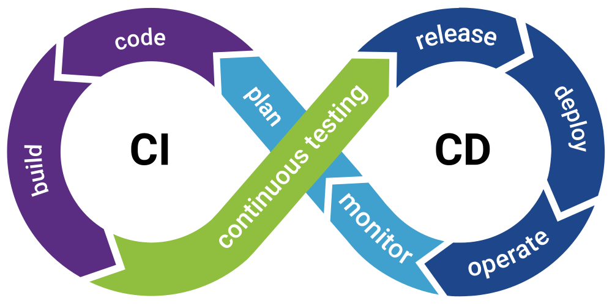
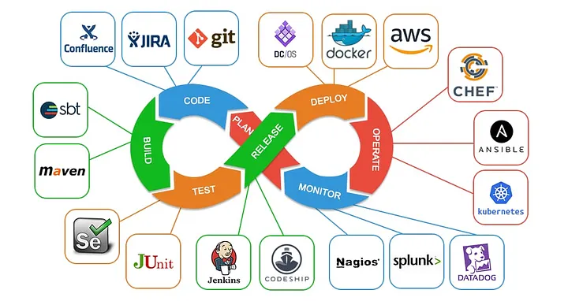
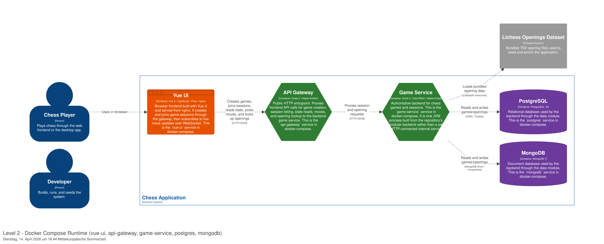

### Prof. Dr. Marko Boger
## Software Architecture 
# Lecture 09: Deployment

From development to production.

<p class="small">Docker → Compose → Nginx / Traefik → Kubernetes → k3s → k3d → Keycloak → Lichess bot API (optional)</p>

---

# Learning Goals

- review **docker containers** for local development
- extend to **Docker Compose** as a local multi-service runtime 
- introduction to **Kubernetes** as a production deployment environment
- compare **k3s** vs. “full” Kubernetes and when each fits
- use **k3d** to spin up a disposable cluster on a laptop
- position **Keycloak** as identity and access management in front of services
- explain how **Nginx** and **Traefik** terminate HTTP, route traffic, and fit into Compose and Kubernetes
- (optional) outline how a **Lichess bot account** consumes the **Bot HTTP API** to play other bots

---

# Continuous Integration/ Continuous Deployment
## CI/CD

Continuous integration (CI) is the practice integrating code changes continuously to their shared code base. Integration is done every time all tests for a new feature/bug fix pass. It triggers automated testing on a centralized server.


Continuous delivery (CD) is the automated delivery of completed code to deployment environment for integration and acceptance tests. CD provides an automated and consistent way for code to be delivered to these environments.




---


# DevOps
DevOps is a cultural and technical approach merging software development (Dev) and IT operations (Ops) to accelerate delivery, improve software quality, and increase reliability through automation, collaboration, and shared responsibility. It breaks down silos between teams, enabling faster, more frequent, and reliable releases using tools like CI/CD, monitoring, and cloud services.

What made DevOps possible is Docker. Docker makes the know-how of operators accessible in open-source deployment patterns and makes it repeatable.


---

# Docker

## What it does

- packages your app with its **runtime dependencies** into an **image**
- runs that image as an **isolated container** on a shared Linux kernel
- uses **layers** and a union filesystem for efficient storage and caching

Docker is not a VM: it virtualizes **userspace**, not a full hardware machine.


---

# Docker: Typical Commands

```bash
docker version
docker build -t myapp:1.0 .
docker run --rm -p 8080:8080 myapp:1.0
docker ps
docker logs <container_id>
docker stop <container_id>
```

Concepts to remember:

- **image** = blueprint
- **container** = running instance
- **registry** = image storage (Docker Hub, GHCR, ECR, …)

---

# Docker: Install

**macOS / Windows (recommended for beginners)**

- install **Docker Desktop** from Docker’s documentation: <https://docs.docker.com/desktop/>

**Linux**

- follow the **engine** install guide for your distribution: <https://docs.docker.com/engine/install/>

Verify:

```bash
docker run --rm hello-world
```

---

# Example: `Dockerfile`

```dockerfile
# syntax=docker/dockerfile:1
FROM eclipse-temurin:21-jre-alpine
WORKDIR /app
COPY target/myapp.jar /app/app.jar
EXPOSE 8080
USER nobody
ENTRYPOINT ["java", "-jar", "/app/app.jar"]
```

Build and run:

```bash
docker build -t chess-api:local .
docker run --rm -p 8080:8080 chess-api:local
```

---

# Docker Compose

## What it does

- describes **multiple containers** (services), networks, and volumes in **one file**
- gives you **one command** to start the whole dev stack (`docker compose up`)
- encodes **dependencies** between services (start order, health checks)

Compose is ideal for **local development** and **small staging** setups.



---

# Docker Compose: Install

Modern Docker Desktop ships the **Compose v2 plugin** (`docker compose`).

Check:

```bash
docker compose version
```

On Linux without Desktop, install the **Compose plugin** per Docker docs: <https://docs.docker.com/compose/install/linux/>

---

# Example: `compose.yaml`

```yaml
services:
  api:
    build: ./api
    ports:
      - "8080:8080"
    environment:
      - DATABASE_URL=postgres://db:5432/app
    depends_on:
      - db

  db:
    image: postgres:16-alpine
    environment:
      POSTGRES_PASSWORD: example
    volumes:
      - pgdata:/var/lib/postgresql/data

volumes:
  pgdata: {}
```

Run:

```bash
docker compose up --build
```

---

# Compose vs. Kubernetes (mental model)

| | **Compose** | **Kubernetes** |
| --- | --- | --- |
| **Best for** | laptop / CI / small stacks | production clusters |
| **Scheduling** | single engine node | many nodes, controllers |
| **Scaling** | `scale` (limited) | replicas, HPA, PDBs |
| **Networking** | bridge networks | Services, Ingress, CNI |

Compose teaches **service graphs**. Kubernetes adds **cluster operations**.

---

# Edge traffic: reverse proxies

Most real deployments do **not** expose every container port directly to the internet.

A **reverse proxy** (or **ingress controller**) sits at the edge and:

- terminates **TLS** (HTTPS certificates)
- routes **Host** / **path** to the correct upstream service
- can add **compression**, **rate limiting**, and **basic auth**
- often provides **load balancing** across replicas

**Nginx** and **Traefik** are two very common choices—different philosophy, same job at the boundary.

---

# Nginx

## What it does

- **HTTP(S) server** and **reverse proxy** with a stable, file-based configuration model
- widely used to serve **static files** (SPA `index.html`, assets) and to **proxy** to app servers
- in Kubernetes, **Ingress-Nginx** is a popular **Ingress controller** implementation

Typical roles:

- `proxy_pass` to a JVM/Node API behind the same Compose network
- cache or gzip at the edge
- optional **mTLS** between proxy and backends


---

# Nginx: minimal reverse proxy

`/etc/nginx/conf.d/app.conf` (or mounted into a container):

```nginx
server {
    listen 80;
    server_name api.example.local;

    location / {
        proxy_pass         http://api:8080;
        proxy_http_version 1.1;
        proxy_set_header   Host $host;
        proxy_set_header   X-Real-IP $remote_addr;
        proxy_set_header   X-Forwarded-For $proxy_add_x_forwarded_for;
        proxy_set_header   X-Forwarded-Proto $scheme;
    }
}
```

In **Docker Compose**, run an `nginx` service, mount this file, and publish **only** port `80` on the host.

---

# Nginx: install

**macOS**

```bash
brew install nginx
nginx -v
```

**Linux (Debian/Ubuntu)**

```bash
sudo apt update && sudo apt install -y nginx
sudo nginx -t && sudo systemctl enable --now nginx
```

**Container (official image)**

```bash
docker run --rm -p 8080:80 nginx:alpine
```

Docs: <https://nginx.org/en/docs/>

---

# Traefik

## What it does

- **cloud-native reverse proxy** and **ingress** solution
- discovers routes from **labels** (Docker / Compose) or from **Kubernetes** `Ingress` / **CRDs** (`IngressRoute`)
- built-in **Let’s Encrypt** (ACME) support for automatic HTTPS certificates

Good fit when:

- services come and go frequently (dynamic backends)
- you want **declarative routing** next to your Compose or Helm charts


---

# Traefik: Compose labels (dynamic routing)

Traefik watches the Docker socket and builds a routing table from **labels**:

```yaml
services:
  traefik:
    image: traefik:v3.2
    command:
      - --providers.docker=true
      - --providers.docker.exposedbydefault=false
      - --entrypoints.web.address=:80
    ports:
      - "80:80"
    volumes:
      - /var/run/docker.sock:/var/run/docker.sock:ro

  api:
    image: ghcr.io/example/api:1.0.0
    labels:
      - traefik.enable=true
      - traefik.http.routers.api.rule=Host(`api.localhost`)
      - traefik.http.services.api.loadbalancer.server.port=8080
```

Docs: <https://doc.traefik.io/traefik/getting-started/docker/> and Kubernetes install: <https://doc.traefik.io/traefik/getting-started/install-traefik/>

---

# Traefik: install (CLI / Compose)

**macOS**

```bash
brew install traefik
traefik version
```

**Static binary**

```bash
curl -sL https://github.com/traefik/traefik/releases/latest/download/traefik_linux_amd64.tar.gz | tar xz
./traefik version
```

On **Kubernetes**, you usually install Traefik via **Helm** or a vendor chart; it then acts as your **Ingress controller**.

---

# Nginx vs Traefik (when to pick which)

| | **Nginx** | **Traefik** |
| --- | --- | --- |
| **Configuration** | files (`*.conf`), reload | often **labels / CRDs**, hot reload |
| **TLS / ACME** | possible (e.g. Certbot sidecar) | first-class **ACME** integration |
| **Discovery** | mostly **static** upstreams | **dynamic** from Docker / K8s |
| **Mental model** | “classic high-performance web server” | “routing fabric for microservices” |

Many teams use **both**: Traefik at the outer edge and Nginx **inside** as a static file server or sidecar.

---

# Kubernetes

*(English “Kubernetes”, often abbreviated **K8s**.)*

## What it does

- places **Pods** (one or more containers) onto **Nodes**
- keeps **desired state** (replicas, rolling updates, rollbacks)
- exposes workloads via **Services** and **Ingress**
- attaches storage with **PersistentVolumes**

The **control plane** decides *what runs where*; **kubelet** on each node makes it real.


---

# Kubernetes: Control Plane (diagram)


<p class="small">Source: Kubernetes documentation (<code>kubernetes.io</code>).</p>

---

# Kubernetes: Install `kubectl`

`kubectl` is the CLI to talk to **any** Kubernetes API server.

**macOS (Homebrew)**

```bash
brew install kubectl
```

**Linux**

```bash
curl -LO "https://dl.k8s.io/release/$(curl -L -s https://dl.k8s.io/release/stable.txt)/bin/linux/amd64/kubectl"
sudo install -o root -g root -m 0755 kubectl /usr/local/bin/kubectl
kubectl version --client
```

Docs: <https://kubernetes.io/docs/tasks/tools/>

---

# Example: `deployment.yaml`

```yaml
apiVersion: apps/v1
kind: Deployment
metadata:
  name: api
spec:
  replicas: 2
  selector:
    matchLabels:
      app: api
  template:
    metadata:
      labels:
        app: api
    spec:
      containers:
        - name: api
          image: ghcr.io/example/chess-api:1.0.0
          ports:
            - containerPort: 8080
```

Apply:

```bash
kubectl apply -f deployment.yaml
kubectl get pods
```

---

# Example: `service.yaml`

```yaml
apiVersion: v1
kind: Service
metadata:
  name: api
spec:
  selector:
    app: api
  ports:
    - port: 80
      targetPort: 8080
```

Inside the cluster, other Pods reach `http://api`.

---

# k3s

## What it does

- a **minimal, certified Kubernetes distribution** by SUSE / Rancher
- ships as a **single binary** plus bundled container runtime
- targets **edge**, **CI**, **IoT**, and **small clusters** where you want K8s APIs without full platform weight

Think: “Kubernetes semantics, smaller footprint.”


---

# k3s: Install (Linux, quick start)

Official install script (requires root on the node):

```bash
curl -sfL https://get.k3s.io | sh -
sudo k3s kubectl get nodes
```

Copy kubeconfig for `kubectl`:

```bash
sudo cat /etc/rancher/k3s/k3s.yaml
```

Docs: <https://docs.k3s.io/installation>

---

# k3d

## What it does

- runs **k3s inside Docker containers**
- creates **multi-node clusters on your laptop** in minutes
- ideal for **learning**, **integration tests**, and **CI pipelines** that need a real API server

Relationship:

**Docker → hosts → k3d → launches → k3s nodes → Kubernetes API**


---

# k3d: Install

**macOS**

```bash
brew install k3d
```

**Generic (install script)**

```bash
curl -s https://raw.githubusercontent.com/k3d-io/k3d/main/install.sh | bash
k3d version
```

Docs: <https://k3d.io/>

---

# k3d: Example Session

```bash
k3d cluster create demo --agents 2
kubectl config use-context k3d-demo
kubectl get nodes

kubectl create deployment api --image=nginx:alpine
kubectl expose deployment api --port=80 --target-port=80

kubectl port-forward svc/api 8080:80
```

Delete everything:

```bash
k3d cluster delete demo
```

---

# Keycloak

## What it does

- **Identity and Access Management (IAM)**
- issues tokens for **OpenID Connect** and supports **SAML**
- central place for **users, roles, clients**, and **identity brokering**

Typical pattern:

`Browser / SPA → Keycloak (login) → access token → your API (JWT validation)`


---

# Keycloak: Install (Docker Compose sketch)

```yaml
services:
  keycloak:
    image: quay.io/keycloak/keycloak:26.0
    command:
      - start-dev
    environment:
      KEYCLOAK_ADMIN: admin
      KEYCLOAK_ADMIN_PASSWORD: admin
    ports:
      - "8080:8080"
```

Run:

```bash
docker compose up
```

Open `http://localhost:8080`, create a **realm**, a **client**, and a test user.

Docs: <https://www.keycloak.org/getting-started/getting-started-docker>

---

# Putting Identity in Front of the Stack

```text
Internet
   │
   ▼
Nginx / Traefik / other Ingress (TLS, routing)
   │
   ├──► Keycloak (login, token issuance)
   │
   └──► Your services (validate JWT, enforce scopes)
```

In Kubernetes, Keycloak is usually:

- a **Deployment + Service**
- optionally behind the same **Ingress** as your apps
- configured with **Secrets** for admin passwords and DB credentials

---

# Optional extension: **Lichess** bot deployment

Connecting your **deployed** chess engine / service to **Lichess** is a realistic “runtime integration” exercise:

- your bot runs **as a container or process** somewhere permanent (Compose, VPS, Kubernetes)
- it holds a **long-lived HTTP client** against the Lichess **Bot API**
- it plays **rated / casual** games against humans or **other bots** by receiving challenges or issuing them

Official reference: **[Lichess HTTP API](https://lichess.org/api)** — read the **Bot** section before you automate anything.

---

# Lichess: Board API vs **Bot API**

| | **Board API** (normal account) | **Bot API** (marked bot account) |
| --- | --- | --- |
| **Account type** | your personal Lichess user | account upgraded **once** to “bot” |
| **Fair-play rules** | not for unattended engine play vs humans | engineered for autonomous engine/bot opponents |
| **Typical usage** | human drives UI / tools | unattended service plays via HTTP |

For this lecture’s goal—**playing other bots on the platform**—students should use an **explicit bot account**, not automate a normal user.

---

# Bot account & personal access token

1. Follow Lichess instructions to create **or upgrade** an account flagged as **BOT** (`POST /api/bot/account/upgrade` is irreversible — only after reading their policy).
2. At **lichess.org** → profile → **[API tokens](https://lichess.org/account/oauth/token)** generate a token with scopes your client needs for bot play (often **challenge read/write**, **bot play**, as documented on the Bot API pages).
3. Store the secret as an **environment variable** or Kubernetes **Secret**, never commit it:

```bash
export LICHESS_BOT_TOKEN='lip_whatever'
curl -s -H "Authorization: Bearer $LICHESS_BOT_TOKEN" https://lichess.org/api/account/me
```

Treat it like production credentials (rotate if leaked).

---

# How a bot listens and plays

Lichess bot integrations are mostly **streaming HTTP**:

```text
                    ┌─────────────────────┐
  Lichess platform  │  NdJSON event stream │   your bot container
 ─────────────────► │  `/api/stream/event` ├──────────────────────►
                    └─────────────────────┘        │
                           challenges,           parse line →
                           game starts            choose move
                                                    │
                    ┌─────────────────────┐         │
 move / status      │ `/api/bot/game/…` stream      │
 ◄─────────────────│ (per-game stream) ◄─┘──────────┘
```

You **consume** newline-delivered JSON (**NDJSON**) and react: accept or decline challenges, then attach to **per-game** streams and **POST moves** when it is your turn.

---

<!-- _class: compact -->
# Typical Bot API endpoints (cheat sheet)

All requests use header `Authorization: Bearer <token>`.

| Goal | Verb + path | Notes |
| --- | --- | --- |
| Open stream of challenges / events | `GET /api/stream/event` | **long-lived** connection; loop in code |
| Accept a challenge id | `POST /api/challenge/{id}/accept` | Body often empty (`-d ''`) |
| Challenge another **user or bot** | `POST /api/challenge/{username}` (+ JSON/time controls as per docs) | how you explicitly play **another bot by name** |
| Stream one game | `GET /api/bot/game/stream/{gameId}` | board state updates |
| Submit a move (UCI) | `POST /api/bot/game/{gameId}/move/{uci}` | e.g. `e2e4` |

Exact parameters and quirks **change** — always cross-check **`lichess.org/api`**.

---

# Minimal flow in pseudocode

```pseudo
TOKEN = getenv("LICHESS_BOT_TOKEN")
open SSE/HTTP stream GET lichess.org/api/stream/event + Authorization header
for each NDJSON line:
  if challenge from acceptable opponent → POST …/challenge/{id}/accept
open GET …/bot/game/stream/{gameId}
  if chessbot turn → compute move SAN/UCI → POST …/bot/game/{id}/move/{uci}
```

Implement with **timeouts**, **reconnect** on disconnect, **logging**, and fair **thinking time**.

---

# Playing specifically **against other bots**

Ways teams usually do it in projects:

1. **Discover** bots on [the Lichess bot list](https://lichess.org/player/bots) (or opponent given in assignment).
2. **Challenge** another bot username with documented time controls (**bullet / blitz** limits apply).
3. **Accept inbound** bot-vs-bot seeks if your stream receives them.

Architecturally identical to humans—only pairing and etiquette differ.

Operational tips:

- one **persistent** outbound stream per bot process  
- backoff if Lichess returns **HTTP 429** (rate limiting)

---

# Compliance & operations

Lichess enforces strict **fair play** for human games; **bots are isolated** under rules you must accept at account upgrade.

Operational checklist for a deployed bot:

- health check: alive if stream reconnects cleanly  
- secret rotation for `lip_…` token  
- version your engine **separately** from the adapter that talks HTTPS  
- never DDoS the API (`429` ⇒ slow down)

---

<!-- _class: compact -->
# Task Assignment

1. Review **Dockerfiles** for your project
2. Extend **Docker Compose** to locally test all your services
3. Create a **k3d** cluster and deploy the same stack with **Kubernetes manifests** 
4. Deploy on your assigned virtual server
5. Optional: include **Keycloak** in Compose, create a realm and client to manage access rights.
6. Connect to the Lichess Bot API

---