### Prof. Dr. Marko Boger
## Software Engineering
# Lecture 01: Introduction to Scala

Agility, functional programming, and first steps in Scala.

---

# Dean of Studies AIN

<div class="columns" style="grid-template-columns: 1fr auto;">
<div>

**Prof. Dr. Marko Boger**

Room O205

marko.boger@htwg-konstanz.de

Office hours: Thursdays 11:30–13:00

</div>

</div>

---

<style scoped>
section { font-size: 21px; }
</style>

# About this Lecture Series

- Moodle as central infrastructure
  - find recordings on Moodle
- Lectures are in presence
- Slides are in English, communication usually is in German
- Lecture for all: Friday 9:45
- Exercise 1: Friday 11:30 or immediately after lecture
- Exercise 2: Friday 8:00

---

<style scoped>
section { font-size: 22px; }
</style>

# Main Goal of this Lecture

- **Agility**
  - The main theme of this lecture is how to achieve agility for a software project.
  - Agility is the ability to adopt changes in business requirements quickly.
  - This determines how we do Requirements, Planning, Development, Quality Assurance and Documentation.
  - To achieve this, we will
    - express requirements as tests
    - only have running code as artifacts (production and test code)
    - write highly testable code (functional programming)
    - use tests as main means to document code

---

<!-- _class: inhalt -->

<style scoped>
section { font-size: 19px; }
ul { margin-top: 0.2rem; }
</style>

# Content of this Lecture

<div class="columns" style="align-items: start; gap: 1.5em;">
<div>

- **Collaboration**
  - Version control
  - Project and task management
  - Software development processes
  - AI
- **Programming Techniques**
  - Functional Programming, Tests
  - Layers, MVC Architecture
  - OO- and FP-Principles
  - Design Patterns, Components
  - Dependency Injection

</div>
<div>

- To learn all this you will develop your own software project
  - A desktop game

</div>
</div>

---

<!-- _footer: "" -->

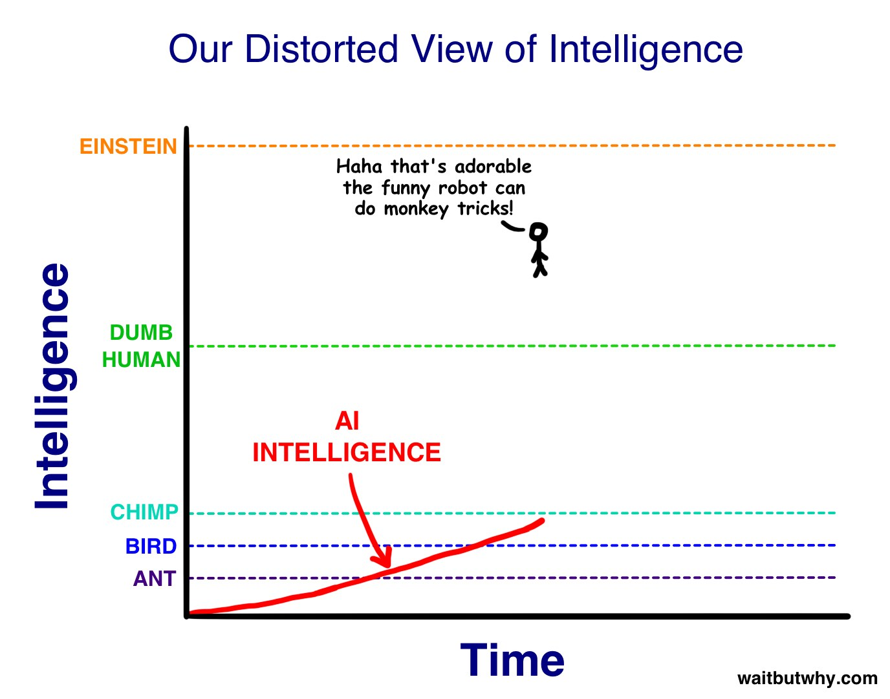

---

<!-- _footer: "" -->

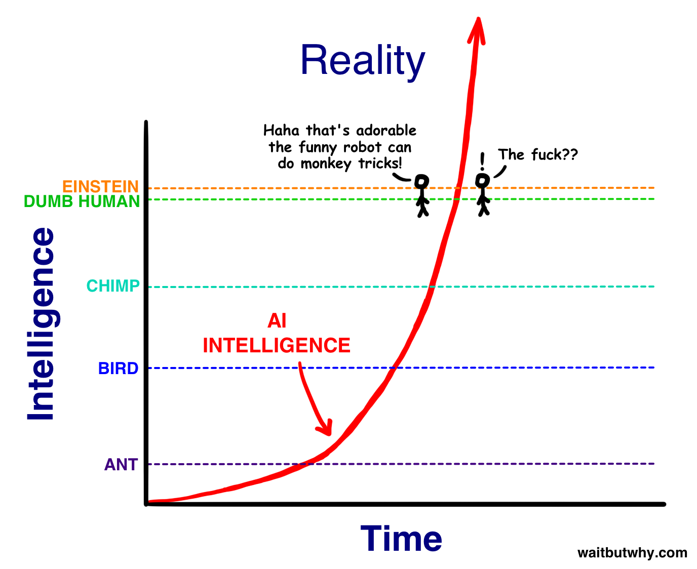

---

# Our Tool Stack

<div style="display: flex; flex-direction: column; align-items: center; gap: 0; margin-top: 0.2rem; font-size: 22px;">
<div style="width: 560px; padding: 0.55rem; text-align: center; background: #cfe2f3; border: 1px solid #444;">Requirement + Specification</div>
<div style="display: flex; align-items: center; gap: 1rem; height: 54px;"><svg width="30" height="36" viewBox="0 0 30 36"><path d="M9 0h12v18h9L15 36 0 18h9z" fill="#0b3c68"/></svg><span style="width: 90px;">AI</span></div>
<div style="width: 560px; padding: 0.55rem; text-align: center; background: #9fc5e8; border: 1px solid #444;">Code + Test Code</div>
<div style="display: flex; align-items: center; gap: 1rem; height: 54px;"><svg width="30" height="36" viewBox="0 0 30 36"><path d="M9 0h12v18h9L15 36 0 18h9z" fill="#0b3c68"/></svg><span style="width: 90px;">Compiler</span></div>
<div style="width: 560px; padding: 0.55rem; text-align: center; background: #6fa8dc; border: 1px solid #444;">Byte Code</div>
<div style="display: flex; align-items: center; gap: 1rem; height: 54px;"><svg width="30" height="36" viewBox="0 0 30 36"><path d="M9 0h12v18h9L15 36 0 18h9z" fill="#0b3c68"/></svg><span style="width: 90px;">JVM</span></div>
<div style="width: 560px; padding: 0.55rem; text-align: center; background: #3d85c6; color: #fff; border: 1px solid #444;">Assembler</div>
</div>

---

# Why FP is important: a Metaphor

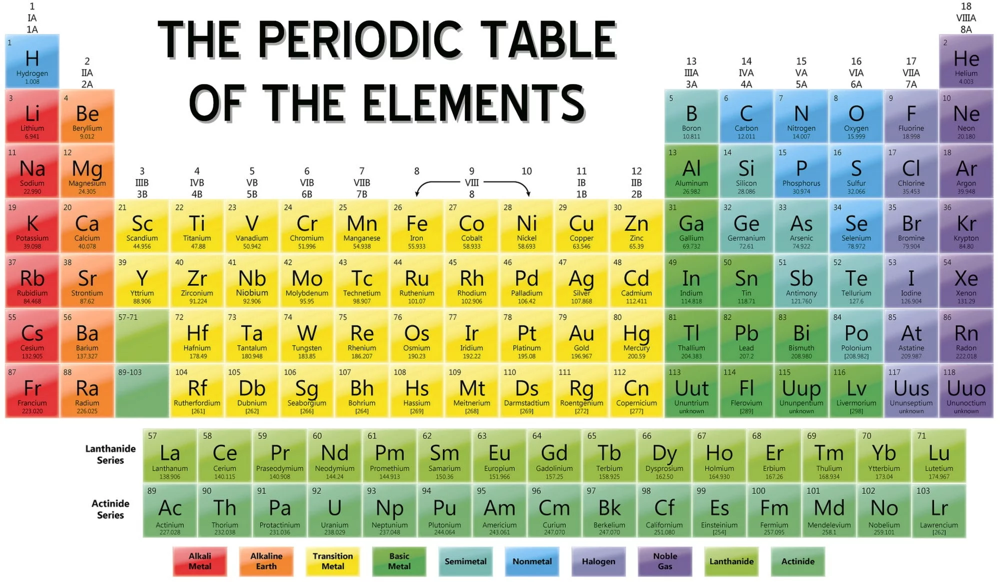

---

# The importance of functional

<div style="display: grid; grid-template-columns: 1fr 1fr; gap: 1rem; align-items: start;">
<div>

Adding functional capabilities to the programming style adds abstraction flexibility. Much like the 4 bindings of carbon create a whole new dimension for chemistry.


</div>
<div style="display: flex; flex-direction: column; align-items: center;">


</div>
</div>

---

# Two Schools of Chemistry

<div class="columns" style="align-items: start;">
<div>

**Inorganic Chemistry**

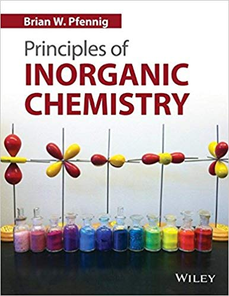
</div>
<div>

**Organic Chemistry**

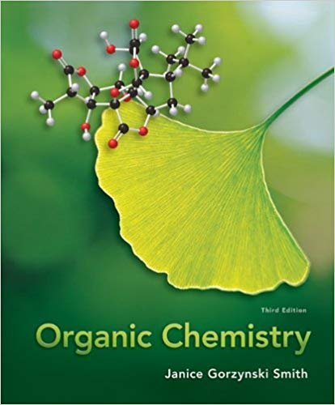
</div>
</div>

---

# Two Schools of Programming

<div class="columns" style="align-items: start;">
<div>

**Object-oriented programming**

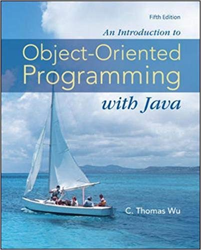
</div>
<div>

**Functional Programming**

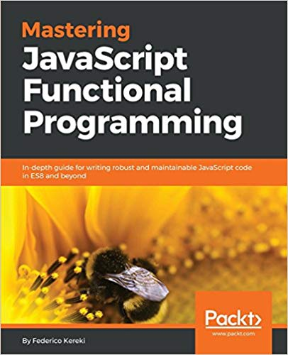
</div>
</div>

---

# These Schools are merging

<div class="columns" style="align-items: start;">
<div>

**Java has functional elements**

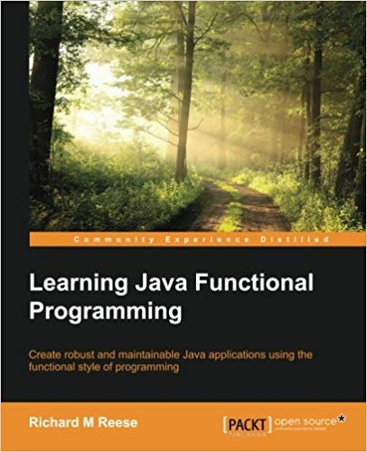
</div>
<div>

**Most other languages as well**

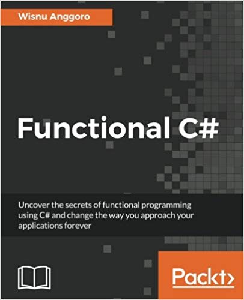
</div>
</div>

---

# So, what is functional programming?

- Functions are the smallest structural element
  - In OOP it is a class, an object being an instance of a class
- Functions always return the same result on the same input
  - In OOP objects change state and return different results
- Functions can be passed as arguments
  - In OOP only objects (and values) can be passed as arguments
- Functional Programming avoids State Change.
  - Functions that do not change state are called Pure Functions.

---

# The Set of All Existing Programming Languages

<div style="position: relative; margin: 0.2rem auto 0 auto; width: 1000px; height: 470px; background: #fff2cc; border: 1px solid #555; border-radius: 60px; font-size: 20px;">
<div style="position: absolute; left: 40px; top: 22px;">Goto</div>
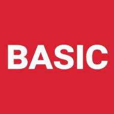
<div style="position: absolute; left: 60px; right: 60px; top: 70px; bottom: 30px; background: #ffe599; border: 1px solid #555; border-radius: 45px;">
<div style="position: absolute; left: 40px; top: 16px; font-size: 26px;">Procedural programming languages</div>
<div style="position: absolute; left: 40px; top: 56px;">Pointer</div>

<div style="position: absolute; left: 60px; right: 60px; top: 108px; bottom: 26px; background: #f1c232; border: 1px solid #555; border-radius: 35px;">
<div style="position: absolute; left: 40px; top: 14px; font-size: 24px;">Object-oriented programming languages</div>
<div style="position: absolute; left: 40px; top: 52px;">Assignments</div>
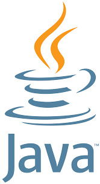
<div style="position: absolute; left: 50px; right: 50px; top: 104px; height: 68px; background: #bf9000; border: 1px solid #555; border-radius: 12px; display: flex; align-items: center; padding-left: 60px; font-size: 24px;">Functional programming languages

</div>
</div>
</div>
</div>

---

<style scoped>
section { font-size: 19px; }
pre { font-size: 15px; margin: 0; }
.pig-row { display: grid; grid-template-columns: 1fr 380px; gap: 1.2rem; align-items: start; margin-top: 0.2rem; }
.pig-row p { margin: 0.2rem 0; }
.pig-label { margin: 0.5rem 0 0.2rem 0; font-weight: bold; }
</style>

# OOP vs Functional: A very simple example

<div class="pig-label"><a href="https://scastie.scala-lang.org/markoboger/AruDcjC4SCWW6bD4bqbCSg">Object-Oriented</a></div>
<div class="pig-row">
<div>

```scala
class PiggyBankOOP (var coins:Int = 0) {
 def insert(newCoins:Int) = coins += newCoins
 def butcher = coins
}

val pig1= new PiggyBankOOP()
pig1.insert(4)
println(pig1.butcher)
```

</div>
<div>
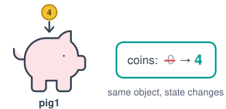

The pig has a changing state.

</div>
</div>

<div class="pig-label"><a href="https://scastie.scala-lang.org/markoboger/0kWFhjNJRGqkI5k0hyg1mA">Functional</a></div>
<div class="pig-row">
<div>

```scala
class PiggyBankFP (val coins:Int = 0) {
 def insert(newCoins:Int): PiggyBankFP = copy(coins + newCoins)
 def butcher = coins
}

val pig2 = new PiggyBankFP()
val pig3=pig2.insert(5)
println(pig3.butcher)
```

</div>
<div>
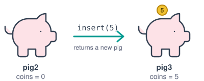

The pig itself never changes, it is immutable.

Instead we copy the object with a new state and manage the reference to it.

</div>
</div>

---

<style scoped>
section { font-size: 19px; }
pre { font-size: 15px; margin: 0.2rem 0 0.5rem 0; }
.lbl { font-weight: bold; margin: 0.3rem 0 0 0; }
</style>

# Function as parameter

<div class="columns" style="align-items: start; gap: 1.4em;">
<div>

<div class="lbl">Your own higher-order function</div>

```scala
def calc(a: Int, b: Int, op: (Int, Int) => Int): Int =
  op(a, b)

def add(x: Int, y: Int) = x + y

calc(3, 4, add)               // 7
calc(3, 4, (x, y) => x * y)   // 12
calc(3, 4, _ - _)             // -1
```

<div class="lbl">Piggy banks from the last slide</div>

```scala
case class PiggyBank(coins: Int)
val pigs = List(PiggyBank(4), PiggyBank(0), PiggyBank(7))

pigs.filter(_.coins > 0)   // List(PiggyBank(4), PiggyBank(7))
pigs.map(_.coins).sum      // 11
pigs.sortWith(_.coins > _.coins).head   // PiggyBank(7)
```

</div>
<div>

<div class="lbl">Named function &rarr; lambda &rarr; placeholder</div>

```scala
val nums = List(1, 2, 3, 4)
def double(x: Int) = x * 2

nums.map(double)          // List(2, 4, 6, 8)
nums.map(x => x * 2)      // List(2, 4, 6, 8)
nums.map(_ * 2)           // List(2, 4, 6, 8)
```

<div class="lbl">Library functions take functions</div>

```scala
nums.filter(_ % 2 == 0)   // List(2, 4)
nums.map(_ * 2).sum       // 20
nums.sortWith(_ > _)      // List(4, 3, 2, 1)
```

A function is a value: it can be passed like an `Int` or a `String`.

</div>
</div>

---

# Why not Java?

Java is also incorporating functional elements into its core language since version 8. Functional programming is possible in Java, but it is not easy. For example, creating an immutable object is hard, since the default data structures are mutable. The syntax for immutable structures is longer than for mutable, state change is so common, it is hard to get away from it.

So, to become a good programmer with functional style available to you, it is easier to learn a language that makes functional programming easy and then switch back to Java and apply what you learned. If you ever go back...

---

<style scoped>
table { font-size: 17px; }
td.y { color: #1a9e3a; font-size: 24px; font-weight: bold; line-height: 1; }
th, td { padding: 0.25rem 0.6rem; text-align: center; }
</style>

# Why Scala?

<div class="columns" style="grid-template-columns: 1fr 1.3fr; align-items: start;">
<div>

Desirable language features for scalable software systems are

- Static Type System
- Strong Type System
- Implicit Type System
- Pure OOP
- Functional

Scala combines these in an elegant way.

</div>
<table>
<tr><th></th><th>Scala</th><th>C</th><th>Java</th><th>JavaScpt</th><th>Python</th><th>Haskell</th><th>Kotlin</th></tr>
<tr><td style="text-align: left;">Static Type System</td><td class="y">&#10003;</td><td></td><td class="y">&#10003;</td><td></td><td></td><td class="y">&#10003;</td><td class="y">&#10003;</td></tr>
<tr><td style="text-align: left;">Strong Type System</td><td class="y">&#10003;</td><td></td><td></td><td></td><td></td><td class="y">&#10003;</td><td class="y">&#10003;</td></tr>
<tr><td style="text-align: left;">Implicit Type System</td><td class="y">&#10003;</td><td></td><td></td><td></td><td class="y">&#10003;</td><td class="y">&#10003;</td><td class="y">&#10003;</td></tr>
<tr><td style="text-align: left;">Pure OOP</td><td class="y">&#10003;</td><td></td><td></td><td></td><td class="y">&#10003;</td><td></td><td class="y">&#10003;</td></tr>
<tr><td style="text-align: left;">Functional</td><td class="y">&#10003;</td><td></td><td></td><td class="y">&#10003;</td><td class="y">&#10003;</td><td class="y">&#10003;</td><td class="y">&#10003;</td></tr>
</table>
</div>

---

# Who invented Scala?

<div class="columns" style="grid-template-columns: 1fr auto;">
<div>

- Martin Odersky
  - Built the Java compiler for Java 1.3 and 1.4
  - Built the generic type system and compiler for Java 1.5
  - Now a Professor at EPFL Lausanne
  - Started to create a “Java how it should be”
  - Founded the company Typesafe in 2011
  - Typesafe was renamed to Lightbend in 2015

</div>

</div>

---

<style scoped>
section { font-size: 20px; }
</style>

# Scala = a SCAlable LAnguage

- Scala is scalable in three dimensions
  - Program size
    - Interpreter, Scripts, Programs, Component Systems
  - Language extension
    - Java is a closed language
      - No operator overloading, no additional operators
    - Scala is open, it can be extended
      - Operators are methods and can be added and extended
      - Flexible syntax allows elegant extensions
      - Libraries can feel like extensions
  - Number of Processors
    - Good Concurrency System
    - Functional Programming is a good fit for concurrency

---

# Scala is a Hybrid Language

- Scala is an Object-Oriented Language
  - Much cleaner OO than Java
  - Everything is an object
- Scala is a Functional Language
  - Functional means
    - No state change
    - Same input produces same output
    - Functions as parameters
- Scala is the first language that combines OO and FP in a very clean, straightforward fashion

---

<style scoped>
section { font-size: 18px; }
ul { margin: 0.2rem 0; }
.flow { display: flex; align-items: center; gap: 0.5rem; justify-content: center; margin: 0.1rem 0 0.5rem 0; font-size: 17px; }
.flow .box { border: 2px solid #334152; border-radius: 8px; padding: 0.3rem 0.7rem; text-align: center; background: #fff; }
.flow .box small { display: block; font-size: 13px; color: #575e75; }
.src { font-size: 12px; color: #575e75; margin-top: 0.4rem; }
</style>

# JVM as Platform

<div class="flow">
<div class="box"><code>Hello.scala</code><small>your source code</small></div>&rarr;
<div class="box" style="border-color: #009B91;"><code>Hello.tasty</code><small>for the compiler: complete information</small></div>&rarr;
<div class="box"><code>Hello.class</code><small>for the JVM: incomplete information</small></div>
</div>

<div class="columns" style="align-items: start; gap: 1.6em;">
<div>

- Scala compiles to Java byte code
- Scala 3 compiles to `.class` files **and** `.tasty` files
- Scala runs on the Java VM
- Scala is fully interoperable with Java
- Call
  - Scala classes can call Java classes
  - Java classes can call almost all Scala classes
- Inherit
  - Scala classes can inherit from Java classes
  - Java classes can inherit from almost all Scala classes

</div>
<div>

**TASTy = Typed Abstract Syntax Trees**

- The complete, type-checked program: syntax, types, positions, documentation.
- `.class` files lose information: generics are erased (`List[Int]` becomes `List<Object>`), and Scala-only constructs such as unions, intersections and trait parameters have no JVM form.
- Scala 3 compilers read the TASTy of libraries: separate compilation, and a stable format that newer 3.x compilers can read. Scala 2.13.6+ has a TASTy reader.
- Basis for tools and macros: language server (completion, find references, rename), inline/macros, code analysis.

<div class="src">Sources: docs.scala-lang.org &ndash; "An Overview of TASTy", "Binary Compatibility"</div>

</div>
</div>

---

<style scoped>
section { font-size: 22px; }
pre { font-size: 16px; }
</style>

# Install Scala


- Java JDK: **JDK 25 (LTS) recommended**; the LTS versions 17 and 21 also work (Scala 3.8 needs at least JDK 17)
- Download Scala from [www.scala-lang.org](http://www.scala-lang.org/)
  - **Tip: install with [Coursier](https://get-coursier.io/)**, the Scala installer: `cs setup` installs a JDK, `scala`, `scala-cli` and `sbt` in one step (macOS: `brew install coursier && coursier setup`)
- Scala can operate in an interpreted mode
  - in a shell, call `scala`, this starts a REPL (the interpreter).
  - The REPL is very good for first experiments.

```
scala> val a = List(10, 5, 8, 1, 7).sorted
a: List[Int] = List(1, 5, 7, 8, 10)
scala> val b = List("banana", "pear", "apple", "orange").sorted
b: List[String] = List(apple, banana, orange, pear)
```

---

<style scoped>
pre { font-size: 16px; }
</style>

# Scala Commandline Interpreter: REPL

```
Markos-iMac:~ mboger$ scala
Welcome to Scala 2.12.6 (Java HotSpot(TM) 64-Bit Server VM, Java 10.0.2).
Type in expressions for evaluation. Or try :help.
scala> 17+4
res0: Int = 21
scala> def f(x:Int) = x+1
f: (x: Int)Int
scala> f(20)
res1: Int = 21
scala> val x = 42
x: Int = 42
scala> f(x)
res2: Int = 43
scala>
```

---

# Scala in VS Code

<div class="columns" style="grid-template-columns: 0.8fr 1.2fr; align-items: start;">
<div>

MS VS Code is a good light weight tool to start out with.

It supports Scala 3.

To set up a project for Scala, use a template:

`sbt new scala/scala3.g8`

</div>
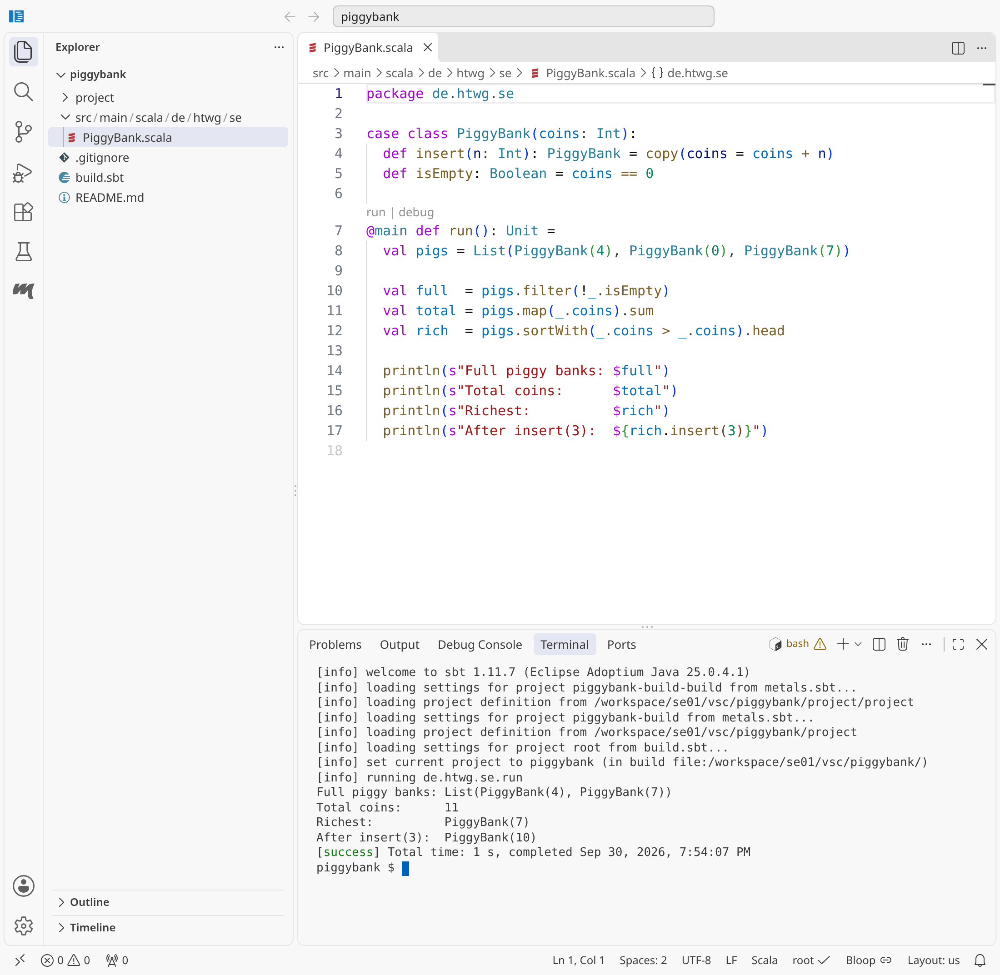
</div>

---

<style scoped>
section { font-size: 21px; }
</style>

# Things to Avoid

Most of what you have learned so far remains valid. But some things now get in the way of Agility. Avoid at all cost (with few exceptions):

<div class="columns" style="align-items: start; gap: 1.5em;">
<div>

- **null**
  - variables should always have a value.
  - Initialise or use Option monad!
- **void**
  - methods should always return a value.

</div>
<div>

- **var**
  - variables that are not final. Variables should be immutable.
  - Use val!
- **try**
  - Exceptions break the control flow.
  - Use Try monad!

</div>
</div>

---

<style scoped>
section { font-size: 21px; }
pre { font-size: 16px; }
</style>

# First Scala Code

<div class="columns" style="grid-template-columns: 1.2fr 1fr; align-items: start;">
<div>

```scala
package de.htwg.se
import scala.io.StdIn._
object Sudoku{
   def main(args:Array[String]) = {
       println("Welcome to Sudoku \n")
       val greeting = "Hello " + signUp(args)
       println(greeting)
   }
   def signUp(playerNames:Array[String]):String = {
       if (playerNames.length > 0)
           playerNames.head
       else
           readLine("Please enter your name: ")
   }
}
```

</div>
<div>

- Packages similar to Java
- Import similar to Java
- Objects similar to static
- `def` defines methods
- `val` defines values
- no Semicolons
- Types are behind the qualifier
- Methods should always have a type
- Types are often implicit
- no return, last expression is returned

</div>
</div>

---

<style scoped>
section { font-size: 21px; }
</style>

# Basic differences of Syntax

- The notation is similar to Java but
- Semicolons are usually inferred
- Types are often inferred
- Parentheses are often optional
- Almost every character is allowed in method names
  - Very few built in operators
  - What we know as operators are now methods ( +, - , % …)
  - Even * can be used. As placeholder Scala uses underscore ( _ )
- The Dot operator for Method calls is optional (infix notation)
  - `a.add(b)` can be written as `a add b` or `a + b`
- Types are written behind the definition
  - `int i` becomes `var i:Int=0` or `var i=0`
- Declarations start with `val`, `var` or `def`

---

<style scoped>
section { font-size: 22px; }
</style>

# Data Types

- Scala is purely Object-oriented, Java is not
- No primitive types
  - `int`, `boolean`, `float` etc are replaced by `Int`, `Boolean`, `Float`
- Every value is an object
  - `3`, `1.7`, `"Hello World"`, `(1,2,3)` are objects
  - Method calls like `3.toString` or `1.7.toInt` are possible
- Most types of Java are fully available
  - `java.lang.String`, `java.util.BitSet`
- Types are inferred
  - No need to say that `1+2` is an `Int`
  - No need to say that `3.toString` is a `String`

---

<style scoped>
section { font-size: 20px; }
</style>

# Your Software Project

<div class="columns" style="align-items: start; gap: 1.5em;">
<div>

- You will develop your own desktop game
- Teams of 2
- Examples for topics
- Something similar to Sudoku – Only exception: Sudoku
  - Battleship („Schiffe versenken“)
  - Minesweeper
  - TicTacToe in 4\*4\*4 with AI
  - Chess with all possible moves but without AI
  - Connect 4 („Vier gewinnt“)
  - Uno
  - Poker
  - Back Gammon

</div>
<div>

- Not so good examples
  - Real-time games
    - Tetris
    - PacMan
  - Jump and run games
  - Egoshooter
- Totally forbidden
  - Reuse an existing game that was developed for this class
- This project will be continued in the classes
  - Web Technologies
  - Software Architecture

</div>
</div>

---

# Requirements

<div class="columns" style="align-items: start; gap: 1.5em;">
<div>

- UI requirements
  - Textual UI
  - Graphical UI
    - Running in parallel
- Software Engineering requirements
  - Developed in team of 2
  - With version control Git
  - Provided on Github
  - File storage
  - Simple documentation

</div>
<div>

- Architecture Requirements
  - Strict layering
  - MVC Architecture
  - Test coverage
  - Components
  - Flexible exchange of these (DI)

</div>
</div>

---

<style scoped>
section { font-size: 22px; }
</style>

# First few features

<div class="columns" style="align-items: start; gap: 1.5em;">
<div>

- Types
  - `Int`, `String`
- Text output
  - `println("Hello World")`
- Operations
  - `+`
  - `*`

</div>
<div>

- Values
  - `val y = 5`
  - `val z = "Hello"`
- Functions
  - `def f(x:Int) = x+1`
  - `def f(x:Int) : Int = x+1`
  - `@main def run = …`

</div>
</div>

---

# Scala String

- Every case class in Scala has a String representation `toString`
- `toString` can be overridden

```scala
case class Person(name: String, age: Int) {
   override def toString = name + "("+age+")"
}
```

- Operation `+` on String works on all Value types and case classes

---

<style scoped>
section { font-size: 15px; padding-top: 40px; }
h1 { font-size: 36px; margin-bottom: 0.3rem; }
ul { margin: 0; padding-left: 1.1em; }
li { margin: 0.12rem 0; }
</style>

# Standard Operations for Strings

<div class="columns" style="align-items: start; gap: 1.2em;">
<div>

- `S.length` is the length of the string in characters;
- `S.substring(i)` returns the part of the string starting at index i.
- `S.substring(i,j)` returns the part of the string starting at index i and going up to index j-1. You can write `S.slice(i,j)` instead.
- `S.contains(T)` returns true if T is a substring of S;
- `S.indexOf(T)` returns the index of the first occurrence of the substring T in S (or -1);
- `S.indexOf(T, i)` returns the index of the first occurrence after index i of the substring T in S (or -1);
- `S.toLowerCase` and `S.toUpperCase` return a copy of the string with all characters converted to lower or upper case;
- `S.capitalize` returns a new string with the first letter only converted to upper case;
- `S.reverse` returns the string backwards;

</div>
<div>

- `S.isEmpty` is the same as `S.length == 0`;
- `S.nonEmpty` is the same as `S.length != 0`;
- `S.startsWith(T)` returns true if S starts with T;
- `S.endsWith(T)` returns true if S ends with T;
- `S.replace(c1, c2)` returns a new string with all characters c1 replaced by c2;
- `S.replace(T1, T2)` returns a new string with all occurrences of the substring T1 replaced by T2;
- `S.trim` returns a copy of the string with white space at both ends removed;
- `S.format(arguments)` returns a string where the percent-placeholders in S have been replaced by the arguments (see example below);
- `S.split(T)` splits the string into pieces and returns an array with the pieces. T is a regular expression (not explained here). To split around white space, use `S.split("\\s+")`.

</div>
</div>

---

<style scoped>
pre { font-size: 17px; }
</style>

# Printf

- Printf replaces placeholders (%) with a format (f, d, s)

```scala
def main(args: Array[String]) {
      var n1 = 78.99
      var n2 = 49
      var s1 = "Hello, World!"
      var f1 = printf("The value of the float variable is " +
                   "%f, while the value of the integer " +
                   "variable is %d, and the string " +
                   "is %s", n1, n2, s1)
      println(f1)
   }
```

---

<style scoped>
pre { font-size: 17px; }
</style>

# String Interpolation

String interpolation goes even further, it replaces a variable name preceded by `$` with its value.

- The `s` interpolation simply replaces variables

```
scala> println(s"$hannah.name has a score of $hannah.score")
Student Hannah has a score of Student 95
```

- The `f` interpolation also formats them

```
scala> println(f"$name is $age years old, and weighs $weight%.0f pounds.")
Fred is 33 years old, and weighs 200 pounds.
```

---

<style scoped>
section { font-size: 21px; }
pre { font-size: 16px; margin: 0.2rem 0; }
</style>

# Multiline String

- With triple quotes you can create multiline strings

```scala
val foo = """This is
    a multiline
    String"""
```

- Pipe allows margins, `stripMargin` removes them again

```scala
val speech = """Four score and
               |seven years ago""".stripMargin
```

- `\n` represents a line break

```scala
val speech = """Four score and
               |seven years ago
               |our fathers
""".stripMargin.replaceAll("\n", " ")
```

---

<!-- _class: aufgabe -->

# Task 1.1: Create a game project

- Install Scala
- Install VS Code
- Create a Scala Project using Giter8 (g8)
  - `sbt new scala/scala3.g8`
- Generate the String output of a playing field on the Console

---

# Worksheets

- A worksheet is a tool that provides instant feedback for your Scala code.
- Code and test code are mixed in one file.
- The file can be executed and evaluated.
- This is the fastest way to get feedback on your code.
- Develop your data structures and classes in a worksheet.
- Only after you have learned enough, copy the code to a proper class file.
- Use the test code to establish tests.

---

<style scoped>
pre { font-size: 15px; margin: 0; }
</style>

# Example Worksheet

<div class="columns" style="align-items: start; gap: 1em;">

```scala
case class Cell(value:Int) {
 def isSet:Boolean = value != 0
}
val cell1= Cell(2)
cell1.isSet
val cell2= Cell(0)
cell2.isSet
case class Field(cells: Array[Cell])
val field1 = Field(Array.ofDim[Cell](1))
field1.cells(0)=cell1
case class House(cells:Vector[Cell])
val house = House(Vector(cell1,cell2))
house.cells(0).value
house.cells(0).isSet
```

```
defined class Cell
cell1: Cell = Cell(2)
res0: Boolean = true
cell2: Cell = Cell(0)
res1: Boolean = false
defined class Field
field1: Field = Field([Lde.htwg.se.sudoku.model.A$...)
field1.cells(0): Cell = Cell(2)
defined class House
house: House = House(Vector(Cell(2), Cell(0)))
res2: Int = 2
res3: Boolean = true
```

</div>

---

<!-- _class: aufgabe -->

# Task 1.2: Create a Worksheet

- Create a worksheet in your project
- Create some basic data structures for your game in the worksheet
- Access your data
- Try to improve your implementation in small increments until your data and its access feel really good. Constantly test this.
- In VS Code Worksheets have the ending `worksheet.sc`

---

<!-- _class: abschluss -->

# Questions?

## Thank you!

marko.boger@htwg-konstanz.de
