### Prof. Dr. Marko Boger
## Software Engineering
# Lecture 03: Agile Development

Software development processes, Scrum, XP, TDD and BDD with ScalaTest.

---

<!-- _class: inhalt -->

# Goals of this Lecture

- Get to know several generations of software development processes
- Distinguish between heavy weight and agile processes
- Learn some lessons from XP
- Understand the core of Scrum
- Understand Test Driven Development and Behaviour Driven Development (TDD / BDD)
- Write Unit Tests and testable code

---

# Software Development Processes

- Waterfall-Model
- Spiral-Model
- V-Model
- Rational Unified Process (RUP)
- XP
- Scrum

---

<style scoped>
.src { font-size: 13px; color: #575e75; margin-top: 0.6rem; }
</style>

# Waterfall Model

<div class="columns" style="grid-template-columns: 0.8fr 1.2fr;">
<div>

- First mentioned 1970 by W. Royce.
- In the paper he criticises this approach as risky and suggests improvements.
- But for some reason, only the start of the paper influences the US military standard [DoD-2167](http://www.product-lifecycle-management.com/download/DOD-STD-2167A.pdf), which in turn influences NATO, etc.

</div>
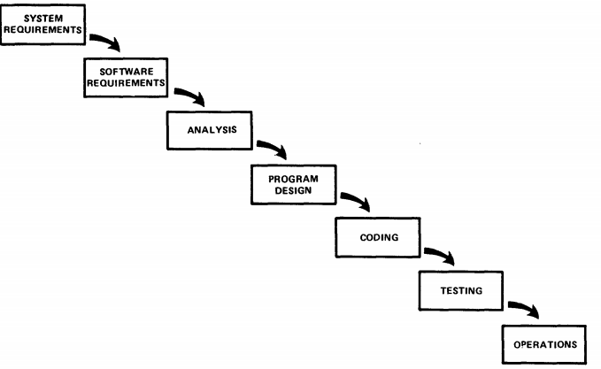
</div>

<div class="src">Source: Royce, Winston (1970), <a href="http://www.cs.umd.edu/class/spring2003/cmsc838p/Process/waterfall.pdf">"Managing the Development of Large Software Systems"</a>, Proceedings of IEEE WESCON 26 (August): 1–9.</div>

---

# Problem with the Waterfall Model

<div class="columns" style="grid-template-columns: 0.7fr 1.3fr;">
<div>

- The main problem are unaccounted long feedback loops
- Findings in late stages lead to large costs
- And iterations are never confined

</div>
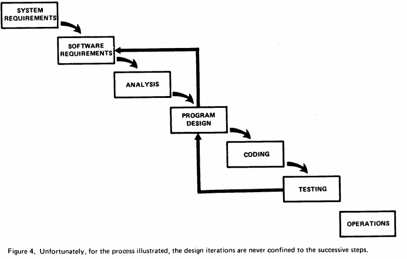
</div>

---

<!-- _class: aufgabe -->

# Video Assignment

- Real Software Engineering by Glenn Vanderburg
- [http://www.youtube.com/watch?v=NP9AIUT9nos](http://www.youtube.com/watch?v=NP9AIUT9nos&feature=related)

[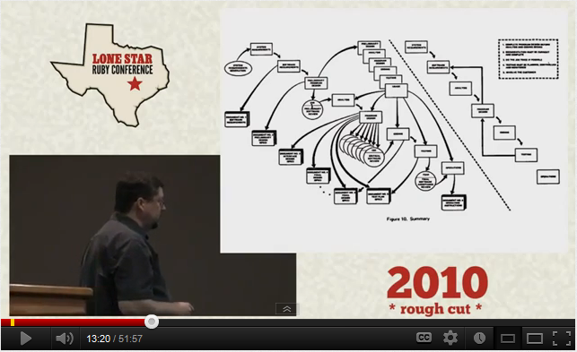](http://www.youtube.com/watch?v=NP9AIUT9nos&feature=related)

---

# Spiral Model

<div class="columns" style="grid-template-columns: 0.8fr 1.2fr;">
<div>

- Developed by Barry Böhme in 1985
- It is the first to stress the importance of iterations
- Main goal was to reduce risk as early as possible

</div>
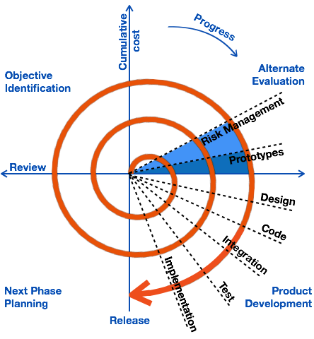
</div>

---

# The V-Model

<div class="columns" style="grid-template-columns: 0.9fr 1.1fr;">
<div>

- Developed 1992 for projects of the German Military
- The left side of the "V" represents the decomposition of requirements, and creation of system specifications.
- The right side of the V represents integration of parts and their validation.
- Current Version: V-Model XT

</div>
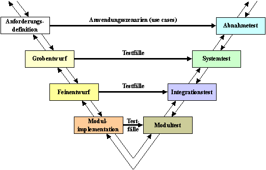
</div>

---

# Rational Unified Process

- Developed in 1996 by Rational, now a unit of IBM
- Tooling (IBM Rational Method Composer) allows to customize it

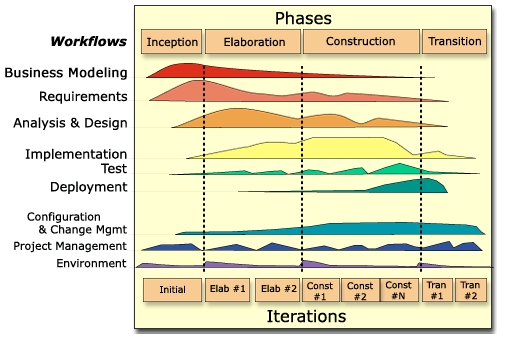

---

<style scoped>
.src { font-size: 13px; color: #575e75; margin-top: 0.3rem; }
</style>

# Heavy Weight Processes

<div class="columns" style="align-items: start;">
<div>

- Assumptions for heavy weight
  - Fixed Requirements
  - Construction in parts and assembly late in the process
  - A running system only after conclusion
  - Reduction of cost by building models

</div>
<div>

- The processes shown so far get under severe critique by the end of the 1990’s.
- They are referred to as heavy weight, pointing to the multitude of documents to be developed.

</div>
</div>


<div class="src">Source: SFO Oakland Bay Bridge <a href="http://mceer.buffalo.edu/publications/bulletin/07/21-02/01_FHWA.asp">http://mceer.buffalo.edu/publications/bulletin/07/21-02/01_FHWA.asp</a></div>

---

# How SE differs from other Engineering Fields

- Our building material (bits or code) is essentially free and extremely flexible
- Changing and extending is possible late in the process
  - Change is frequently expected late in the process
- Creating a new instance (copy) is free
- Testing is possible instantaneously and at almost no cost
- All costs are directly related to human work
  - At a very high level of education
  - With highly creative, non-repetitive tasks

---

# Choosing a different Metaphor

<div class="columns" style="align-items: start;">
<div>

- Software as a living System
  - Should always run
  - Has an observable behaviour and can be tested
  - Is constantly extended at many points concurrently
  - Can be educated or developed
  - Has bugs

</div>
<div>

- But it is only a metaphor
  - i.e. testing does not destroy the system

</div>
</div>

<div style="display: flex; align-items: flex-end; justify-content: space-between; margin-top: -2.2rem;">


</div>

---

<style scoped>
.src { font-size: 13px; color: #575e75; }
</style>

# Agile Development Processes

<div class="columns" style="grid-template-columns: 1fr 1fr; align-items: start;">
<div>

- Cristal Clear
  - 1992-97, Alister Cockburn
- Scrum
  - 1995-2001, Jeff Sutherland, Ken Schwaber
- Feature Driven Development
  - 1997, Jeff De Luca
- Extreme Programming
  - 1999, Kent Beck

</div>
<div>
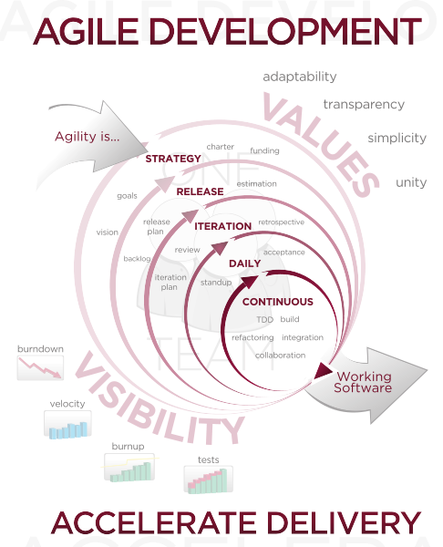
<div class="src">Source: <a href="http://en.wikipedia.org/wiki/Agile_software_development">http://en.wikipedia.org/wiki/Agile_software_development</a></div>
</div>
</div>

---

<style scoped>
.src { font-size: 13px; color: #575e75; text-align: center; }
</style>

# The Agile Manifesto

- Developed at a „Think Tank“ meeting in 2001
- Describes the core ideas of Agile Methods

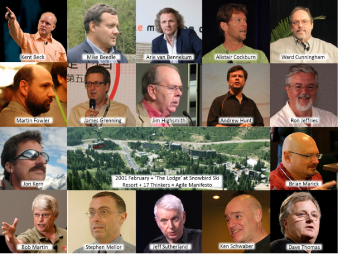
<div class="src">Source: <a href="http://agilescout.com/history-of-agile-the-influencers-and-drivers-of-the-agile-movement/">http://agilescout.com/history-of-agile-the-influencers-and-drivers-of-the-agile-movement/</a></div>

---

# Manifesto for Agile Software Development

We are uncovering better ways of developing software by doing it and helping others do it. Through this work we have come to value:

- **Individuals and interactions** over processes and tools
- **Working software** over comprehensive documentation
- **Customer collaboration** over contract negotiation
- **Responding to change** over following a plan

That is, while there is value in the items on the right, we value the items on the left more.

---

<style scoped>
section { font-size: 18px; }
li { margin: 0.15rem 0; }
</style>

# Principles behind the Agile Manifesto

- Our highest priority is to satisfy the customer through early and continuous delivery of valuable software.
- Welcome changing requirements, even late in development. Agile processes harness change for the customer's competitive advantage.
- Deliver working software frequently, from a couple of weeks to a couple of months, with a preference to the shorter timescale.
- Business people and developers must work together daily throughout the project.
- Build projects around motivated individuals. Give them the environment and support they need, and trust them to get the job done.
- The most efficient and effective method of conveying information to and within a development team is face-to-face conversation.
- Working software is the primary measure of progress.
- Agile processes promote sustainable development. The sponsors, developers, and users should be able to maintain a constant pace indefinitely.
- Continuous attention to technical excellence and good design enhances agility.
- Simplicity--the art of maximizing the amount of work not done--is essential.
- The best architectures, requirements, and designs emerge from self-organizing teams.
- At regular intervals, the team reflects on how to become more effective, then tunes and adjusts its behavior accordingly.

---

<style scoped>
.src { font-size: 13px; color: #575e75; text-align: center; }
</style>

# Scrum in a Nutshell

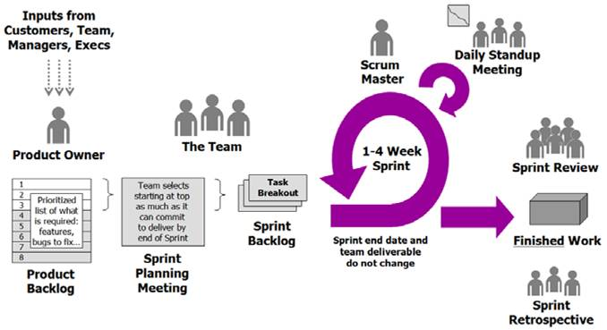
<div class="src">Source: <a href="http://www.sadhanbiswas.com/myblog/techsavvy/agile-methodology/">http://www.sadhanbiswas.com/myblog/techsavvy/agile-methodology/</a></div>

---

<!-- _class: aufgabe -->

# Video Assignment

- Scrum in under 10 Minutes
- [http://www.youtube.com/watch?v=XU0llRltyFM](http://www.youtube.com/watch?v=XU0llRltyFM)

[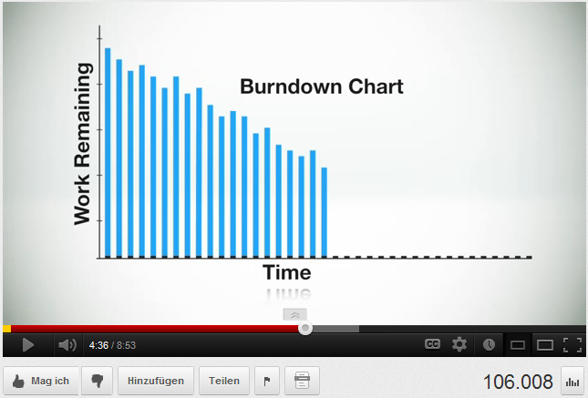](http://www.youtube.com/watch?v=XU0llRltyFM)

---

# Value Delivered: Waterfall

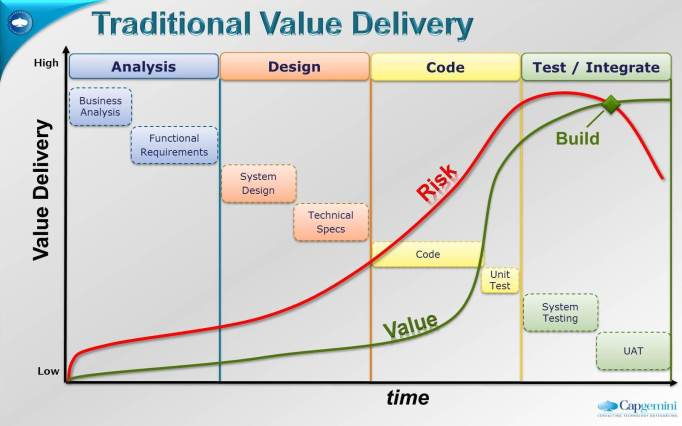

---

# Value Delivered: Agile

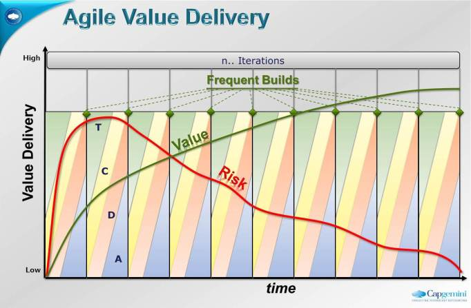

---

# Leap of Faith

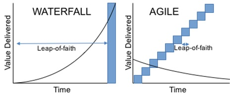

---

# Tools to support Scrum

<div class="columns" style="align-items: start;">
<div>

- Whiteboard
- Google Spread Sheet
- PivotalTracker
  - Webtool, almost no setup or config, free for Universities
- Ontime
  - Powerfull webtool, great Scrum support, github integration

</div>
<div>

- Jazz / Rational Team Concert
  - Full integration in Eclipse, Combines SCM and PM
- Scrumwise
  - Excellent web-based tool for Scrum
- Waffle.io
  - Based on issues on Github
- Github Issues

</div>
</div>

---

# Limitations of Scrum

- Scrum is a Project Management Methodology
  - It helps us organize what to work on next and how to organize as a group
  - But it does not help us with how we are actually going to work with the code
  - Therefore we will look at another agile method that goes deeper
    - Extreme Programming
- Scrum is good for inhouse software development
- It is also good for software development as a service
  - If the customer really understands modern software development
- It is not very good for fixed price projects.
  - But then again, no method really is.

---

# Product Owner in Scrum

- [http://blog.crisp.se/2012/10/25/henrikkniberg/agile-product-ownership-in-a-nutshell](http://blog.crisp.se/2012/10/25/henrikkniberg/agile-product-ownership-in-a-nutshell)

[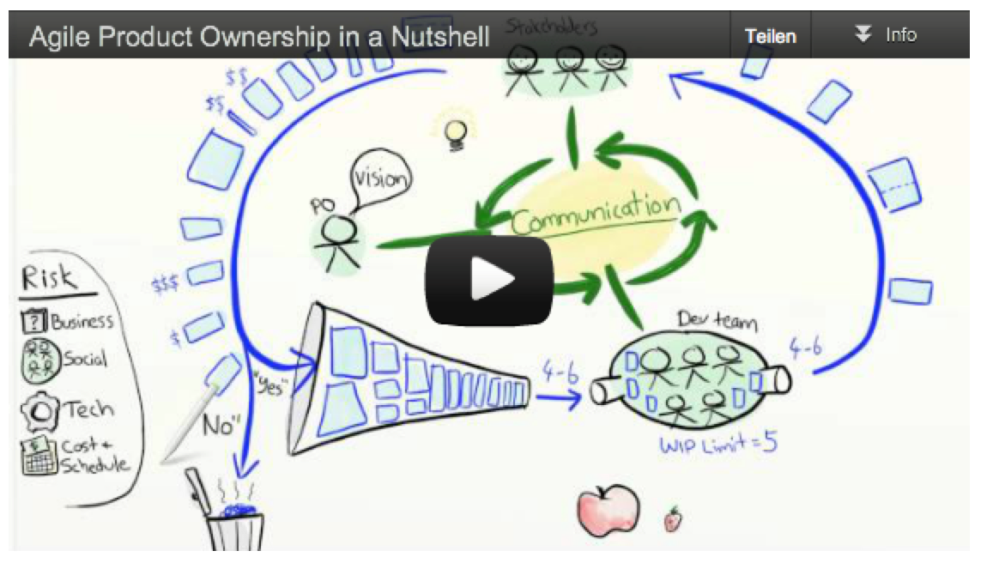](http://blog.crisp.se/2012/10/25/henrikkniberg/agile-product-ownership-in-a-nutshell)

---

# What is Extreme Programming

- Is this Extreme Programming?

[](http://www.youtube.com/watch?v=Ytu1Hxzr_Bs&feature=youtube_gdata_player)

- [http://www.youtube.com/watch?v=Ytu1Hxzr_Bs](http://www.youtube.com/watch?v=Ytu1Hxzr_Bs&feature=youtube_gdata_player)

---

# What is Extreme Programming?

<div class="columns" style="grid-template-columns: 0.6fr 1.4fr;">
<div>

- Best programming practices to 10

</div>

</div>

---

# Why extreme?

<div class="columns" style="align-items: start;">
<div>

- Good Practices
  - Code reviews
  - Testing
  - Design
  - Simplicity
  - Integration
  - short iterations (weeks)
  - feedback

</div>
<div>

- taken to extremes
  - pair programming
  - unit/function testing, test-first
  - refactoring
  - simplest thing that could possibly work
  - continuous integration, daily build
  - short iterations (minutes, hours, days)
  - continuous feedback, customer on site

</div>
</div>

---

# Extreme Programming

- Developed by Kent Beck
- C3 Project at Chrysler: Salary payment system
- 1998 first Articles
- 1999 Book „Extreme Programming explained“ published
- 2000 first XP-Conference

---

# Why does XP work?

- The “Cost of Change” Curve remains flat

<svg viewBox="0 0 1000 380" style="display: block; width: 1000px; margin: 0.6rem auto 0 auto; font-family: sans-serif;">
<defs><marker id="se03cc-a" viewBox="0 0 10 10" refX="8" refY="5" markerWidth="7" markerHeight="7" orient="auto"><path d="M0 0L10 5L0 10z" fill="#333"/></marker></defs>
<g transform="translate(60,10)">
<line x1="0" y1="330" x2="380" y2="330" stroke="#333" stroke-width="3" marker-end="url(#se03cc-a)"/>
<line x1="0" y1="330" x2="0" y2="10" stroke="#333" stroke-width="3" marker-end="url(#se03cc-a)"/>
<path d="M10 322 C 180 318, 280 290, 340 20" fill="none" stroke="#e02020" stroke-width="5"/>
<text x="12" y="30" font-size="20" fill="#333">cost</text>
<text x="330" y="360" font-size="20" fill="#333">Time</text>
<text x="190" y="-2" font-size="20" fill="#575e75" text-anchor="middle">traditional</text>
</g>
<g transform="translate(560,10)">
<line x1="0" y1="330" x2="380" y2="330" stroke="#333" stroke-width="3" marker-end="url(#se03cc-a)"/>
<line x1="0" y1="330" x2="0" y2="10" stroke="#333" stroke-width="3" marker-end="url(#se03cc-a)"/>
<path d="M10 300 C 60 250, 120 235, 340 225" fill="none" stroke="#e02020" stroke-width="5"/>
<text x="12" y="30" font-size="20" fill="#333">cost</text>
<text x="330" y="360" font-size="20" fill="#333">Time</text>
<text x="190" y="-2" font-size="20" fill="#575e75" text-anchor="middle">XP</text>
</g>
</svg>

---

# How to keep the curve flat?

<div class="columns" style="align-items: start;">
<div>

- Design to change
  - Pattern, Encapsulation, Information hiding
- Automated testing of all artefacts
  - insure that changes don't break anything
  - traceability of problems

</div>
<div>

- Automated Consistency of all artefacts
  - integration of changes
  - rollback
- Simplicity
  - Simplest thing that could possibly work
  - readability
  - clear design

</div>
</div>

---

<style scoped>
.pp { position: relative; width: 340px; height: 300px; margin: 1rem auto 0 auto; font-size: 24px; }
.pp .box { position: absolute; left: 70px; top: 50px; width: 200px; height: 200px; border: 3px solid #333; }
.pp span { position: absolute; font-weight: bold; color: #0b3c68; }
</style>

# Parameters of a Project

<div class="columns" style="grid-template-columns: 1.2fr 0.8fr; align-items: start;">
<div>

- Four Variables
  - Cost
    - Budget, Team size, Resources
  - Time
    - Schedule, time of delivery
  - Quality
    - Stability, Correctness, Design, Documentation
  - Scope
    - Features, Requirements

</div>
<div class="pp">
<div class="box"></div>
<span style="left: 140px; top: 10px;">Cost</span>
<span style="left: 128px; top: 262px;">Quality</span>
<span style="left: 0px; top: 134px;">Scope</span>
<span style="left: 282px; top: 134px;">Time</span>
</div>
</div>

---

# XP Philosophy

<div class="columns" style="align-items: start;">
<div>

XP has

- 4 Values
- 5 Principles
- 12 Practices

</div>
<div>

Values

- Communication
- Simplicity
- Feedback
- Courage

</div>
</div>

---

# 5 Principles

- Fundamental Principles:
  - Rapid Feedback
  - Assume Simplicity
  - Incremental Change
  - Embracing Change
  - Quality Work

---

# 12 Practices

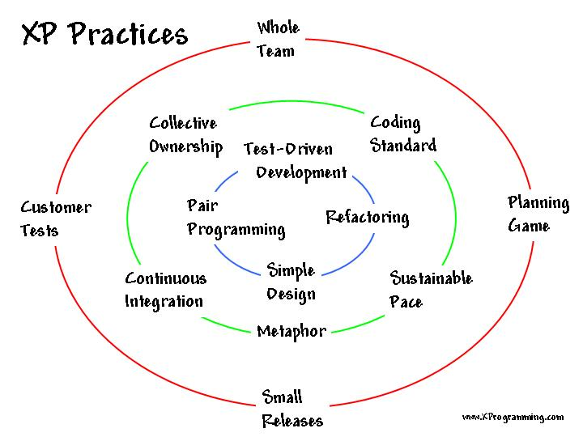

---

# Test Driven Development (TDD)

<div class="columns" style="grid-template-columns: 1.2fr 0.8fr;">
<div>

- Test Driven Development or Test First Development is one of the most prominent results of XP

</div>
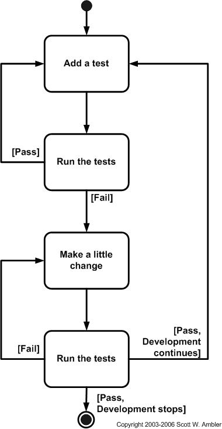
</div>

---

# JUnit

<div class="columns" style="grid-template-columns: 1.3fr 0.7fr; align-items: start;">
<div>

- Developed by Kent Beck and Erich Gamma
- To support the process of XP
- Translated to many languages

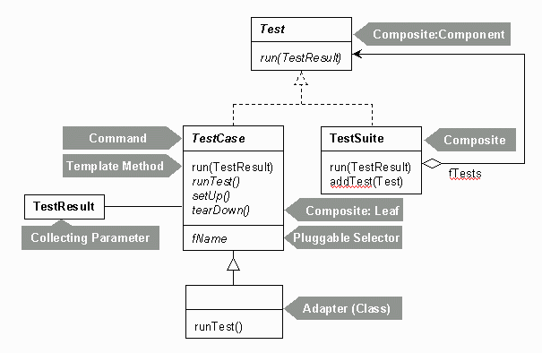

</div>
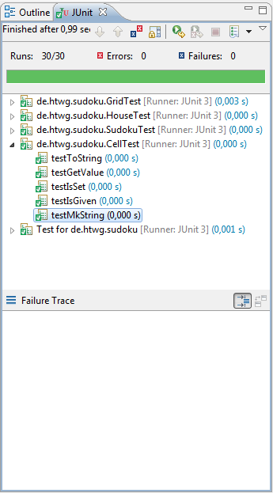
</div>

---

<style scoped>
pre, code { font-variant-ligatures: none; font-feature-settings: "liga" 0, "calt" 0; }
pre { font-size: 17px; line-height: 1.3; }
</style>

# JUnit Java Code

```java
import junit.framework.TestCase;
public class CellTest extends TestCase {
  Cell cell;
  public void setUp() {
     cell = new Cell(0,0);
  }
  public void testGetValue() {
     cell.setValue( 1 );
     assertEquals( 1, cell.getValue());
     cell.setValue(0);
     assertEquals( 0, cell.getValue());
  }
  public void testIsSet() {
     assertFalse( cell.isSet() );
     cell.setValue(1);
     assertTrue( cell.isSet() );
     cell.setValue(0);
     assertFalse( cell.isSet() );
  }
}
```

---

# Pros and Cons of TDD

- Robert Martin
  - TDD is part of our professional discipline, like washing hands for a Doctor
- But with Junit, the test code can become very technical and hard to read and maintain
  - Some improved ideas in Ruby and in Scala

---

# Behaviour Driven Development (BDD)

- Write a Specification in near-english code
- Then make that executable line after line
- Engages non-programmer into testing
- Technically it extends TDD
- But most importantly it creates a mind shift
  - Think of the tests as Specifications
  - And Tests are the best available Documentation

---

<style scoped>
pre, code { font-variant-ligatures: none; font-feature-settings: "liga" 0, "calt" 0; }
pre { font-size: 17px; }
</style>

# BDD in Scala

- ScalaTest by Bill Venners is the most popular library for BDD in Scala
- ScalaTest have several “Flavors” that provide a lot of flexibility for different people with different backgrounds or needs.
  - FlatSpec, FunSpec, WordSpec, FreeSpec, PropSpec, FeatureSpec
- You should start with WordSpec

To install it, add these two lines to your build.sbt file

```scala
libraryDependencies += "org.scalactic" %% "scalactic" % "3.2.14"
libraryDependencies += "org.scalatest" %% "scalatest" % "3.2.14" % "test"
```

---

<style scoped>
pre, code { font-variant-ligatures: none; font-feature-settings: "liga" 0, "calt" 0; }
pre { font-size: 16px; line-height: 1.25; }
</style>

# WordSpec example

```scala
package de.htwg.se.tictactoe
import org.scalatest.wordspec.AnyWordSpec
import org.scalatest.matchers.should.Matchers._
class TicTacToeSpec extends AnyWordSpec {
 "TicTacToe" should {
   "have a bar as String of form '+---+---+---+'" in {
     bar() should be("+---+---+---+" + eol)
   }
   "have a scalable bar" in {
     bar(1, 1) should be("+-+" + eol)
     bar(1, 2) should be("+-+-+" + eol)
     bar(2, 1) should be("+--+" + eol)
   }
   "have cells as String of form '|   |   |   |'" in {
     cells() should be("|   |   |   |" + eol)
   }
   "have scalable cells" in {
     cells(1, 1) should be("| |" + eol)
     cells(1, 2) should be("| | |" + eol)
     cells(2, 1) should be("|  |" + eol)
   }
 }
```

---

<style scoped>
pre, code { font-variant-ligatures: none; font-feature-settings: "liga" 0, "calt" 0; }
pre { font-size: 17px; line-height: 1.3; }
</style>

# Matchers

ScalaTest provides a domain specific language (DSL) for expressing assertions in tests using the word should. Just mix in [Matchers](http://doc.scalatest.org/3.0.1/#org.scalatest.Matchers), like this:

```scala
import org.scalatest._

class ExampleSpec extends WordSpec with Matchers {
"A Cell" when {
   "not set to any value " should {
     val emptyCell = Cell(0)
     "have value 0" in {
       emptyCell.value should be(0)
     }
     "not be set" in {
       emptyCell.isSet should be(false)
     }
   }
```

---

<style scoped>
pre, code { font-variant-ligatures: none; font-feature-settings: "liga" 0, "calt" 0; }
section { font-size: 20px; }
pre { font-size: 14px; line-height: 1.25; margin: 0.2rem 0 0.4rem 0; }
p { margin: 0.3rem 0; }
</style>

# Testing for equality

In JUnit the most frequent test is assertEquals.

```java
 assertEquals( 1, cell.getValue());
```

Or should it be …?

```java
 assertEquals( cell.getValue(), 1);
```

ScalaTest makes clear which is the result and what it is expected

```scala
 result === expected // will provide both values on failure
 expect(true){ some_Bool_Function }
 result should equal (3)
```

And it offers alternatives with slightly different meaning

```scala
result should equal (3) // can customize equality
result should === (3)   // can customize equality and enforce type constraints
result should be (3)    // cannot customize equality, so fastest to compile
result shouldEqual 3    // can customize equality, no parentheses required
result shouldBe 3       // cannot customize equality, so fastest to compile, no parentheses required
```

---

<style scoped>
pre, code { font-variant-ligatures: none; font-feature-settings: "liga" 0, "calt" 0; }
pre { font-size: 17px; line-height: 1.3; margin: 0.2rem 0 0.5rem 0; }
p { margin: 0.3rem 0; }
</style>

# Matchers for Numbers

Odd and Even

```scala
num shouldBe odd
num should not be even
```

Less and Greater

```scala
one should be < 7
one should be > 0
one should be <= 7
one should be >= 0
```

Tolerance

```scala
sevenDotOh should equal (6.9 +- 0.2)
sevenDotOh should === (6.9 +- 0.2)
sevenDotOh should be (6.9 +- 0.2)
sevenDotOh shouldEqual 6.9 +- 0.2
sevenDotOh shouldBe 6.9 +- 0.2
```

---

<style scoped>
pre, code { font-variant-ligatures: none; font-feature-settings: "liga" 0, "calt" 0; }
pre { font-size: 16px; line-height: 1.3; margin: 0.2rem 0 0.5rem 0; }
p { margin: 0.3rem 0; }
</style>

# Matchers for String

Matchers for String

```scala
string should startWith ("Hello")
string should endWith ("world")
string should include ("seven")
```

Matchers with RegEx

```scala
string should startWith regex "Hel*o"
string should endWith regex "wo.ld"
string should include regex "wo.ld"

string should fullyMatch regex """(-)?(\d+)(\.\d*)?"""

"abbccxxx" should startWith regex ("a(b*)(c*)" withGroups ("bb", "cc"))
"xxxabbcc" should endWith regex ("a(b*)(c*)" withGroups ("bb", "cc"))
"xxxabbccxxx" should include regex ("a(b*)(c*)" withGroups ("bb", "cc"))
"abbcc" should fullyMatch regex ("a(b*)(c*)" withGroups ("bb", "cc"))
```

---

<style scoped>
pre, code { font-variant-ligatures: none; font-feature-settings: "liga" 0, "calt" 0; }
pre { font-size: 15px; line-height: 1.3; margin: 0.2rem 0 0.4rem 0; }
p { margin: 0.3rem 0; }
</style>

# Matchers for Collections

Emptiness

```scala
traversable shouldBe empty
javaMap should not be empty
```

Containment

```scala
traversable should contain ("five")

List(1, 2, 3, 4, 5) should contain oneOf (5, 7, 9)
Some(7) should contain oneOf (5, 7, 9)
"howdy" should contain oneOf ('a', 'b', 'c', 'd')

List(1, 2, 3, 4, 5) should contain noneOf (7, 8, 9)
Some(0) should contain noneOf (7, 8, 9)
"12345" should contain noneOf ('7', '8', '9')

(Array("Doe", "Ray", "Me") should contain oneOf ("X", "RAY", "BEAM")) (after being lowerCased)

List(1, 2, 3) should contain atLeastOneOf (2, 3, 4)
Array(1, 2, 3) should contain atLeastOneOf (3, 4, 5)
"abc" should contain atLeastOneOf ('c', 'a', 't')
```

---

<style scoped>
pre, code { font-variant-ligatures: none; font-feature-settings: "liga" 0, "calt" 0; }
pre { font-size: 18px; line-height: 1.3; }
</style>

# Matchers for Types

Classes and Types

```scala
result1 shouldBe a [Tiger]
result1 should not be an [Orangutan]
```

Generic types suffer erasure in the JVM

```scala
result shouldBe a [List[_]] // recommended
result shouldBe a [List[Fruit]] // discouraged
```

---

<style scoped>
pre, code { font-variant-ligatures: none; font-feature-settings: "liga" 0, "calt" 0; }
pre { font-size: 17px; line-height: 1.3; margin: 0.2rem 0 0.5rem 0; }
p { margin: 0.3rem 0; }
</style>

# Matchers for Exceptions

Expect an Exception

```scala
an [IndexOutOfBoundsException] should be thrownBy s.charAt(-1)
```

Capture that Exception

```scala
val thrown = the [IndexOutOfBoundsException] thrownBy s.charAt(-1)
thrown.getMessage should equal ("String index out of range: -1")
```

In one step

```scala
the [ArithmeticException] thrownBy 1 / 0 should have message "/ by zero"
```

No Exception

```scala
noException should be thrownBy 0 / 1
```

---

<style scoped>
pre, code { font-variant-ligatures: none; font-feature-settings: "liga" 0, "calt" 0; }
pre { font-size: 18px; }
</style>

# Running Coverage Reports

- For Scala 3.2 a code coverage a good code coverage tool is available. It is called scoverage.
- For earlier Scala 3-versions, use jacoco

Add this to the file project/plugins.sbt

```scala
addSbtPlugin("org.scoverage" % "sbt-scoverage" % "x.x.x")
```

Then run

```bash
$ sbt clean coverage test
$ sbt coverageReport
```

---

# Scoverage Report

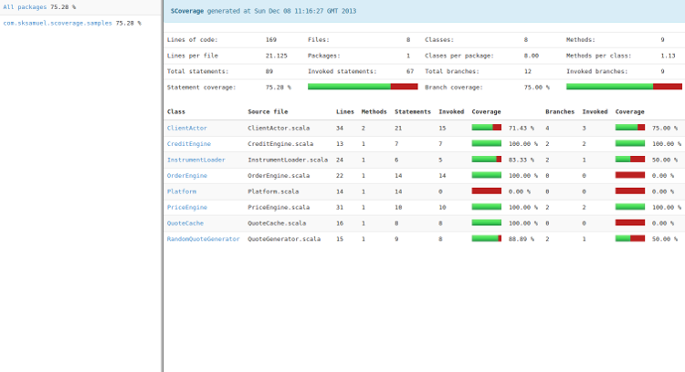

---

<!-- _class: aufgabe -->

# Task 3: Write Tests

- Take the Classes from your domain model
- Start developing them in Scala
- Use Behaviour Driven Development
  - Use ScalaTest
  - Write a Spec using WordSpec
  - Use the sbt test Test Runner
- Achieve 100% code coverage. And maintain it!

---

<!-- _class: abschluss -->

# Questions?

## Thank you!

marko.boger@htwg-konstanz.de
