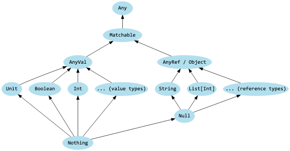
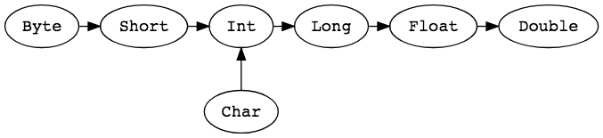
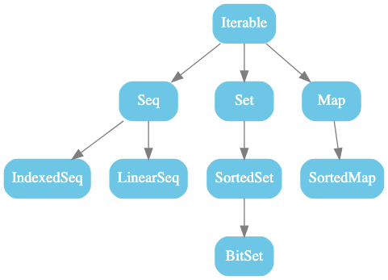
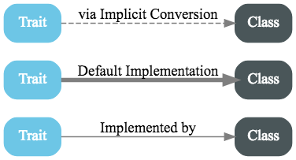
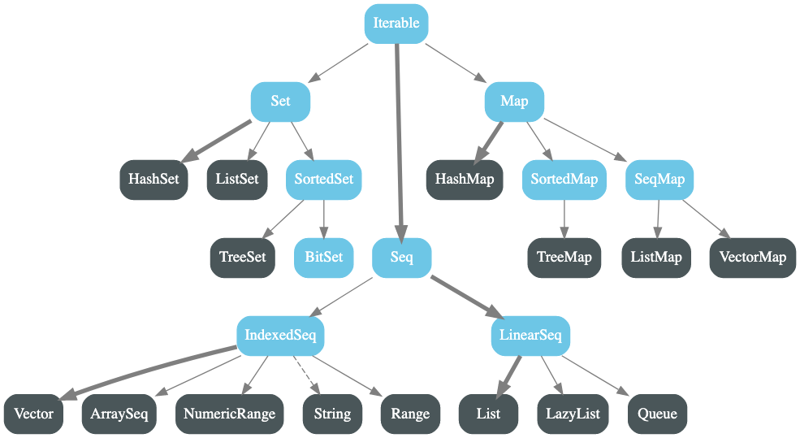
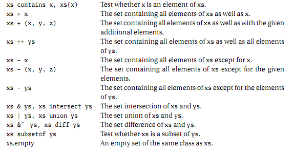
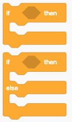
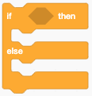
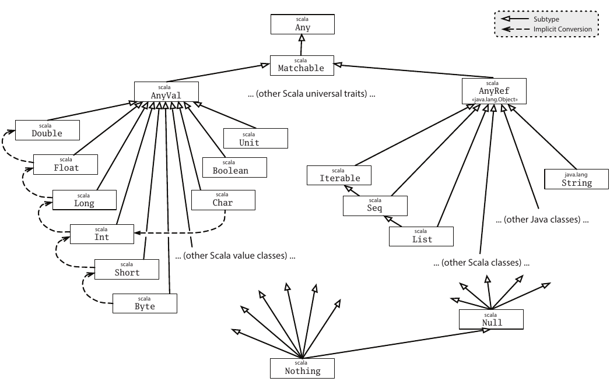
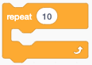

### Prof. Dr. Marko Boger
## Software Engineering
# Lecture 04: More Scala

Type system, collections, control structures, pattern matching and new Scala 3 types.

---

# CodeTask

- CodeTask is a learning platform for Scala, developed here at HTWG.
- Please use it now! We need your feedback.
- We will soon do an exam in CodeTask
- [https://codetask.in.htwg-konstanz.de/](https://codetask.in.htwg-konstanz.de/)

---

<style scoped>
pre, code { font-variant-ligatures: none; font-feature-settings: "liga" 0, "calt" 0; }
pre { font-size: 20px; }
.vs { display: grid; grid-template-columns: 170px 1fr; gap: 0.6rem 1rem; align-items: center; }
.vs .lbl { font-size: 26px; color: #575e75; }
.vs .sep { grid-column: 1 / 3; border-top: 3px dashed #b0b4bf; margin: 0.3rem 0; }
</style>

# A class ...

<div class="vs">
<div class="lbl">... in Java:</div>

```java
public class Person {
  public final String name;
  public final int age;
  Person(String name, int age) {
      this.name = name;
      this.age = age;
  }
}
```

<div class="sep"></div>
<div class="lbl">... in Scala:</div>

```scala
case class Person(name: String, age: Int)
```

</div>

---

<style scoped>
pre, code { font-variant-ligatures: none; font-feature-settings: "liga" 0, "calt" 0; }
pre { font-size: 19px; }
.vs { display: grid; grid-template-columns: 170px 1fr; gap: 0.6rem 1rem; align-items: center; }
.vs .lbl { font-size: 26px; color: #575e75; }
.vs .sep { grid-column: 1 / 3; border-top: 3px dashed #b0b4bf; margin: 0.3rem 0; }
</style>

# ... and its usage

<div class="vs">
<div class="lbl">... in Java:</div>

```java
import java.util.ArrayList;
...
Person[] people;
Person[] minors;
Person[] adults;
{  ArrayList<Person> minorsList = new ArrayList<Person>();
   ArrayList<Person> adultsList = new ArrayList<Person>();
   for (int i = 0; i < people.length; i++)
       (people[i].age < 18 ? minorsList : adultsList)
           .add(people[i]);
   minors = minorsList.toArray(people);
   adults = adultsList.toArray(people);
}
```

<div class="sep"></div>
<div class="lbl">... in Scala:</div>

```scala
val people = List(Person("Luke Skywalker",19))
val (minors, adults) = people partition (_.age < 18)
```

</div>

---

<style scoped>
pre, code { font-variant-ligatures: none; font-feature-settings: "liga" 0, "calt" 0; }
pre { font-size: 18px; line-height: 1.3; margin: 0.2rem 0 0.4rem 0; }
section { font-size: 22px; }
p { margin: 0.3rem 0; }
</style>

# Small Grammar

- The grammar of Scala 3 is very small in comparison to other languages. It fits on [8 pages in A4 format](http://dotty.epfl.ch/docs/reference/syntax.html).
- Here is a list of all keywords

Regular keywords

```text
abstract  case      catch     class     def       do        else
enum      export    extends   false     final     finally   for
given     if        implicit  import    lazy      match     new
null      object    override  package   private   protected return
sealed    super     then      throw     trait     true      try
type      val       var       while     with      yield
:         =         <-        =>        <:        >:        #
@         =>>       ?=>
```

Soft keywords

```text
as  derives  end  extension  infix  inline  opaque  open  transparent  using  |  *  +  -
```

---

<style scoped>
pre, code { font-variant-ligatures: none; font-feature-settings: "liga" 0, "calt" 0; }
pre { font-size: 18px; line-height: 1.3; }
</style>

# Significant Indentation

- In Scala 2, blocks of code are formed by braces, Java style

```scala
case class Person(name:String, birthdate:Date) extends Ordered[Person]{
 override def compare(that: Person) = this.age - that.age
 def age = birthdate.fullYearsSince
 def age(date:Date) = birthdate.fullYearsSince(date)
}
```

- Scala 3 also allows blocks by significant indentation, Python style

```scala
case class Person(name:String, birthdate:Date) extends Ordered[Person]:
 override def compare(that: Person) = this.age - that.age
 def age = birthdate.fullYearsSince
 def age(date:Date) = birthdate.fullYearsSince(date)
```

---

<style scoped>
pre, code { font-variant-ligatures: none; font-feature-settings: "liga" 0, "calt" 0; }
</style>

# Scala Class Hierarchy

- Scala has a closed type hierarchy with top and bottom types.
  - The top class is `Any`.
  - The bottom type is `Nothing`.



---

# Type Casting for Value Types

- Value types can easily be converted into a suitable more complex value type.



---

# The Type Unit

- Similar to void in Java
- But Java-void is not a type, it is a keyword
- In Scala Unit is a type
  - So we can do type checking on it
  - It is a subtype of AnyVal
- It has only a single instance value
  - `()`
- Try to avoid Unit, try to always return a result from a function

---

<style scoped>
pre, code { font-variant-ligatures: none; font-feature-settings: "liga" 0, "calt" 0; }
pre { font-size: 20px; }
</style>

# The Type Nothing

- Nothing is a subtype of any type
- i.e. is returned if a calculation is aborted with exception

```scala
def error(message:String):Nothing =
  throw new RuntimeException(message)
def divide(x:Int, y:Int) : Int =
  if (y!=0) x/y
  else error("can not divide by zero")
```

- Both branches are compatible with type Int

---

# The Type Null

- In Java null is a value that is allowed for many Types
  - It can be checked for its value, but not for its type
- Null in Scala is a Type
  - Null is a subtype of any Reference Type
    - It is type compatible with any Reference Type
  - null is an instance of Null
    - Value Types can not contain null, only Reference Types can
- Null should be avoided, instead the type Option should be used
  - it is only present for compatibility reasons

---

<style scoped>
pre, code { font-variant-ligatures: none; font-feature-settings: "liga" 0, "calt" 0; }
pre { font-size: 18px; line-height: 1.3; margin: 0.2rem 0 0.3rem 0; }
section { font-size: 22px; }
li { margin: 0.1rem 0; }
</style>

# The Type Option

- In Java, a return value null can mean „no value found“ or dereferenced
  - It forces to check for null pointer - > Defencive Programming
- In Scala, return types that can have a value or not are modeled as Option

```scala
def search(something:Any): Option[Any] = …
```

- An Option can have the values `Some(x)` or `None`
- Access this value i.e. with a match:

```scala
search(something) match {
  case Some(s) => println("found "+s)
  case None => println("found nothing")
}
```

---

<style scoped>
section { font-size: 22px; }
</style>

# Extending the Type System

- Java has inheritance from one class and realization from several Interfaces
  - Interfaces can not have attributes or method implementations
  - Abstract classes can only be inherited once
    - Rich Interfaces are problematic because all methods must be provided by the user
- Scala has
  - Inheritance from a class OR a trait
  - Mix-in using ‚with‘ from several traits
  - Traits can have attributes and method implementations
    - Rich Traits are very convenient, they provide a lot
  - Since Scala 3, traits can also have parameters
- This brings Scala very close to multiple Inheritance

---

<style scoped>
pre, code { font-variant-ligatures: none; font-feature-settings: "liga" 0, "calt" 0; }
pre { font-size: 21px; line-height: 1.35; }
</style>

# Traits - an Example

```scala
trait Ordered[A] {
  def compare(that: A): Int   // abstract method
  def <  (that: A): Boolean = (this compare that) <  0
  def >  (that: A): Boolean = (this compare that) >  0
}
class Health(val value : Int) extends Ordered[Health]
{
  override def compare(other : Health) = {
    this.value - other.value }
  def isCritical() = …
}
```

---

# Collection Abstractions

<div class="columns" style="grid-template-columns: 1fr 1fr;">
<div>

- Scala has a very nice collection library. At its core are some very clean abstractions of different types of collections. They very nicely unify the API.
- These abstractions are available both as immutable and mutable implementations.
- Unless you have a very strong reason, use the immutable one.

</div>

</div>

---

# Immutable Collections





---

<style scoped>
pre, code { font-variant-ligatures: none; font-feature-settings: "liga" 0, "calt" 0; }
pre { font-size: 20px; line-height: 1.3; margin: 0.2rem 0 0.4rem 0; }
p { margin: 0.3rem 0; }
</style>

# Creation of Collections

Creation of collections is uniform and simple. Here are examples:

```scala
Iterable("x", "y", "z")
Map("x" -> 24, "y" -> 25, "z" -> 26)
Set(Color.red, Color.green, Color.blue)
SortedSet("hello", "world")
Buffer(x, y, z)
IndexedSeq(1.0, 2.0)
LinearSeq(a, b, c)
```

Often you will use the default types:

```scala
List(1, 2, 3)
Vector(1, 2, 3)
Map("x" -> 24, "y" -> 25, "z" -> 26)
```

---

<style scoped>
pre, code { font-variant-ligatures: none; font-feature-settings: "liga" 0, "calt" 0; }
pre { font-size: 18px; line-height: 1.3; }
</style>

# Examples for Iterator

```scala
scala> val xs = List(1, 2, 3, 4, 5)
xs: List[Int] = List(1, 2, 3, 4, 5)
scala> val git = xs grouped 3
git: Iterator[List[Int]] = non-empty iterator
scala> git.next()
res3: List[Int] = List(1, 2, 3)
scala> git.next()
res4: List[Int] = List(4, 5)
scala> val sit = xs sliding 3
sit: Iterator[List[Int]] = non-empty iterator
scala> sit.next()
res5: List[Int] = List(1, 2, 3)
scala> sit.next()
res6: List[Int] = List(2, 3, 4)
scala> sit.next()
res7: List[Int] = List(3, 4, 5)
```

---

# API of Set

- A Set is a Traversable and an Iterator, and has specific operations for sets



---

<style scoped>
pre, code { font-variant-ligatures: none; font-feature-settings: "liga" 0, "calt" 0; }
pre { font-size: 20px; line-height: 1.3; margin: 0.2rem 0 0.4rem 0; }
</style>

# Lists

- Lists are heavily used in Scala, like in all functional programming languages
- Simple lists

```scala
List('a', 'b', 'c')
List( 1, 2, 3, 4)
List("apples", "oranges", "pears")
List(List(1,0), List(0,1))
List()
```

- The elements all have the same (super-) Type

```scala
List[Char], List[Int], List[String], List[List[Int]]
val fruit: List[String] = List("apples", "oranges")
```

---

<style scoped>
pre, code { font-variant-ligatures: none; font-feature-settings: "liga" 0, "calt" 0; }
pre { font-size: 19px; margin: 0.1rem 0 0.3rem 0; }
section { font-size: 22px; }
li { margin: 0.1rem 0; }
</style>

# List concatenator

<div class="columns" style="align-items: start;">
<div>

- Empty List

```scala
Nil
```

- Element Concatenator `::`

```scala
val nums = 1 :: (2 :: (3 :: (4 :: Nil)))
```

- Concatenation works from right to left

```scala
val nums = 1 :: 2 :: 3 :: 4 :: Nil
```

</div>
<div>

- Basic Operations

```scala
head
tail
isEmpty
```

- List Concatenator `:::`

```scala
List(1,2,3):::List(4,5,6)
```

</div>
</div>

---

<style scoped>
.blocks { display: grid; grid-template-columns: auto auto auto; gap: 0.4rem 2rem; align-items: start; justify-content: end; margin-top: -0.5rem; }
.blocks div { text-align: center; font-weight: bold; color: #0b3c68; }
.blocks img { display: block; margin: 0.5rem auto 0 auto; }
</style>

# The fundamental building blocks of programming languages

<div class="columns" style="grid-template-columns: 0.9fr 1.1fr; align-items: start;">
<div>

- Most programming languages consist of these fundamental building blocks
  - Assignment
  - Conditionals
  - Iterations
- We already saw them im Scratch.

</div>
<div class="blocks">
<div>Assignment</div>
<div>Conditionals</div>
<div>Iterations</div>
</div>
</div>

---

<style scoped>
pre, code { font-variant-ligatures: none; font-feature-settings: "liga" 0, "calt" 0; }
pre { font-size: 21px; }
</style>

# Assignment

- An assignment stores a data value into a variable, usually written with the equals sign (=)

```scala
var x = 42
x = 21
var anakin: String = "Anakin Skywalker"
anakin = "Darth Vader"
var theForceIsStrong = true
```

- This differs from Math, were = denotes an equality relationship, not assignment.

---

<style scoped>
pre, code { font-variant-ligatures: none; font-feature-settings: "liga" 0, "calt" 0; }
pre { font-size: 21px; }
</style>

# Equality

- In programming, the equality is usually written with two equal signs (==) and is a boolean condition.

```scala
x==21
x==42
anakin=="Anakin Skywalker"
anakin=="Darth Vader"
theForceIsStrong==true
theForceIsStrong==false
```

---

<style scoped>
pre, code { font-variant-ligatures: none; font-feature-settings: "liga" 0, "calt" 0; }
pre { font-size: 19px; margin: 0.2rem 0 0.4rem 0; }
section { font-size: 22px; }
</style>

# Types in Assignment

<div class="columns" style="grid-template-columns: 1.3fr 0.7fr; align-items: start;">
<div>

- Data values have a type, like Int or String.
- In statically typed languages, the variable that should store this data value must match its type.
- In some programming languages, like Java, this type needs to be declared before assignment.

```scala
var padme: String = "Padme Amidala"
var age: Int = 26
```

- In Scala, this type is often inferred by the compiler
- and can be omitted

```scala
var padme = "Padme Amidala"
var age = 26
```

</div>
<div style="margin-top: 5.5rem;">

```java
String padme = "Padme Amidala";
int age = 26;
```

</div>
</div>

---

<style scoped>
pre, code { font-variant-ligatures: none; font-feature-settings: "liga" 0, "calt" 0; }
pre { font-size: 20px; margin: 0.2rem 0 0.4rem 0; }
</style>

# Values and Variables

- Variables can be assigned a new value

```scala
var anakin: String = "Anakin Skywalker"
anakin = "Darth Vader"
```

- But variables can be declared as non-reassignable or constant. In Scala, these are called values

```scala
val pi = 3.14159
val luke = "Luke Skywalker"
```

- In functional programming, the re-assignment is avoided. It is regarded as a side-effect and makes code difficult to test and reason about.

---

<style scoped>
pre, code { font-variant-ligatures: none; font-feature-settings: "liga" 0, "calt" 0; }
pre { font-size: 18px; line-height: 1.25; margin: 0.2rem 0 0.3rem 0; }
section { font-size: 21px; }
li { margin: 0.1rem 0; }
</style>

# Scope

- The declaration of a variable is only visible within the block of code it is defined in. This is called the scope of a variable.
- A block of code is usually defined by brackets { … }

```scala
{
   val anakin = "Anakin Skywalker"
}
{
   val anakin = "Darth Vader"
}
```

- Variables on the top-most block are visible everywhere, this is called global scope.

```scala
val pi = 3.14159
```

- We should usually be very careful with global scope. It can interfere with other code, like libraries.

---

<style scoped>
pre, code { font-variant-ligatures: none; font-feature-settings: "liga" 0, "calt" 0; }
pre { font-size: 20px; }
</style>

# Shadowing

- Blocks of Code can be nested inside each other. Accordingly variables can be declared at different depth of the scope.
- If a variable of same name and type is declared on an inner nested scope, this is called Shadowing.

```scala
{
   val anakin = "Anakin Skywalker"
   {
       val anakin = "Darth Vader"
       println (anakin)
   }
   println (anakin)
}
```

- This can lead to difficult to find bugs and should generally be avoided.

---

<style scoped>
pre, code { font-variant-ligatures: none; font-feature-settings: "liga" 0, "calt" 0; }
pre { font-size: 18px; margin: 0.2rem 0 0.4rem 0; }
section { font-size: 21px; }
</style>

# Statements and Expressions

- **Statement:** A statement is a complete unit of code that performs an action but does not produce a value. It’s like a command that the program executes, often causing side effects (e.g., printing to the console, modifying a variable). Statements are typically executed for their effect rather than their result.

```scala
val meaningOfLife = 42; println(meaningOfLife)
```

- **Expression:** An expression is a piece of code that evaluates to a value. It can be used wherever a value is expected (e.g., in assignments, function arguments). Expressions may or may not cause side effects, but their primary purpose is to produce a result.

```scala
17+4
sin(x) * log(1 + x * x) + exp(x / pi)
theForceIsStrong==true
```

---

<style scoped>
pre, code { font-variant-ligatures: none; font-feature-settings: "liga" 0, "calt" 0; }
pre { font-size: 19px; margin: 0.2rem 0 0.4rem 0; }
section { font-size: 22px; }
li { margin: 0.1rem 0; }
</style>

# Statements and Expressions

- Expressions can be combined with Expressions or Statements. An Expression evaluates to a value, this can be compiled with another value, assigned to a variable, passed to a function or printed

```scala
val blackjack = 17+4
println(sin(x) * log(1 + x * x) + exp(x / pi))
```

- Note that Statements do not combine with Expressions or other Statements.
- Statements are only combined in sequence.
- In many languages, the sequence of Statements is separated by a semicolon (;)

```scala
val meaningOfLife = 42; println(meaningOfLife)
```

- In Scala, this is only necessary if used on the same line.

---

<style scoped>
pre, code { font-variant-ligatures: none; font-feature-settings: "liga" 0, "calt" 0; }
pre { font-size: 22px; }
</style>

# If Conditional

<div class="columns" style="grid-template-columns: 1.4fr 0.6fr; align-items: start;">
<div>

- If is a fundamental control structure and found in all programming languages.
- In Scala, its basic form is

```scala
if boolean_expression then statement
```

</div>

</div>

---

<style scoped>
pre, code { font-variant-ligatures: none; font-feature-settings: "liga" 0, "calt" 0; }
pre { font-size: 21px; margin: 0.2rem 0 0.4rem 0; }
</style>

# Syntax Alternatives

- Scala offers syntax alternatives.
- A style close to C or Java is

```scala
if (boolean_expression) { statement }
```

- The more modern version close to pseudo notations is

```scala
if boolean_expression then statement
```

- And you can mix these as you like.

```scala
if (boolean_expression) then { statement }
if (boolean_expression) then statement
```

---

<style scoped>
pre, code { font-variant-ligatures: none; font-feature-settings: "liga" 0, "calt" 0; }
pre { font-size: 20px; margin: 0.2rem 0 0.4rem 0; }
</style>

# if then else

<div class="columns" style="grid-template-columns: 1.6fr 0.4fr; align-items: start;">
<div>

- The if expression also has an else in Scala

```scala
if (boolean_expression) { statement } else { statement }
if boolean_expression then statement else statement
```

- This is often formatted over several lines

```scala
if boolean_expression
then statement
else statement
```

</div>

</div>

---

<style scoped>
pre, code { font-variant-ligatures: none; font-feature-settings: "liga" 0, "calt" 0; }
pre { font-size: 17px; margin: 0.2rem 0 0.4rem 0; }
</style>

# If as expression

- In Scala, the if can also be used as an expression

```scala
if (boolean_expression) { expression } else { expression }
if boolean_expression then expression else expression
```

- The importance of this is that expressions can be composed

```scala
val result = if (boolean_expression)
then expression
else expression
(if boolean_expression then expression else expression) + (if boolean_expression then expression else expression)
```

---

<style scoped>
pre, code { font-variant-ligatures: none; font-feature-settings: "liga" 0, "calt" 0; }
pre { font-size: 20px; margin: 0.2rem 0 0.4rem 0; }
</style>

# If Conditional

- Here is a more practical example. First as a Statement

```scala
if (points  > 21) println("Busted!")
else if (points == 21) println("Blackjack!")
else println("Points: " + points)
```

- And as an expression.

```scala
val result = if (points  > 21) "Busted!"
else if (points == 21) "Blackjack!"
else "Points: " + points
println(result)
```

---

<style scoped>
pre, code { font-variant-ligatures: none; font-feature-settings: "liga" 0, "calt" 0; }
pre { font-size: 21px; }
</style>

# if without Parentheses

- Here is another example, here without parentheses

```scala
// if without parentheses as statement
if age >= 18
then println("Adult")
else println("Minor")
// if without parentheses as expression
val ageGroup = if age >= 18 then "Adult" else "Minor"
println(ageGroup)
```

---

# The Type of an if expression

- The if expression’s return type is the least upper bound of the types of the then and else branches.
- That is, the next common super type of the then branch and the else branch.
- The least upper bound of Int and Boolean is AnyVal.
- The least upper bound of Double and String is Matchable.
- So, in general it is advisable to always use an else branch when if is used as expression. And the type of the then and else branch should match.

---

<!-- _footer: "" -->



---

<style scoped>
pre, code { font-variant-ligatures: none; font-feature-settings: "liga" 0, "calt" 0; }
pre { font-size: 14px; line-height: 1.3; margin: 0; }
section { font-size: 22px; }
.code3 { display: grid; grid-template-columns: 1fr 1fr; gap: 0.6rem 1rem; }
</style>

# If in Functional Programming

<div class="columns" style="grid-template-columns: 0.9fr 1.1fr; align-items: start; gap: 1.2rem;">
<div>

- Most programming languages only offer if as a statement. Java has if as an expression, but it is rarely used.
- In the functional programming style, the expression is preferred.
- In general Scala is an expression-oriented language, Java is statement-oriented.

```java
String result = points > 21 ? "Busted!" :
       points == 21 ? "Blackjack!" :
       "Points: " + points;
```

</div>
<div>

```c
if (points > 21) {
    printf("Busted!\n");
} else if (points == 21) {
    printf("Blackjack!\n");
} else {
    printf("Points: %d\n", points);
}
```

```java
int points = 22;
if (points > 21) {
    System.out.println("Busted!");
} else if (points == 21) {
    System.out.println("Blackjack!");
} else {
    System.out.println("Points: " + points);
}
```

</div>
</div>

---

<style scoped>
pre, code { font-variant-ligatures: none; font-feature-settings: "liga" 0, "calt" 0; }
pre { font-size: 20px; margin: 0.2rem 0 0.4rem 0; }
section { font-size: 22px; }
li { margin: 0.1rem 0; }
</style>

# for loop

<div class="columns" style="grid-template-columns: 1.6fr 0.4fr; align-items: start;">
<div>

- Another fundamental control structure in all programming languages is the for loop.

```scala
for (i <- 0 until 10) println(i)
for (i <- 1 to 10) println(i)
```

- Note: read the <- arrow as “take i from the Range 1 to 10”
- For loops are often used to access the index of an Array.

```scala
val array = Array(1, 2, 3, 4, 5)
for (i <- 0 until array.length) println(array(i))
```

- Here, the for loop is used as a statement.

</div>

</div>

---

<style scoped>
pre, code { font-variant-ligatures: none; font-feature-settings: "liga" 0, "calt" 0; }
pre { font-size: 18px; margin: 0.2rem 0 0.4rem 0; }
section { font-size: 22px; }
li { margin: 0.1rem 0; }
</style>

# More Features of for

- The for loop has a few more tricks up its sleeve.
- The general form is

```scala
for (generator) statement
```

- The generator can have a step size

```scala
for (i <- 0 until array.length by 2) println(array(i))
```

- The generator can also have a condition

```scala
for (i <- 0 until array.length if array(i) % 2 == 0)
    println(array(i))
```

- Or both

```scala
for (i <- 0 until array.length by 3 if array(i) % 2 == 0) println(array(i))
```

---

<style scoped>
pre, code { font-variant-ligatures: none; font-feature-settings: "liga" 0, "calt" 0; }
pre { font-size: 20px; margin: 0.2rem 0 0.4rem 0; }
section { font-size: 22px; }
</style>

# For as an Expression

- The for loop can also be used as an Expression. For this to work, every iteration has to return a single result. This is expressed with the keyword yield.
- The general form is

```scala
for (generator) yield expression
```

- The return type of the for loop now is a collection. The type of the collection depends on the collection used in the generator. If the generator does not have a suitable collection, the type is IndexedSeq or more specifically a Vector.

```scala
var vector: IndexedSeq[Int] = Vector()
vector = for (i <- 0 until array.length) yield i
```

---

<style scoped>
pre, code { font-variant-ligatures: none; font-feature-settings: "liga" 0, "calt" 0; }
pre { font-size: 19px; line-height: 1.3; }
</style>

# Step by and Condition

- Also as expression, step by and conditions can be used.

```scala
// for loop as an expression, using yield with a step
vector = for (i <- 0 until array.length by 2)
    yield i
// for loop using yield with a condition
vector = for (i <- 0 until array.length if array(i) % 2 == 0)
    yield i
// for loop using yield with a step and a condition
vector = for (i <- 0 until array.length by 3
    if array(i) % 2 == 0)
    yield i
```

---

<style scoped>
pre, code { font-variant-ligatures: none; font-feature-settings: "liga" 0, "calt" 0; }
pre { font-size: 19px; margin: 0.2rem 0 0.4rem 0; }
section { font-size: 22px; }
</style>

# For over a List

- In Scala, the Array is generally avoided. Instead the List is preferred. This becomes evident in the context of the for loop.
- Instead of iterating over an index, we directly iterate over the List.

```scala
val list: List[Int] = List(1, 2, 3, 4, 5)
val result3 : List[Int] = for (elem <- list) yield elem
val result4 : List[Int] =
   for (elem <- list if elem % 2 == 0) yield elem
```

- In this case, the resulting collection is a List, because we started with a List. But the compiler knows this, we can leave that out.

```scala
val result4 =
   for (elem <- list if elem % 2 == 0) yield elem
```

---

<style scoped>
pre, code { font-variant-ligatures: none; font-feature-settings: "liga" 0, "calt" 0; }
pre { font-size: 20px; margin: 0.2rem 0 0.4rem 0; }
section { font-size: 22px; }
</style>

# For over an Array

- Scala can also directly iterate over an Array, without explicitly using the index.

```scala
val array = Array(1, 2, 3, 4, 5)
val result5 : Array[Int] = for (elem <- array) yield elem
```

- In this case the result type is an Array. We can again leave out the type.

```scala
val result5 = for (elem <- array) yield elem
```

- Because we do not need an index anymore, but directly iterate over the elements of the collection, in Scala the List is preferred over the Array. Reading sequentially is exactly what it is built for.

---

<style scoped>
section { font-size: 22px; }
</style>

# Summary

- Assignment, if conditions and for loops are fundamental building blocks of programming languages.
- **var allows re-assignment, val does not. val is preferred in FP.**
- **if can be used as a statement or an expression. In FP expressions are preferred.**
- **Also for can be used as a statement or an expression.**
- for can loop over a Range of the index of an Array.
- **A Range has to and until, as well as by operators.**
- **In Scala, for can also directly iterate over an Array or a List.**
- **It is often used as expression using yield.**
- Then the return type is the same as used in the generator.

---

<style scoped>
pre, code { font-variant-ligatures: none; font-feature-settings: "liga" 0, "calt" 0; }
pre { font-size: 21px; }
</style>

# foreach

- All collections have the function foreach. It serves much like a for loop and is very common.

```scala
val v = Vector((1,9), (2,8), (3,7), (4,6), (5,5))
v.foreach{ case(i,j) => println(i, j) }
```

---

<style scoped>
pre, code { font-variant-ligatures: none; font-feature-settings: "liga" 0, "calt" 0; }
pre { font-size: 18px; line-height: 1.3; margin: 0.2rem 0 0.3rem 0; }
section { font-size: 22px; }
li { margin: 0.1rem 0; }
</style>

# map

- A typical way to express loops in FP is using map
- Map
  - Maps each element of a list to a new element of a list according to some function

```scala
val n = (1 to 3).toList
n.map(i => i*3)
List[Int] = List(3, 6, 9))
n.map(i => n.map(j => i * j))
List[List[Int]] = List(List(1, 2, 3), List(2, 4, 6), List(3, 6, 9))
```

- Flatmap
  - Produces a not-nested list (flat)

```scala
n.flatMap(i => n.map(j => i * j))
List[Int] = List(1, 2, 3, 2, 4, 6, 3, 6, 9)
```

---

<style scoped>
pre, code { font-variant-ligatures: none; font-feature-settings: "liga" 0, "calt" 0; }
pre { font-size: 19px; line-height: 1.3; margin: 0.2rem 0 0.4rem 0; }
</style>

# match

<div class="columns" style="align-items: start;">
<div>

- Match is similar to switch but more general

```scala
def describe(x: Int) =
   x match {
     case 1 => "one"
     case 2 => "two"
     case _ => "many"
   }
```

</div>
<div>

- Variable renaming and guards

```scala
def describe(x: Int) =
   x match {
     case n:Int if (n < 0) => n + " is negative"
     case z:Int if (z ==0) => z + " is zero"
     case p:Int if (p > 0) => p + " is positive"
   }
```

</div>
</div>

---

<style scoped>
pre, code { font-variant-ligatures: none; font-feature-settings: "liga" 0, "calt" 0; }
pre { font-size: 21px; }
</style>

# match on Types

- The match can be used to cast types to new variables

```scala
def describe(x: Any) =
    x match {
      case i:Int     => i + " is an Integer"
      case s:String  => s + " is a String"
      case b:Boolean => b + " is a Boolean"
      case _         => x + " has some other type"
    }
```

---

<style scoped>
pre, code { font-variant-ligatures: none; font-feature-settings: "liga" 0, "calt" 0; }
pre { font-size: 18px; line-height: 1.3; margin: 0.2rem 0 0.4rem 0; }
</style>

# Pattern Matching

- Lists can be taken apart by pattern matching

```scala
elem::list = 2::5::1::Nil
elem=2, list=5::1::Nil
```

- Isort with pattern matching

```scala
def isort(list: List[Int]): List[Int] = list match {
   case Nil => Nil
   case head :: tail => insert(head, isort(tail))
 }
 def insert(elem: Int, list: List[Int]): List[Int] = list match {
   case Nil => List(elem)
   case head :: tail => if (elem <= head) elem :: list
     else head :: insert(elem, tail)
 }
```

---

<style scoped>
pre, code { font-variant-ligatures: none; font-feature-settings: "liga" 0, "calt" 0; }
pre { font-size: 14px; line-height: 1.25; margin: 0; }
</style>

# What does this Java code do?

<div class="columns" style="align-items: start; gap: 1rem;">

```java
public class Roman
{
    public static class SymTab
    {
        char symbol;
        long value;
        public SymTab(char s, long v) { this.symbol=s; this.value=v; }
   };
   public static Roman.SymTab syms[]= {
        new Roman.SymTab('M',1000),
            new Roman.SymTab('D',500),
        new Roman.SymTab('C',100),
        new Roman.SymTab('L',50),
        new Roman.SymTab('X',10),
        new Roman.SymTab('V',5),
        new Roman.SymTab('I',1)
   };
```

```java
public static long toLong(String s) {
        long tot=0,max=0;
        char ch[]=s.toUpperCase().toCharArray();
        int i,p;
        for(p=ch.length-1;p>=0;p--)
        {
            for(i=0;i<syms.length;i++)
            {
                if(syms[i].symbol==ch[p])
                {
                    if(syms[i].value>=max)
                        tot+= (max = syms[i].value);
                    else
                        tot-= syms[i].value;
                }
            }
        }
        return tot;
   };
}
```

</div>

---

<style scoped>
pre, code { font-variant-ligatures: none; font-feature-settings: "liga" 0, "calt" 0; }
pre { font-size: 18px; line-height: 1.3; }
</style>

# An implementation in Scala using Lists

```scala
def roman(in: List[Char]): Int = in match {
   case 'I' :: 'V' :: rest => 4 + roman(rest)
   case 'I' :: 'X' :: rest => 9 + roman(rest)
   case 'I' :: rest => 1 + roman(rest)
   case 'V' :: rest => 5 + roman(rest)
   case 'X' :: 'L' :: rest => 40 + roman(rest)
   case 'X' :: 'C' :: rest => 90 + roman(rest)
   case 'X' :: rest => 10 + roman(rest)
   case 'L' :: rest => 50 + roman(rest)
   case 'C' :: 'D' :: rest => 400 + roman(rest)
   case 'C' :: 'M' :: rest => 900 + roman(rest)
   case 'C' :: rest => 100 + roman(rest)
   case 'D' :: rest => 500 + roman(rest)
   case 'M' :: rest => 1000 + roman(rest)
   case _ => 0
}
```

---

<style scoped>
pre, code { font-variant-ligatures: none; font-feature-settings: "liga" 0, "calt" 0; }
pre { font-size: 19px; line-height: 1.3; }
</style>

# Traits with Parameter

- Classes (or their constructor) can have Parameters. But Traits in Scala 2 could not. In Scala 3 now they can.
- Only the class that first extends the trait passes the arguments. A sub-trait cannot pass arguments.

```scala
trait Greeting(val name: String):
  def msg = s"Hello, $name!"
class C extends Greeting("Luke")           // the first class passes the argument
trait FormalGreeting extends Greeting      // a sub-trait passes no argument
class D extends C, FormalGreeting          // Greeting is already initialized by C
class E extends FormalGreeting, Greeting("Leia") // E must pass it itself
```

---

<style scoped>
pre, code { font-variant-ligatures: none; font-feature-settings: "liga" 0, "calt" 0; }
pre { font-size: 20px; line-height: 1.3; }
</style>

# Union Types

- Scala 3 allows a variable to have one of two (or several) types

```scala
case class UserName(name: String)
case class Email(address: String)
val id: UserName | Email = UserName("Marko")
case class Person(name:String, birthdate:Date) extends Ordered[Person]:
  def verify(id: UserName | Email): Boolean =
   id match
     case UserName(name) => lookupName(name)
     case Email(address) => lookupEmail(address)
```

---

<style scoped>
pre, code { font-variant-ligatures: none; font-feature-settings: "liga" 0, "calt" 0; }
pre { font-size: 19px; line-height: 1.3; }
section { font-size: 22px; }
</style>

# Intersection Types

- Likewise we can require a variable to have two (or more) types at the same time (usually traits). Intersection is very similar to “with” but it is commutative (the order of inheritance does not matter).

```scala
trait Camera:
   def takePhoto(): Unit = println("snap")
trait Phone:
   def makeCall(): Unit = println("ring")
def useSmartDevice(sp: Camera & Phone): Unit =
   sp.takePhoto()
   sp.makeCall()
class Smartphone extends Camera with Phone
useSmartDevice(new Smartphone)
```

---

<style scoped>
pre, code { font-variant-ligatures: none; font-feature-settings: "liga" 0, "calt" 0; }
pre { font-size: 24px; }
</style>

# Literal Types

- 1, 3.14, true and null are literals. Now they can also serve as Types.

```scala
val fieldSize : 1 | 4 | 9 = 9
```

---

<style scoped>
pre, code { font-variant-ligatures: none; font-feature-settings: "liga" 0, "calt" 0; }
pre { font-size: 21px; margin: 0.2rem 0 0.4rem 0; }
</style>

# ReadLine

- Scala has a ReadLine, but it requires an import

```scala
import scala.io.StdIn.readLine
```

- Then it can be used to read lines of input

```scala
print("Enter your first name: ")
val firstName = readLine()
print("Enter your last name: ")
val lastName = readLine()
println(s"Your name is $firstName $lastName")
```

---

<!-- _class: aufgabe -->

# Task 4: Build a Text UI

- Start building the core data structures of your game.
- Build a simple UI using text input and output.

---

<!-- _class: abschluss -->

# Questions?

## Thank you!

marko.boger@htwg-konstanz.de
