### Prof. Dr. Marko Boger
## Software Engineering
# Lecture 05: Architecture

Code analysis, layers, the Observer pattern and MVC

---

<!-- _paginate: false -->
<!-- _footer: "" -->
<style scoped>
h1 { color: white; text-shadow: 0 0 12px rgba(0,0,0,0.8); }
.src { position: absolute; right: 30px; bottom: 16px; font-size: 13px; color: rgba(255,255,255,0.85); text-shadow: 0 0 4px rgba(0,0,0,0.8); }
</style>


# If we had a Tomograph for Software, what would we see?

<div class="src">Photo: National Institute of Mental Health, NIH, public domain, Wikimedia Commons</div>

---

<!-- _paginate: false -->
<!-- _footer: "" -->
<style scoped>
h1 { color: white; text-shadow: 0 0 12px rgba(0,0,0,0.8); }
</style>

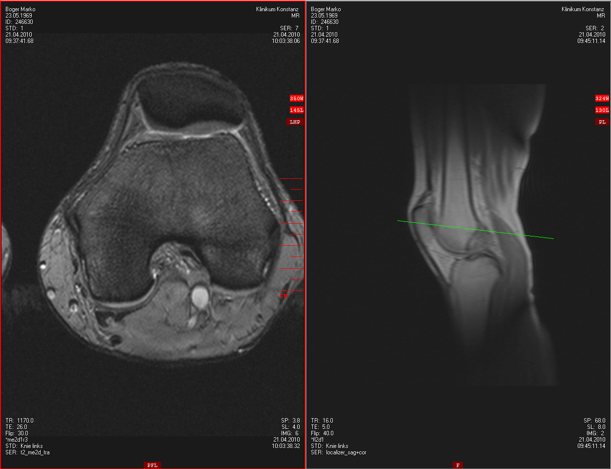

# What would we want to see? What can be visualized?

---

# Manual Code Review

<div class="columns" style="grid-template-columns: 1fr 1.6fr; align-items: center;">
<div>

- Manual code reviews are very time consuming and imprecise.

</div>
<div>

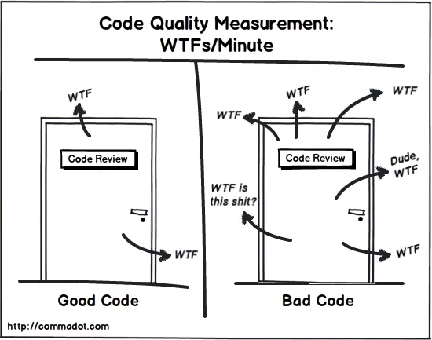

</div>
</div>

---

# Static Code Analysis

- Static code analysis is performed without actually executing the code. Tooling looks for patterns in code that often lead to bugs and warns about it.
- Examples are
  - SpotBugs (formerly FindBugs)
  - PMD
  - SonarQube
- Tools collect metrics about the code, like
  - Cyclomatic complexity
  - Technical debt

---

# Cyclomatic Complexity

<div class="columns" style="grid-template-columns: 1fr 1.4fr; align-items: center;">
<div>

- Counts the number of if-branches and for-loops
- Cyclomatic complexity is one of the most important metrics for imperative code.
- Cyclomatic complexity becomes meaningless in FP.

</div>
<div>

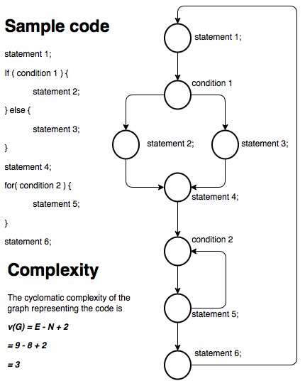

</div>
</div>

---

# Technical Debt

- Technical debt is an aggregated metric for code quality.
- It sums up the time necessary to fix the problems from static code analysis, based on heuristics.
- It can be expressed in hours, money or as percent. In percent it is the relation of time needed to invest to clean up the code to time already invested in the code.
- Technical debt in percent can be compared to an interest rate on a bank loan.

---

# SonarQube

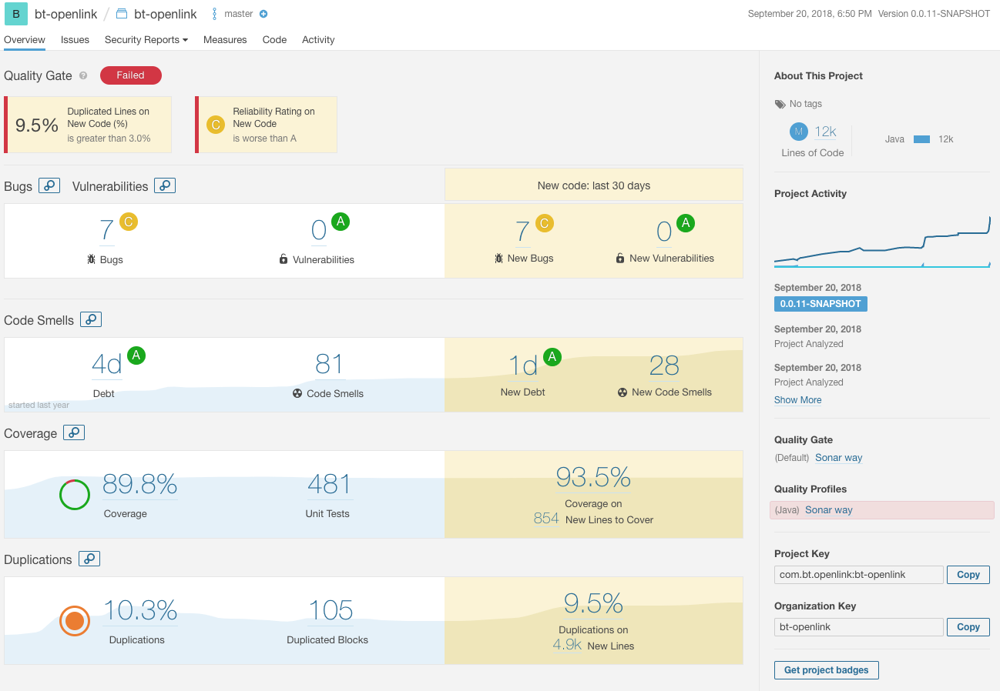

---

# SonarQube

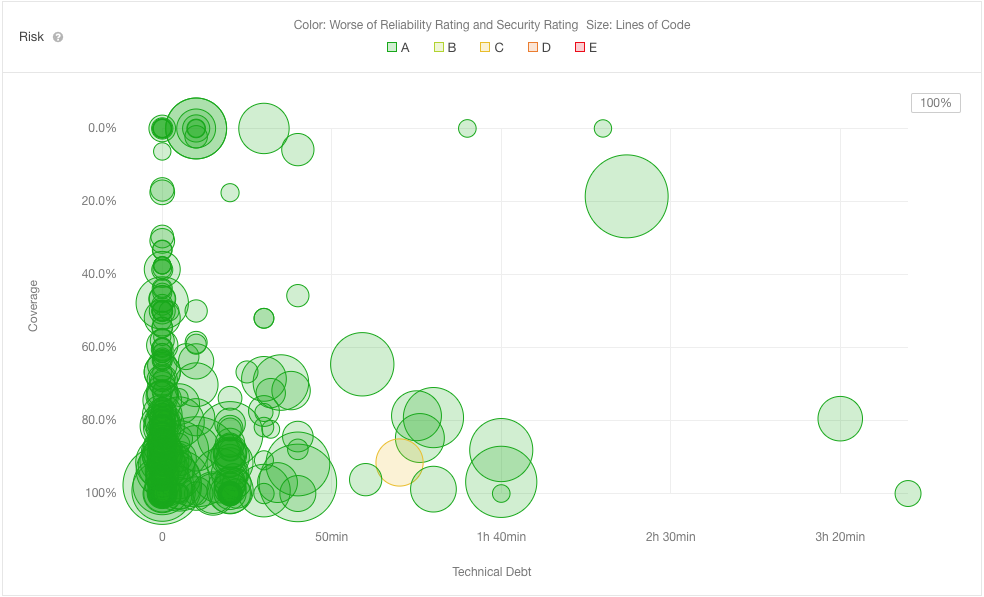

---

# SonarQube

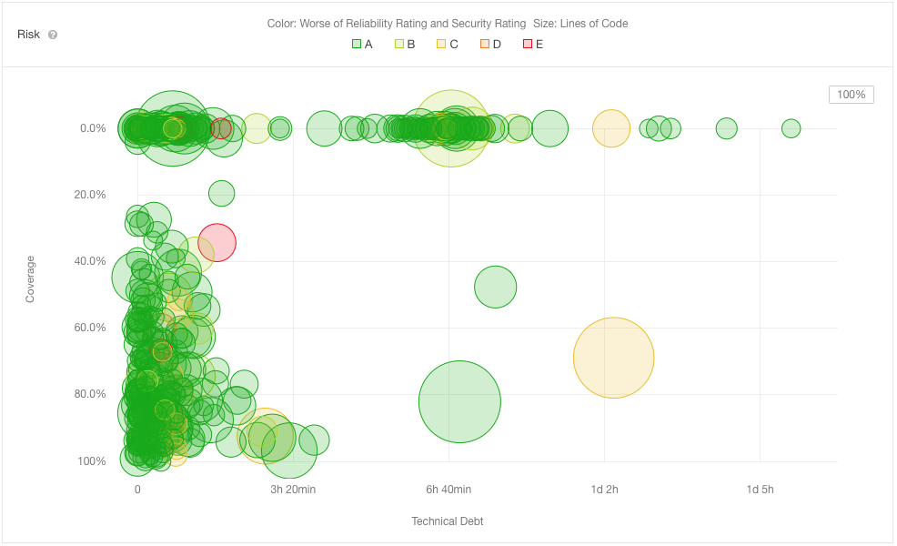

---

# Structural Analysis

- Instead of collecting metrics, we want to look at the architecture of software. For that we want to analyze the dependencies of code fragments.
- There are several ways to visualize such dependencies, depending on the granularity of the fragments.

---

# Analysis of Method Calls

- Assume a project with 100,000 Lines of Code (LoC).
- Or about 10,000 methods or functions

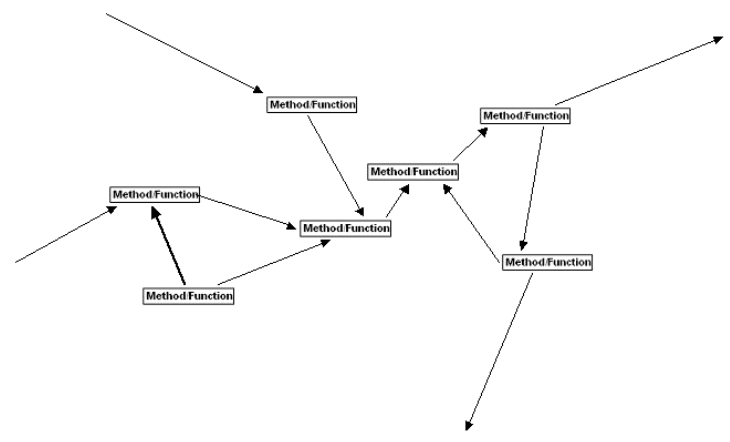

---

# Analysis of Class Dependencies

- Or 1000 classes.

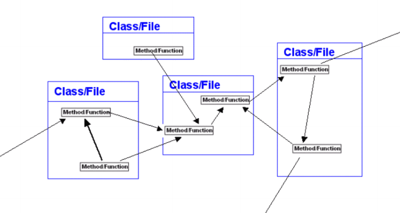

---

# Analysis of Package Dependencies

- Or 50 packages

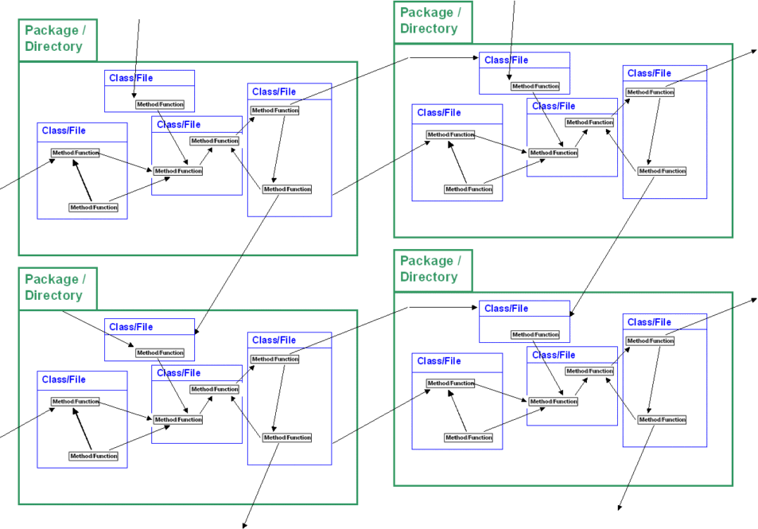

---

# Analysis of Component Dependencies

- Or 10 components.

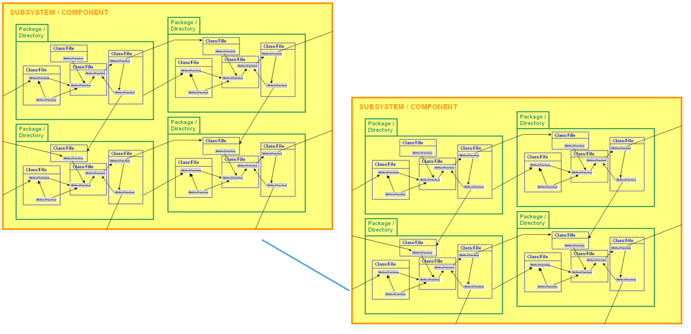

---

# Analysis of Layers

- Or 3 to 5 layers

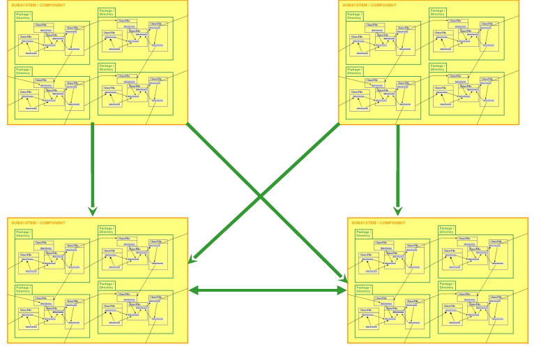

---

# Rules for Layers

<style scoped>
.legend { display: flex; flex-direction: column; gap: 14px; font-size: 0.8em; margin-top: 20px; }
.legend span { display: inline-block; width: 90px; height: 5px; margin-right: 16px; vertical-align: middle; }
</style>

- We only allow dependencies to go down, never up.

<div class="columns" style="grid-template-columns: 1fr 1.3fr; align-items: end;">
<div class="legend">
<div><span style="background: #339933;"></span>Allowed Relationships</div>
<div><span style="background: #ff3300;"></span>Not allowed Relationships</div>
</div>
<div>

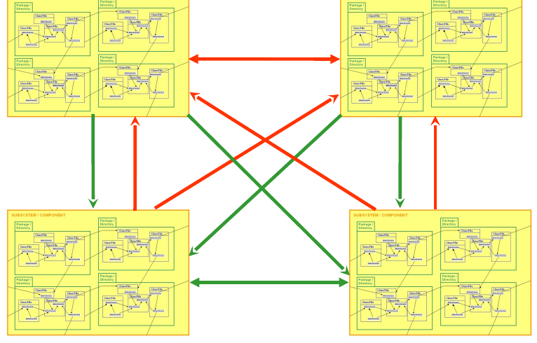

</div>
</div>

---

# Layered Architecture

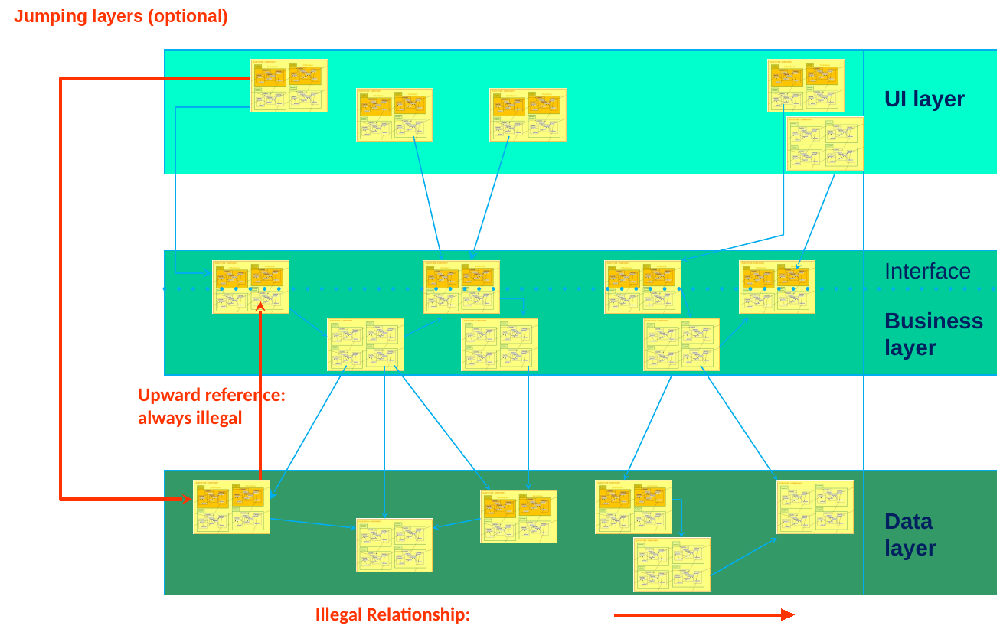

---

# Tooling for Structure Analysis

<div class="columns" style="grid-template-columns: 1.3fr 1fr; align-items: center;">
<div>

- Headway Structure101 (now part of Sonar) provides an Architecture Diagram.
- It is automatically generated based on existing dependencies and package structure.
- It can be thought of as a brick wall
  - Packages should only depend on blocks below it.
  - Dependencies upward are violations and are shown

</div>
<div>

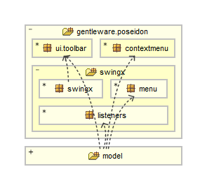

</div>
</div>

---

# An Example

<div class="columns" style="grid-template-columns: 1fr 1fr 1fr; align-items: center;">
<div>

- Structure Analysis of Poseidon at different times during development.

</div>
<div>

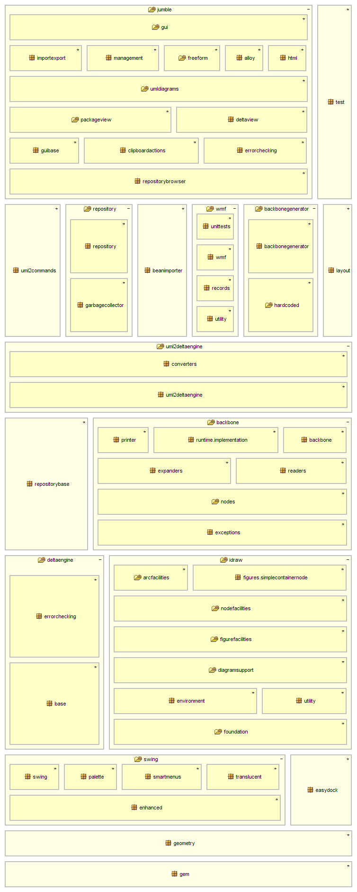

</div>
<div>

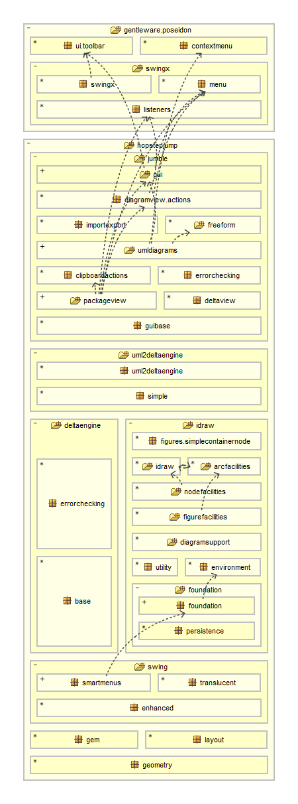

</div>
</div>

---

# Example: Sudoku

<div class="columns" style="grid-template-columns: 1fr 1fr; align-items: center;">
<div>

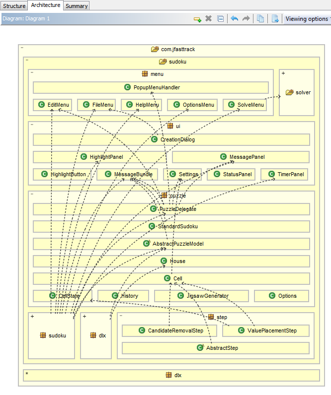

</div>
<div>

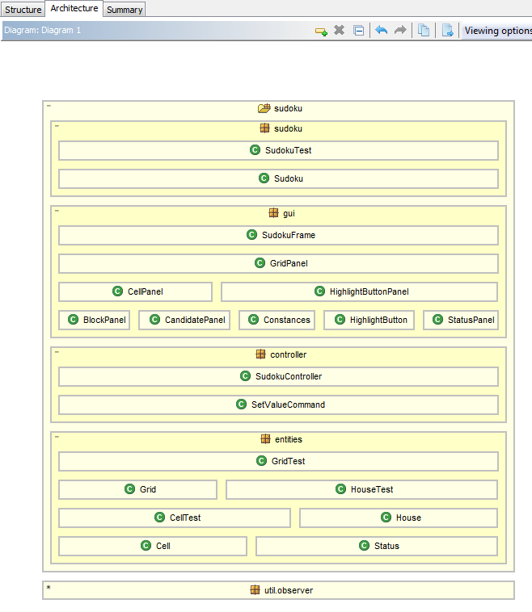

</div>
</div>

---

# Dependency Graph in Structure101 (now part of Sonar)

<div class="columns" style="grid-template-columns: 1fr 1fr;">
<div>

- com.jfasttrack.sudoku

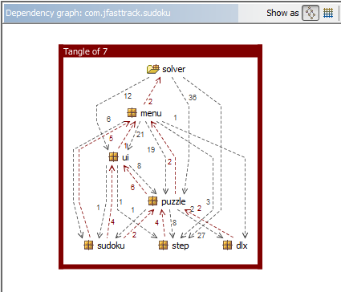

</div>
<div>

- de.htwg.se.sudoku

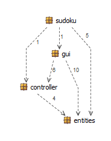

</div>
</div>

---

# Matrix View in Structure101 (now part of Sonar)

<div class="columns" style="grid-template-columns: 1fr 1fr;">
<div>

- com.jfasttrack.sudoku

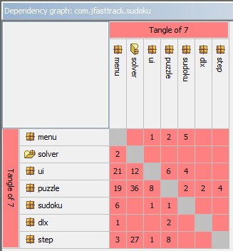

</div>
<div>

- de.htwg.se.sudoku

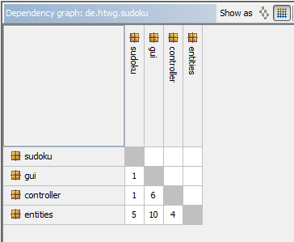

</div>
</div>

---

# How do we resolve Layer conflicts?

- Move classes, methods or variables
  - Move to a higher layer
- Move the functionality where it belongs
  - Do not jump layers
  - Do not make calls upwards
- Inversion of Control
  - Turn around the dependency
  - A typical implementation for IoC is the Observer Pattern

---

# Inversion of Control

<div class="columns" style="grid-template-columns: 1fr 1fr;">
<div>

- The call is inverted by introducing an Abstraction

</div>
<div>

- This is particularly important with several instances

</div>
</div>

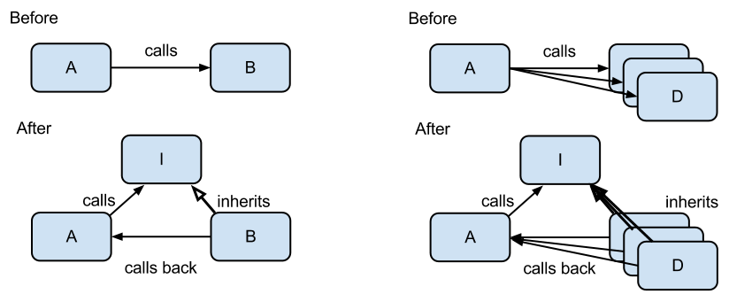

---

# Observer Pattern

- A pattern that implements Inversion of Control is the Observer Pattern.

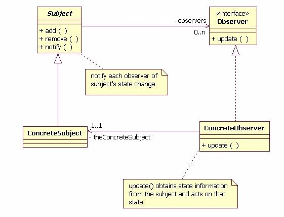

---

# Implementation of Observer in Scala

<div class="columns" style="grid-template-columns: 260px 1fr;">
<div>

- Observer
  - update
- Observable
  - add
  - remove
  - notify

</div>
<div style="width: 860px;">

```scala
package de.htwg.util

trait Observer {
  def update
}

class Observable {
  var subscribers:Vector[Observer] = Vector()
  def add(s:Observer) = subscribers=subscribers:+s
  def remove(s:Observer) = subscribers=subscribers.filterNot(o=>o==s)
  def notifyObservers = subscribers.foreach(o=>o.update)
}
```

</div>
</div>

---

# Model View Controller or MVC

<div class="columns" style="grid-template-columns: 1fr 1fr; align-items: center;">
<div style="font-size: 0.9em;">

- MVC is an architecture pattern.
- It was developed in 1979 for Smalltalk by Trygve Reenskaug.
- It is today the standard architecture pattern for most event driven software, like GUIs.
- It also plays an important role for web-architectures.
- We will use a strict version of MVC, where View, Controller and Model are layers.

</div>
<div>

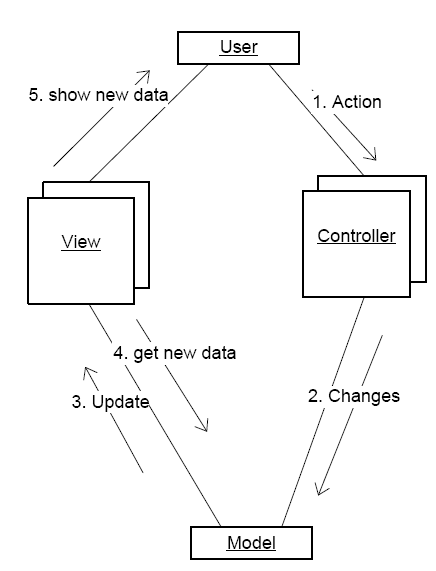

</div>
</div>

---

# Model View Controller revised

<div class="columns" style="grid-template-columns: 1fr 1fr; align-items: center;">
<div style="font-size: 0.85em;">

- To achieve strict layering, the Controller is the Observable.
- The View receives interactions of the User, translates them into modality-independent actions and triggers the action on the Controller.
- The Controller changes the Data in the Model and sends an update signal to the View.
- The View gets the new Data from the Controller (which fetches it from the Model) and updates the view.

</div>
<div>

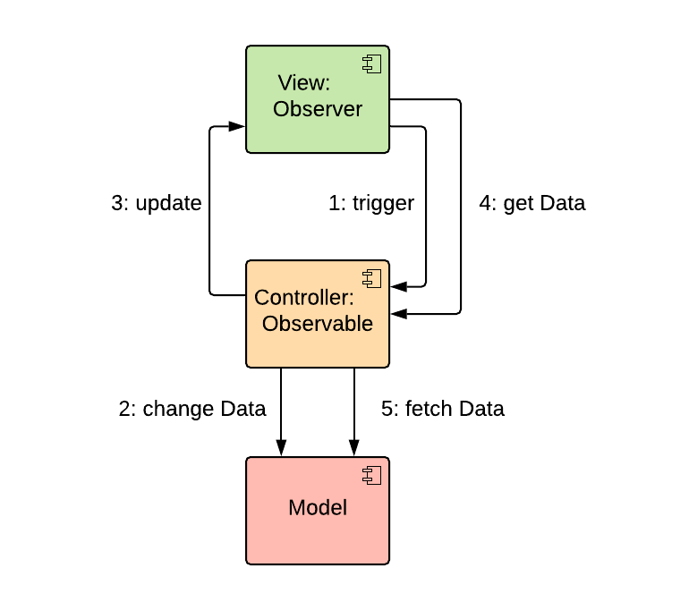

</div>
</div>

---

# The Role of the Controller

<style scoped>
li { font-size: 0.9em; }
</style>

- The Controller contains Business logic.
- It is independent of the modality.
- A Modality is a channel for input or output between computer and human, like keyboard (TUI), mouse (GUI, WUI) or touch (mobile).
- The View translates modality-dependent interactions into modality-independent actions.
- The Controller supervises the business process, i.e. with the management of a state machine.
- It contains only transient or no data. All persistent data and state is transferred to the Model.

---

# The Role of the View

- The View layer translates user input into controller calls.
- It holds no business logic and no data. In later variants of this architecture the view can cache some data (Web tech).

---

# The Role of the Model

- The Model contains all data and the logic on this data.
- However, it does not contain logic across the model, but only local logic.
- All state should be in the model. The model will eventually be written to a database, only the model layer is saved. All layers above are stateless or have transient state.

---

<!-- _class: aufgabe -->

# Task 5: Build a MVC Architecture

- Make sure that your game has a clean MVC architecture
- Use SonarQube, fix issues
- No import of classes from higher layers
- Use reorganization and observer pattern to resolve
  - Cycles
  - Layer conflicts

---

<!-- _class: abschluss -->

# Questions?

## Thank you!

marko.boger@htwg-konstanz.de
