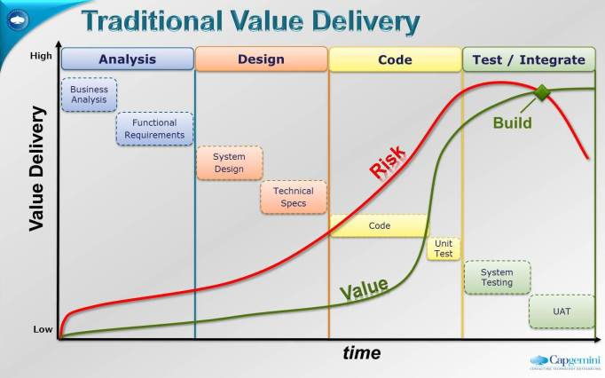
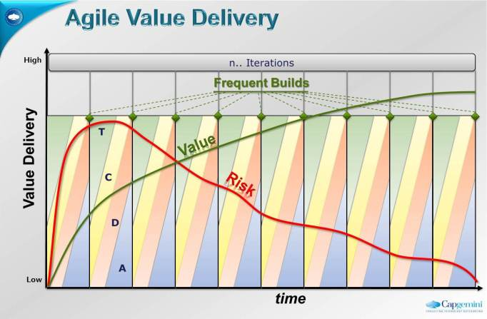
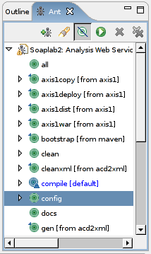
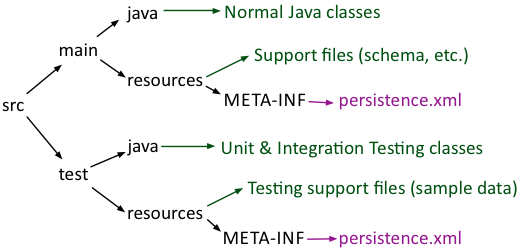
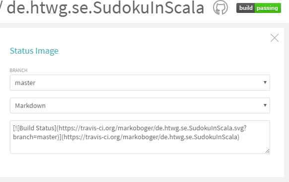
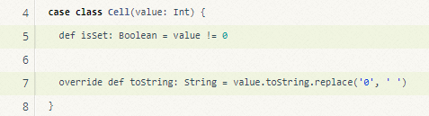
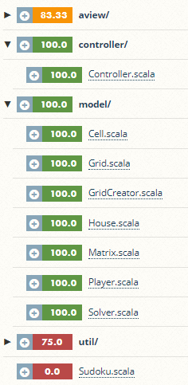

### Prof. Dr. Marko Boger
## Software Engineering
# Lecture 06: Continuous Deployment

Build automation, Continuous Integration, code coverage and mutation testing

---

# Terminology

Continuous Integration

- Integrate your work several times a day with the team to a central build server
- Automatically build the integrated software and execute automated tests on the build server
- Part of the XP-Process

Continuous Delivery

- The ability to automatically build and test a product, so that it can (potentially) be delivered to the customer

Continuous Deployment

- The continuous shipment of new product value as soon as it becomes available

---

# The Pace of Software Development

- Desktop Applications
  - Office Suites, Browser, IDEs, Tools etc.
  - Releases every 3 to 0.5 years
  - Release Trains, fixed release dates, every 12 months
- Mobile Applications
  - Instagram, Twitter, Facebook
  - Automatic Updates
  - Releases every 1 to 3 months
- Web Applications
  - Google Mail/Search/Drive, GitHub
  - Releases every few days or weeks

---

# Cycle Time

Cycle Time is a metric for Continuous Deployment

> "How long would it take your organization to deploy a change that involves just one single line of code?
> Can this be done on a repeatable, reliable basis?"
>
> – Mary Poppendieck

---

# Requirements for Continuous Deployment

- Small teams
- Agile development
- Test Driven Development
- Componentized architecture
- Great underlying platforms
- Few dependencies
- Continuous Integration
- Continuous Delivery
- High degree of automation

---

# Value Delivered: Waterfall



---

# Value Delivered: Agile



---

# Build Automation Tools

So far you have built your software locally

- Depends on locally installed Java/Scala, libraries, DBs etc.

Now, we want to automate that on a central server

- Tools
  - Ant
  - Maven
  - Gradle
  - sbt

---

# Ant

<style scoped>
p { font-size: 0.9em; }
</style>

Apache Ant is a software tool for automating software build processes, which originated from the Apache Tomcat project in early 2000. It was a replacement for the unix make build tool, and was created due to a number of problems with the unix make. It is similar to Make but is implemented using the Java language, requires the Java platform, and is best suited to building Java projects.

The most immediately noticeable difference between Ant and Make is that Ant uses XML to describe the build process and its dependencies, whereas Make uses Makefile format. By default the XML file is named build.xml

---

<style scoped>
pre, code { font-variant-ligatures: none; font-feature-settings: "liga" 0, "calt" 0; }
pre { font-size: 15px; }
</style>

# build.xml for Ant

<div class="columns" style="grid-template-columns: 1fr 230px; align-items: start;">
<div>

```xml
<?xml version="1.0"?>
<project name="Hello" default="compile">
    <target name="clean" description="remove intermediate files">
        <delete dir="classes"/>
    </target>
    <target name="clobber" depends="clean" description="remove all artifact files">
        <delete file="hello.jar"/>
    </target>
    <target name="compile" description="compile the Java source code to class files">
        <mkdir dir="classes"/>
        <javac srcdir="." destdir="classes"/>
    </target>
    <target name="jar" depends="compile" description="create a Jar file for the application">
        <jar destfile="hello.jar">
            <fileset dir="classes" includes="**/*.class"/>
            <manifest>
                <attribute name="Main-Class" value="HelloProgram"/>
            </manifest>
        </jar>
    </target>
</project>
```

</div>
<div>



</div>
</div>

---

# Maven

<style scoped>
section { font-size: 26px; }
</style>

- Maven is a software management and comprehension tool based on the concept of a Project Object Model (POM) which can manage project build, reporting, and documentation from a central piece of information
- A POM is an XML file that contains all information about project and configuration details used by Maven to build the project
- Maven is more than just a build tool. It provides:
  - Easy Build Process
  - Uniform Build System
  - Dependency Management Tool
  - Documentation Tool
  - Quality Information
  - Guidelines for Best Practices Development

---

<style scoped>
pre, code { font-variant-ligatures: none; font-feature-settings: "liga" 0, "calt" 0; }
</style>

# Project Creation

Maven allows the creation of a project from an archetype

```bash
mvn archetype:generate \
  -DgroupId=com.mycompany.app \
  -DartifactId=my-app \
  -DarchetypeArtifactId=maven-archetype-quickstart \
  -DinteractiveMode=false
```

---

<style scoped>
pre, code { font-variant-ligatures: none; font-feature-settings: "liga" 0, "calt" 0; }
pre { font-size: 17px; }
</style>

# The Pom.xml file

```xml
<project xmlns = "http://maven.apache.org/POM/4.0.0"
         xmlns:xsi = "http://www.w3.org/2001/XMLSchema-instance"
         xsi:schemaLocation = "http://maven.apache.org/POM/4.0.0
                               https://maven.apache.org/xsd/maven-4.0.0.xsd">
    <modelVersion> 4.0.0 </modelVersion>
    <groupId> com.mycompany.app </groupId>
    <artifactId> my-app </artifactId>
    <packaging> jar </packaging>
    <version> 1.0-SNAPSHOT </version>
    <name> Maven Quick Start Archetype </name>
    <url> https://maven.apache.org </url>
    <dependencies>
        <dependency>
            <groupId> org.junit.jupiter </groupId>
            <artifactId> junit-jupiter </artifactId>
            <version> 6.1.3 </version>
            <scope> test </scope>
        </dependency>
    </dependencies>
</project>
```

---

# Maven Standard Directory Structure

<div class="columns" style="grid-template-columns: 0.6fr 1.4fr; align-items: start;">
<div>

Eclipse

- src -> Normal Java classes
- test -> JUnit Test classes

</div>
<div>

Maven



</div>
</div>

---

<style scoped>
pre, code { font-variant-ligatures: none; font-feature-settings: "liga" 0, "calt" 0; }
section { font-size: 23px; }
pre { font-size: 17px; margin-top: 0.3em; }
li { margin: 0.05em 0; }
</style>

# Goals

- the default lifecycle has the following build phases
  - validate - validate the project is correct
  - compile - compile the source code of the project
  - test - test the compiled source code
  - package – package in a distributable format, such as a JAR.
  - integration-test – process, deploy and test the package
  - verify - run any checks to verify the package is valid
  - install - install the package into the local repository
  - deploy - copies the final package to the remote repository
- Example

```bash
mvn compile
mvn test
mvn deploy
```

---

# Gradle

<style scoped>
section { font-size: 26px; }
</style>

- Gradle is an open source build automation system that builds upon the concepts of Apache Ant and Apache Maven. It uses a Kotlin-based domain-specific language (DSL) instead of XML files (the default since Gradle 8.2); a Groovy-based DSL is available as an alternative.
- Gradle uses a directed acyclic graph ("DAG") to determine the order in which tasks can be run.
- Gradle was designed for multi-project builds which can grow to be quite large, and supports incremental builds.
- The initial plugins are primarily focused around Java, Groovy and Scala development and deployment.
- Official build system for Android

---

# sbt

<style scoped>
section { font-size: 26px; }
</style>

- sbt is an open source build tool for Scala and Java projects, similar to Java's Maven or Ant.
- Its main features are:
  - native support for compiling Scala code and integrating with many Scala test frameworks
  - build descriptions written in Scala using a DSL
  - dependency management using Coursier (which supports Maven-format repositories)
  - continuous compilation, testing, and deployment
  - integration with the Scala interpreter for rapid iteration and debugging
  - support for mixed Java/Scala projects

---

<style scoped>
pre, code { font-variant-ligatures: none; font-feature-settings: "liga" 0, "calt" 0; }
section { font-size: 26px; }
</style>

# Using sbt

- sbt can be run with no configuration at all
  - Scala projects with no dependencies with maven folder structure
  - Purely based on conventions
- Basic configuration in build.sbt
- More complex configuration using Scala in project/
- Sbt can run as shell command
  - `>sbt run`
- Or in interactive mode
  - `>sbt`
  - `sbt> run`

---

<style scoped>
pre, code { font-variant-ligatures: none; font-feature-settings: "liga" 0, "calt" 0; }
table { font-size: 22px; }
</style>

# sbt Commands

| Command | Description |
|---|---|
| `clean` | Deletes all generated files in the target directory. |
| `compile` | Compiles the main sources (in src/main/scala and src/main/java directories). |
| `test` | Compiles and runs all tests. |
| `console` | Starts the Scala interpreter with a classpath including the compiled sources and all dependencies. To return to sbt, type :quit, Ctrl+D (Unix), or Ctrl+Z (Windows). |
| `run <argument>*` | Runs the main class for the project in the same virtual machine as sbt. |
| `package` | Creates a jar file containing the files in src/main/resources and the classes compiled from src/main/scala and src/main/java. |

---

<style scoped>
pre, code { font-variant-ligatures: none; font-feature-settings: "liga" 0, "calt" 0; }
pre { font-size: 18px; }
p { margin: 0.3em 0; }
</style>

# Dependencies

- Specifying multiple dependencies one by one in build.sbt:

```scala
name         := "hello-world"
scalaVersion := "3.9.0"
libraryDependencies += "org.apache.commons" % "commons-lang3" % "3.21.0"
libraryDependencies += "commons-io" % "commons-io" % "2.22.0"
```

- Alternatively, you can also specify them as a Seq

```scala
name         := "hello-world"
scalaVersion := "3.9.0"
libraryDependencies ++= {
  Seq(
    "org.apache.commons" % "commons-lang3" % "3.21.0",
    "commons-io" % "commons-io" % "2.22.0"
  )
}
```

---

<style scoped>
pre, code { font-variant-ligatures: none; font-feature-settings: "liga" 0, "calt" 0; }
pre { font-size: 20px; }
</style>

# Plugins

- Sbt can be extended by plugins
  - Add these lines in file project/plugins.sbt

```scala
addSbtPlugin("org.scoverage" % "sbt-scoverage" % "2.4.4")
addSbtPlugin("org.scoverage" % "sbt-coveralls" % "1.3.15")
```

- Run from Command line
  - `sbt coverage test`
  - `sbt coverageReport`

---

# Tools for Continuous Integration

<style scoped>
section { font-size: 24px; }
</style>

- Cruise Control
  - Developed by ThoughtWorks (Martin Fowler) for XP
- Hudson
  - Kohsuke Kawaguchi, Sun, now Oracle
  - Open Source, but the name and infrastructure is controlled by Oracle
- Jenkins
  - Split from Hudson in 2011
  - Open Source, led by Kohsuke Kawaguchi
- Travis
  - Continuous Integration in the Cloud
  - started in 2011 by a startup in Berlin
- GitHub Actions
  - Integration of CI into GitHub

---

# GitHub Actions

GitHub Actions is a continuous integration and continuous delivery (CI/CD) platform that allows you to automate your build, test, and deployment pipeline. You can create workflows that build and test every pull request to your repository, or deploy merged pull requests to production.

---

# GitHub Actions

GitHub allows you to configure workflows.

For this you need to

- create a scala.yml file in .github/workflows
- configure build.sbt
- sign in with Coveralls and get a Token key
- set a repository secret under Settings → Secrets and variables → Actions with this token

Then GitHub can build the project and integrate coverage reporting.

---

<style scoped>
pre, code { font-variant-ligatures: none; font-feature-settings: "liga" 0, "calt" 0; }
pre { font-size: 16px; }
li { font-size: 26px; }
</style>

# YAML

<div class="columns" style="grid-template-columns: 0.8fr 1.2fr; align-items: start;">
<div>

```yaml
animals:
  - Name: Leo
    Species: Lion
    Age: 5
    Weight: 190
  - Name: Bella
    Species: Elephant
    Age: 12
    Weight: 4000
  - Name: Milo
    Species: Parrot
    Age: 3
    Weight: 0.5
  - Name: Luna
    Species: Tiger
    Age: 7
    Weight: 250
```

</div>
<div>

- YAML uses indentation (typically 2 spaces) to define structure.
- The animals key contains a list (indicated by -) of animal entries.
- Each animal is represented as a set of key-value pairs (Name, Species, Age, Weight).
- This format is human-readable and supports hierarchical data.

</div>
</div>

---

<style scoped>
pre, code { font-variant-ligatures: none; font-feature-settings: "liga" 0, "calt" 0; }
</style>

# YAML - YAML Ain’t Markup Language

YAML is similar to XML or JSON.

YAML is a very simple textual data format

- Basic types are String, Number, Boolean, Map, Sequence
- Key-value pairs, separated by colon: `key: value`
- Indentation with 2 spaces creates maps
- `-` creates sequence
- `#` is a comment

---

<style scoped>
pre, code { font-variant-ligatures: none; font-feature-settings: "liga" 0, "calt" 0; }
pre { font-size: 14px; }
</style>

# Example YAML file

<div class="columns" style="grid-template-columns: 2fr 1fr; align-items: start;">
<div>

```yaml
# Scalar Data Types (strings, numbers, booleans, null)
animal_name: Tiger      # String (no quotes needed for simple strings)
age: 5                 # Integer
weight: 200.5          # Float
is_wild: true          # Boolean
owner: null            # Null value
# String with Special Characters (requires quotes)
habitat: "Savanna, Forest"  # String with comma, quoted to avoid parsing issues
# Multi-line String (using | for literal style)
description: |
  The tiger is a large carnivore,
  known for its distinctive orange coat
  with black stripes.
```

</div>
<div>

```yaml
# Mapping (Key-Value Pairs)
lion:
  name: Simba          # String
  age: 3              # Integer
  is_leader: true     # Boolean
  territory: Pride Lands
# List (Sequence of Items)
pets:
  - Cat              # List item 1
  - Dog              # List item 2
  - Parrot           # List item 3
# Nested Structure (Mapping with List)
zoo:
  name: City Zoo
  animals:
    - species: Elephant
      weight: 6000.0
      diet: Herbivore
    - species: Penguin
      weight: 30.0
      diet: Carnivore
```

</div>
</div>

---

<style scoped>
pre, code { font-variant-ligatures: none; font-feature-settings: "liga" 0, "calt" 0; }
pre { font-size: 15px; }
</style>

# Example YAML file

<div class="columns" style="grid-template-columns: 0.8fr 1.2fr; align-items: start;">
<div>

```yaml
name: Scala CI
on:
  push:
    branches: [main, develop]
  pull_request:
    branches: [main]
jobs:
  build:
    runs-on: ubuntu-latest
    steps:
      - uses: actions/checkout@v7
      - name: Set up JDK 25
        uses: actions/setup-java@v6
        with:
          java-version: '25'
          distribution: 'temurin'
          cache: 'sbt'
      - uses: sbt/setup-sbt@v1
      - name: compile
        run: sbt compile
      - name: run tests
        run: sbt test
```

</div>
<div>

```yaml
  run_tests:
    runs-on: ubuntu-latest
    steps:
      - uses: actions/checkout@v7
      - uses: actions/setup-java@v6
        with:
          java-version: '25'
          distribution: 'temurin'
          cache: 'sbt'
      - uses: sbt/setup-sbt@v1
      - name: Build Project and export Coverage
        env:
          COVERALLS_REPO_TOKEN: ${{ secrets.COVERALLS_REPO_TOKEN }}
        run: sbt clean coverage test coverageReport coveralls
```

</div>
</div>

---

# Badges or Embedded Status Images

<div class="columns" style="grid-template-columns: 0.85fr 1.15fr; align-items: start;">
<div>

- The status of your build can be embedded into other web pages
- This can be used from your README.md file
  - Click on the badge in your Travis project
  - Select Markdown
  - Copy the code into your README.md file
- Same for badge from Coveralls

</div>
<div>



</div>
</div>

---

# Coveralls.io

<div class="columns" style="grid-template-columns: 1.6fr 0.4fr; align-items: start;">
<div>

Code Coverage in the Cloud

- register using GitHub account
- add GitHub repo
- restart build
- add a badge to your README



</div>
<div>



</div>
</div>

---

# Mutation Testing

<style scoped>
section { font-size: 26px; }
p { margin: 0.4em 0; }
</style>

Covering code may not be enough, if the tests are not tight enough. To test the tests, we can artificially introduce bugs and see if our tests catch these.

This is known as Mutation Testing.

A mutation introduces one change at a time

- `>` instead of `<`
- `false` instead of `true`
- `+` instead of `-`

Of these mutations, also called Mutants, hundreds are produced and the tests run again.

The result is a rate how many such Mutants are found (killed)

---

<style scoped>
pre, code { font-variant-ligatures: none; font-feature-settings: "liga" 0, "calt" 0; }
pre { font-size: 20px; margin: 0.3em 0; }
p { margin: 0.4em 0; }
</style>

# Stryker4s

For Scala, there is a very nice tool for mutation testing, called Stryker.

It is integrated into sbt.

Add it as a plugin to project/plugins.sbt

```scala
addSbtPlugin("io.stryker-mutator" % "sbt-stryker4s" % stryker4sVersion)
```

Add a config file, then call

```bash
sbt stryker
```

Here is an example: https://stryker-mutator.io/stryker-playground/

---

<!-- _class: aufgabe -->

# Task 6: Set up a Continuous Development Process

- Make your development independent of the local platform using a build mechanism like sbt
- Initiate a Continuous Integration Server on GitHub
- Set up tests and code coverage using Coveralls
- Improve your tests using Stryker4s
- Integrate Badges into your git repository

---

<!-- _class: abschluss -->

# Questions?

## Thank you!

marko.boger@htwg-konstanz.de
