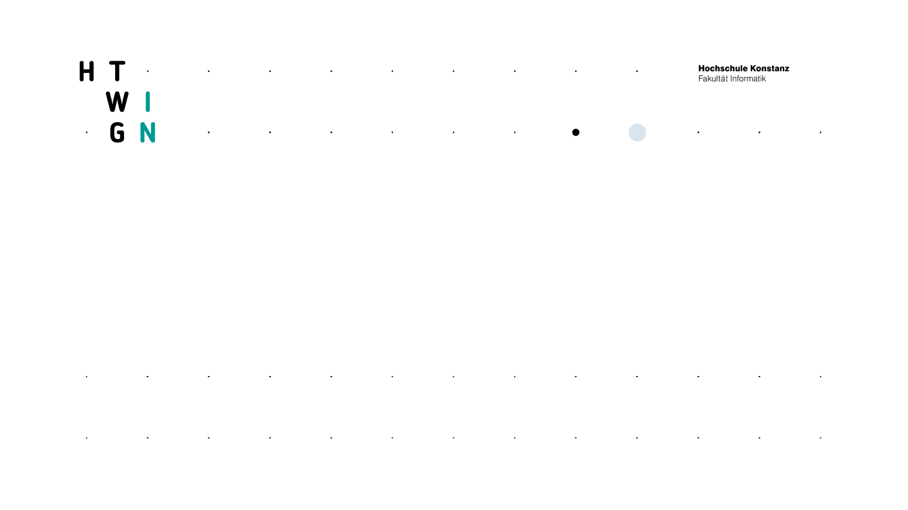

### Prof. Dr. Marko Boger
## Software Engineering
# Lecture 07: Design Pattern I

Design patterns, Observer, Singleton, Factory Method, Strategy, State and design principles

---

<style scoped>
p { margin: 0.3em 0; }
</style>

# What are Design Patterns?

<div class="columns" style="grid-template-columns: 1.3fr 1fr; align-items: start;">
<div>

A design pattern is a transferable solution to a problem.

Like the concept of an arch.

It is an idea, a concept, that needs to be adapted to the situation.

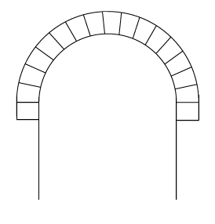

</div>
<div>

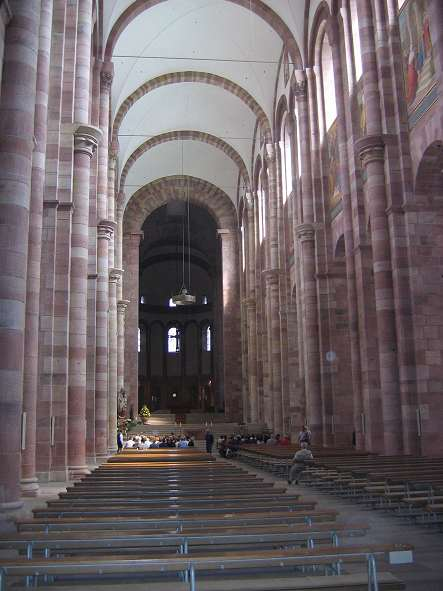

</div>
</div>

---

# Romanesque Round Arch

<div class="columns" style="grid-template-columns: 1fr 1fr; align-items: start;">
<div style="text-align: right;">


</div>
<div>


</div>
</div>

---

# Design Pattern

<div class="columns" style="grid-template-columns: 1.4fr 1fr; align-items: start;">
<div>

Design patterns appear over and over again. Different patterns have different qualities or provide solutions to different problems.

A pointed arch allowed higher buildings and is the characteristic design element of Gothic Architecture

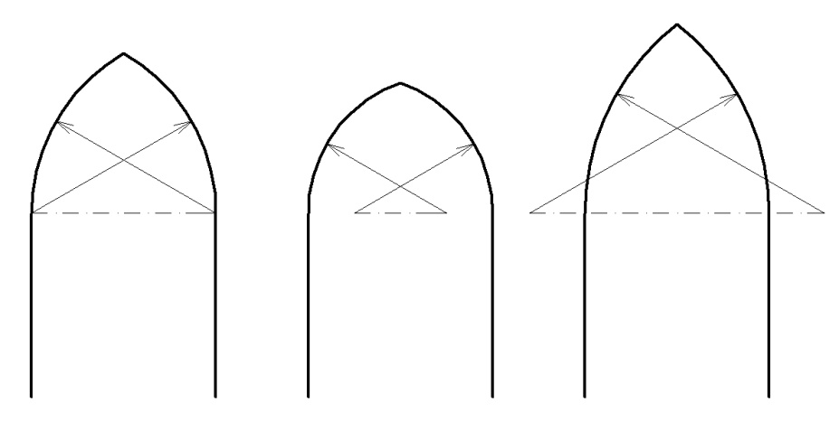

</div>
<div>


</div>
</div>

---

# Gothic Pointed Arches

<div class="columns" style="grid-template-columns: 1fr 1fr 1.3fr; align-items: start;">
<div>


</div>
<div>

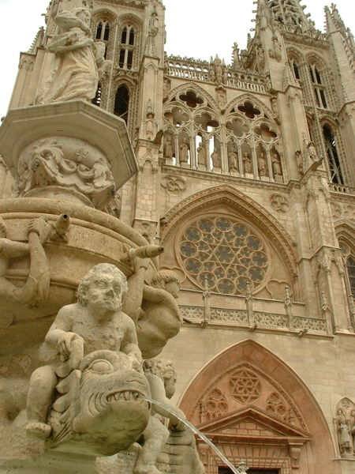

</div>
<div>

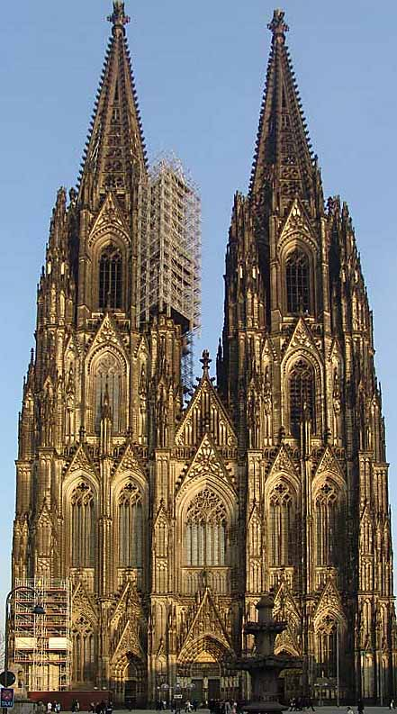

</div>
</div>

---

# Design Pattern in IT

<style scoped>
section { font-size: 24px; }
</style>

- Design Patterns were first described by Christopher Alexander in the field of civil architecture
- The concept was then transferred to Software Engineering
- In software engineering, a design pattern is a general reusable solution to a commonly occurring problem
- Design Patterns capture and communicate proven design ideas
- Design Patterns describe the problem and its solution in a structured and abstract way, so that it can be transferred to other situations
- A design pattern is not a finished building block that can be applied directly. It is a description or template for how to solve a problem.
- They have become part of our domain language and help to find and communicate design solutions

---

# Erich Gamma

<style scoped>
section { font-size: 26px; }
</style>

<div class="columns" style="grid-template-columns: 1.4fr 1fr; align-items: start;">
<div>

- PhD on Design Patterns
- Main author of the book
  Design Patterns
- Introduced the term design pattern into the domain of software engineering
- Co-Author of JUnit
<br>

- Head of the Eclipse project
- Head of the Jazz project
- Lead Dev on Visual Studio Code
- Office 365

</div>
<div style="position: relative; height: 480px;">

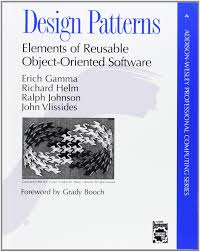
</div>
</div>

---

# Resources

Refactoring Guru: https://refactoring.guru/design-patterns

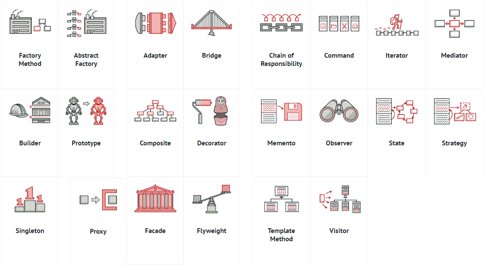

---

<style scoped>
pre, code { font-variant-ligatures: none; font-feature-settings: "liga" 0, "calt" 0; }
pre { font-size: 15px; }
</style>

# Observer Pattern
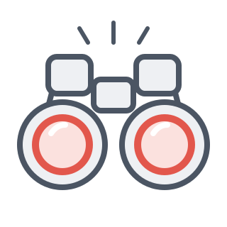

<div class="columns" style="grid-template-columns: 790px 1fr; align-items: start;">
<div>

The Observer Pattern is a solution to the problem of how to invert a dependency.

```scala
trait Observer {
 def update: Boolean
}
class Observable {
 var subscribers: Vector[Observer] = Vector()
 def add(s: Observer): Unit = subscribers = subscribers :+ s
 def remove(s: Observer): Unit = subscribers = subscribers.filterNot(o => o == s)
 def notifyObservers: Unit = subscribers.foreach(o => o.update)
}
```

</div>
<div>

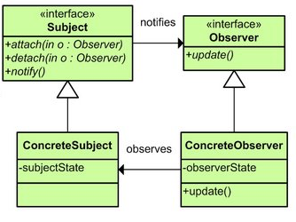

</div>
</div>

---

<style scoped>
h1 { font-size: 30px; text-align: center; margin: 0 0 6px 0; }
section { padding-top: 20px; }
</style>

# Pattern Cheat Sheet

<div class="columns" style="grid-template-columns: 1fr 1fr; gap: 10px;">
<div>

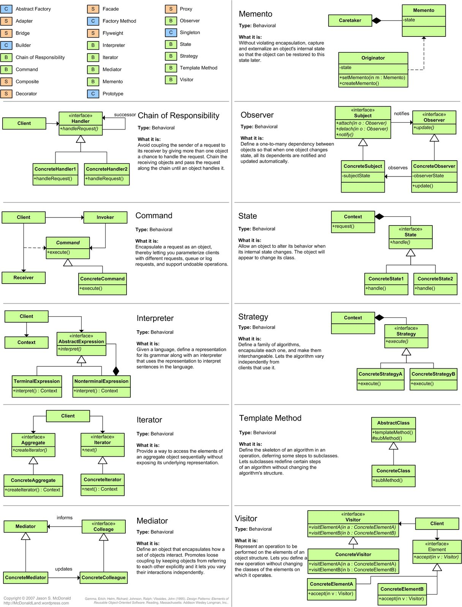

</div>
<div>

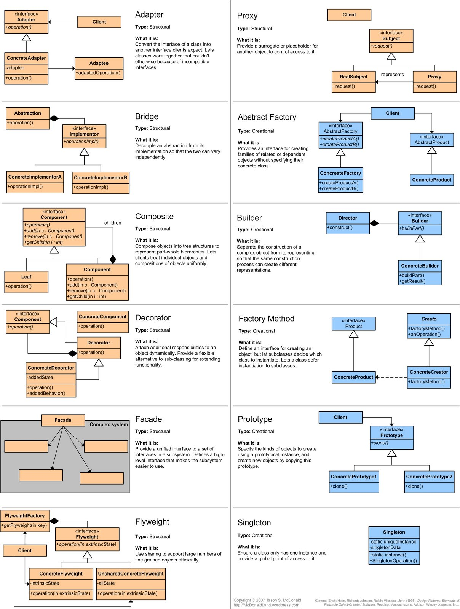

</div>
</div>

---

# Example for a Pattern-based Design

<style scoped>
li li { color: #009b91; }
</style>

<div class="columns" style="grid-template-columns: 1fr 1fr; align-items: start;">
<div>

A Storage Explorer

- Analyzes File Size
- Tree View of the File Structure
- Percentage or Size of Files/Folders
  - Pie
  - Chart
  - List
- View by
  - File type
  - Folder structure

</div>
<div>

<br><br>

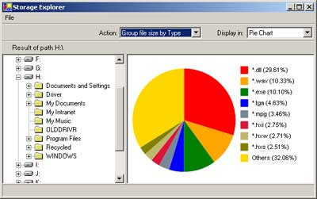

</div>
</div>

---

# Structure of the Storage Explorer

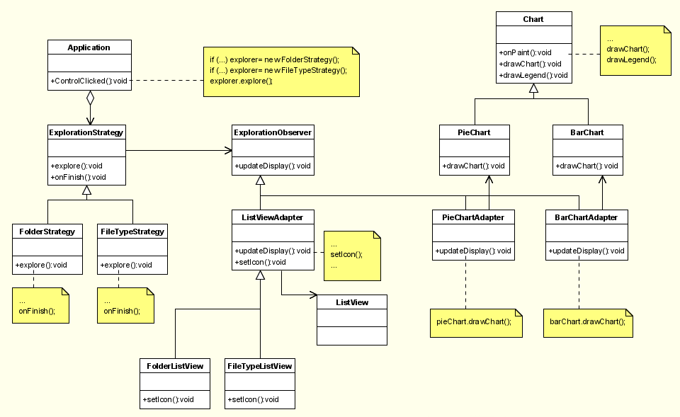

---

# Structure of the Storage Explorer

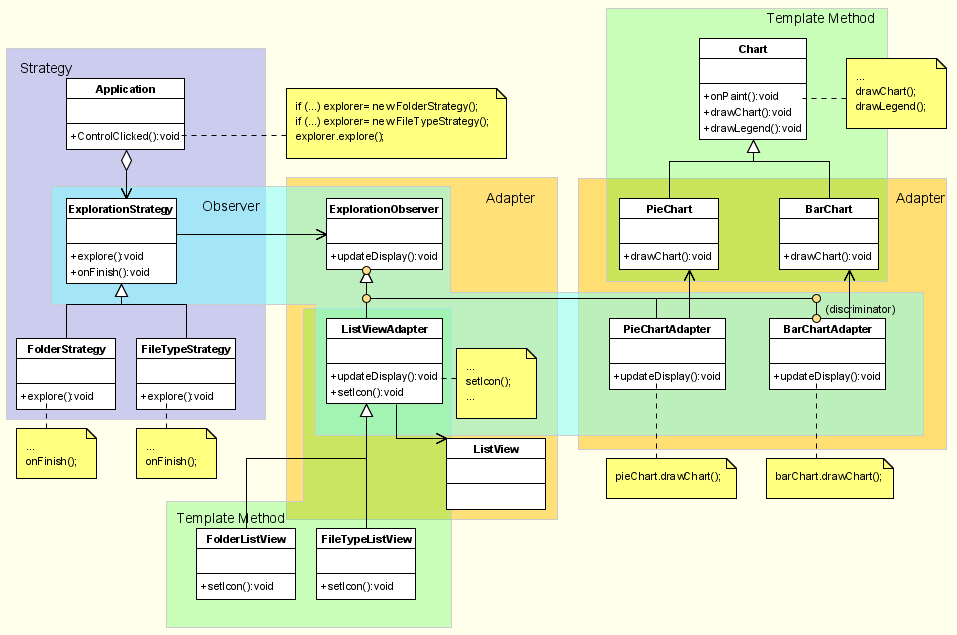

---

# Singleton
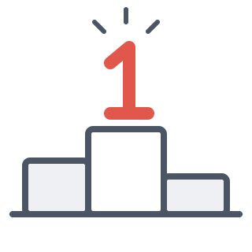

Singleton is a pattern to ensure there is only one instance of a class. If the singleton contains variable data, it should only be used if exactly one instance has to be enforced.

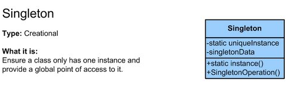

---

<style scoped>
pre, code { font-variant-ligatures: none; font-feature-settings: "liga" 0, "calt" 0; }
pre { font-size: 18px; }
</style>

# Singleton Java-style


Singleton has a private instance (and a private constructor)

<div class="columns" style="grid-template-columns: 1.6fr 1fr; align-items: start;">
<div>

```scala
class Singleton1 {
 def singletonFunction = println("I am a singleton")
}
object Singleton1 {
 private var instance:Singleton1 = null
 def getInstance:Singleton1= {
   if (instance == null) {
     instance= new Singleton1()
   }
   instance
 }
}
Singleton1.getInstance.singletonFunction
```

</div>
<div>

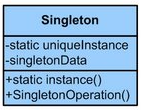

</div>
</div>

---

<style scoped>
pre, code { font-variant-ligatures: none; font-feature-settings: "liga" 0, "calt" 0; }
pre { font-size: 18px; }
</style>

# Singleton Scala-style


- Scala has Singletons built in: Object

```scala
object Singleton {
 def singletonFunction = println("I am a singleton")
}
Singleton.singletonFunction
```

---

# Factory Method
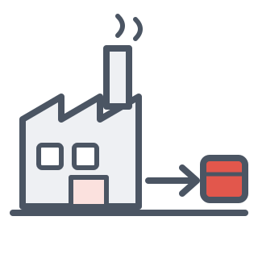

A Factory Method is used to create an instance of an abstraction. The dependency to the concrete type is avoided.

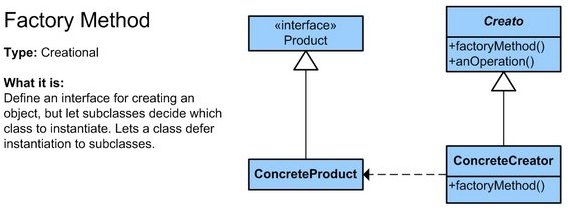

---

<style scoped>
pre, code { font-variant-ligatures: none; font-feature-settings: "liga" 0, "calt" 0; }
pre { font-size: 16px; }
p { margin: 0.2em 0; }
</style>

# Factory Method Java-style


Get a specific instance of an abstraction from a factory

```scala
trait Animal1 {
 def run = println("animal running")
}
private class Dog1 extends Animal {
 override def run: Unit = println("dog running")
}
private class Cat1 extends Animal {
 override def run: Unit = println("cat running")
}
object AnimalFactory {
 def getInstance(kind: String) = kind match {
   case "dog" => new Dog1()
   case "cat" => new Cat1()
 }
}
val dog1 = AnimalFactory.getInstance("dog")
dog1.run
```

---

<style scoped>
pre, code { font-variant-ligatures: none; font-feature-settings: "liga" 0, "calt" 0; }
pre { font-size: 16px; }
p { margin: 0.2em 0; }
</style>

# Factory Method Scala-style


Scala has Factory Method built in: apply on companion object

```scala
trait Animal {
 def run = println("animal running")
}
private class Dog extends Animal {
 override def run: Unit = println("dog running")
}
private class Cat extends Animal {
 override def run: Unit = println("cat running")
}
object Animal {
 def apply(kind: String) = kind match {
   case "dog" => new Dog()
   case "cat" => new Cat()
 }
}
val animal = Animal("dog")
animal.run
```

---

# Strategy Pattern
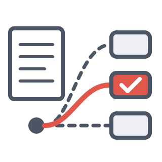

A Strategy allows switching between different algorithms.

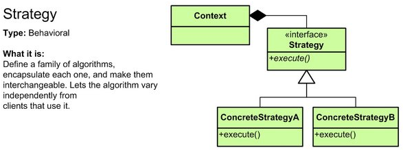

---

<style scoped>
pre, code { font-variant-ligatures: none; font-feature-settings: "liga" 0, "calt" 0; }
pre { font-size: 15px; }
</style>

# Strategy Java-style


Strategy with Inheritance

<div class="columns" style="grid-template-columns: 780px 1fr; align-items: start;">
<div>

```scala
object Context1 {
 trait Strategy {
   def execute
 }
 class Strategy1 extends Strategy {
   override def execute = println("I am strategy 1")
 }
 class Strategy2 extends Strategy {
   override def execute = println("I am strategy 2")
 }
 var strategy = if (Random.nextInt() % 2 == 0) new Strategy1 else new Strategy2
}
Context1.strategy.execute
```

</div>
<div>

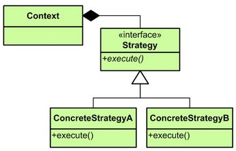

</div>
</div>

---

<style scoped>
pre, code { font-variant-ligatures: none; font-feature-settings: "liga" 0, "calt" 0; }
pre { font-size: 18px; }
</style>

# Strategy Scala-style


Scala allows overriding the function value at runtime

```scala
object Context2 {
 var strategy = if (Random.nextInt() % 2 == 0) strategy1 else strategy2
 def strategy1 = println("I am strategy 1")
 def strategy2 = println("I am strategy 2")
}
Context2.strategy
```

---

<style scoped>
pre, code { font-variant-ligatures: none; font-feature-settings: "liga" 0, "calt" 0; }
pre { font-size: 18px; }
</style>

# State Pattern
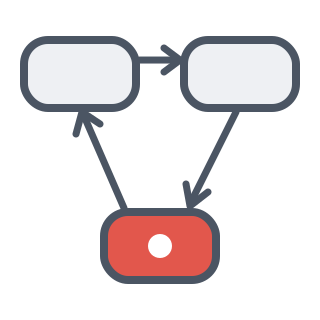

<div class="columns" style="grid-template-columns: 0.75fr 1.25fr; align-items: start;">
<div>

Some context code
before we look at the
implementation

```scala
trait Event

case class OnEvent() extends Event

case class OffEvent() extends Event

StateContext1.handle(new OnEvent)
StateContext1.handle(new OffEvent)

StateContext2.handle(OnEvent())
StateContext2.handle(OffEvent())
```

</div>
<div>

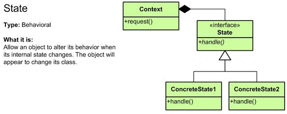

</div>
</div>

---

<style scoped>
pre, code { font-variant-ligatures: none; font-feature-settings: "liga" 0, "calt" 0; }
pre { font-size: 12.5px; }
p { margin: 0.2em 0; }
</style>

# State Java-style


In Java the State is encapsulated in Instances of an Abstraction

<div class="columns" style="grid-template-columns: 1.5fr 1fr; align-items: start;">
<div>

```scala
object StateContext1 {
 trait State {
   def handle(e: Event): State
 }
 case class OnState() extends State {
   println("I am On")
   override def handle(e: Event): State = {
     e match {
       case on: OnEvent => OnState()
       case off: OffEvent => OffState()
     }
   }
 }
 case class OffState() extends State {
   println("I am Off")
   override def handle(e: Event): State = {
     e match {
       case on: OnEvent => OnState()
       case off: OffEvent => OffState()
     }
   }
 }
 var state: State = OffState()
 def handle(e: Event) = state = state.handle(e)
}
```

</div>
<div>

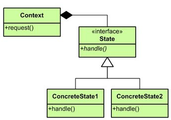

</div>
</div>

---

<style scoped>
pre, code { font-variant-ligatures: none; font-feature-settings: "liga" 0, "calt" 0; }
pre { font-size: 18px; }
</style>

# State Scala-style


In Scala this can be encapsulated in a reassignable function.

```scala
object StateContext2 {
 var state = onState
 def handle(e: Event) = {
   e match {
     case on: OnEvent => state = onState
     case off: OffEvent => state = offState
   }
   state
 }
 def onState = println("I am on")
 def offState = println("I am off")
}
```

---

# Design Principles

<style scoped>
p { margin: 0.15em 0; }
</style>

DRY - Don't Repeat Yourself

KISS - Keep it simple, Stupid

YAGNI - You Ain't Gonna Need It

SOLID

First Broken Window Principle

Law of Demeter

Law of least astonishment

---

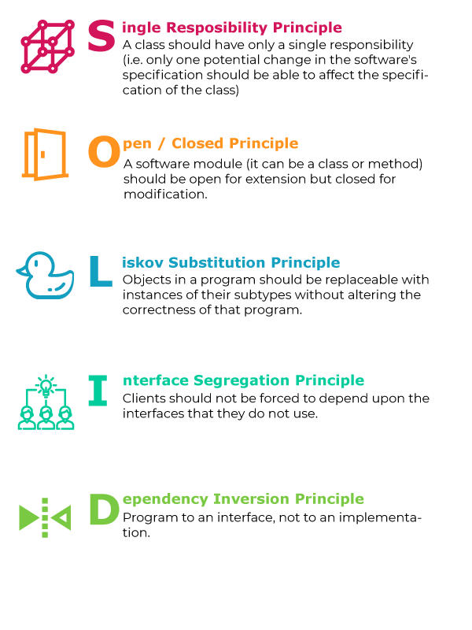

---

# Sources

<style scoped>
section { font-size: 22px; }
</style>

- Design pattern overview: Refactoring Guru, https://refactoring.guru/design-patterns
- Pattern icons: self-drawn in the style of Refactoring Guru
- E. Gamma, R. Helm, R. Johnson, J. Vlissides: Design Patterns – Elements of Reusable Object-Oriented Software, Addison-Wesley, 1994

---

<!-- _class: aufgabe -->

# Task 7: Integrate Patterns into your code

Increase the quality of your code by making it more extendable using patterns.

Try to integrate a pattern like Strategy, Factory, State, Template or others.

Try to implement 3 or more patterns.

---

<!-- _class: abschluss -->

# Questions?

## Thank you!

marko.boger@htwg-konstanz.de
