### Prof. Dr. Marko Boger
## Software Engineering
# Lecture 08: Design Pattern II

Composite, Decorator, Command, Monads, Option and Try

---

<style scoped>
h1 { font-size: 30px; text-align: center; margin: 0 0 6px 0; }
section { padding-top: 20px; }
</style>

# Pattern Cheat Sheet

<div class="columns" style="grid-template-columns: 1fr 1fr; gap: 10px;">
<div>


</div>
<div>


</div>
</div>

---

# Structure of the Storage Explorer


---

# Composite Pattern
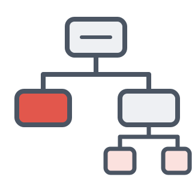

- Composite allows a group of objects to be treated in the same way as a single instance of an object

<div class="columns" style="grid-template-columns: 0.75fr 1.6fr; align-items: end;">
<div>

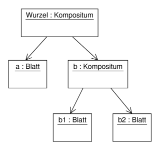

</div>
<div>

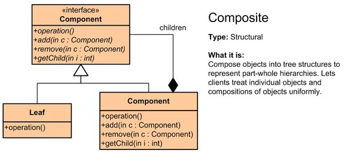

</div>
</div>

---

# Decorator


add additional responsibilities dynamically to an object.

<div style="text-align: right;">

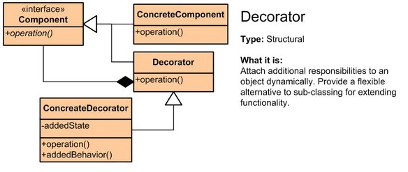

</div>

---

<style scoped>
h1 { margin-bottom: 4px; }
</style>

# Similar structure, different purpose

<div style="text-align: center;">

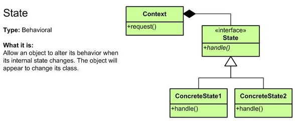

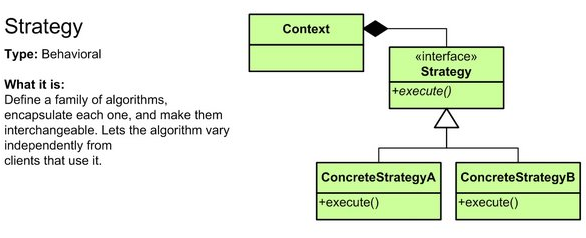

</div>

---

<style scoped>
h1 { margin-bottom: 4px; }
.grid6 { display: grid; grid-template-columns: 1fr 1fr; gap: 4px 16px; }
.grid6 img { height: 160px; }
</style>

# Similar structure, different purpose

<div class="grid6">
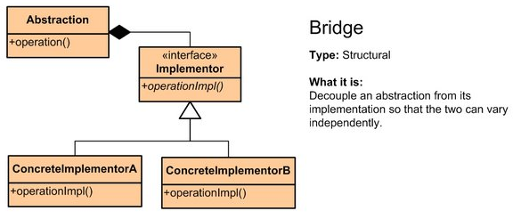
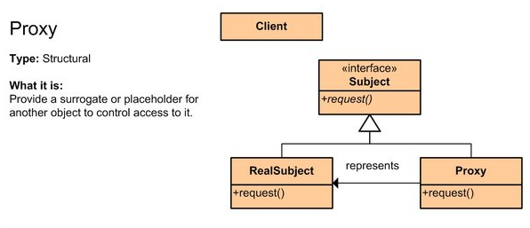
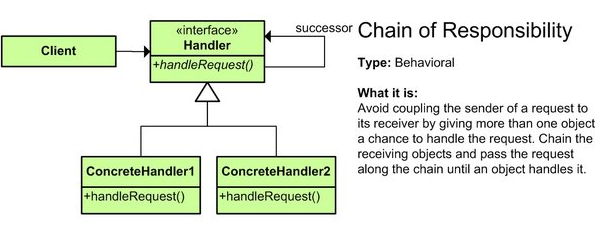
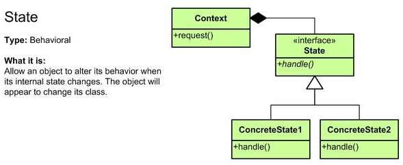
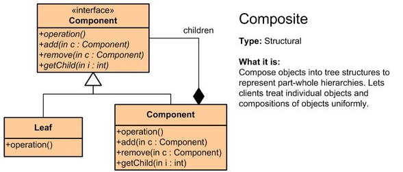
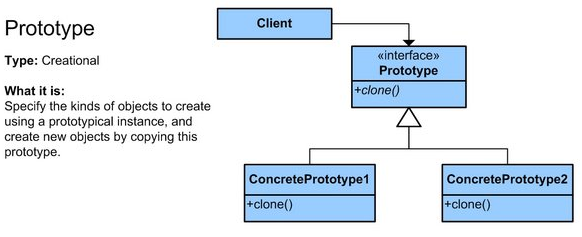
</div>

---

# Command Pattern


<div class="columns" style="grid-template-columns: 0.75fr 1.4fr; align-items: center;">
<div>

The Command Pattern is used to encapsulate a method into a class with a normed Interface.

This allows to put the “method” on to a stack and execute it later.

This is often used for Undo-Redo.

</div>
<div>

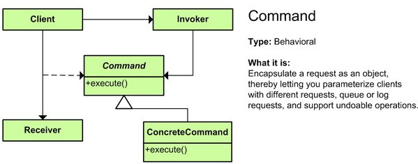

</div>
</div>

---

<style scoped>
pre, code { font-variant-ligatures: none; font-feature-settings: "liga" 0, "calt" 0; }
pre { font-size: 15px; }
</style>

# An Undo-Mechanism


<div class="columns" style="grid-template-columns: 1fr 380px; align-items: start;">
<div>

The Command has an execute, here undoStep

</div>
<div>

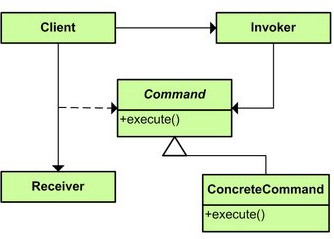

</div>
</div>

```scala
trait Command {
 def doStep:Unit
 def undoStep:Unit
 def redoStep:Unit
}
class SetCommand(row:Int, col: Int, value:Int, controller: Controller) extends Command {
 override def doStep: Unit =   controller.grid = controller.grid.set(row, col, value)
 override def undoStep: Unit = controller.grid = controller.grid.set(row, col, 0)
 override def redoStep: Unit = controller.grid = controller.grid.set(row, col, value)
}
```

---

<style scoped>
pre, code { font-variant-ligatures: none; font-feature-settings: "liga" 0, "calt" 0; }
pre { font-size: 17px; }
p { margin: 0.2em 0; }
</style>

# An Undo-Mechanism


The Invoker is here called UndoManager

<div class="columns" style="grid-template-columns: 1fr 380px; align-items: start;">
<div>

```scala
class UndoManager {
 private var undoStack: List[Command]= Nil
 private var redoStack: List[Command]= Nil
 def doStep(command: Command) = {
   undoStack = command::undoStack
   command.doStep
 }
 def undoStep  = {
   undoStack match {
     case  Nil =>
     case head::stack => {
       head.undoStep
       undoStack=stack
       redoStack= head::redoStack
     }
   }
 }
```

</div>
<div>


</div>
</div>

---

<style scoped>
.big { font-size: 46px; font-weight: 700; line-height: 1.9; margin: 0.2em 0 0.4em 0; }
</style>

# Monads
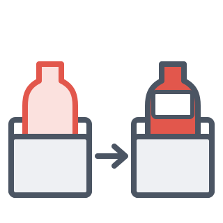

<div class="columns" style="grid-template-columns: 1.4fr 1fr; align-items: center;">
<div>

<div class="big">A Monad is just a Monoid<br>in the Category of<br>Endofunctors</div>

https://medium.com/@felix.kuehl/a-monad-is-just-a-monoid-in-the-category-of-endofunctors-lets-actually-unravel-this-f5d4b7dbe5d6

</div>
<div>


</div>
</div>

---

<style scoped>
section { font-size: 23px; }
p { margin: 0.1em 0; }
ul { margin: 0.1em 0; }
li li { color: #009b91; }
.boxes { display: flex; justify-content: space-between; align-items: flex-end; margin-top: 6px; }
</style>

# Monad as a Pattern


A Monad is a simple Design Pattern, just like Observer or State Pattern.

It is a container for algebraic structures.

A Monad has to have three methods:

- map
  - it opens the box, applies a function on the content, and but it back into a box
- flatmap
  - like map, but it can handle boxes in boxes
- filter
  - like map, but the function must be boolean

<div class="boxes">
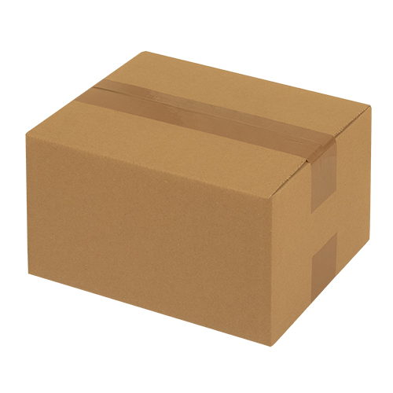
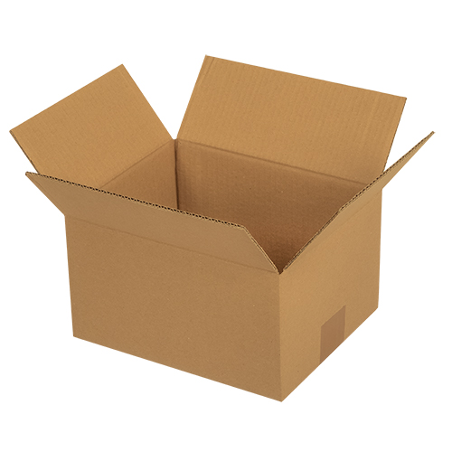
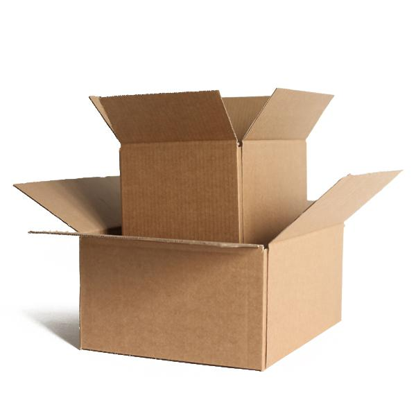
</div>

---

<style scoped>
pre, code { font-variant-ligatures: none; font-feature-settings: "liga" 0, "calt" 0; }
pre { font-size: 24px; }
</style>

# For-Comprehension is syntactic Sugar for map

A simple for-expression with one Generator is expanded to a map function

```scala
// Translation of For(1)
for (x <- e1) yield toValue(x)

// translated from compiler to:
e1.map(x => toValue(x) )
```

---

<style scoped>
pre, code { font-variant-ligatures: none; font-feature-settings: "liga" 0, "calt" 0; }
pre { font-size: 22px; margin: 0.2em 0; }
p { margin: 0.25em 0; }
</style>

# For can be used for any data structure with map

Complex for is translated to map, flatmap and filter

```scala
for {
  i <- 1 to n
  j <- 1 to i
  if isEven(i + j)
} yield(i, j)
```

is translated to

```scala
(1 to n) flatMap ( i =>
  (1 to i) filter (j => isEven(i+j))
    map (j => (i, j))
  )
)
```

---

# Algebraic Structures<br>Monoid

A monoid is an algebraic structure with a single associative binary operation and an identity element. Monoids are semigroups with identity.

<div style="text-align: center;">

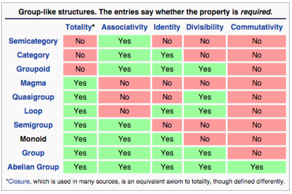

</div>

---

<style scoped>
section { font-size: 25px; }
li li { color: #009b91; }
</style>

# Rules for Monoids

- Associativity
  - For all a, b and c in S, the equation (a • b) • c = a • (b • c) holds.
- Identity element
  - There exists an element e in S such that for every element a in S, the equations e • a = a • e = a hold.
- Examples
  - Strings with concat and empty word
  - 12 Hour Clock with add and zero
  - Integers with add and zero
  - Integers with modulo and 1
  - Lists with concat and ()
  - Sets

---

<style scoped>
.pics { display: flex; gap: 40px; align-items: flex-end; margin-top: 10px; }
</style>

# Monads and Monoids


The Monad acts as a container for a Monoid.

We can take an element out of the container, apply a function or transformation to the element, and put it into a new container.

For example, we can take a bottle from a crate, put a label on it, and put it into a new crate.

<div class="pics">
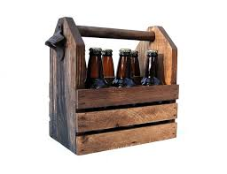
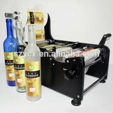

</div>

---

<style scoped>
li li { color: #009b91; }
</style>

# Option and Try are Monads


- Try and Option are Monads for handling a single content
- Think of it as a container with just one content for secure transportation
  - Like a box for a bottle of wine

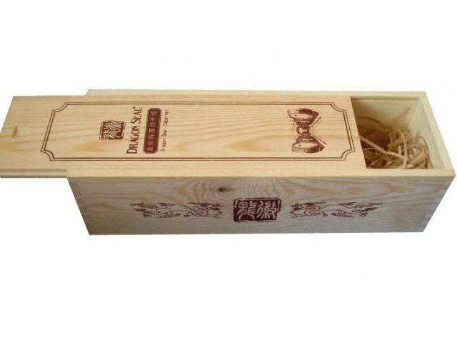

---

# Option is a Monad


Option can contain Some(thing) or None

<div class="columns" style="grid-template-columns: 1fr 1fr; align-items: center;">
<div>


</div>
<div>

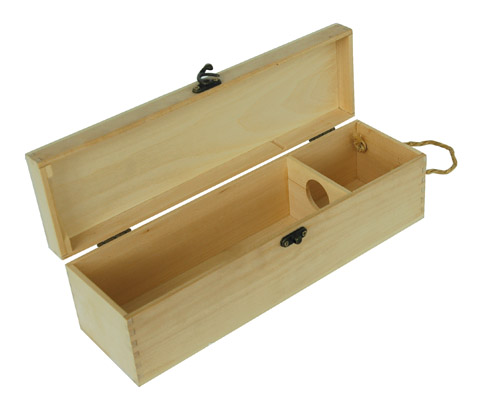

</div>
</div>

---

<style scoped>
.blue { color: #1f4e9c; font-weight: 600; }
</style>

# Try is a Monad


- <span class="blue">A Try can contain a Success or a Failure</span>

<div class="columns" style="grid-template-columns: 1fr 1.3fr; align-items: end;">
<div>

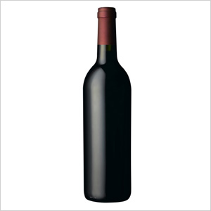

</div>
<div>


</div>
</div>

---

# The State Pattern applied in Monads


<div class="columns" style="grid-template-columns: 1fr 1.2fr; align-items: start;">
<div>

Take a look again at the structure of the State Pattern.

Monads use this structure and typically distinguish a “good” and a “bad” state.

</div>
<div>

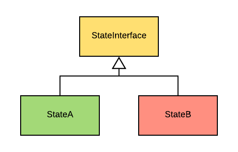

</div>
</div>

---

<style scoped>
.g4 { display: grid; grid-template-columns: 1fr 1fr; gap: 6px 30px; align-items: end; }
.g4 img { height: 225px; }
</style>

# Option, Try, Future and Either


<div class="g4">
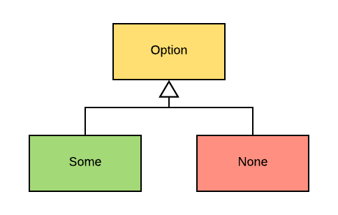
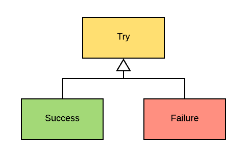
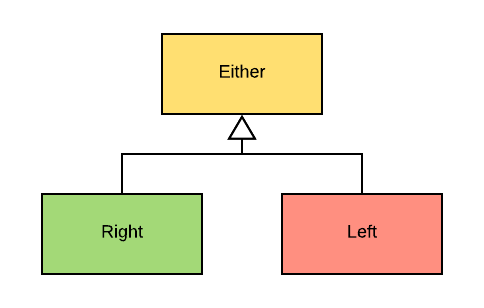
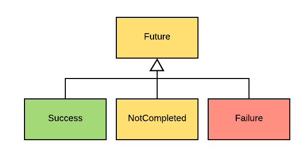
</div>

---

<style scoped>
pre, code { font-variant-ligatures: none; font-feature-settings: "liga" 0, "calt" 0; }
section { padding-left: 40px; padding-right: 40px; }
pre { font-size: 17px; margin: 0.2em 0; padding: 10px 12px; }
.cap { font-size: 20px; font-weight: 600; color: #009b91; margin: 0 0 4px 0; }
.task { font-size: 21px; margin: 0 0 8px 0; }
</style>

# An Example using Bottles


<div class="task">

**Task:** `totalVolume` sums the volume of all drinks in a crate of packs of bottles. Some bottles may be empty.

</div>

<div class="columns" style="grid-template-columns: 475px 1fr; gap: 16px; align-items: start;">
<div>

<div class="cap">The model (monad style)</div>

```scala
case class Drink(name: String, volumeMl: Int)

val beer  = Drink("Beer", 500)
val wine  = Drink("Wine", 750)
val water = Drink("Water", 330)

val pack1 = Pack(List(MonadBottle(Some(beer)),
                      MonadBottle(Some(wine))))
val pack2 = Pack(List(MonadBottle(None),
                      MonadBottle(Some(water))))
val crate = Crate(List(pack1, pack2))
// totalVolume(crate) == 1580
```

</div>
<div>

<div class="cap">Each style has its own bottle</div>

```scala
// Java style: empty bottle = null
case class JavaBottle(drink: Drink | Null)
class JavaPack(val bottles: List[JavaBottle])
class JavaCrate(val packs: List[JavaPack])

// Exception style: empty bottle throws
case class ExceptionBottle(private val drinkOpt: Option[Drink]):
  def drink: Drink // throws EmptyBottleException
class ExceptionPack(val bottles: List[ExceptionBottle])
class ExceptionCrate(val packs: List[ExceptionPack])

// Monad style: empty bottle = None
case class MonadBottle(content: Option[Drink])
case class Pack[A](items: List[A])
case class Crate[A](items: List[A])
```

</div>
</div>


---

<style scoped>
pre, code { font-variant-ligatures: none; font-feature-settings: "liga" 0, "calt" 0; }
section { padding-left: 36px; padding-right: 36px; }
pre { font-size: 15.5px; margin: 0.2em 0; padding: 10px 8px; }
.cap { font-size: 19px; font-weight: 600; color: #009b91; margin: 0 0 4px 0; }
</style>

# Three ways to compute totalVolume


<div class="columns" style="grid-template-columns: 366px 412px 1fr; gap: 10px; align-items: start;">
<div>

<div class="cap">Java style: null checks</div>

```scala
def totalVolume(crate: JavaCrate): Int =
  var total = 0
  for pack <- crate.packs do
    for bottle <- pack.bottles do
      val drink = bottle.drink
      if drink != null then
        total += drink.volumeMl
  total
```

</div>
<div>

<div class="cap">Exceptions: try/catch per bottle</div>

```scala
def totalVolume(crate: ExceptionCrate): Int =
  var total = 0
  for pack <- crate.packs do
    for bottle <- pack.bottles do
      try
        val drink = bottle.drink // may throw
        total += drink.volumeMl
      catch
        case _: EmptyBottleException => ()
  total
```

</div>
<div>

<div class="cap">Monad: one for</div>

```scala
def totalVolume(
    crate: Crate[Pack[MonadBottle]]
): Int =
  val result = for
    pack <- crate
    bottle <- pack.toCrate
    drink <- Crate.fromOption(bottle.content)
  yield drink.volumeMl
  result.items.sum
```

</div>
</div>


---

<style scoped>
pre, code { font-variant-ligatures: none; font-feature-settings: "liga" 0, "calt" 0; }
section { padding-left: 40px; padding-right: 40px; }
pre { font-size: 18px; margin: 0.2em 0; padding: 10px 12px; }
.cap { font-size: 21px; font-weight: 600; color: #009b91; margin: 0 0 4px 0; }
.note { font-size: 20px; }
.note p { margin: 0.35em 0; }
</style>

# The for-comprehension is flatMap and map


<div class="columns" style="grid-template-columns: 595px 1fr; gap: 16px; align-items: start;">
<div>

<div class="cap">What we write</div>

```scala
for
  pack <- crate            // Crate.flatMap
  bottle <- pack.toCrate   // Crate.flatMap
  drink <- Crate.fromOption(bottle.content) // Crate.map
yield drink.volumeMl
```

</div>
<div>

<div class="cap">What the compiler generates</div>

```scala
crate.flatMap { pack =>
  pack.toCrate.flatMap { bottle =>
    Crate.fromOption(bottle.content).map { drink =>
      drink.volumeMl
    }
  }
}
```

</div>
</div>

<div class="note">

The `drink <-` line becomes `map` only because it is the **last** generator: every earlier generator becomes `flatMap`.

The calls go to **our own** `Crate.flatMap` and `Crate.map`, not to `List` or `Option`. `Crate.fromOption` turns `None` into `Crate.empty`, so an empty bottle adds nothing. `result.items.sum` adds up the `Crate[Int]`: 500 + 750 + 330 = 1580.

</div>


---

<style scoped>
pre, code { font-variant-ligatures: none; font-feature-settings: "liga" 0, "calt" 0; }
section { padding-left: 40px; padding-right: 40px; }
pre { font-size: 17px; margin: 0.2em 0; padding: 10px 12px; }
.cap { font-size: 20px; font-weight: 600; color: #009b91; margin: 0 0 4px 0; }
.side { font-size: 20px; }
.side li { margin: 0.15em 0; }
.side p { margin: 0.3em 0 0.6em 0; }
</style>

# Build your own Monad: Pack[A] and Crate[A]


<div class="columns" style="grid-template-columns: 455px 1fr; gap: 20px; align-items: start;">
<div>

```scala
case class Pack[A](items: List[A]):

  def map[B](f: A => B): Pack[B] =
    Pack(items.map(f))

  def flatMap[B](f: A => Pack[B]): Pack[B] =
    Pack(items.flatMap(a => f(a).items))

  def withFilter(p: A => Boolean): Pack[A] =
    Pack(items.filter(p))

  def toCrate: Crate[A] = Crate(items)

object Pack:
  def pure[A](a: A): Pack[A] = Pack(List(a))
  def empty[A]: Pack[A] = Pack(List.empty)
```

</div>
<div class="side">

<div class="cap">Crate[A] is built the same way</div>

`map`, `flatMap`, `withFilter`, `pure` and `empty` are all a `for` needs. In addition, `Crate.fromOption` turns `Some(a)` into `pure(a)` and `None` into `empty`.

<div class="cap">The monad laws</div>

- Left identity:<br>`pure(a).flatMap(f) == f(a)`
- Right identity:<br>`m.flatMap(pure) == m`
- Associativity:<br>`m.flatMap(f).flatMap(g)`<br>`== m.flatMap(x => f(x).flatMap(g))`

Checked for `Pack` and `Crate` with 6 ScalaCheck properties.

</div>
</div>

---

<!-- _class: aufgabe -->

# Task 8: Integrate Undo, Make use of Try and Option

Implement an Undo mechanism using the Command Pattern.

Avoid the use of null and Null. Use Option instead. Also avoid using try-catch, use the Try-Monad instead.

---

<!-- _class: abschluss -->

# Questions?

## Thank you!

marko.boger@htwg-konstanz.de
